# Samuel’s Project

------------------------------------------------------------------------

# Literature

## Social Influence

### Visual-spatial dynamics drive adaptive social learning in immersive environments

Wu, C. M., Deffner, D., Kahl, B., Meder, B., Ho, M. H., & Kurvers, R. H.
J. M. (2023). **Visual-spatial dynamics drive adaptive social learning
in immersive environments** \[Preprint\].
https://doi.org/10.1101/2023.06.28.546887

Abstract

Humans are uniquely capable social learners. Our capacity to learn from
others across short and long timescales is a driving force behind the
success of our species. Yet there are seemingly maladaptive patterns of
human social learning, characterized by both overreliance and
underreliance on social information. Recent advances in animal research
have incorporated rich visual and spatial dynamics to study social
learning in ecological contexts, showing how simple mechanisms can give
rise to intelligent group dynamics. However, similar techniques have yet
to be translated into human research, which additionally requires
integrating the sophistication of human individual and social learning
mechanisms. Thus, it is still largely unknown how humans dynamically
adapt social learning strategies to different environments and how group
dynamics emerge under realistic conditions. Here, we use a collective
foraging experiment in an immersive Minecraft environment to provide
unique insights into how visual-spatial interactions give rise to
adaptive, specialized, and selective social learning. Our analyses show
how groups adapt to the demands of the environment through
specialization of learning strategies rather than homogeneity and
through the adaptive deployment of selective imitation rather than
indiscriminate copying. We test these mechanisms using computational
modeling, providing a deeper understanding of the cognitive mechanisms
that dynamically influence social decision-making in ecological contexts.
All results are compared against an asocial baseline, allowing us to
specify specialization and selective attention as uniquely social
phenomena, which provide the adaptive foundations of human social
learning.

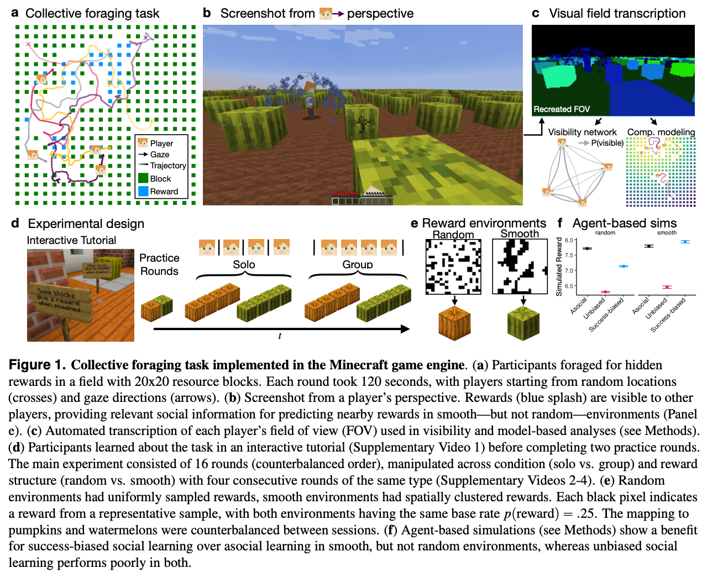

------------------------------------------------------------------------

### Specialization and selective social attention establishes the balance between individual and social learning.

Wu, C. M., Ho, M. K., Kahl, B., Leuker, C., Meder, B., & Kurvers, R. H.
J. M. (2021). **Specialization and selective social attention
establishes the balance between individual and social learning.**
Proceedings of the 43rd Annual Conference of the Cognitive Science
Society, 1921–1927. https://doi.org/10.1101/2021.02.03.429553

Abstract

A key question individuals face in any social learning environment is
when to innovate alone and when to imitate others. Previous simulation
results have found that the best performing groups exhibit an
intermediate balance, yet it is still largely unknown how individuals
collectively negotiate this balance. We use an immersive collective
foraging experiment, implemented in the Minecraft game engine,
facilitating unprecedented access to spatial trajectories and visual
field data. The virtual environment imposes a limited field of view,
creating a natural trade-off between allocating visual attention towards
individual innovation or to look towards peers for social imitation. By
analyzing foraging patterns, social interactions (visual and spatial),
and social influence, we shine new light on how groups collectively adapt
to the fluctuating demands of the environment through specialization and
selective imitation, rather than homogeneity and indiscriminate copying
of others.

<https://www.youtube.com/watch?v=_rDE49k1ENM>

### Collective incentives reduce over-exploitation of social information in unconstrained human groups.

Deffner, D., Mezey, D., Kahl, B., Schakowski, A., Romanczuk, P., Wu, C.
M., & Kurvers, R. H. J. M. (2024). **Collective incentives reduce
over-exploitation of social information in unconstrained human groups.**
Nature Communications, 15(1), 2683.
https://doi.org/10.1038/s41467-024-47010-3

Abstract

Collective dynamics emerge from countless individual decisions. Yet, we
poorly understand the processes governing dynamically-interacting
individuals in human collectives under realistic conditions. We present
a naturalistic immersive-reality experiment where groups of participants
searched for rewards in different environments, studying how individuals
weigh personal and social information and how this shapes individual and
collective outcomes. Capturing high-resolution visual-spatial data,
behavioral analyses revealed individual-level gains—but group-level
losses—of high social information use and spatial proximity in
environments with concentrated (vs. distributed) resources.
Incentivizing participants at the group (vs. individual) level
facilitated adaptation to concentrated environments, buffering
apparently excessive scrounging. To infer discrete choices from
unconstrained interactions and uncover the underlying decision
mechanisms, we developed an unsupervised Social Hidden Markov Decision
model. Computational results showed that participants were more
sensitive to social information in concentrated environments frequently
switching to a social relocation state where they approach successful
group members. Group-level incentives reduced participants’ overall
responsiveness to social information and promoted higher selectivity
over time. Finally, mapping group-level spatio-temporal dynamics through
time-lagged regressions revealed a collective exploration-exploitation
trade-off across different timescales. Our study unravels the processes
linking individual-level strategies to emerging collective dynamics, and
provides tools to investigate decision-making in freely-interacting
collectives.

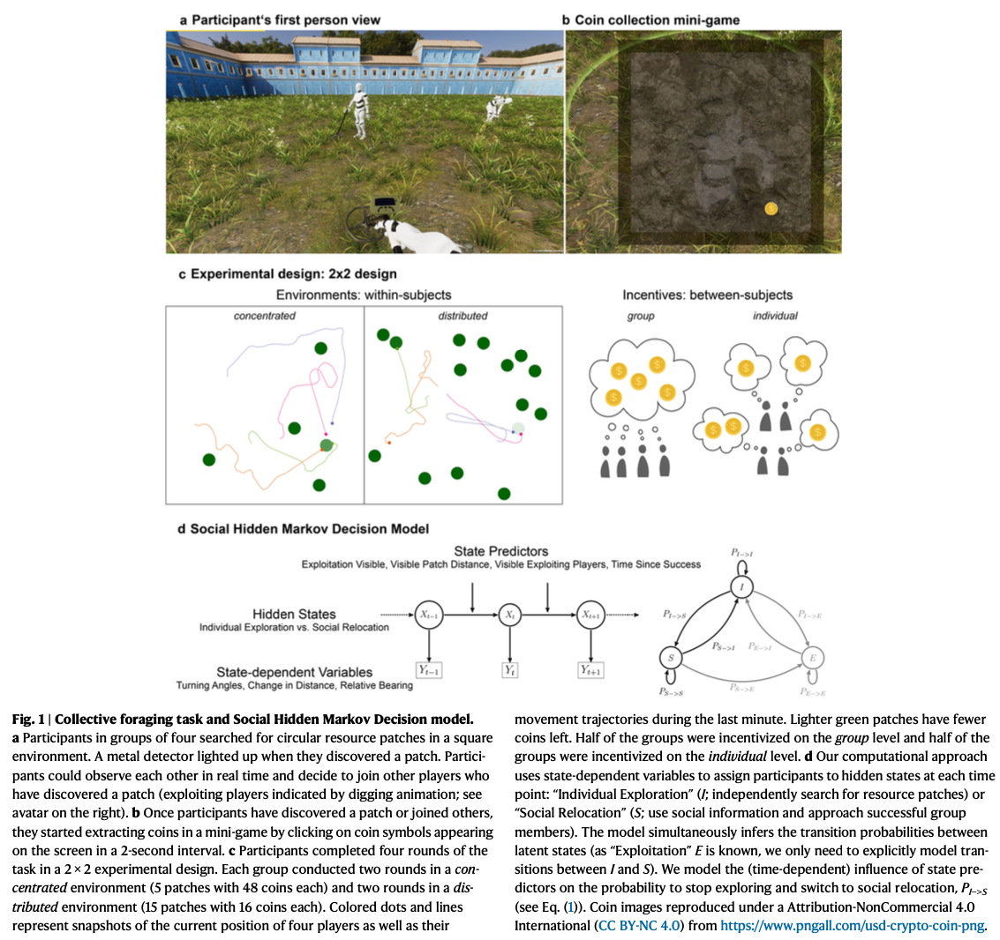

------------------------------------------------------------------------

### Insights about the common generative rule underlying an information foraging task can be facilitated via collective search.

Naito, A., Katahira, K., & Kameda, T. (2022). **Insights about the
common generative rule underlying an information foraging task can be
facilitated via collective search.** Scientific Reports, 12(1), 8047.

Abstract

Social learning is beneficial for efficient information search in
unfamiliar environments (“within-task” learning). In the real world,
however, possible search spaces are often so large that decision makers
are incapable of covering all options, even if they pool their
information collectively. One strategy to handle such overload is
developing generalizable knowledge that extends to multiple related
environments (“across-task” learning). However, it is unknown whether
and how social information may facilitate such across-task learning.
Here, we investigated participants’ social learning processes across
multiple laboratory foraging sessions in spatially correlated reward
landscapes that were generated according to a common rule. The results
showed that paired participants were able to improve efficiency in
information search across sessions more than solo participants.
Computational analysis of participants’ choice-behaviors revealed that
such improvement across sessions was related to better understanding of
the common generative rule. Rule understanding was correlated within a
pair, suggesting that social interaction is a key to the improvement of
across-task learning.

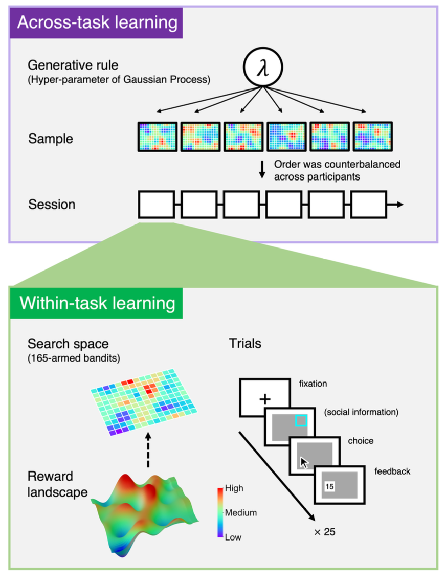

------------------------------------------------------------------------

### Individualism versus collective movement during travel.

Doherty, C. T. M., & Laidre, M. E. (2022). **Individualism versus
collective movement during travel.** Scientific Reports, 12(1), 7508.
https://doi.org/10.1038/s41598-022-11469-1

Abstract

Collective movement may emerge if coordinating one’s movement with
others produces a greater benefit to oneself than can be achieved alone.
Experimentally, the capacity to manoeuvre simulated groups in the wild
could enable powerful tests of the impact of collective movement on
individual decisions. Yet such experiments are currently lacking due to
the inherent difficulty of controlling whole collectives. Here we used a
novel technique of experimentally simulating the movement of collectives
of social hermit crabs (Coenobita compressus) in the wild. Using large
architectural arrays of shells dragged across the beach, we generated
synchronous collective movement and systematically varied the simulated
collective’s travel direction as well as the context (i.e., danger
level). With drone video from above, we then tested whether focal
individuals were biased in their movement by the collective. We found
that, despite considerable engagement with the collective, individuals’
direction was not significantly biased. Instead, individuals expressed
substantial variability across all stimulus directions and contexts.
Notably, individuals typically achieved shorter displacements in the
presence of the collective versus in the presence of the control
stimulus, suggesting an impact of traffic. The absence of a directional
bias in individual movement due to the collective suggests that social
hermit crabs are individualists, which move with a high level of
opportunistic independence, likely thanks to the personal architecture
and armour they carry in the form of a protective shell. Future studies
can manipulate this level of armour to test its role in autonomy of
movement, including the consequences of shell architecture for social
decisions. Our novel experimental approach can be used to ask many
further questions about how and why collective and individual movement
interact.

------------------------------------------------------------------------

### Beyond the individual: A social foraging framework to study decisions in groups.

Garg, K., Deng, W., & Mobbs, D. (2024). **Beyond the individual: A
social foraging framework to study decisions in groups.** OSF.
https://doi.org/10.31219/osf.io/rmqyb

Abstract

A key goal of the behavioral sciences is to understand how agents decide
between rewarding, hazardous, and conflicting options. Foraging theory,
which is rooted in ecology and evolutionary theory, has helped advance
this pursuit but has largely been limited to the study of the
individual. In this Perspective, we extend beyond an individual. We
propose social foraging as a promising avenue to study social decisions,
or decisions within a social context. Recent research has already
applied similar paradigms to study social behavior in naturalistic
conditions. We synthesize the key socio-cognitive elements involved in
social foraging that can be further studied through foraging paradigms.
We then propose a social foraging framework that distinguishes between
the asocial and social components involved in the decision-making
process and describes their integration. Our framework bridges research
across disciplines to provide a promising new avenue for the study of
social behavior by linking decisions across different scales, from
individuals to collectives.

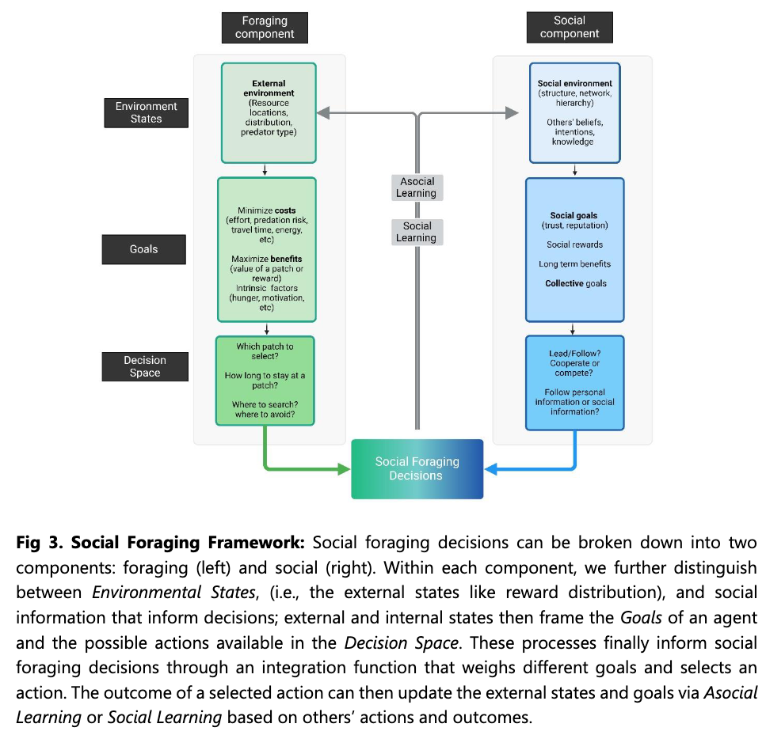

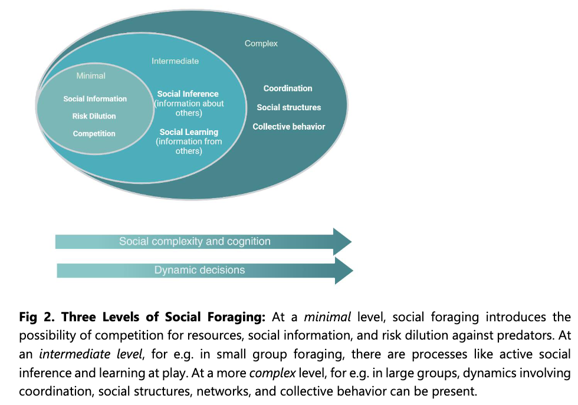

Figure 1: Figures from Garg et al. (2024)

------------------------------------------------------------------------

## Complexity

### Task complexity moderates group synergy.

Almaatouq, A., Alsobay, M., Yin, M., & Watts, D. J. (2021). **Task
complexity moderates group synergy.** Proceedings of the National
Academy of Sciences, 118(36). https://doi.org/10.1073/pnas.2101062118

Abstract

Complexity—defined in terms of the number of components and the nature
of the interdependencies between them—is clearly a relevant feature of
all tasks that groups perform. Yet the role that task complexity plays
in determining group performance remains poorly understood, in part
because no clear language exists to express complexity in a way that
allows for straightforward comparisons across tasks. Here we avoid this
analytical difficulty by identifying a class of tasks for which
complexity can be varied systematically while keeping all other elements
of the task unchanged. We then test the effects of task complexity in a
preregistered two-phase experiment in which 1,200 individuals were
evaluated on a series of tasks of varying complexity (phase 1) and then
randomly assigned to solve similar tasks either in interacting groups or
as independent individuals (phase 2). We find that interacting groups
are as fast as the fastest individual and more efficient than the most
efficient individual for complex tasks but not for simpler ones.
Leveraging our highly granular digital data, we define and precisely
measure group process losses and synergistic gains and show that the
balance between the two switches signs at intermediate values of task
complexity. Finally, we find that interacting groups generate more
solutions more rapidly and explore the solution space more broadly than
independent problem solvers, finding higher-quality solutions than all
but the highest-scoring individuals.

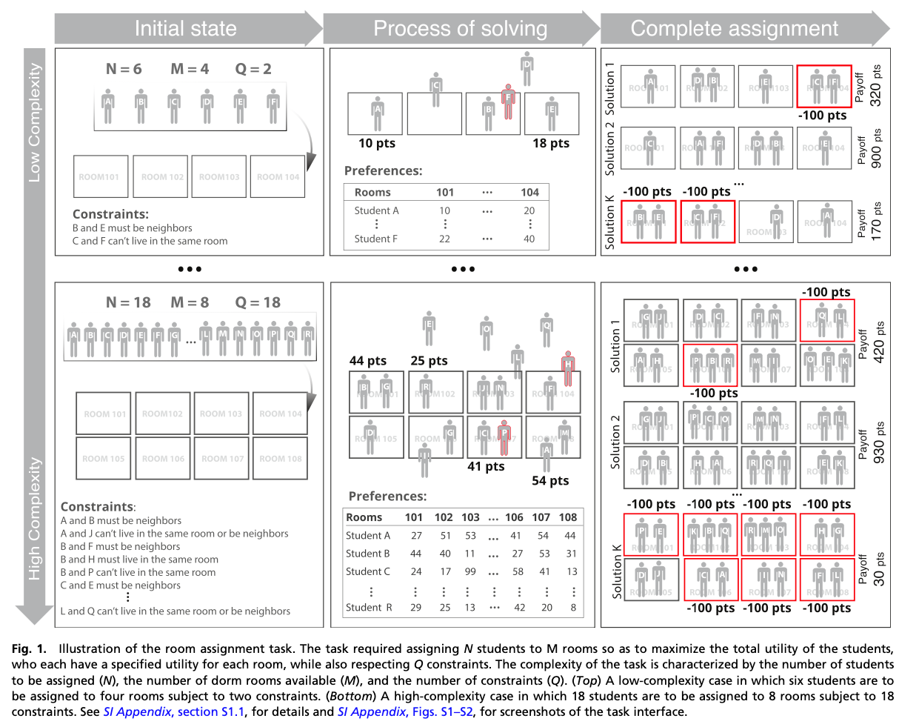

------------------------------------------------------------------------

### The interaction between map complexity and crowd movement on navigation decisions in virtual reality.

Zhao, H., Thrash, T., Grossrieder, A., Kapadia, M., Moussaïd, M.,
Hölscher, C., & Schinazi, V. R. (2020). **The interaction between map
complexity and crowd movement on navigation decisions in virtual
reality.** Royal Society Open Science, 7(3), 191523.
https://doi.org/10.1098/rsos.191523

Abstract

A carefully designed map can reduce pedestrians’ cognitive load during
wayfinding and may be an especially useful navigation aid in crowded
public environments. In the present paper, we report three studies that
investigated the effects of map complexity and crowd movement on
wayfinding time, accuracy and hesitation using both online and
laboratory-based networked virtual reality (VR) platforms. In the online
study, we found that simple map designs led to shorter decision times
and higher accuracy compared to complex map designs. In the networked VR
set-up, we found that co-present participants made very few errors. In
the final VR study, we replayed the traces of participants’ avatars from
the second study so that they indicated a different direction than the
maps. In this scenario, we found an interaction between map design and
crowd movement in terms of decision time and the distributions of
locations at which participants hesitated. Together, these findings can
help the designers of maps for public spaces account for the movements
of real crowds.

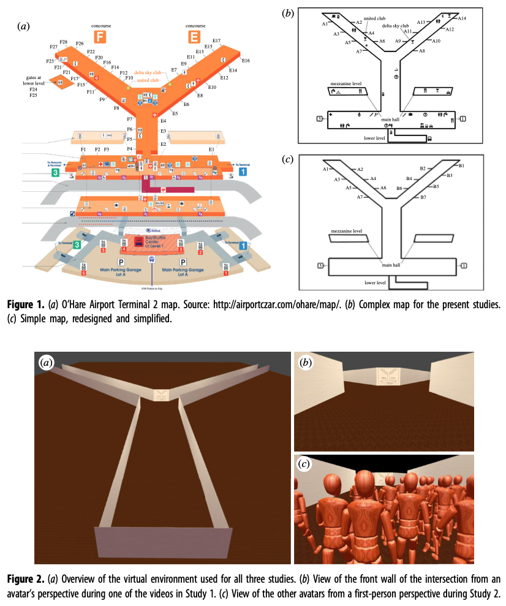

------------------------------------------------------------------------

### Task Complexity and Performance in Individuals and Groups Without Communication.

Gulati, A., Nguyen, T. N., & Gonzalez, C. (2021). **Task Complexity and
Performance in Individuals and Groups Without Communication.** AAAI Fall
Symposium. Cham: Springer Nature Switzerland, 8.

Abstract

While groups where members communicate with each other may perform
better than groups without communication, there are multiple scenarios
where communication between group members is not possible. Our work
analyses the impact of task complexity on individuals and groups of
different sizes while solving a goal-seeking navigation task without
communication. Our major goal is to determine the effect of task
complexity on performance and whether agents in a group are able to
coordinate to perform the task more effectively despite the lack of
communication. We developed a cognitive model of each individual agent
that performs the task. We compare the performance of this agent with
individual human performance, who worked on the same task. We observe
that the cognitive agent is able to replicate the general behavioral
trends observed in humans. Using this cognitive model, we generate
groups of different sizes where individual agents work in the same
goal-seeking task independently and without communication. First, we
observe that increasing task complexity by design does not necessarily
lead to worse performance in individuals and groups. We also observe
that larger groups perform better than smaller groups and individuals
alone. However, individual agents within a group perform worse than an
agent working on the task alone. This effect is not the result of agents
within a group covering less ground in the task compared to individuals
alone. Rather, it is an effect resulting from the overlap of the agents
within a group. Importantly, agents learn to reduce their overlap and
improve their performance without explicit communication. These results
can inform the design of AI agents in humanmachine teams.

Gulati et al. (2021)

------------------------------------------------------------------------

### Environmental memory boosts group formation of clueless individuals.

Dias, C. S., Trivedi, M., Volpe, G., Araújo, N. A. M., & Volpe, G.
(2023). **Environmental memory boosts group formation of clueless
individuals.** Nature Communications, 14(1), 7324.
https://doi.org/10.1038/s41467-023-43099-0

Abstract

The formation of groups of interacting individuals improves performance
and fitness in many decentralised systems, from micro-organisms to
social insects, from robotic swarms to artificial intelligence
algorithms. Often, group formation and high-level coordination in these
systems emerge from individuals with limited information-processing
capabilities implementing low-level rules of communication to signal to
each other. Here, we show that, even in a community of clueless
individuals incapable of processing information and communicating, a
dynamic environment can coordinate group formation by transiently
storing memory of the earlier passage of individuals. Our results
identify a new mechanism of indirect coordination via shared memory that
is primarily promoted and reinforced by dynamic environmental factors,
thus overshadowing the need for any form of explicit signalling between
individuals. We expect this pathway to group formation to be relevant
for understanding and controlling self-organisation and collective
decision making in both living and artificial active matter in real-life
environments.

## Uncertainty

------------------------------------------------------------------------

### Flexible social inference facilitates targeted social learning when rewards are not observable.

Hawkins, R. D., Berdahl, A. M., Pentland, A. ‘Sandy,’ Tenenbaum, J. B.,
Goodman, N. D., & Krafft, P. M. (2023). **Flexible social inference
facilitates targeted social learning when rewards are not observable.**
Nature Human Behaviour, 7(10), 1767–1776.
https://doi.org/10.1038/s41562-023-01682-x

Abstract

Groups coordinate more effectively when individuals are able to learn
from others’ successes. But acquiring such knowledge is not always easy,
especially in real-world environments where success is hidden from
public view. We suggest that social inference capacities may help bridge
this gap, allowing individuals to update their beliefs about others’
underlying knowledge and success from observable trajectories of
behaviour. We compared our social inference model against simpler
heuristics in three studies of human behaviour in a collective-sensing
task. Experiment 1 demonstrated that average performance improved as a
function of group size at a rate greater than predicted by heuristic
models. Experiment 2 introduced artificial agents to evaluate how
individuals selectively rely on social information. Experiment 3
generalized these findings to a more complex reward landscape. Taken
together, our findings provide insight into the relationship between
individual social cognition and the flexibility of collective behaviour.

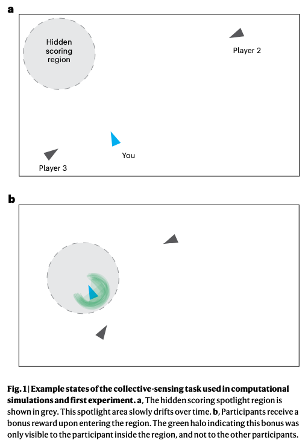

------------------------------------------------------------------------

Tump, A. N., Wu, C. M., Bouhlel, I., & Goldstone, R. L. (2019). **The
Evolutionary Dynamics of Cooperation in Collective Search**
\[Preprint\]. http://biorxiv.org/lookup/doi/10.1101/538447

Abstract

How does cooperation arise in an evolutionary context? We approach this
problem using a collective search paradigm where interactions are
dynamic and there is competition for rewards. Using evolutionary
simulations, we find that the unconditional sharing of information can be
an evolutionary advantageous strategy without the need for conditional
strategies or explicit reciprocation. Shared information acts as a
recruitment signal and facilitates the formation of a self-organized
group. Thus, the improved search efficiency of the collective bestows
byproduct benefits onto the original sharer. A key mechanism is a
visibility radius, where individuals have unconditional access to
information about neighbors within a limited distance. Our results show
that for a variety of initial conditions—including populations initially
devoid of prosocial individuals—and across both static and dynamic
fitness landscapes, we find strong selection pressure to evolve
unconditional sharing.

------------------------------------------------------------------------

### Spatial planning with long visual range benefits escape from visual predators in complex naturalistic environments.

Mugan, U., & MacIver, M. A. (2020). **Spatial planning with long visual
range benefits escape from visual predators in complex naturalistic
environments.** Nature Communications, 11(1), 3057.
https://doi.org/10.1038/s41467-020-16102-1

[live task demo](https://maciver-lab.github.io/plangame/)  
[code repository](https://github.com/MacIver-Lab/plangame)  

Abstract

It is uncontroversial that land animals have more elaborated cognitive
abilities than their aquatic counterparts such as fish. Yet there is no
apparent a-priori reason for this. A key cognitive faculty is planning.
We show that in visually guided predator-prey interactions, planning
provides a significant advantage, but only on land. During animal
evolution, the water-to-land transition resulted in a massive increase
in visual range. Simulations of behavior identify a specific type of
terrestrial habitat, clustered open and closed areas (savanna-like),
where the advantage of planning peaks. Our computational experiments
demonstrate how this patchy terrestrial structure, in combination with
enhanced visual range, can reveal and hide agents as a function of their
movement and create a selective benefit for imagining, evaluating, and
selecting among possible future scenarios—in short, for planning. The
vertebrate invasion of land may have been an important step in their
cognitive evolution.

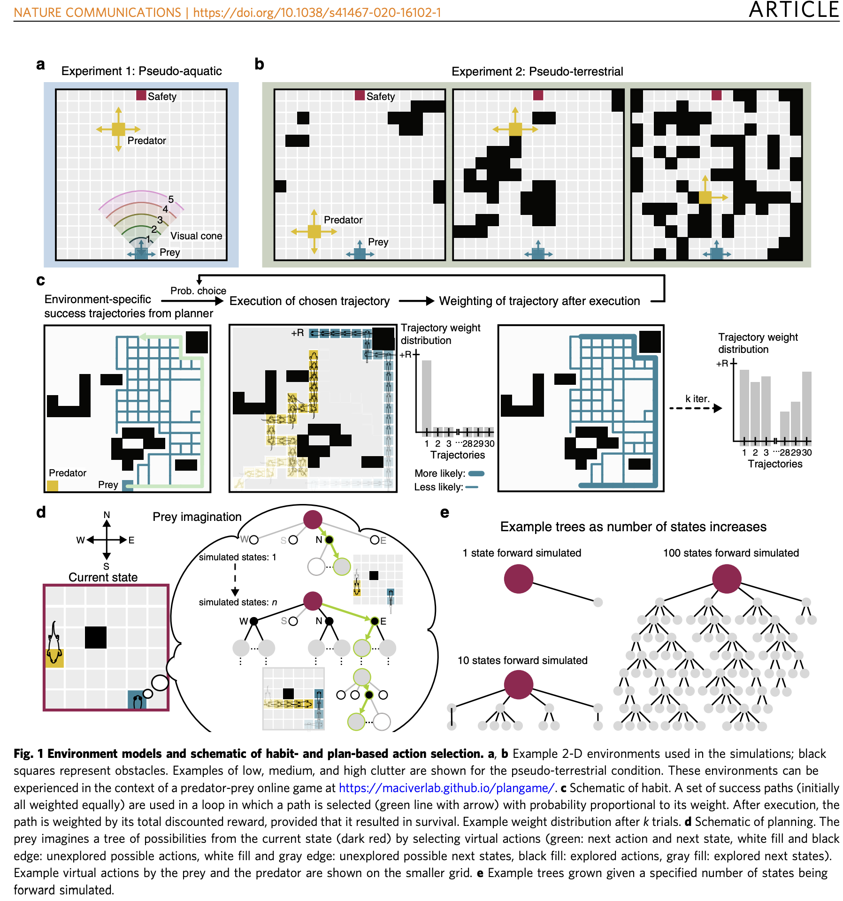

------------------------------------------------------------------------

### The form of uncertainty affects selection for social learning.

Turner, M. A., Moya, C., Smaldino, P. E., & Jones, J. H. (2023). **The
form of uncertainty affects selection for social learning.**
Evolutionary Human Sciences, 5, e20. https://doi.org/10.1017/ehs.2023.11

Abstract

Social learning is a critical adaptation for dealing with different
forms of variability. Uncertainty is a severe form of variability where
the space of possible decisions or probabilities of associated outcomes
are unknown. We identified four theoretically important sources of
uncertainty: temporal environmental variability; payoff ambiguity;
selection-set size; and effective lifespan. When these combine, it is
nearly impossible to fully learn about the environment. We develop an
evolutionary agent-based model to test how each form of uncertainty
affects the evolution of social learning. Agents perform one of several
behaviours, modelled as a multi-armed bandit, to acquire payoffs. All
agents learn about behavioural payoffs individually through an adaptive
behaviour-choice model that uses a softmax decision rule. Use of
vertical and oblique payoff-biased social learning evolved to serve as a
scaffold for adaptive individual learning – they are not opposite
strategies. Different types of uncertainty had varying effects. Temporal
environmental variability suppressed social learning, whereas larger
selection-set size promoted social learning, even when the environment
changed frequently. Payoff ambiguity and lifespan interacted with other
uncertainty parameters. This study begins to explain how social learning
can predominate despite highly variable real-world environments when
effective individual learning helps individuals recover from learning
outdated social information.

------------------------------------------------------------------------

## Peter’s Talks on Foraging

<https://www.youtube.com/watch?v=McNrmZdEO0w>

<https://www.youtube.com/watch?v=H8WLS3S1rAo>

<https://www.youtube.com/watch?v=yL-kf2IGbxk>

<https://www.youtube.com/watch?v=Ay9ydPF4UAg>

------------------------------------------------------------------------

https://www.youtube.com/watch?v=vIyFGM5p40w&ab_channel=GuillaumeInstitutdessciencescognitives

https://www.youtube.com/watch?v=HiqdleY6rFg&ab_channel=MINDSummerSchool

https://www.youtube.com/watch?v=t18gU5kvDFg&ab_channel=CogSci%3AInterdisciplinaryStudyoftheMind

https://www.youtube.com/watch?v=Yih7YD8nikU&ab_channel=InstituteforPure%26AppliedMathematics%28IPAM%29

https://www.youtube.com/watch?v=lrviTiJLoqE&ab_channel=MaxPlanckInstituteforHumanDevelopment

https://www.youtube.com/watch?v=jbhWE8NxaOk&ab_channel=AugmentedIntelligenceWorkshop

https://www.youtube.com/watch?v=fgGkTlF8hXc&ab_channel=sethfrey

https://www.youtube.com/watch?v=lPVQe_kTm28&ab_channel=CogSci%3AInterdisciplinaryStudyoftheMind

------------------------------------------------------------------------

# Tasks used in Other Studes

### Structuring Knowledge with Cognitive Maps and Cognitive Graphs.

Peer, M., Brunec, I. K., Newcombe, N. S., & Epstein, R. A. (2021).
**Structuring Knowledge with Cognitive Maps and Cognitive Graphs.**
Trends in Cognitive Sciences, 25(1), 37–54.
https://doi.org/10.1016/j.tics.2020.10.004

Abstract

Humans and animals use mental representations of the spatial structure
of the world to navigate. The classical view is that these
representations take the form of Euclidean cognitive maps, but
alternative theories suggest that they are cognitive graphs consisting
of locations connected by paths. We review evidence suggesting that both
map-like and graph-like representations exist in the mind/brain that
rely on partially overlapping neural systems. Maps and graphs can
operate simultaneously or separately, and they may be applied to both
spatial and nonspatial knowledge. By providing structural frameworks for
complex information, cognitive maps and cognitive graphs may provide
fundamental organizing schemata that allow us to navigate in physical,
social, and conceptual spaces.

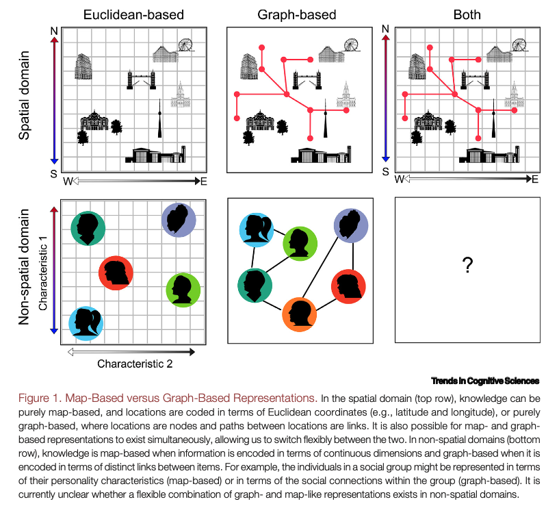

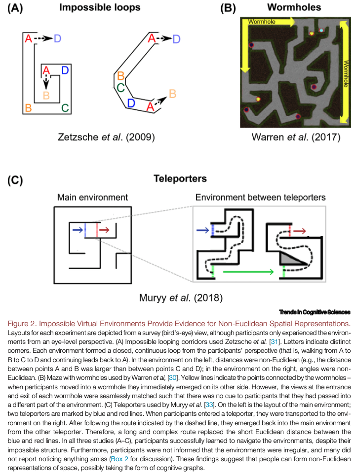

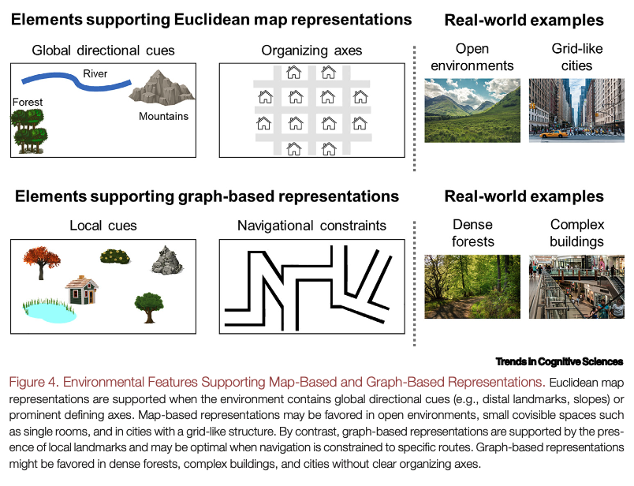

Figure 2: Figures from Peer et al. (2021)

------------------------------------------------------------------------

### Wormholes in virtual space: From cognitive maps to cognitive graphs

Warren, W. H., Rothman, D. B., Schnapp, B. H., & Ericson, J. D. (2017).
**Wormholes in virtual space: From cognitive maps to cognitive graphs.**
Cognition, 166, 152–163. https://doi.org/10.1016/j.cognition.2017.05.020

Abstract

Humans and other animals build up spatial knowledge of the environment
on the basis of visual information and path integration. We compare
three hypotheses about the geometry of this knowledge of navigation
space: (a) ‘cognitive map’ with metric Euclidean structure and a
consistent coordinate system, (b) ‘topological graph’ or network of
paths between places, and (c) ‘labelled graph’ incorporating local
metric information about path lengths and junction angles. In two
experiments, participants walked in a non-Euclidean environment, a
virtual hedge maze containing two ‘wormholes’ that visually rotated and
teleported them between locations. During training, they learned the
metric locations of eight target objects from a ‘home’ location, which
were visible individually. During testing, shorter wormhole routes to a
target were preferred, and novel shortcuts were directional, contrary to
the topological hypothesis. Shortcuts were strongly biased by the
wormholes, with mean constant errors of 37° and 41° (45° expected),
revealing violations of the metric postulates in spatial knowledge. In
addition, shortcuts to targets near wormholes shifted relative to
flanking targets, revealing ‘rips’ (86% of cases), ‘folds’ (91%), and
ordinal reversals (66%) in spatial knowledge. Moreover, participants
were completely unaware of these geometric inconsistencies, reflecting a
surprising insensitivity to Euclidean structure. The probability of the
shortcut data under the Euclidean map model and labelled graph model
indicated decisive support for the latter (BFGM\>100). We conclude that
knowledge of navigation space is best characterized by a labelled graph,
in which local metric information is approximate, geometrically
inconsistent, and not embedded in a common coordinate system. This class
of ‘cognitive graph’ models supports route finding, novel detours, and
rough shortcuts, and has the potential to unify a range of data on
spatial navigation.

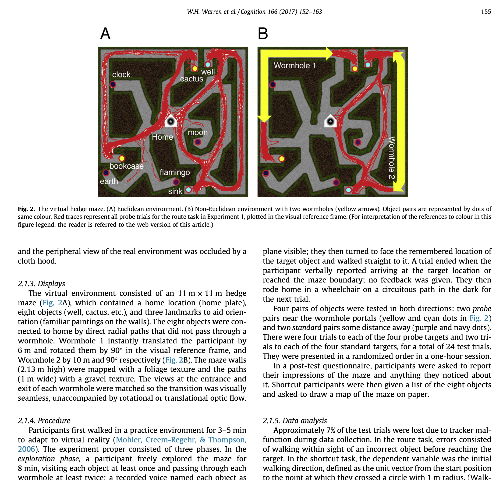

------------------------------------------------------------------------

### Route effects in city-based survey knowledge estimates

Krukar, J., Navas Medrano, S., & Schwering, A. (2023). **Route effects
in city-based survey knowledge estimates.** Cognitive Processing, 24(2),
213–231. https://doi.org/10.1007/s10339-022-01122-0

Abstract

When studying wayfinding in urban environments, researchers are often
interested in obtaining measures of participants’ survey knowledge,
i.e., their estimate of distant locations relative to other places.
Previous work showed that distance estimations are consistently biased
when no direct route is available to the queried target or when
participants follow a detour. Here we investigated whether a
corresponding bias is manifested in two other popular measures of survey
knowledge: a pointing task and a sketchmapping task. The aim of this
study was to investigate whether there is a systematic bias in
pointing/sketchmapping performance associated with the preferred route
choice in an applied urban setting. The results were mixed. We found
moderate evidence for the presence of a systematic bias, but only for a
subset of urban locations. When two plausible routes to the target were
available, survey knowledge estimates were significantly biased in the
direction of the route chosen by the participant. When only one
plausible route was available, we did not find a statistically
significant pattern. The results may have methodological implications
for spatial cognition studies in applied urban settings that might be
obtaining systematically biased survey knowledge estimates at some urban
locations. Researchers should be aware that the choice of urban
locations from which pointing and sketchmapping are performed might
systematically distort the results, in particular when two plausible but
diverging routes to the target are visible from the location.

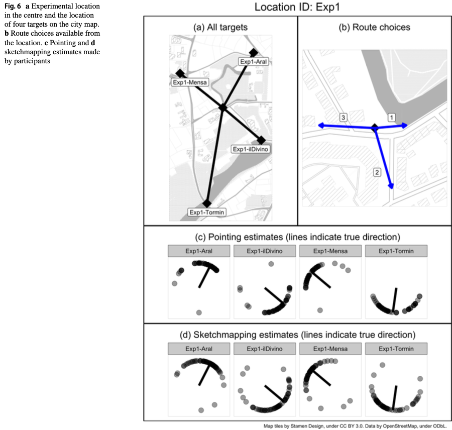

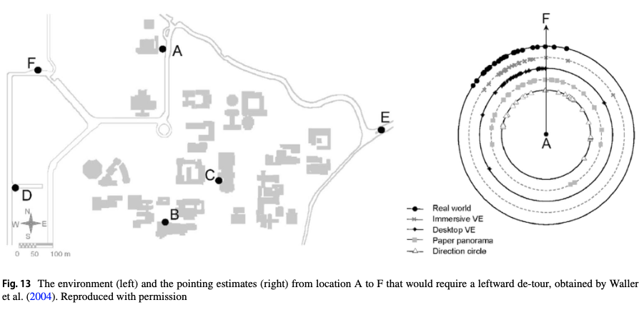

Figure 3: Figures from Krukar et al. (2023)

------------------------------------------------------------------------

### Spatial decision dynamics during wayfinding: Intersections prompt the decision-making process.

Brunyé, T. T., Gardony, A. L., Holmes, A., & Taylor, H. A. (2018).
**Spatial decision dynamics during wayfinding: Intersections prompt the
decision-making process.** Cognitive Research: Principles and
Implications, 3(1), 13. https://doi.org/10.1186/s41235-018-0098-3

Abstract

Intersections are critical decision points for wayfinders, but it is
unknown how decision dynamics unfold during pedestrian wayfinding. Some
research implies that pedestrians leverage available visual cues to
actively compare options while in an intersection, whereas other
research suggests that people strive to make decisions long before overt
responses are required. Two experiments examined these possibilities
while participants navigated virtual desktop environments, assessing
information-seeking behavior (Experiment 1) and movement dynamics
(Experiment 2) while approaching intersections. In Experiment 1, we
found that participants requested navigation guidance while in path
segments approaching an intersection and the guidance facilitated choice
behavior. In Experiment 2, we found that participants tended to orient
themselves toward an upcoming turn direction before entering an
intersection, particularly as they became more familiar with the
environment. Some of these patterns were modulated by individual
differences in spatial ability, sense of direction, spatial strategies,
and gender. Together, we provide novel evidence that deciding whether to
continue straight or turn involves a dynamic, distributed
decision-making process that is prompted by upcoming intersections and
modulated by individual differences and environmental experience. We
discuss implications of these results for spatial decision-making theory
and the development of innovative adaptive, beacon-based navigation
guidance systems.

------------------------------------------------------------------------

Ericson, J. D., & Warren, W. H. (2020). **Probing the invariant
structure of spatial knowledge: Support for the cognitive graph
hypothesis.** Cognition, 200, 104276.
https://doi.org/10.1016/j.cognition.2020.104276

Abstract

We tested four hypotheses about the structure of spatial knowledge used
for navigation: (1) the Euclidean hypothesis, a geometrically consistent
map; (2) the Neighborhood hypothesis, adjacency relations between
spatial regions, based on visible boundaries; (3) the Cognitive Graph
hypothesis, a network of paths between places, labeled with approximate
local distances and angles; and (4) the Constancy hypothesis, whatever
geometric properties are invariant during learning. In two experiments,
different groups of participants learned three virtual hedge mazes,
which varied specific geometric properties (Euclidean Control Maze,
Elastic Maze with stretching paths, Swap Maze with alternating paths to
the same place). Spatial knowledge was then tested using three
navigation tasks (metric shortcuts on empty ground plane, neighborhood
shortcuts with visible boundaries, route task in corridors). They
yielded the following results: (a) Metric shortcuts were insensitive to
detectable shifts in target location, inconsistent with the Euclidean
hypothesis. (b) Neighborhood shortcuts were constrained by visible
boundaries in the Elastic Maze, but not in the Swap Maze, contrary to
the Neighborhood and Constancy hypotheses. (c) The route task indicated
that a graph of the maze was acquired in all environments, including
knowledge of local path lengths. We conclude that primary spatial
knowledge is consistent with the Cognitive Graph hypothesis.
Neighborhoods are derived from the graph, and local distance and angle
information is not embedded in a geometrically consistent map.

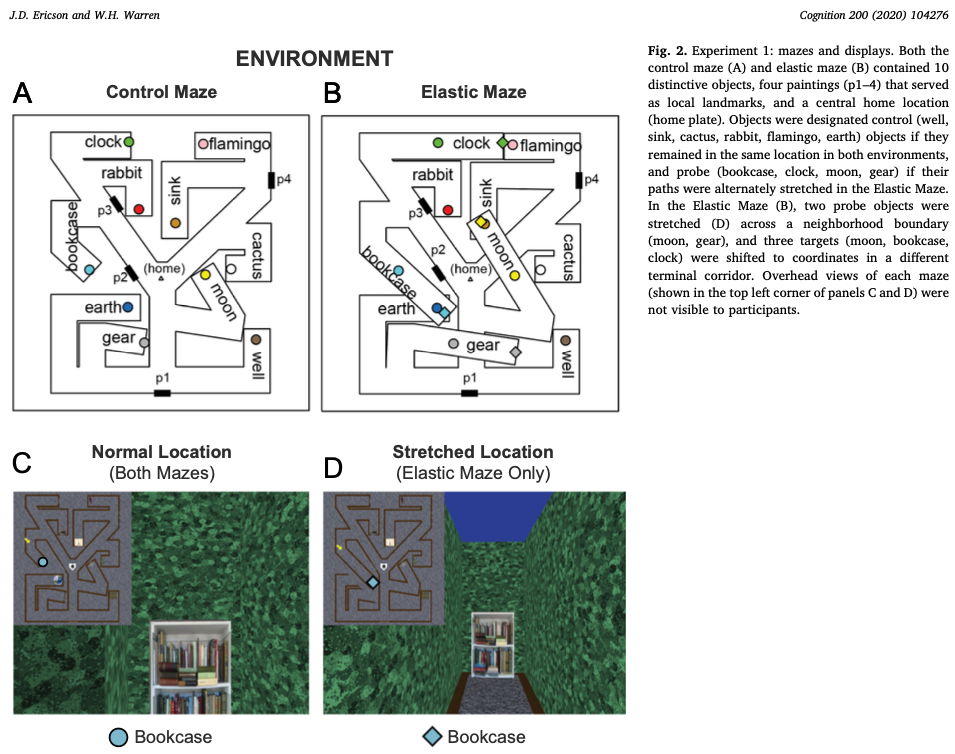

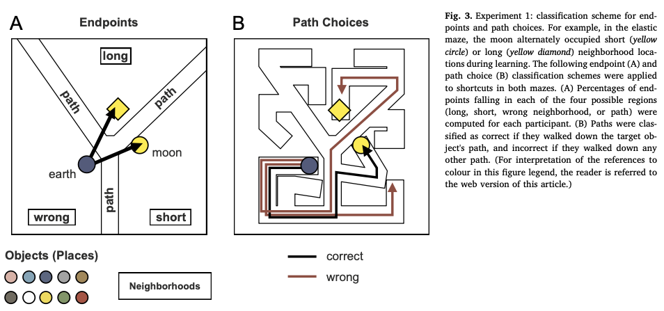

Figure 4: Figures from Ericson & Warren (2020)

------------------------------------------------------------------------

### Rational use of cognitive resources in human planning

Callaway, F., Van Opheusden, B., Gul, S., Das, P., Krueger, P. M.,
Griffiths, T. L., & Lieder, F. (2022). Rational use of cognitive
resources in human planning. Nature Human Behaviour, 6(8), 1112–1125.
https://doi.org/10.1038/s41562-022-01332-8

[link to code](https://osf.io/6venh/)   [link to
paper](https://cocosci.princeton.edu/papers/callawayrationaluse.pdf)  
[link to live task demo](https://roadtrip-task-demo.netlify.app/)  

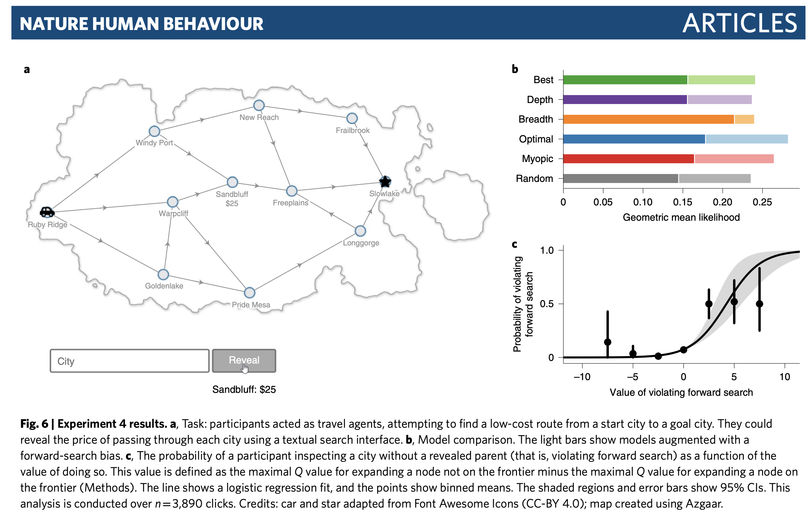

------------------------------------------------------------------------

### People construct simplified mental representations to plan.

Ho, M. K., Abel, D., Correa, C. G., Littman, M. L., Cohen, J. D., &
Griffiths, T. L. (2022). **People construct simplified mental
representations to plan.** Nature, 1–8.
https://doi.org/10.1038/s41586-022-04743-9

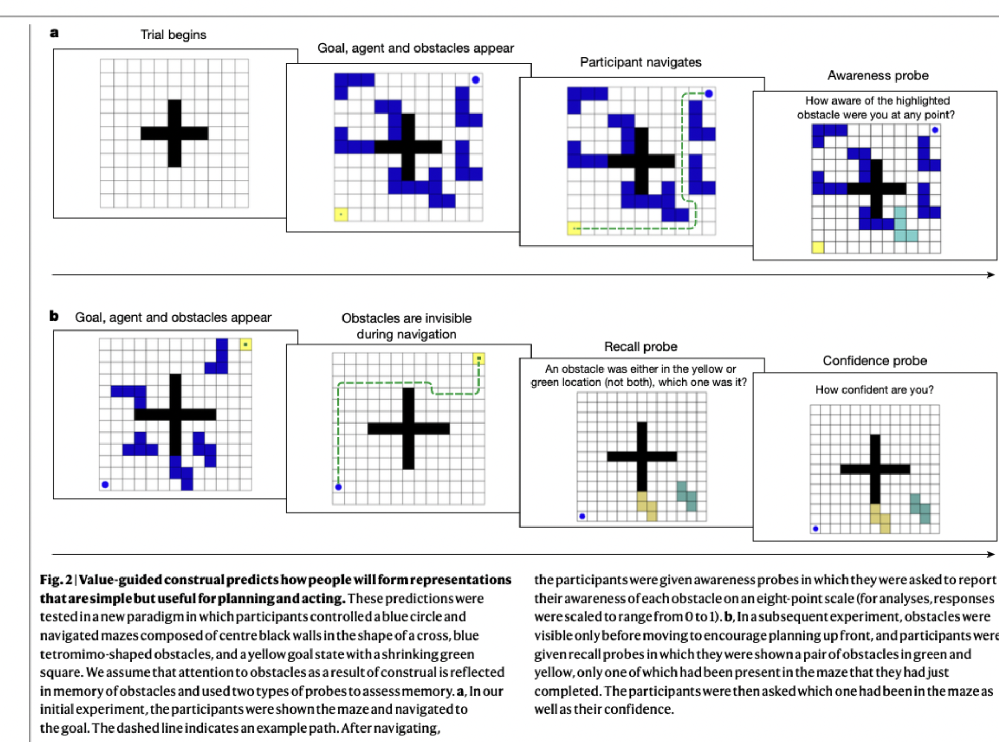

Ho, M. K., Abel, D., Correa, C. G., Littman, M. L., Cohen, J. D., &
Griffiths, T. L. (2021). **Control of mental representations in human
planning.** arXiv:2105.06948 \[Cs\]. http://arxiv.org/abs/2105.06948

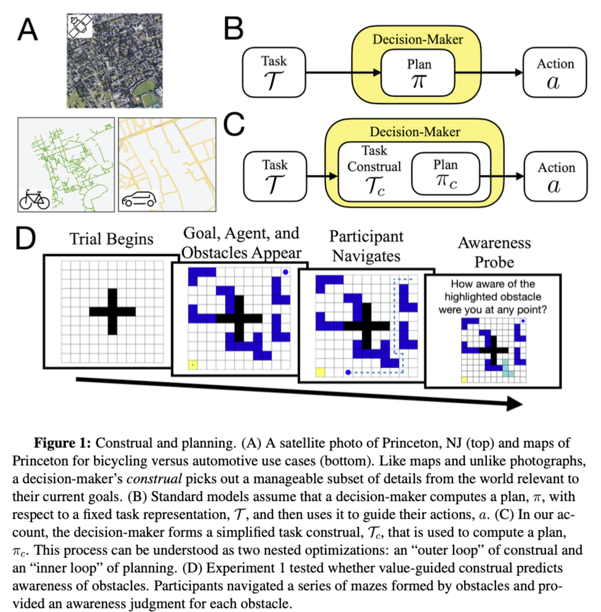

------------------------------------------------------------------------

### Emergent Collective Sensing in Human Groups.

Krafft, P. M., Hawkins, R. X., Pentland, A., Goodman, N. D., &
Tenenbaum, J. B. (2015). **Emergent Collective Sensing in Human
Groups.** In CogSci.
https://people.csail.mit.edu/pkrafft/papers/krafft-et-al-2015-emergent.pdf

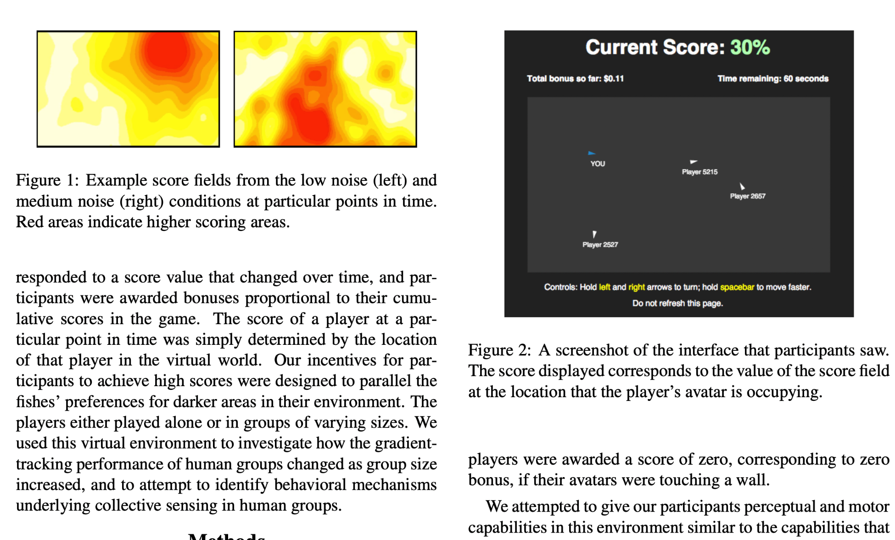

------------------------------------------------------------------------

### Towards a computational model of responsibility judgments in sequential human-AI collaboration

Tsirtsis, S., Gomez Rodriguez, M., & Gerstenberg, T. (2024). **Towards a
computational model of responsibility judgments in sequential human-AI
collaboration.** In Proceedings of the Annual Meeting of the Cognitive
Science Society (Vol. 46). https://osf.io/preprints/psyarxiv/m4yad

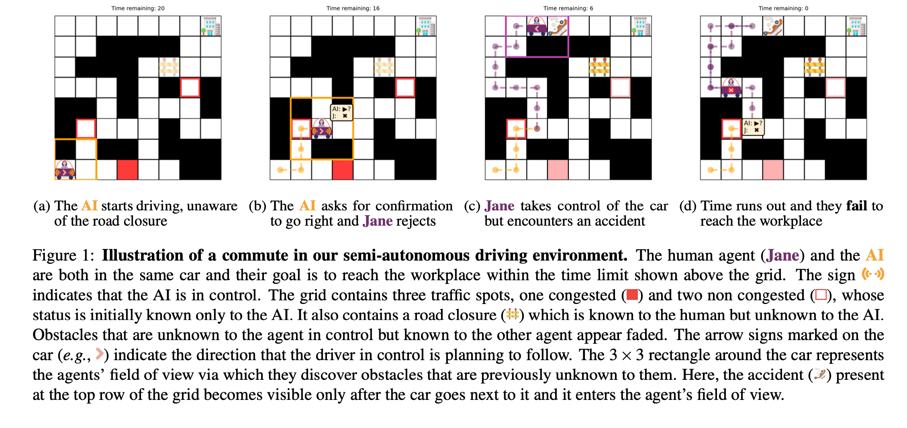

------------------------------------------------------------------------

### Pattern-Driven Navigation in 2D Multiscale Visualizations with Scalable Insets.

Lekschas, F., Behrisch, M., Bach, B., Kerpedjiev, P., Gehlenborg, N., &
Pfister, H. (2020). **Pattern-Driven Navigation in 2D Multiscale
Visualizations with Scalable Insets.** IEEE Transactions on
Visualization and Computer Graphics, 26(1), 611–621. IEEE Transactions
on Visualization and Computer Graphics.
https://doi.org/10.1109/TVCG.2019.2934555

[link to code on
github](https://github.com/flekschas/higlass-scalable-insets)

[project page](https://scalable-insets.lekschas.de/)

Abstract

We present Scalable Insets, a technique for interactively exploring and
navigating large numbers of annotated patterns in multiscale
visualizations such as gigapixel images, matrices, or maps. Exploration
of many but sparsely-distributed patterns in multiscale visualizations
is challenging as visual representations change across zoom levels,
context and navigational cues get lost upon zooming, and navigation is
time consuming. Our technique visualizes annotated patterns too small to
be identifiable at certain zoom levels using insets, i.e., magnified
thumbnail views of the annotated patterns. Insets support users in
searching, comparing, and contextualizing patterns while reducing the
amount of navigation needed. They are dynamically placed either within
the viewport or along the boundary of the viewport to offer a compromise
between locality and context preservation. Annotated patterns are
interactively clustered by location and type. They are visually
represented as an aggregated inset to provide scalable exploration
within a single viewport. In a controlled user study with 18
participants, we found that Scalable Insets can speed up visual search
and improve the accuracy of pattern comparison at the cost of slower
frequency estimation compared to a baseline technique. A second study
with 6 experts in the field of genomics showed that Scalable Insets is
easy to learn and provides first insights into how Scalable Insets can
be applied in an open-ended data exploration scenario.

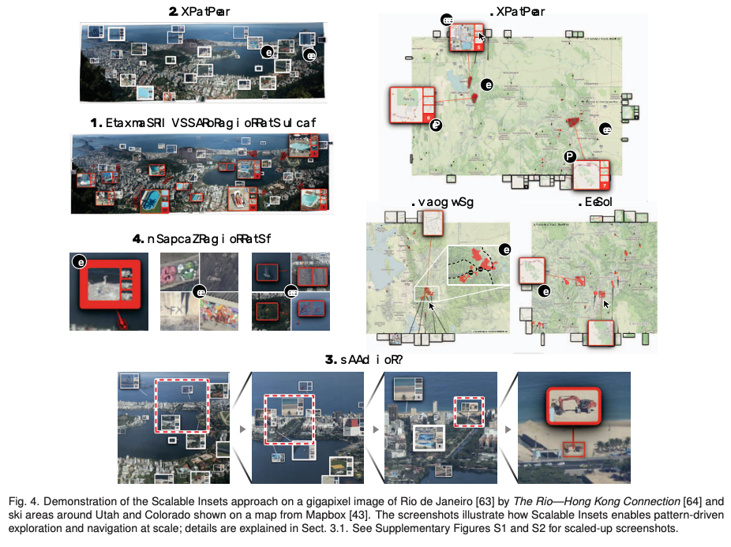

### Personality Traits and Spatial Skills Are Related to Group Dynamics and Success During Collective Wayfinding

Brunyé, T. T., Hendel, D., Gardony, A. L., Hussey, E. K., & Taylor, H.
A. (2024). **Personality traits and spatial skills are related to group
dynamics and success during collective wayfinding.** Collective Spatial
Cognition, 60-99.

Abstract

This chapter reviews and identifies gaps in research examining
collective navigation and describes the results of a small study aimed
at better elucidating the independent and interactive roles of
personality and spatial skill in guiding group wayfinding dynamics,
wayfinding performance, and spatial memory. In this study, individuals,
dyads, and triads completed a series of individual differences tasks and
questionnaires, and an individual or shared (dyads and triads) virtual
wayfinding experience involving planning and executing routes between
origin and destination pairs. Navigators were provided with a single
digital map that they could share during the task; patterns of map
sharing, virtual navigation, and wayfinding performance were logged.
Higher spatial anxiety was associated with more map viewing among group
members, higher scores on questionnaires assessing autism-type traits
were associated with lower group cohesion, higher group heterogeneity
was associated with lower group cohesion and lower path efficiency, and
triads tended to have poorer memory for the location of goal locations
relative to individuals and dyads. Results speak to the inherent
complexity and dynamics of collective navigation, the need for
understanding individual differences in guiding group behavior, and the
value of continuing research in this domain.

Brunyé et al. (2023)

------------------------------------------------------------------------

### Wayfinding in pairs: Comparing the planning and navigation performance of dyads and individuals in a real-world environment.

Bae, C., Montello, D., & Hegarty, M. (2024). **Wayfinding in pairs:
Comparing the planning and navigation performance of dyads and
individuals in a real-world environment.** Cognitive Research:
Principles and Implications, 9(1), 40.
https://doi.org/10.1186/s41235-024-00563-9

Abstract

Navigation is essential to life, and it is cognitively complex, drawing
on abilities such as prospective and situated planning, spatial memory,
location recognition, and real-time decision-making. In many cases,
day-to-day navigation is embedded in a social context where cognition
and behavior are shaped by others, but the great majority of existing
research in spatial cognition has focused on individuals. The two
studies we report here contribute to our understanding of social
wayfinding, assessing the performance of paired and individual
navigators on a real-world wayfinding task in which they were instructed
to minimize time and distance traveled. In the first study, we recruited
30 pairs of friends (familiar dyads); in the second, we recruited 30
solo participants (individuals). We compare the two studies to the
results of an earlier study of 30 pairs of strangers (unfamiliar dyads).
We draw out differences in performance with respect to spatial, social,
and cognitive considerations. Of the three conditions, solo participants
were least successful in reaching the destination accurately on their
initial attempt. Friends traveled more efficiently than either strangers
or individuals. Working with a partner also appeared to lend confidence
to wayfinders: dyads of either familiarity type were more persistent
than individuals in the navigation task, even after encountering
challenges or making incorrect attempts. Route selection was
additionally impacted by route complexity and unfamiliarity with the
study area. Navigators explicitly used ease of remembering as a planning
criterion, and the resulting differences in route complexity likely
influenced success during enacted navigation.

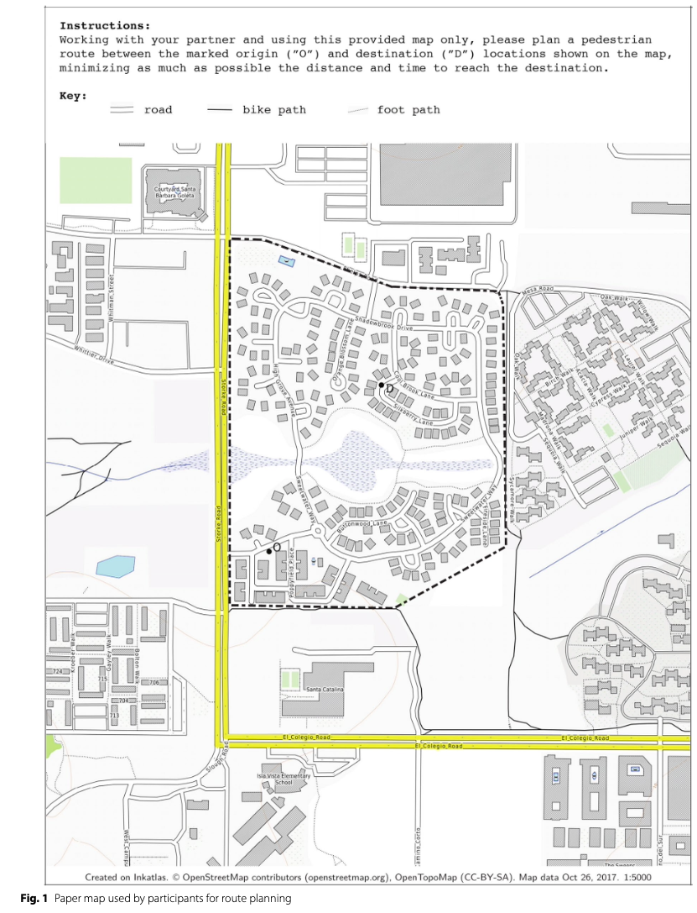

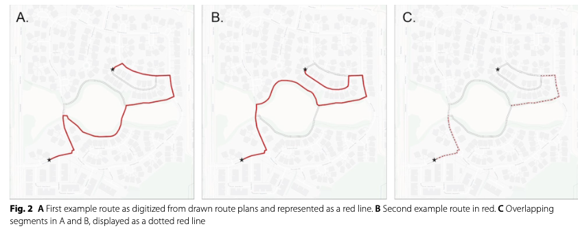

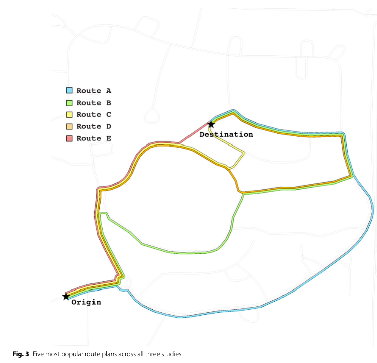

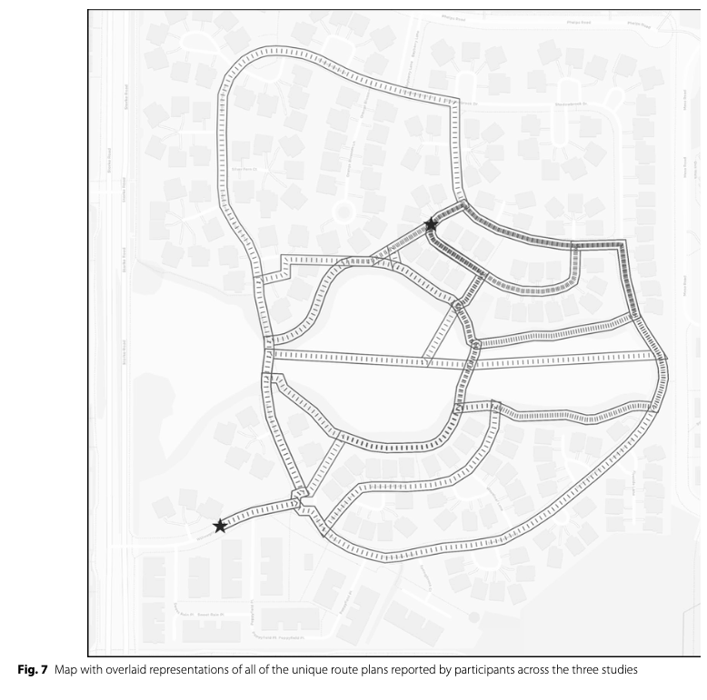

Figure 5: Figures from Bae et al. (2024)

------------------------------------------------------------------------

### Individual and collective foraging in autonomous search agents with human intervention

Schloesser, D. S., Hollenbeck, D., & Kello, C. T. (2021). **Individual
and collective foraging in autonomous search agents with human
intervention.** Scientific Reports, 11(1), Article 1.
https://doi.org/10.1038/s41598-021-87717-7

Abstract

Humans and other complex organisms exhibit intelligent behaviors as
individual agents and as groups of coordinated agents. They can switch
between independent and collective modes of behavior, and flexible
switching can be advantageous for adapting to ongoing changes in
conditions. In the present study, we investigated the flexibility
between independent and collective modes of behavior in a simulated
social foraging task designed to benefit from both modes: distancing
among ten foraging agents promoted faster detection of resources,
whereas flocking promoted faster consumption. There was a tradeoff
between faster detection versus faster consumption, but both factors
contributed to foraging success. Results showed that group foraging
performance among simulated agents was enhanced by loose coupling that
balanced distancing and flocking among agents and enabled them to
fluidly switch among a variety of groupings. We also examined the
effects of more sophisticated cognitive capacities by studying how human
players improve performance when they control one of the search agents.
Results showed that human intervention further enhanced group
performance with loosely coupled agents, and human foragers performed
better when coordinating with loosely coupled agents. Humans players
adapted their balance of independent versus collective search modes in
response to the dynamics of simulated agents, thereby demonstrating the
importance of adaptive flexibility in social foraging.

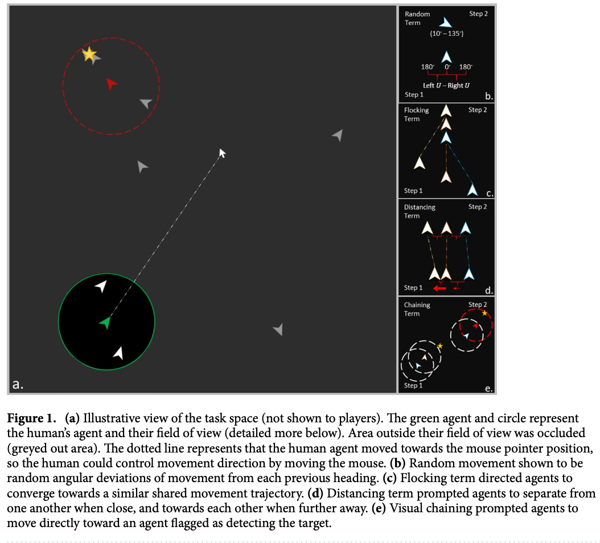

------------------------------------------------------------------------

  

Alharbi, A. H., Khafaga, D. S., El-kenawy, E.-S. M., Eid, M. M.,
Ibrahim, A., Abualigah, L., Khodadadi, N., & Abdelhamid, A. A. (2024).
**Optimizing electric vehicle paths to charging stations using parallel
greylag goose algorithm and Restricted Boltzmann Machines.** Frontiers
in Energy Research, 12. https://doi.org/10.3389/fenrg.2024.1401330

Garg, K., Kello, C. T., & Smaldino, P. E. (2022). **Individual
exploration and selective social learning: Balancing
exploration–exploitation trade-offs in collective foraging.** Journal of
The Royal Society Interface, 19(189), 20210915.
https://doi.org/10.1098/rsif.2021.0915

Mezey, D., Deffner, D., Kurvers, R. H. J. M., & Romanczuk, P. (2024).
**Visual social information use in collective foraging.** PLOS
Computational Biology, 20(5), e1012087.
https://doi.org/10.1371/journal.pcbi.1012087

------------------------------------------------------------------------

Almaatouq, A., Alsobay, M., Yin, M., & Watts, D. J. (2021). Task
complexity moderates group synergy. *Proceedings of the National Academy
of Sciences*, *118*(36). <https://doi.org/10.1073/pnas.2101062118>

Bae, C., Montello, D., & Hegarty, M. (2024). Wayfinding in pairs:
Comparing the planning and navigation performance of dyads and
individuals in a real-world environment. *Cognitive Research: Principles
and Implications*, *9*(1), 40.
<https://doi.org/10.1186/s41235-024-00563-9>

Brunyé, T. T., Gardony, A. L., Holmes, A., & Taylor, H. A. (2018).
Spatial decision dynamics during wayfinding: Intersections prompt the
decision-making process. *Cognitive Research: Principles and
Implications*, *3*(1), 13. <https://doi.org/10.1186/s41235-018-0098-3>

Brunyé, T. T., Hendel, D., Gardony, A. L., Hussey, E. K., & Taylor, H.
A. (2023). Personality Traits and Spatial Skills Are Related to Group
Dynamics and Success During Collective Wayfinding. In *Collective
Spatial Cognition*. Routledge.

Callaway, F., Van Opheusden, B., Gul, S., Das, P., Krueger, P. M.,
Griffiths, T. L., & Lieder, F. (2022). Rational use of cognitive
resources in human planning. *Nature Human Behaviour*, *6*(8),
1112–1125. <https://doi.org/10.1038/s41562-022-01332-8>

Deffner, D., Mezey, D., Kahl, B., Schakowski, A., Romanczuk, P., Wu, C.
M., & Kurvers, R. H. J. M. (2024). Collective incentives reduce
over-exploitation of social information in unconstrained human groups.
*Nature Communications*, *15*(1), 2683.
<https://doi.org/10.1038/s41467-024-47010-3>

Ericson, J. D., & Warren, W. H. (2020). Probing the invariant structure
of spatial knowledge: Support for the cognitive graph hypothesis.
*Cognition*, *200*, 104276.
<https://doi.org/10.1016/j.cognition.2020.104276>

Garg, K., Deng, W., & Mobbs, D. (2024). *Beyond the individual: A social
foraging framework to study decisions in groups*. OSF.
<https://doi.org/10.31219/osf.io/rmqyb>

Gulati, A., Nguyen, T. N., & Gonzalez, C. (2021). Task Complexity and
Performance in Individuals and Groups Without Communication. *AAAI Fall
Symposium. Cham: Springer Nature Switzerland*, 8.

Hawkins, R. D., Berdahl, A. M., Pentland, A. ‘Sandy’., Tenenbaum, J. B.,
Goodman, N. D., & Krafft, P. M. (2023). Flexible social inference
facilitates targeted social learning when rewards are not observable.
*Nature Human Behaviour*, *7*(10), 1767–1776.
<https://doi.org/10.1038/s41562-023-01682-x>

Ho, M. K., Abel, D., Correa, C. G., Littman, M. L., Cohen, J. D., &
Griffiths, T. L. (2021). Control of mental representations in human
planning. *arXiv:2105.06948 \[Cs\]*. <https://arxiv.org/abs/2105.06948>

Krafft, P. M. (2015). *Emergent Collective Sensing in Human Groups*. 6.

Krukar, J., Navas Medrano, S., & Schwering, A. (2023). Route effects in
city-based survey knowledge estimates. *Cognitive Processing*, *24*(2),
213–231. <https://doi.org/10.1007/s10339-022-01122-0>

Lekschas, F., Behrisch, M., Bach, B., Kerpedjiev, P., Gehlenborg, N., &
Pfister, H. (2020). Pattern-Driven Navigation in 2D Multiscale
Visualizations with Scalable Insets. *IEEE Transactions on Visualization
and Computer Graphics*, *26*(1), 611–621.
<https://doi.org/10.1109/TVCG.2019.2934555>

Mugan, U., & MacIver, M. A. (2020). Spatial planning with long visual
range benefits escape from visual predators in complex naturalistic
environments. *Nature Communications*, *11*(1), 3057.
<https://doi.org/10.1038/s41467-020-16102-1>

Naito, A., Katahira, K., & Kameda, T. (2022). Insights about the common
generative rule underlying an information foraging task can be
facilitated via collective search. *Scientific Reports*, *12*(1), 8047.

Peer, M., Brunec, I. K., Newcombe, N. S., & Epstein, R. A. (2021).
Structuring Knowledge with Cognitive Maps and Cognitive Graphs. *Trends
in Cognitive Sciences*, *25*(1), 37–54.
<https://doi.org/10.1016/j.tics.2020.10.004>

Tsirtsis, S., Rodriguez, M. G., & Gerstenberg, T. (2024). *Towards a
computational model of responsibility judgments in sequential human-AI
collaboration*. <https://doi.org/10.31234/osf.io/m4yad>

Wu, C. M., Deffner, D., Kahl, B., Meder, B., Ho, M. H., & Kurvers, R. H.
J. M. (2023). *Visual-spatial dynamics drive adaptive social learning in
immersive environments* \[Preprint\].
<https://doi.org/10.1101/2023.06.28.546887>

Zhao, H., Thrash, T., Grossrieder, A., Kapadia, M., Moussaïd, M.,
Hölscher, C., & Schinazi, V. R. (2020). The interaction between map
complexity and crowd movement on navigation decisions in virtual
reality. *Royal Society Open Science*, *7*(3), 191523.
<https://doi.org/10.1098/rsos.191523>

