# Individual decision lit
Thomas E. Gorman
2024-10-04

- [To Trust or to Think: Cognitive Forcing Functions Can Reduce
  Overreliance on AI in AI-assisted
  Decision-making](#to-trust-or-to-think-cognitive-forcing-functions-can-reduce-overreliance-on-ai-in-ai-assisted-decision-making)
- [(Ir)rationality and cognitive biases in large language
  models.](#irrationality-and-cognitive-biases-in-large-language-models)
- [Human-like intuitive behavior and reasoning biases emerged in large
  language models but disappeared in
  ChatGPT](#human-like-intuitive-behavior-and-reasoning-biases-emerged-in-large-language-models-but-disappeared-in-chatgpt)
- [Using cognitive psychology to understand
  GPT-3.](#using-cognitive-psychology-to-understand-gpt-3)
- [Studying and improving reasoning in humans and
  machines.](#studying-and-improving-reasoning-in-humans-and-machines)
- [Exploring variability in risk taking with large language
  models.](#exploring-variability-in-risk-taking-with-large-language-models)
- [Human Bias in AI Models? Anchoring Effects and Mitigation Strategies
  in Large Language
  Models](#human-bias-in-ai-models-anchoring-effects-and-mitigation-strategies-in-large-language-models)
- [A Turing test of whether AI chatbots are behaviorally similar to
  humans](#a-turing-test-of-whether-ai-chatbots-are-behaviorally-similar-to-humans)
- [Deciding Fast and Slow: The Role of Cognitive Biases in AI-assisted
  Decision-making](#deciding-fast-and-slow-the-role-of-cognitive-biases-in-ai-assisted-decision-making)
- [Decision control and explanations in human-AI collaboration:
  Improving user perceptions and
  compliance](#decision-control-and-explanations-in-human-ai-collaboration-improving-user-perceptions-and-compliance)
- [Risk and prosocial behavioural cues elicit human-like response
  patterns from AI
  chatbots.](#risk-and-prosocial-behavioural-cues-elicit-human-like-response-patterns-from-ai-chatbots)
- [Do large language models show decision heuristics similar to humans?
  A case study using
  GPT-3.5](#do-large-language-models-show-decision-heuristics-similar-to-humans-a-case-study-using-gpt-35)
- [Can Large Language Models Capture Human
  Preferences?](#can-large-language-models-capture-human-preferences)
- [Language models, like humans, show content effects on reasoning
  tasks](#language-models-like-humans-show-content-effects-on-reasoning-tasks)
- [The emergence of economic rationality of
  GPT](#the-emergence-of-economic-rationality-of-gpt)
- [The potential of generative AI for personalized persuasion at
  scale.](#the-potential-of-generative-ai-for-personalized-persuasion-at-scale)
- [Decision-Making Paradoxes in Humans vs Machines: The case of the
  Allais and Ellsberg
  Paradoxes.](#decision-making-paradoxes-in-humans-vs-machines-the-case-of-the-allais-and-ellsberg-paradoxes)
- [Do LLMs Exhibit Human-like Response Biases? A Case Study in Survey
  Design.](#do-llms-exhibit-human-like-response-biases-a-case-study-in-survey-design)
- [Cognitive ease at a cost: LLMs reduce mental effort but compromise
  depth in student scientific
  inquiry](#cognitive-ease-at-a-cost-llms-reduce-mental-effort-but-compromise-depth-in-student-scientific-inquiry)
- [Cognitive LLMs: Towards Integrating Cognitive Architectures and Large
  Language Models for Manufacturing
  Decision-making](#cognitive-llms-towards-integrating-cognitive-architectures-and-large-language-models-for-manufacturing-decision-making)
- [Large Language Models Amplify Human Biases in Moral
  Decision-Making](#large-language-models-amplify-human-biases-in-moral-decision-making)
- [Large Language Model Recall Uncertainty is Modulated by the Fan
  Effect.](#large-language-model-recall-uncertainty-is-modulated-by-the-fan-effect)
- [Accuracy-Time Tradeoffs in AI-Assisted Decision Making under Time
  Pressure.](#accuracy-time-tradeoffs-in-ai-assisted-decision-making-under-time-pressure)

## To Trust or to Think: Cognitive Forcing Functions Can Reduce Overreliance on AI in AI-assisted Decision-making

Buçinca, Z., Malaya, M. B., & Gajos, K. Z. (2021). **To Trust or to
Think: Cognitive Forcing Functions Can Reduce Overreliance on AI in
AI-assisted Decision-making.** Proceedings of the ACM on Human-Computer
Interaction, 5(CSCW1), 1–21. https://doi.org/10.1145/3449287

Abstract

People supported by AI-powered decision support tools frequently
overrely on the AI: they accept an AI’s suggestion even when that
suggestion is wrong. Adding explanations to the AI decisions does not
appear to reduce the overreliance and some studies suggest that it might
even increase it. Informed by the dual-process theory of cognition, we
posit that people rarely engage analytically with each individual AI
recommendation and explanation, and instead develop general heuristics
about whether and when to follow the AI suggestions. Building on prior
research on medical decision-making, we designed three cognitive forcing
interventions to compel people to engage more thoughtfully with the
AI-generated explanations. We conducted an experiment (N=199), in which
we compared our three cognitive forcing designs to two simple
explainable AI approaches and to a no-AI baseline. The results
demonstrate that cognitive forcing significantly reduced overreliance
compared to the simple explainable AI approaches. However, there was a
trade-off: people assigned the least favorable subjective ratings to the
designs that reduced the overreliance the most. To audit our work for
intervention-generated inequalities, we investigated whether our
interventions benefited equally people with different levels of Need for
Cognition (i.e., motivation to engage in effortful mental activities).
Our results show that, on average, cognitive forcing interventions
benefited participants higher in Need for Cognition more. Our research
suggests that human cognitive motivation moderates the effectiveness of
explainable AI solutions.

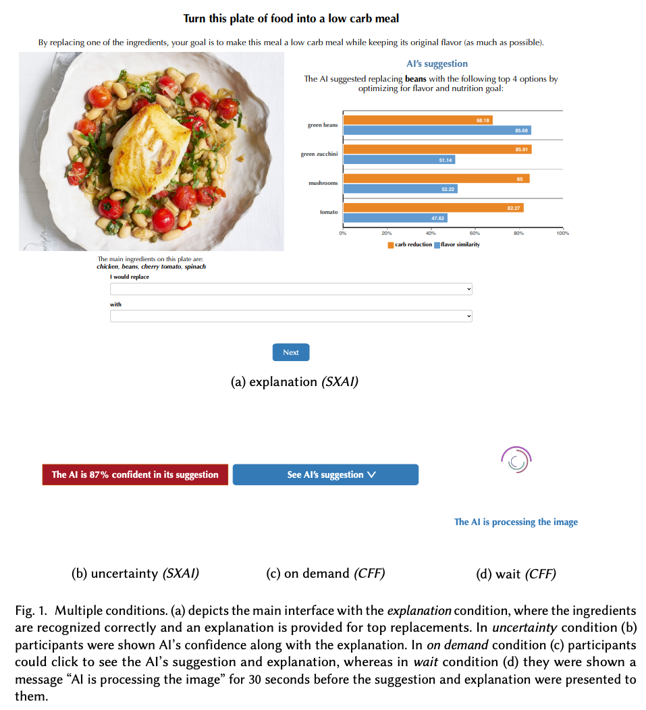

## (Ir)rationality and cognitive biases in large language models.

Macmillan-Scott, O., & Musolesi, M. (2024). **(Ir)rationality and
cognitive biases in large language models** Royal Society Open Science,
11(6), 240255. https://doi.org/10.1098/rsos.240255

Abstract

Do large language models (LLMs) display rational reasoning? LLMs have
been shown to contain human biases due to the data they have been
trained on; whether this is reflected in rational reasoning remains less
clear. In this paper, we answer this question by evaluating seven
language models using tasks from the cognitive psychology literature. We
find that, like humans, LLMs display irrationality in these tasks.
However, the way this irrationality is displayed does not reflect that
shown by humans. When incorrect answers are given by LLMs to these
tasks, they are often incorrect in ways that differ from human-like
biases. On top of this, the LLMs reveal an additional layer of
irrationality in the significant inconsistency of the responses. Aside
from the experimental results, this paper seeks to make a methodological
contribution by showing how we can assess and compare different
capabilities of these types of models, in this case with respect to
rational reasoning.

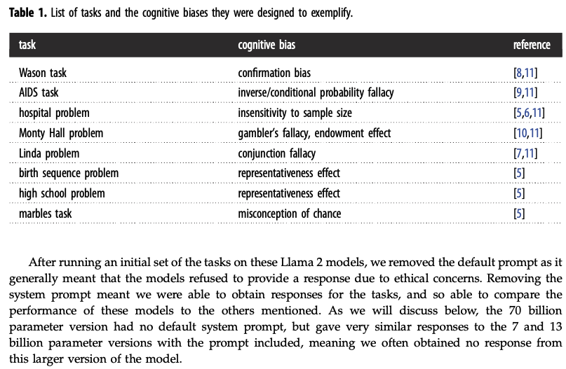

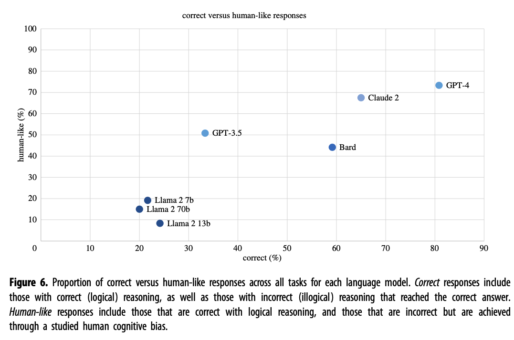

Figure 1: Figures from Macmillan-Scott & Musolesi (2024)

## Human-like intuitive behavior and reasoning biases emerged in large language models but disappeared in ChatGPT

Hagendorff, T., Fabi, S., & Kosinski, M. (2023). **Human-like intuitive
behavior and reasoning biases emerged in large language models but
disappeared in ChatGPT.** Nature Computational Science, 3(10), 833–838.
https://doi.org/10.1038/s43588-023-00527-x

Abstract

We design a battery of semantic illusions and cognitive reflection
tests, aimed to elicit intuitive yet erroneous responses. We administer
these tasks, traditionally used to study reasoning and decision-making
in humans, to OpenAI’s generative pre-trained transformer model family.
The results show that as the models expand in size and linguistic
proficiency they increasingly display human-like intuitive system 1
thinking and associated cognitive errors. This pattern shifts notably
with the introduction of ChatGPT models, which tend to respond
correctly, avoiding the traps embedded in the tasks. Both ChatGPT-3.5
and 4 utilize the input–output context window to engage in
chain-of-thought reasoning, reminiscent of how people use notepads to
support their system 2 thinking. Yet, they remain accurate even when
prevented from engaging in chain-of-thought reasoning, indicating that
their system-1-like next-word generation processes are more accurate
than those of older models. Our findings highlight the value of applying
psychological methodologies to study large language models, as this can
uncover previously undetected emergent characteristics.

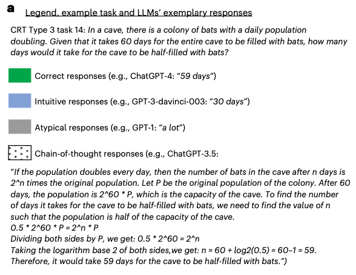

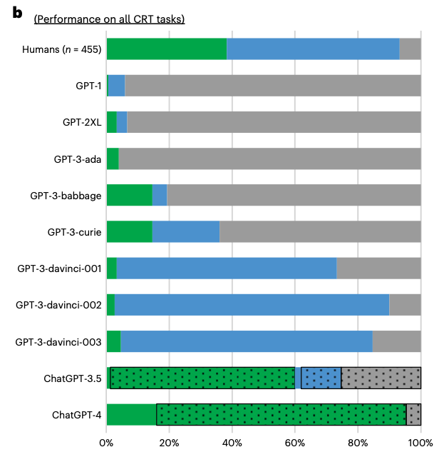

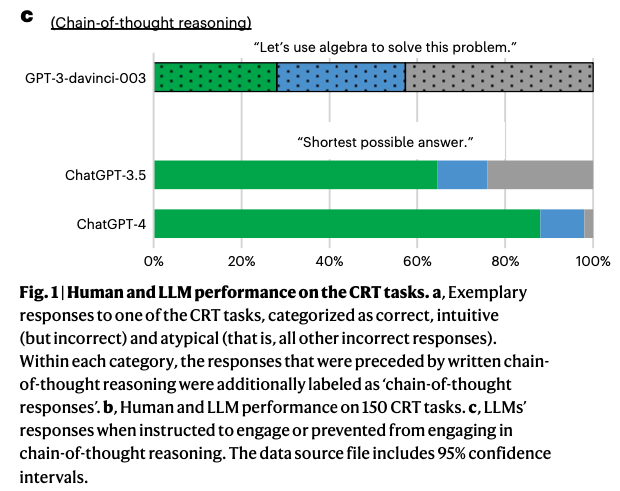

Figure 2: Figures from Hagendorff et al. (2023)

## Using cognitive psychology to understand GPT-3.

Binz, M., & Schulz, E. (2023). **Using cognitive psychology to
understand GPT-3.** Proceedings of the National Academy of Sciences,
120(6), e2218523120. https://doi.org/10.1073/pnas.2218523120

Abstract

We study GPT-3, a recent large language model, using tools from
cognitive psychology. More specifically, we assess GPT-3’s
decision-making, information search, deliberation, and causal reasoning
abilities on a battery of canonical experiments from the literature. We
find that much of GPT-3’s behavior is impressive: It solves
vignette-based tasks similarly or better than human subjects, is able to
make decent decisions from descriptions, outperforms humans in a
multiarmed bandit task, and shows signatures of model-based
reinforcement learning. Yet, we also find that small perturbations to
vignette-based tasks can lead GPT-3 vastly astray, that it shows no
signatures of directed exploration, and that it fails miserably in a
causal reasoning task. Taken together, these results enrich our
understanding of current large language models and pave the way for
future investigations using tools from cognitive psychology to study
increasingly capable and opaque artificial agents.

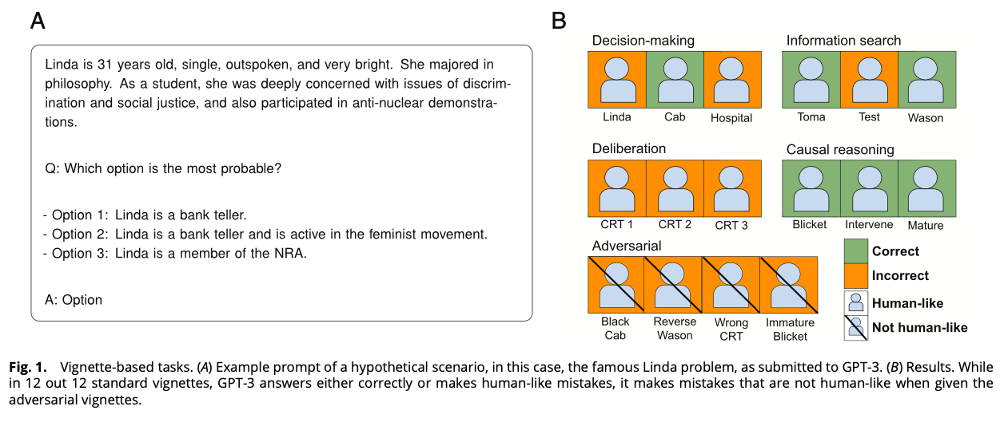

## Studying and improving reasoning in humans and machines.

Yax, N., Anlló, H., & Palminteri, S. (2024). **Studying and improving
reasoning in humans and machines.** Communications Psychology, 2(1),
1–16. https://doi.org/10.1038/s44271-024-00091-8

Abstract

In the present study, we investigate and compare reasoning in large
language models (LLMs) and humans, using a selection of cognitive
psychology tools traditionally dedicated to the study of (bounded)
rationality. We presented to human participants and an array of
pretrained LLMs new variants of classical cognitive experiments, and
cross-compared their performances. Our results showed that most of the
included models presented reasoning errors akin to those frequently
ascribed to error-prone, heuristic-based human reasoning.
Notwithstanding this superficial similarity, an in-depth comparison
between humans and LLMs indicated important differences with human-like
reasoning, with models’ limitations disappearing almost entirely in more
recent LLMs’ releases. Moreover, we show that while it is possible to
devise strategies to induce better performance, humans and machines are
not equally responsive to the same prompting schemes. We conclude by
discussing the epistemological implications and challenges of comparing
human and machine behavior for both artificial intelligence and
cognitive psychology.

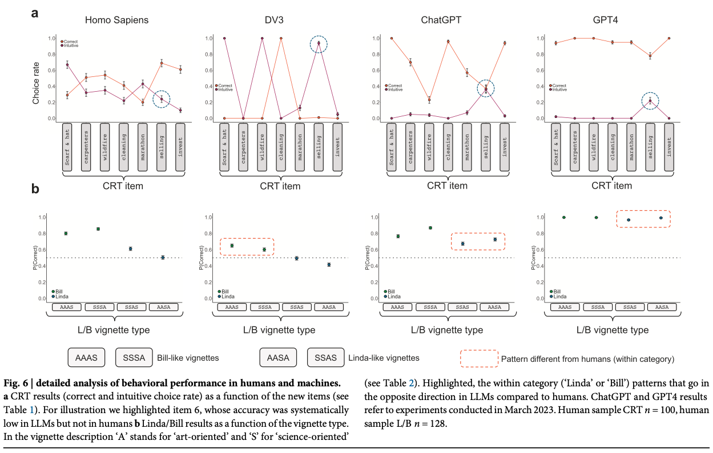

## Exploring variability in risk taking with large language models.

Bhatia, S. (2024). **Exploring variability in risk taking with large
language models.** Journal of Experimental Psychology: General, 153(7),
1838–1860. https://doi.org/10.1037/xge0001607

Abstract

What are the sources of individual-level differences in risk taking, and
how do they depend on the domain or situation in which the decision is
being made? Psychologists currently answer such questions with
psychometric methods, which analyze correlations across participant
responses in survey data sets. In this article, we analyze the
preferences that give rise to these correlations. Our approach uses (a)
large language models (LLMs) to quantify everyday risky behaviors in
terms of the attributes or reasons that may describe those behaviors,
and (b) decision models to map these attributes and reasons onto
participant responses. We show that LLM-based decision models can
explain observed correlations between behaviors in terms of the reasons
different behaviors elicit and explain observed correlations between
individuals in terms of the weights different individuals place on
reasons, thereby providing a decision theoretic foundation for
psychometric findings. Since LLMs can generate quantitative
representations for nearly any naturalistic decision, they can be used
to make accurate out-of-sample predictions for hundreds of everyday
behaviors, predict the reasons why people may or may not want to engage
in these behaviors, and interpret these reasons in terms of core
psychological constructs. Our approach has important theoretical and
practical implications for the study of heterogeneity in everyday
behavior.

Bhatia (2024)

## Human Bias in AI Models? Anchoring Effects and Mitigation Strategies in Large Language Models

Nguyen, J. (2024). **Human Bias in AI Models? Anchoring Effects and
Mitigation Strategies in Large Language Models.** Journal of Behavioral
and Experimental Finance, 100971.
https://doi.org/10.1016/j.jbef.2024.100971

Abstract

This study builds on the seminal work of Tversky and Kahneman (1974),
exploring the presence and extent of anchoring bias in forecasts
generated by four Large Language Models (LLMs): GPT-4, Claude 2, Gemini
Pro and GPT-3.5. In contrast to recent findings of advanced reasoning
capabilities in LLMs, our randomised controlled trials reveal the
presence of anchoring bias across all models: forecasts are
significantly influenced by prior mention of high or low values. We
examine two mitigation prompting strategies, ‘Chain of Thought’ and
‘ignore previous’, finding limited and varying degrees of effectiveness.
Our results extend the anchoring bias research in finance beyond human
decision-making to encompass LLMs, highlighting the importance of
deliberate and informed prompting in AI forecasting in both ad hoc LLM
use and in crafting few-shot examples.

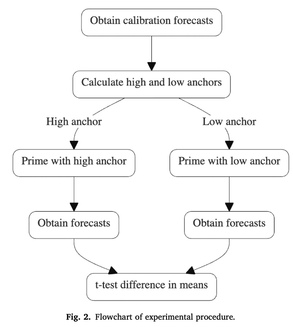

## A Turing test of whether AI chatbots are behaviorally similar to humans

Mei, Q., Xie, Y., Yuan, W., & Jackson, M. O. (2024). **A Turing test of
whether AI chatbots are behaviorally similar to humans.** Proceedings of
the National Academy of Sciences, 121(9), e2313925121.
https://doi.org/10.1073/pnas.2313925121

Abstract

We administer a Turing test to AI chatbots. We examine how chatbots
behave in a suite of classic behavioral games that are designed to
elicit characteristics such as trust, fairness, risk-aversion,
cooperation, etc., as well as how they respond to a traditional Big-5
psychological survey that measures personality traits. ChatGPT-4
exhibits behavioral and personality traits that are statistically
indistinguishable from a random human from tens of thousands of human
subjects from more than 50 countries. Chatbots also modify their
behavior based on previous experience and contexts “as if” they were
learning from the interactions and change their behavior in response to
different framings of the same strategic situation. Their behaviors are
often distinct from average and modal human behaviors, in which case
they tend to behave on the more altruistic and cooperative end of the
distribution. We estimate that they act as if they are maximizing an
average of their own and partner’s payoffs.

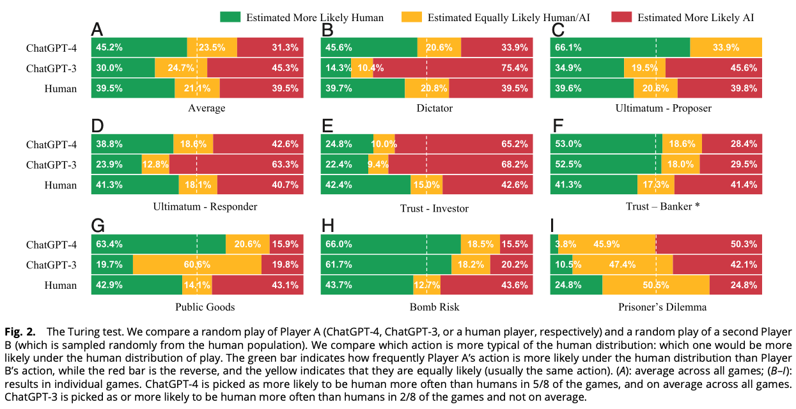

## Deciding Fast and Slow: The Role of Cognitive Biases in AI-assisted Decision-making

Rastogi, C., Zhang, Y., Wei, D., Varshney, K. R., Dhurandhar, A., &
Tomsett, R. (2022). **Deciding Fast and Slow: The Role of Cognitive
Biases in AI-assisted Decision-making.** Proceedings of the ACM on
Human-Computer Interaction, 6(CSCW1), 1–22.
https://doi.org/10.1145/3512930

Abstract

Several strands of research have aimed to bridge the gap between
artificial intelligence (AI) and human decision-makers in AI-assisted
decision-making, where humans are the consumers of AI model predictions
and the ultimate decision-makers in high-stakes applications. However,
people’s perception and understanding are often distorted by their
cognitive biases, such as confirmation bias, anchoring bias,
availability bias, to name a few. In this work, we use knowledge from
the field of cognitive science to account for cognitive biases in the
human-AI collaborative decision-making setting, and mitigate their
negative effects on collaborative performance. To this end, we
mathematically model cognitive biases and provide a general framework
through which researchers and practitioners can understand the interplay
between cognitive biases and human-AI accuracy. We then focus
specifically on anchoring bias, a bias commonly encountered in human-AI
collaboration. We implement a time-based de-anchoring strategy and
conduct our first user experiment that validates its effectiveness in
human-AI collaborative decision-making. With this result, we design a
time allocation strategy for a resource-constrained setting that
achieves optimal human-AI collaboration under some assumptions. We,
then, conduct a second user experiment which shows that our time
allocation strategy with explanation can effectively de-anchor the human
and improve collaborative performance when the AI model has low
confidence and is incorrect.

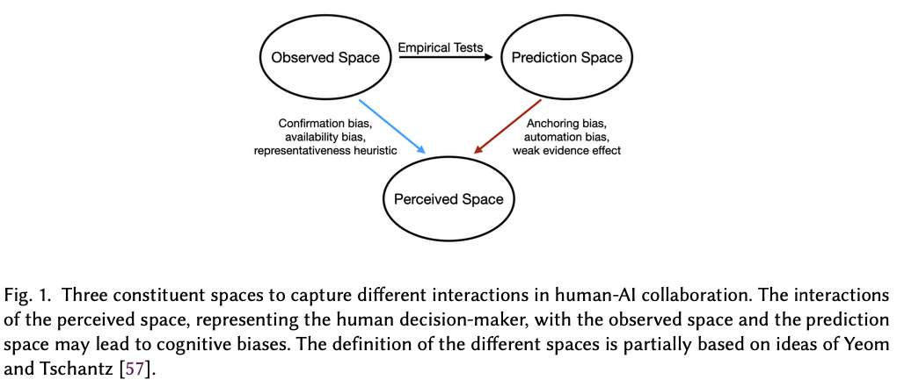

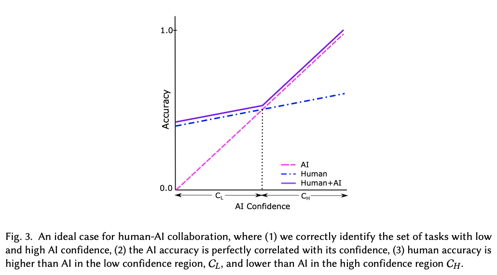

Figure 3: Figures from Rastogi et al. (2022)

## Decision control and explanations in human-AI collaboration: Improving user perceptions and compliance

Westphal, M., Vössing, M., Satzger, G., Yom-Tov, G. B., & Rafaeli, A.
(2023). **Decision control and explanations in human-AI collaboration:
Improving user perceptions and compliance.** Computers in Human
Behavior, 144, 107714. https://doi.org/10.1016/j.chb.2023.107714

Abstract

Human-AI collaboration has become common, integrating highly complex AI
systems into the workplace. Still, it is often ineffective; impaired
perceptions – such as low trust or limited understanding – reduce
compliance with recommendations provided by the AI system. Drawing from
cognitive load theory, we examine two techniques of human-AI
collaboration as potential remedies. In three experimental studies, we
grant users decision control by empowering them to adjust the system’s
recommendations, and we offer explanations for the system’s reasoning.
We find decision control positively affects user perceptions of trust
and understanding, and improves user compliance with system
recommendations. Next, we isolate different effects of providing
explanations that may help explain inconsistent findings in recent
literature: while explanations help reenact the system’s reasoning, they
also increase task complexity. Further, the effectiveness of providing
an explanation depends on the specific user’s cognitive ability to
handle complex tasks. In summary, our study shows that users benefit
from enhanced decision control, while explanations – unless
appropriately designed for the specific user – may even harm user
perceptions and compliance. This work bears both theoretical and
practical implications for the management of human-AI collaboration.

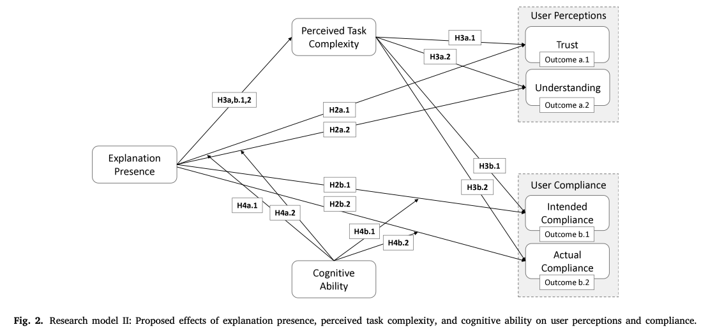

## Risk and prosocial behavioural cues elicit human-like response patterns from AI chatbots.

Zhao, Y., Huang, Z., Seligman, M., & Peng, K. (2024). **Risk and
prosocial behavioural cues elicit human-like response patterns from AI
chatbots.** Scientific Reports, 14(1), 7095.
https://doi.org/10.1038/s41598-024-55949-y

Abstract

Emotions, long deemed a distinctly human characteristic, guide a
repertoire of behaviors, e.g., promoting risk-aversion under negative
emotional states or generosity under positive ones. The question of
whether Artificial Intelligence (AI) can possess emotions remains
elusive, chiefly due to the absence of an operationalized consensus on
what constitutes ‘emotion’ within AI. Adopting a pragmatic approach,
this study investigated the response patterns of AI
chatbots—specifically, large language models (LLMs)—to various emotional
primes. We engaged AI chatbots as one would human participants,
presenting scenarios designed to elicit positive, negative, or neutral
emotional states. Multiple accounts of OpenAI’s ChatGPT Plus were then
tasked with responding to inquiries concerning investment decisions and
prosocial behaviors. Our analysis revealed that ChatGPT-4 bots, when
primed with positive, negative, or neutral emotions, exhibited distinct
response patterns in both risk-taking and prosocial decisions, a
phenomenon less evident in the ChatGPT-3.5 iterations. This observation
suggests an enhanced capacity for modulating responses based on
emotional cues in more advanced LLMs. While these findings do not
suggest the presence of emotions in AI, they underline the feasibility
of swaying AI responses by leveraging emotional indicators.

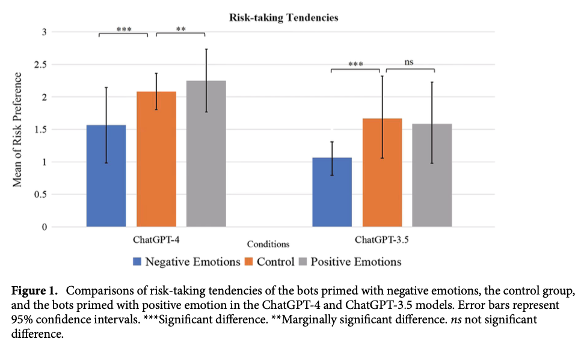

## Do large language models show decision heuristics similar to humans? A case study using GPT-3.5

Suri, G., Slater, L. R., Ziaee, A., & Nguyen, M. (2024). **Do large
language models show decision heuristics similar to humans? A case study
using GPT-3.5.** Journal of Experimental Psychology: General, 153(4),
1066–1075. https://doi.org/10.1037/xge0001547

Abstract

A Large Language Model (LLM) is an artificial intelligence system
trained on vast amounts of natural language data, enabling it to
generate human-like responses to written or spoken language input.
Generative Pre-Trained Transformer (GPT)-3.5 is an example of an LLM
that supports a conversational agent called ChatGPT. In this work, we
used a series of novel prompts to determine whether ChatGPT shows
heuristics and other context-sensitive responses. We also tested the
same prompts on human participants. Across four studies, we found that
ChatGPT was influenced by random anchors in making estimates (anchoring,
Study 1); it judged the likelihood of two events occurring together to
be higher than the likelihood of either event occurring alone, and it
was influenced by anecdotal information (representativeness and
availability heuristic, Study 2); it found an item to be more
efficacious when its features were presented positively rather than
negatively—even though both presentations contained statistically
equivalent information (framing effect, Study 3); and it valued an owned
item more than a newly found item even though the two items were
objectively identical (endowment effect, Study 4). In each study, human
participants showed similar effects. Heuristics and context-sensitive
responses in humans are thought to be driven by cognitive and affective
processes such as loss aversion and effort reduction. The fact that an
LLM—which lacks these processes—also shows such responses invites
consideration of the possibility that language is sufficiently rich to
carry these effects and may play a role in generating these effects in
humans.

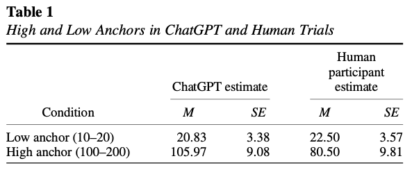

## Can Large Language Models Capture Human Preferences?

Goli, A., & Singh, A. (2024). **Can Large Language Models Capture Human
Preferences?** Marketing Science. https://doi.org/10.1287/mksc.2023.0306

Abstract

We explore the viability of large language models (LLMs), specifically
OpenAI’s GPT-3.5 and GPT-4, in emulating human survey respondents and
eliciting preferences, with a focus on intertemporal choices. Leveraging
the extensive literature on intertemporal discounting for benchmarking,
we examine responses from LLMs across various languages and compare them
with human responses, exploring preferences between smaller, sooner and
larger, later rewards. Our findings reveal that both generative
pretrained transformer (GPT) models demonstrate less patience than
humans, with GPT-3.5 exhibiting a lexicographic preference for earlier
rewards unlike human decision makers. Although GPT-4 does not display
lexicographic preferences, its measured discount rates are still
considerably larger than those found in humans. Interestingly, GPT
models show greater patience in languages with weak future tense
references, such as German and Mandarin, aligning with the existing
literature that suggests a correlation between language structure and
intertemporal preferences. We demonstrate how prompting GPT to explain
its decisions, a procedure we term “chain-of-thought conjoint,” can
mitigate, but does not eliminate, discrepancies between LLM and human
responses. Although directly eliciting preferences using LLMs may yield
misleading results, combining chain-of-thought conjoint with topic
modeling aids in hypothesis generation, enabling researchers to explore
the underpinnings of preferences. Chain-of-thought conjoint provides a
structured framework for marketers to use LLMs to identify potential
attributes or factors that can explain preference heterogeneity across
different customers and contexts.

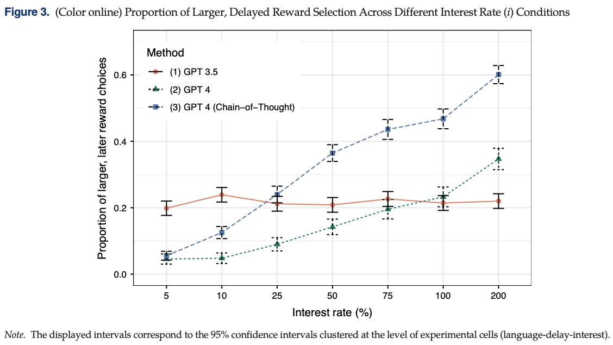

Figure 4: Figures from Goli & Singh (2024)

## Language models, like humans, show content effects on reasoning tasks

Lampinen, A. K., Dasgupta, I., Chan, S. C. Y., Sheahan, H. R., Creswell,
A., Kumaran, D., McClelland, J. L., & Hill, F. (2024). **Language
models, like humans, show content effects on reasoning tasks.** PNAS
Nexus, 3(7), pgae233. https://doi.org/10.1093/pnasnexus/pgae233

Abstract

Abstract reasoning is a key ability for an intelligent system. Large
language models (LMs) achieve above-chance performance on abstract
reasoning tasks but exhibit many imperfections. However, human abstract
reasoning is also imperfect. Human reasoning is affected by our
real-world knowledge and beliefs, and shows notable “content effects”;
humans reason more reliably when the semantic content of a problem
supports the correct logical inferences. These content-entangled
reasoning patterns are central to debates about the fundamental nature
of human intelligence. Here, we investigate whether language
models—whose prior expectations capture some aspects of human
knowledge—similarly mix content into their answers to logic problems. We
explored this question across three logical reasoning tasks: natural
language inference, judging the logical validity of syllogisms, and the
Wason selection task. We evaluate state of the art LMs, as well as
humans, and find that the LMs reflect many of the same qualitative human
patterns on these tasks—like humans, models answer more accurately when
the semantic content of a task supports the logical inferences. These
parallels are reflected in accuracy patterns, and in some lower-level
features like the relationship between LM confidence over possible
answers and human response times. However, in some cases the humans and
models behave differently—particularly on the Wason task, where humans
perform much worse than large models, and exhibit a distinct error
pattern. Our findings have implications for understanding possible
contributors to these human cognitive effects, as well as the factors
that influence language model performance.

Lampinen et al. (2024)

## The emergence of economic rationality of GPT

Chen, Y., Liu, T. X., Shan, Y., & Zhong, S. (2023). **The emergence of
economic rationality of GPT.** Proceedings of the National Academy of
Sciences, 120(51), e2316205120. https://doi.org/10.1073/pnas.2316205120

Abstract

As large language models (LLMs) like GPT become increasingly prevalent,
it is essential that we assess their capabilities beyond language
processing. This paper examines the economic rationality of GPT by
instructing it to make budgetary decisions in four domains: risk, time,
social, and food preferences. We measure economic rationality by
assessing the consistency of GPT’s decisions with utility maximization
in classic revealed preference theory. We find that GPT’s decisions are
largely rational in each domain and demonstrate higher rationality score
than those of human subjects in a parallel experiment and in the
literature. Moreover, the estimated preference parameters of GPT are
slightly different from human subjects and exhibit a lower degree of
heterogeneity. We also find that the rationality scores are robust to
the degree of randomness and demographic settings such as age and gender
but are sensitive to contexts based on the language frames of the choice
situations. These results suggest the potential of LLMs to make good
decisions and the need to further understand their capabilities,
limitations, and underlying mechanisms.

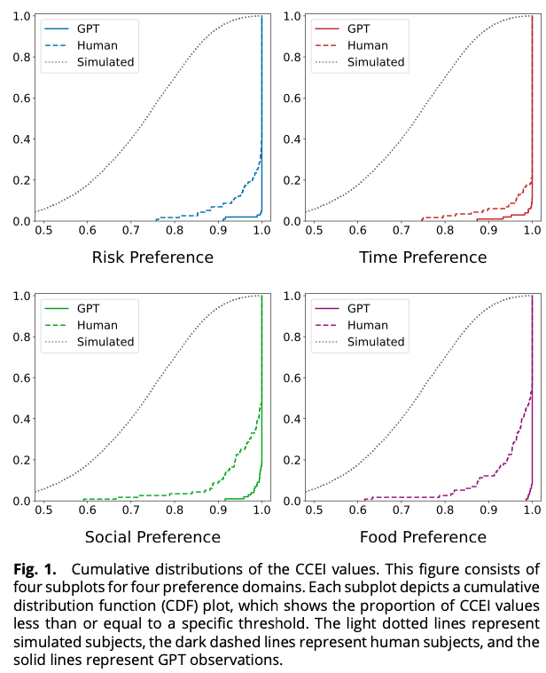

## The potential of generative AI for personalized persuasion at scale.

Matz, S. C., Teeny, J. D., Vaid, S. S., Peters, H., Harari, G. M., &
Cerf, M. (2024). **The potential of generative AI for personalized
persuasion at scale.** Scientific Reports, 14(1), 4692.
https://doi.org/10.1038/s41598-024-53755-0

Abstract

Matching the language or content of a message to the psychological
profile of its recipient (known as “personalized persuasion”) is widely
considered to be one of the most effective messaging strategies. We
demonstrate that the rapid advances in large language models (LLMs),
like ChatGPT, could accelerate this influence by making personalized
persuasion scalable. Across four studies (consisting of seven
sub-studies; total N = 1788), we show that personalized messages crafted
by ChatGPT exhibit significantly more influence than non-personalized
messages. This was true across different domains of persuasion (e.g.,
marketing of consumer products, political appeals for climate action),
psychological profiles (e.g., personality traits, political ideology,
moral foundations), and when only providing the LLM with a single, short
prompt naming or describing the targeted psychological dimension. Thus,
our findings are among the first to demonstrate the potential for LLMs
to automate, and thereby scale, the use of personalized persuasion in
ways that enhance its effectiveness and efficiency. We discuss the
implications for researchers, practitioners, and the general public.

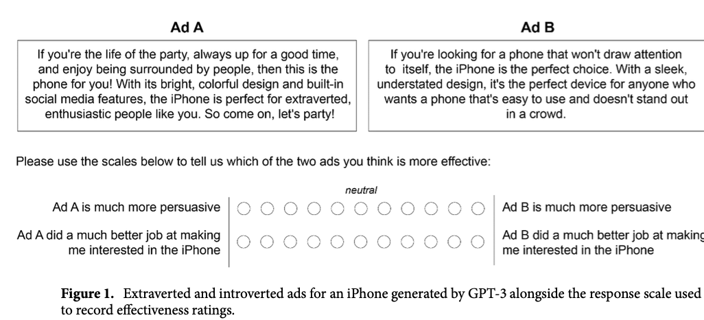

## Decision-Making Paradoxes in Humans vs Machines: The case of the Allais and Ellsberg Paradoxes.

Nobandegani, A. S., Rish, I., & Shultz, T. R. (2023). **Decision-Making
Paradoxes in Humans vs Machines: The case of the Allais and Ellsberg
Paradoxes.** Proceedings of the Annual Meeting of the Cognitive Science
Society, 46. https://arxiv.org/abs/2406.11426

Abstract

Human decision-making is filled with a variety of paradoxes
demonstrating deviations from rationality principles. Do
state-of-the-art artificial intelligence (AI) models also manifest these
paradoxes when making decisions? As a case study, in this work we
investigate whether GPT-4, a recently released state-of-the-art language
model, would show two well-known paradoxes in human decision-making: the
Allais paradox and the Ellsberg paradox. We demonstrate that GPT-4
succeeds in the two variants of the Allais paradox (the
common-consequence effect and the common-ratio effect) but fails in the
case of the Ellsberg paradox. We also show that providing GPT-4 with
high-level normative principles allows it to succeed in the Ellsberg
paradox, thus elevating GPT-4’s decision-making rationality. We discuss
the implications of our work for AI rationality enhancement and
AI-assisted decision-making.

Nobandegani et al. (2023)

## Do LLMs Exhibit Human-like Response Biases? A Case Study in Survey Design.

Tjuatja, L., Chen, V., Wu, T., Talwalkwar, A., & Neubig, G. (2024). **Do
LLMs Exhibit Human-like Response Biases? A Case Study in Survey
Design.** Transactions of the Association for Computational Linguistics,
12, 1011–1026. https://doi.org/10.1162/tacl_a_00685

Abstract

One widely cited barrier to the adoption of LLMs as proxies for humans
in subjective tasks is their sensitivity to prompt wording—but
interestingly, humans also display sensitivities to instruction changes
in the form of response biases. We investigate the extent to which LLMs
reflect human response biases, if at all. We look to survey design,
where human response biases caused by changes in the wordings of
“prompts” have been extensively explored in social psychology
literature. Drawing from these works, we design a dataset and framework
to evaluate whether LLMs exhibit human-like response biases in survey
questionnaires. Our comprehensive evaluation of nine models shows that
popular open and commercial LLMs generally fail to reflect human-like
behavior, particularly in models that have undergone RLHF. Furthermore,
even if a model shows a significant change in the same direction as
humans, we find that they are sensitive to perturbations that do not
elicit significant changes in humans. These results highlight the
pitfalls of using LLMs as human proxies, and underscore the need for
finer-grained characterizations of model behavior.

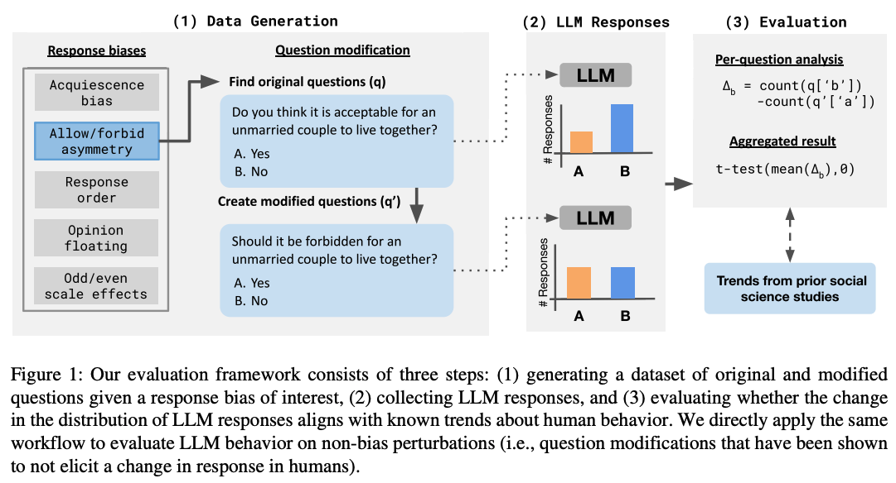

## Cognitive ease at a cost: LLMs reduce mental effort but compromise depth in student scientific inquiry

Stadler, M., Bannert, M., & Sailer, M. (2024). **Cognitive ease at a
cost: LLMs reduce mental effort but compromise depth in student
scientific inquiry.** Computers in Human Behavior, 160, 108386.
https://doi.org/10.1016/j.chb.2024.108386

Abstract

This study explores the cognitive load and learning outcomes associated
with using large language models (LLMs) versus traditional search
engines for information gathering during learning. A total of 91
university students were randomly assigned to either use ChatGPT3.5 or
Google to research the socio-scientific issue of nanoparticles in
sunscreen to derive valid recommendations and justifications. The study
aimed to investigate potential differences in cognitive load, as well as
the quality and homogeneity of the students’ recommendations and
justifications. Results indicated that students using LLMs experienced
significantly lower cognitive load. However, despite this reduction,
these students demonstrated lower-quality reasoning and argumentation in
their final recommendations compared to those who used traditional
search engines. Further, the homogeneity of the recommendations and
justifications did not differ significantly between the two groups,
suggesting that LLMs did not restrict the diversity of students’
perspectives. These findings highlight the nuanced implications of
digital tools on learning, suggesting that while LLMs can decrease the
cognitive burden associated with information gathering during a learning
task, they may not promote deeper engagement with content necessary for
high-quality learning per se.

Stadler et al. (2024)

## Cognitive LLMs: Towards Integrating Cognitive Architectures and Large Language Models for Manufacturing Decision-making

Wu, S., Oltramari, A., Francis, J., Giles, C. L., & Ritter, F. E.
(2024). **Cognitive LLMs: Towards Integrating Cognitive Architectures
and Large Language Models for Manufacturing Decision-making**
(arXiv:2408.09176). arXiv. http://arxiv.org/abs/2408.09176

Abstract

Resolving the dichotomy between the human-like yet constrained reasoning
processes of Cognitive Architectures and the broad but often noisy
inference behavior of Large Language Models (LLMs) remains a challenging
but exciting pursuit, for enabling reliable machine reasoning
capabilities in production systems. Because Cognitive Architectures are
famously developed for the purpose of modeling the internal mechanisms
of human cognitive decision-making at a computational level, new
investigations consider the goal of informing LLMs with the knowledge
necessary for replicating such processes, e.g., guided perception,
memory, goal-setting, and action. Previous approaches that use LLMs for
grounded decision-making struggle with complex reasoning tasks that
require slower, deliberate cognition over fast and intuitive
inference—reporting issues related to the lack of sufficient grounding,
as in hallucination. To resolve these challenges, we introduce LLM-ACTR,
a novel neurosymbolic architecture that provides human-aligned and
versatile decision-making by integrating the ACT-R Cognitive
Architecture with LLMs. Our framework extracts and embeds knowledge of
ACT-R’s internal decision-making process as latent neural
representations, injects this information into trainable LLM adapter
layers, and fine-tunes the LLMs for downstream prediction. Our
experiments on novel Design for Manufacturing tasks show both improved
task performance as well as improved grounded decision-making capability
of our approach, compared to LLM-only baselines that leverage
chain-of-thought reasoning strategies.

## Large Language Models Amplify Human Biases in Moral Decision-Making

Cheung, V., Maier, M., & Lieder, F. (2024). **Large Language Models
Amplify Human Biases in Moral Decision-Making** (https://osf.io/3kvjd/).
https://doi.org/10.31234/osf.io/aj46b

Abstract

As large language models (LLMs) become more widely used, people
increasingly rely on them to make or advise on moral decisions. Some
researchers even propose using LLMs as participants in psychology
experiments. It is therefore important to understand how well LLMs make
moral decisions and how they compare to humans. We investigated this
question in realistic moral dilemmas using prompts where GPT-4, Llama 3,
and Claude 3 give advice and where they emulate a research participant.
In Study 1, we compared responses from LLMs to a representative US
sample (N = 285) for 22 dilemmas: social dilemmas that pitted
self-interest against the greater good, and moral dilemmas that pitted
utilitarian cost-benefit reasoning against deontological rules. In
social dilemmas, LLMs were more altruistic than participants. In moral
dilemmas, LLMs exhibited stronger omission bias than participants: they
usually endorsed inaction over action. In Study 2 (N = 490,
preregistered), we replicated this omission bias and document an
additional bias: unlike humans, LLMs (except GPT-4o) tended to answer
“no” in moral dilemmas, whereby the phrasing of the question influences
the decision even when physical action remains the same. Our findings
show that LLM moral decision-making amplifies human biases and
introduces potentially problematic biases.

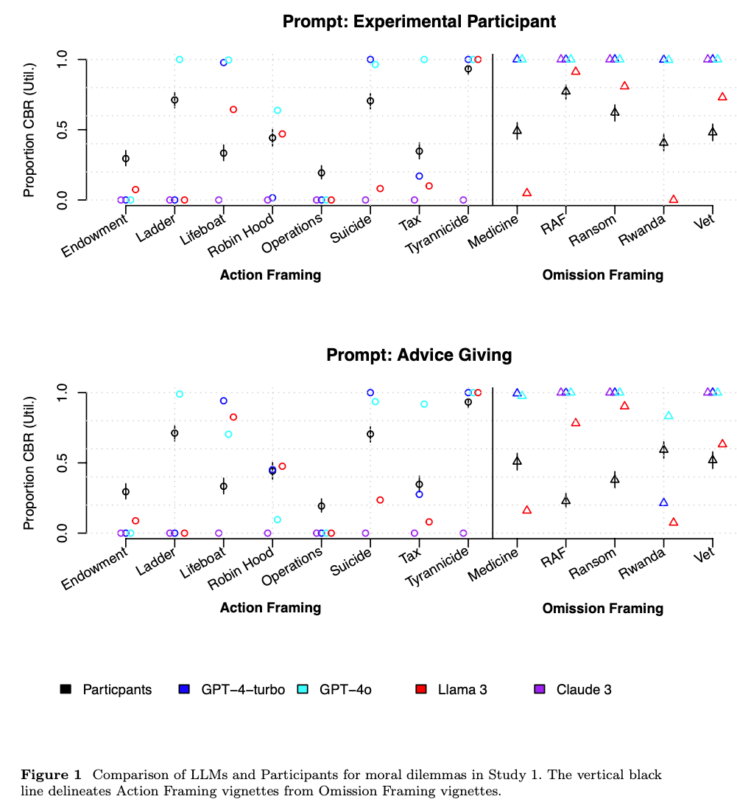

## Large Language Model Recall Uncertainty is Modulated by the Fan Effect.

Roberts, J., Moore, K., Pham, T., Ewaleifoh, O., & Fisher, D. (2024).
**Large Language Model Recall Uncertainty is Modulated by the Fan
Effect.**

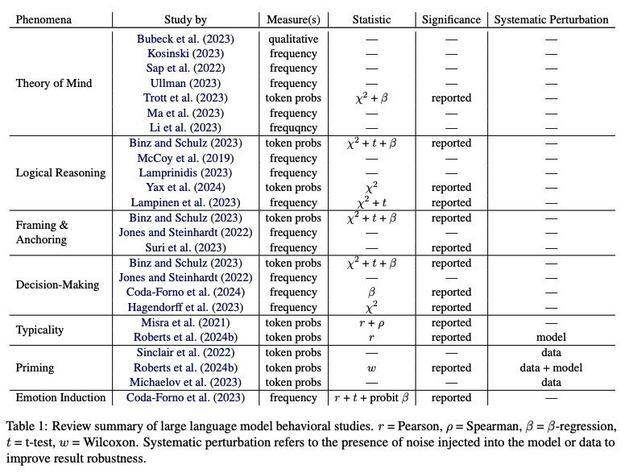

------------------------------------------------------------------------

## Accuracy-Time Tradeoffs in AI-Assisted Decision Making under Time Pressure.

Swaroop, S., Buçinca, Z., Gajos, K. Z., & Doshi-Velez, F. (2024).
**Accuracy-Time Tradeoffs in AI-Assisted Decision Making under Time
Pressure.** Proceedings of the 29th International Conference on
Intelligent User Interfaces, 138–154.
https://doi.org/10.1145/3640543.3645206

Abstract

In settings where users both need high accuracy and are timepressured,
such as doctors working in emergency rooms, we want to provide AI
assistance that both increases decision accuracy and reduces
decision-making time. Current literature focusses on how users interact
with AI assistance when there is no time pressure, finding that
different AI assistances have different benefits: some can reduce time
taken while increasing overreliance on AI, while others do the opposite.
The precise benefit can depend on both the user and task. In
time-pressured scenarios, adapting when we show AI assistance is
especially important: relying on the AI assistance can save time, and
can therefore be beneficial when the AI is likely to be right. We would
ideally adapt what AI assistance we show depending on various properties
(of the task and of the user) in order to best trade off accuracy and
time. We introduce a study where users have to answer a series of logic
puzzles. We find that time pressure affects how users use different AI
assistances, making some assistances more beneficial than others when
compared to notime-pressure settings. We also find that a user’s
overreliance rate is a key predictor of their behaviour: overreliers and
not-overreliers use different AI assistance types differently. We find
marginal correlations between a user’s overreliance rate (which is
related to the user’s trust in AI recommendations) and their personality
traits (Big Five Personality traits). Overall, our work suggests that AI
assistances have different accuracy-time tradeoffs when people are under
time pressure compared to no time pressure, and we explore how we might
adapt AI assistances in this setting.

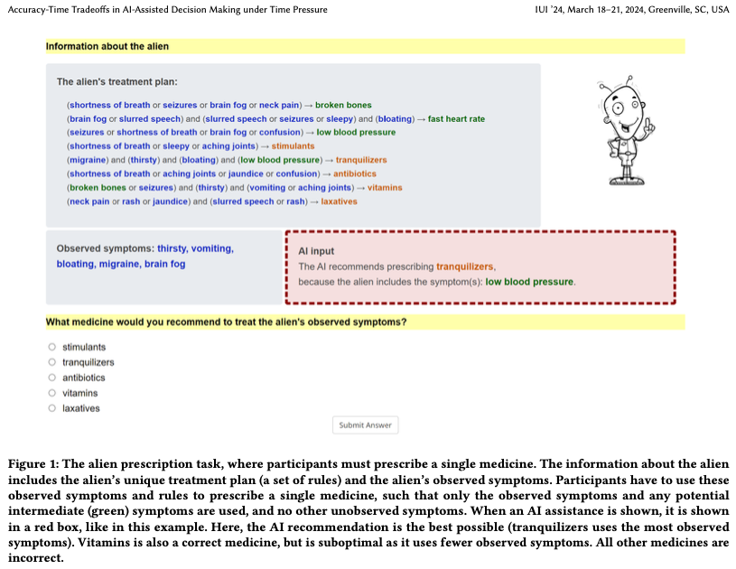

Bhatia, S. (2024). Exploring variability in risk taking with large
language models. *Journal of Experimental Psychology: General*,
*153*(7), 1838–1860. <https://doi.org/10.1037/xge0001607>

Binz, M., & Schulz, E. (2023). Using cognitive psychology to understand
GPT-3. *Proceedings of the National Academy of Sciences*, *120*(6),
e2218523120. <https://doi.org/10.1073/pnas.2218523120>

Buçinca, Z., Malaya, M. B., & Gajos, K. Z. (2021). To Trust or to Think:
Cognitive Forcing Functions Can Reduce Overreliance on AI in
AI-assisted Decision-making. *Proceedings of
the ACM on Human-Computer Interaction*, *5*(CSCW1), 1–21.
<https://doi.org/10.1145/3449287>

Chen, Y., Liu, T. X., Shan, Y., & Zhong, S. (2023). The emergence of
economic rationality of GPT. *Proceedings of the National Academy of
Sciences*, *120*(51), e2316205120.
<https://doi.org/10.1073/pnas.2316205120>

Cheung, V., Maier, M., & Lieder, F. (2024). *Large Language Models
Amplify Human Biases in Moral Decision-Making*.
<https://doi.org/10.31234/osf.io/aj46b>

Goli, A., & Singh, A. (2024). Can Large Language Models Capture Human
Preferences? *Marketing Science*.
<https://doi.org/10.1287/mksc.2023.0306>

Hagendorff, T., Fabi, S., & Kosinski, M. (2023). Human-like intuitive
behavior and reasoning biases emerged in large language models but
disappeared in ChatGPT. *Nature Computational Science*, *3*(10),
833–838. <https://doi.org/10.1038/s43588-023-00527-x>

Lampinen, A. K., Dasgupta, I., Chan, S. C. Y., Sheahan, H. R., Creswell,
A., Kumaran, D., McClelland, J. L., & Hill, F. (2024). Language models,
like humans, show content effects on reasoning tasks. *PNAS Nexus*,
*3*(7), pgae233. <https://doi.org/10.1093/pnasnexus/pgae233>

Macmillan-Scott, O., & Musolesi, M. (2024). (Ir)rationality and
cognitive biases in large language models. *Royal Society Open Science*,
*11*(6), 240255. <https://doi.org/10.1098/rsos.240255>

Matz, S. C., Teeny, J. D., Vaid, S. S., Peters, H., Harari, G. M., &
Cerf, M. (2024). The potential of generative AI for personalized
persuasion at scale. *Scientific Reports*, *14*(1), 4692.
<https://doi.org/10.1038/s41598-024-53755-0>

Mei, Q., Xie, Y., Yuan, W., & Jackson, M. O. (2024). A Turing test of
whether AI chatbots are behaviorally similar to humans. *Proceedings of
the National Academy of Sciences*, *121*(9), e2313925121.
<https://doi.org/10.1073/pnas.2313925121>

Nguyen, J. (2024). Human Bias in AI Models? Anchoring Effects and
Mitigation Strategies in Large Language Models. *Journal of Behavioral
and Experimental Finance*, 100971.
<https://doi.org/10.1016/j.jbef.2024.100971>

Nobandegani, A. S., Rish, I., & Shultz, T. R. (2023). Decision-Making
Paradoxes in Humans vs Machines: The case of the Allais and Ellsberg
Paradoxes. *Proceedings of the Annual Meeting of the Cognitive Science
Society*, *46*.

Rastogi, C., Zhang, Y., Wei, D., Varshney, K. R., Dhurandhar, A., &
Tomsett, R. (2022). Deciding Fast and Slow: The Role of Cognitive Biases
in AI-assisted Decision-making. *Proceedings
of the ACM on Human-Computer Interaction*, *6*(CSCW1), 1–22.
<https://doi.org/10.1145/3512930>

Roberts, J., Moore, K., Pham, T., Ewaleifoh, O., & Fisher, D. (2024).
*Large Language Model Recall Uncertainty is Modulated by the Fan
Effect*.

Stadler, M., Bannert, M., & Sailer, M. (2024). Cognitive ease at a cost:
LLMs reduce mental effort but compromise depth in student scientific
inquiry. *Computers in Human Behavior*, *160*, 108386.
<https://doi.org/10.1016/j.chb.2024.108386>

Suri, G., Slater, L. R., Ziaee, A., & Nguyen, M. (2024). Do large
language models show decision heuristics similar to humans? A case study
using GPT-35. *Journal of Experimental Psychology: General*, *153*(4),
1066–1075. <https://doi.org/10.1037/xge0001547>

Swaroop, S., Buçinca, Z., Gajos, K. Z., & Doshi-Velez, F. (2024).
Accuracy-Time Tradeoffs in AI-Assisted Decision Making under Time
Pressure. *Proceedings of the 29th International Conference on
Intelligent User Interfaces*, 138–154.
<https://doi.org/10.1145/3640543.3645206>

Tjuatja, L., Chen, V., Wu, T., Talwalkwar, A., & Neubig, G. (2024). Do
LLMs Exhibit Human-like Response Biases? A
Case Study in Survey Design. *Transactions of the Association for
Computational Linguistics*, *12*, 1011–1026.
<https://doi.org/10.1162/tacl_a_00685>

Westphal, M., Vössing, M., Satzger, G., Yom-Tov, G. B., & Rafaeli, A.
(2023). Decision control and explanations in human-AI collaboration:
Improving user perceptions and compliance. *Computers in Human
Behavior*, *144*, 107714. <https://doi.org/10.1016/j.chb.2023.107714>

Yax, N., Anlló, H., & Palminteri, S. (2024). Studying and improving
reasoning in humans and machines. *Communications Psychology*, *2*(1),
1–16. <https://doi.org/10.1038/s44271-024-00091-8>

Zhao, Y., Huang, Z., Seligman, M., & Peng, K. (2024). Risk and prosocial
behavioural cues elicit human-like response patterns from AI chatbots.
*Scientific Reports*, *14*(1), 7095.
<https://doi.org/10.1038/s41598-024-55949-y>

