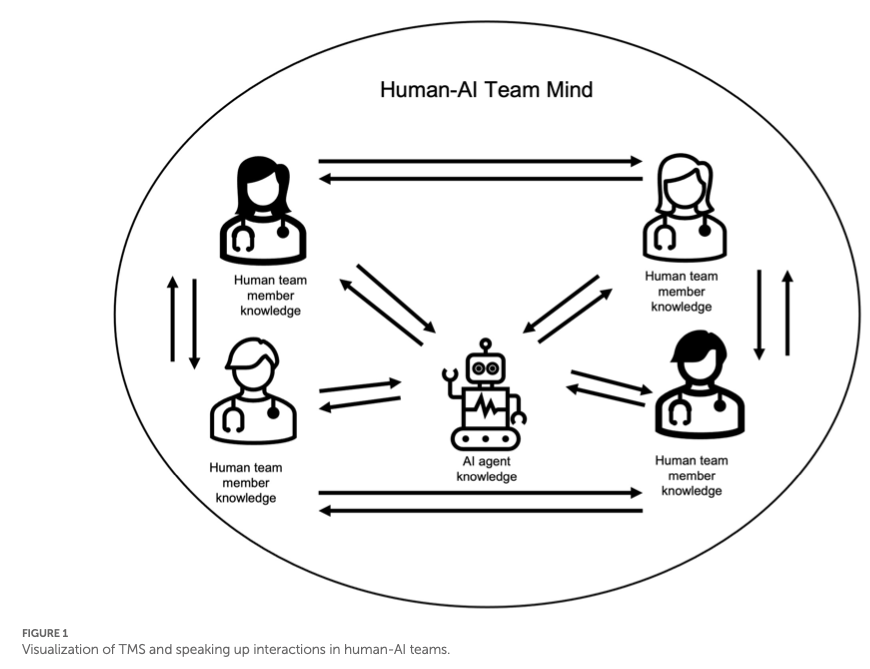
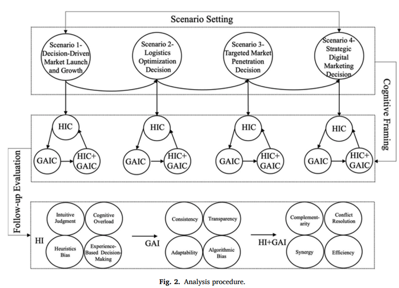
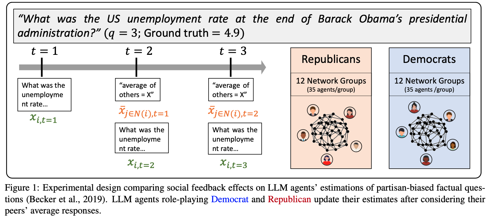
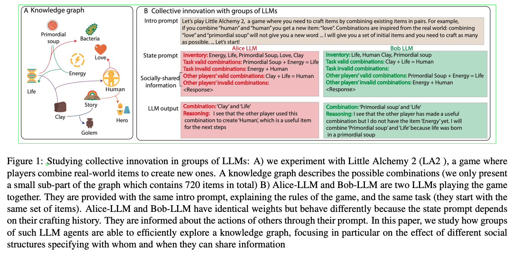
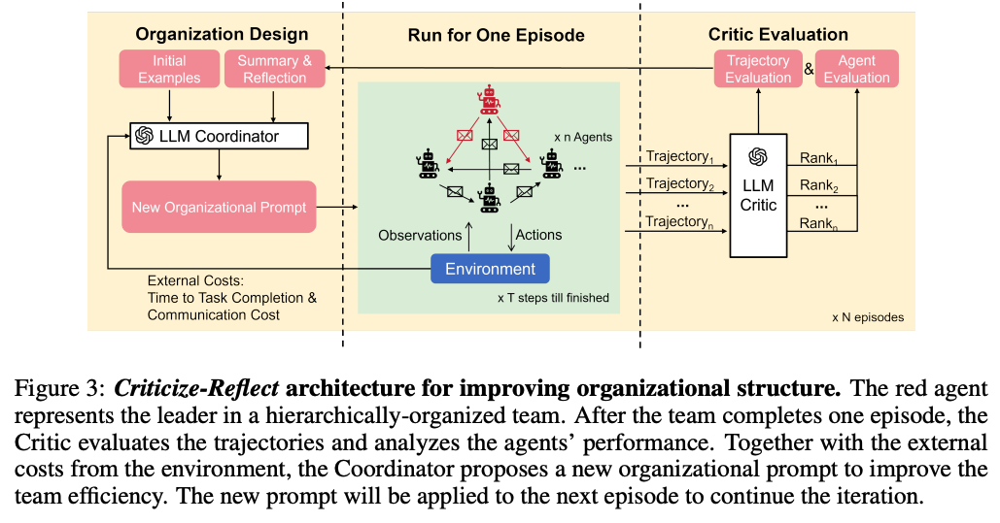
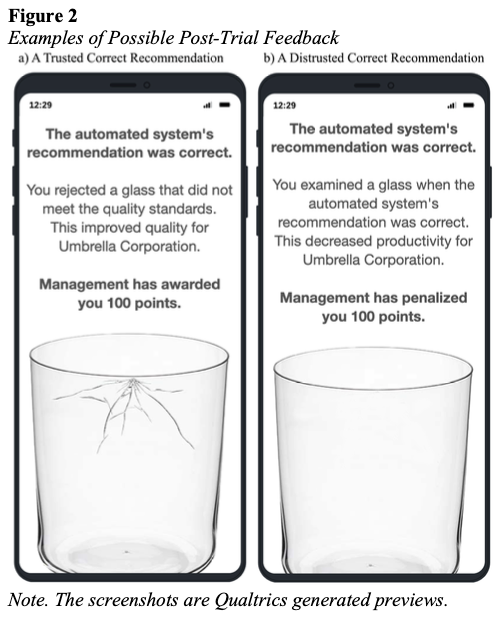

# Literature Notes
Thomas E. Gorman
2024-09-30

- [Relevant Papers](#relevant-papers)
  - [Task Allocation in Teams as a Multi-Armed
    Bandit.](#task-allocation-in-teams-as-a-multi-armed-bandit)
  - [Human-AI teaming: Leveraging transactive memory and speaking up for
    enhanced team
    effectiveness.](#human-ai-teaming-leveraging-transactive-memory-and-speaking-up-for-enhanced-team-effectiveness)
  - [Large language models empowered agent-based modeling and
    simulation: A survey and
    perspectives.](#large-language-models-empowered-agent-based-modeling-and-simulation-a-survey-and-perspectives)
  - [Building Machines that Learn and Think with
    People](#building-machines-that-learn-and-think-with-people)
  - [Large Language Models for Collective Problem-Solving: Insights into
    Group Consensus
    Decision-Making](#large-language-models-for-collective-problem-solving-insights-into-group-consensus-decision-making)
  - [Exploring collaborative decision-making: A quasi-experimental study
    of human and Generative AI
    interaction.](#exploring-collaborative-decision-making-a-quasi-experimental-study-of-human-and-generative-ai-interaction)
  - [How large language models can reshape collective
    intelligence](#how-large-language-models-can-reshape-collective-intelligence)
  - [Enhancing AI-Assisted Group Decision Making through LLM-Powered
    Devil’s
    Advocate.](#enhancing-ai-assisted-group-decision-making-through-llm-powered-devils-advocate)
  - [The Wisdom of Partisan Crowds: Comparing Collective Intelligence in
    Humans and LLM-based
    Agents](#the-wisdom-of-partisan-crowds-comparing-collective-intelligence-in-humans-and-llm-based-agents)
  - [Collective Innovation in Groups of Large Language
    Models.](#collective-innovation-in-groups-of-large-language-models)
  - [Evaluating LLM Agent Group Dynamics against Human Group Dynamics: A
    Case Study on Wisdom of Partisan
    Crowds](#evaluating-llm-agent-group-dynamics-against-human-group-dynamics-a-case-study-on-wisdom-of-partisan-crowds)
  - [Exploring Collaboration Mechanisms for LLM Agents: A Social
    Psychology
    View](#exploring-collaboration-mechanisms-for-llm-agents-a-social-psychology-view)
  - [LLM-Deliberation: Evaluating LLMs with Interactive Multi-Agent
    Negotiation
    Games.](#llm-deliberation-evaluating-llms-with-interactive-multi-agent-negotiation-games)
  - [LLM Voting: Human Choices and AI Collective Decision
    Making](#llm-voting-human-choices-and-ai-collective-decision-making)
  - [Embodied LLM Agents Learn to Cooperate in Organized
    Teams](#embodied-llm-agents-learn-to-cooperate-in-organized-teams)
  - [Measuring Latent Trust Patterns in Large Language Models in the
    Context of Human-AI
    Teaming](#measuring-latent-trust-patterns-in-large-language-models-in-the-context-of-human-ai-teaming)
  - [A Survey on Human-AI Teaming with Large Pre-Trained
    Models](#a-survey-on-human-ai-teaming-with-large-pre-trained-models)

# Relevant Papers

## Task Allocation in Teams as a Multi-Armed Bandit.

Marjieh, R., Gokhale, A., Bullo, F., & Griffiths, T. L. (2024). **Task
Allocation in Teams as a Multi-Armed Bandit.**
https://cocosci.princeton.edu/papers/marjieh2024task.pdf

Abstract

Humans rely on efficient distribution of resources to transcend the
abilities of individuals. Successful task allocation, whether in small
teams or across large institutions, depends on individuals’ ability to
discern their own and others’ strengths and weaknesses, and to optimally
act on them. This dependence creates a tension between exploring the
capabilities of others and exploiting the knowledge acquired so far,
which can be challenging. How do people navigate this tension? To
address this question, we propose a novel task allocation paradigm in
which a human agent is asked to repeatedly allocate tasks in three
distinct classes (categorizing a blurry image, detecting a noisy voice
command, and solving an anagram) between themselves and two other (bot)
team members to maximize team performance. We show that this problem can
be recast as a combinatorial multi-armed bandit which allows us to
compare people’s performance against two well-known strategies, Thompson
Sampling and Upper Confidence Bound (UCB). We find that humans are able
to successfully integrate information about the capabilities of
different team members to infer optimal allocations, and in some cases
perform on par with these optimal strategies. Our approach opens up new
avenues for studying the mechanisms underlying collective cooperation in
teams.

## Human-AI teaming: Leveraging transactive memory and speaking up for enhanced team effectiveness.

Bienefeld, N., Kolbe, M., Camen, G., Huser, D., & Buehler, P. K. (2023).
**Human-AI teaming: Leveraging transactive memory and speaking up for
enhanced team effectiveness.** Frontiers in Psychology, 14.
https://doi.org/10.3389/fpsyg.2023.1208019

Abstract

In this prospective observational study, we investigate the role of
transactive memory and speaking up in human-AI teams comprising 180
intensive care (ICU) physicians and nurses working with AI in a
simulated clinical environment. Our findings indicate that interactions
with AI agents differ significantly from human interactions, as
accessing information from AI agents is positively linked to a team’s
ability to generate novel hypotheses and demonstrate speaking-up
behavior, but only in higher-performing teams. Conversely, accessing
information from human team members is negatively associated with these
aspects, regardless of team performance. This study is a valuable
contribution to the expanding field of research on human-AI teams and
team science in general, as it emphasizes the necessity of incorporating
AI agents as knowledge sources in a team’s transactive memory system, as
well as highlighting their role as catalysts for speaking up. Practical
implications include suggestions for the design of future AI systems and
human-AI team training in healthcare and beyond.

  
  

## Large language models empowered agent-based modeling and simulation: A survey and perspectives.

Gao, C., Lan, X., Li, N., Yuan, Y., Ding, J., Zhou, Z., Xu, F., & Li, Y.
(2024). Large language models empowered agent-based modeling and
simulation: A survey and perspectives. Humanities and Social Sciences
Communications, 11(1), 1–24. https://doi.org/10.1057/s41599-024-03611-3

Abstract

Agent-based modeling and simulation have evolved as a powerful tool for
modeling complex systems, offering insights into emergent behaviors and
interactions among diverse agents. Recently, integrating large language
models into agent-based modeling and simulation presents a promising
avenue for enhancing simulation capabilities. This paper surveys the
landscape of utilizing large language models in agent-based modeling and
simulation, discussing their challenges and promising future directions.
In this survey, since this is an interdisciplinary field, we first
introduce the background of agent-based modeling and simulation and
large language model-empowered agents. We then discuss the motivation
for applying large language models to agent-based simulation and
systematically analyze the challenges in environment perception, human
alignment, action generation, and evaluation. Most importantly, we
provide a comprehensive overview of the recent works of large language
model-empowered agent-based modeling and simulation in multiple
scenarios, which can be divided into four domains: cyber, physical,
social, and hybrid, covering simulation of both real-world and virtual
environments, and how these works address the above challenges. Finally,
since this area is new and quickly evolving, we discuss the open
problems and promising future directions. We summarize the
representative papers along with their code repositories in
https://github.com/tsinghua-fib-lab/LLM-Agent-Based-Modeling-and-Simulation.

## Building Machines that Learn and Think with People

Collins, K. M., Sucholutsky, I., Bhatt, U., Chandra, K., Wong, L., Lee,
M., Zhang, C. E., Zhi-Xuan, T., Ho, M., Mansinghka, V., Weller, A.,
Tenenbaum, J. B., & Griffiths, T. L. (2024). **Building Machines that
Learn and Think with People** (arXiv:2408.03943). arXiv.
http://arxiv.org/abs/2408.03943

Abstract

What do we want from machine intelligence? We envision machines that are
not just tools for thought, but partners in thought: reasonable,
insightful, knowledgeable, reliable, and trustworthy systems that think
with us. Current artificial intelligence (AI) systems satisfy some of
these criteria, some of the time. In this Perspective, we show how the
science of collaborative cognition can be put to work to engineer
systems that really can be called “thought partners,” systems built to
meet our expectations and complement our limitations. We lay out several
modes of collaborative thought in which humans and AI thought partners
can engage and propose desiderata for human-compatible thought
partnerships. Drawing on motifs from computational cognitive science, we
motivate an alternative scaling path for the design of thought partners
and ecosystems around their use through a Bayesian lens, whereby the
partners we construct actively build and reason over models of the human
and world.

  

## Large Language Models for Collective Problem-Solving: Insights into Group Consensus Decision-Making

Du, Y., Rajivan, P., & Gonzalez, C. C. (2024). **Large Language Models
for Collective Problem-Solving: Insights into Group Consensus
Decision-Making.** https://escholarship.org/uc/item/6s060914

Abstract

Large Language models (LLM) exhibit human-like proficiency in various
tasks such as translation, question answering, essay writing, and
programming. Emerging research explores the use of LLMs in collective
problem-solving endeavors, such as tasks where groups try to uncover
clues through discussions. Although prior work has investigated
individual problem-solving tasks, leveraging LLM-powered agents for
group consensus and decision-making remains largely unexplored. This
research addresses this gap by (1) proposing an algorithm to enable
free-form conversation in groups of LLM agents, (2) creating metrics to
evaluate the human-likeness of the generated dialogue and
problem-solving performance, and (3) evaluating LLM agent groups against
human groups using an open source dataset. Our results reveal that LLM
groups outperform human groups in problem-solving tasks. LLM groups also
show a greater improvement in scores after participating in free
discussions. In particular, analyses indicate that LLM agent groups
exhibit more disagreements, complex statements, and a propensity for
positive statements compared to human groups. The results shed light on
the potential of LLMs to facilitate collective reasoning and provide
insight into the dynamics of group interactions involving synthetic LLM
agents.

Figure 1: Figure from Du et al. (2024)

## Exploring collaborative decision-making: A quasi-experimental study of human and Generative AI interaction.

Hao, X., Demir, E., & Eyers, D. (2024). Exploring collaborative
decision-making: A quasi-experimental study of human and Generative AI
interaction. Technology in Society, 78, 102662.
https://doi.org/10.1016/j.techsoc.2024.102662

Abstract

This paper explores the effects of integrating Generative Artificial
Intelligence (GAI) into decision-making processes within organizations,
employing a quasi-experimental pretest-posttest design. The study
examines the synergistic interaction between Human Intelligence (HI) and
GAI across four group decision-making scenarios within three global
organizations renowned for their cutting-edge operational techniques.
The research progresses through several phases: identifying research
problems, collecting baseline data on decision-making, implementing AI
interventions, and evaluating the outcomes post-intervention to identify
shifts in performance. The results demonstrate that GAI effectively
reduces human cognitive burdens and mitigates heuristic biases by
offering data-driven support and predictive analytics, grounded in
System 2 reasoning. This is particularly valuable in complex situations
characterized by unfamiliarity and information overload, where
intuitive, System 1 thinking is less effective. However, the study also
uncovers challenges related to GAI integration, such as potential
over-reliance on technology, intrinsic biases particularly
‘out-of-the-box’ thinking without contextual creativity. To address
these issues, this paper proposes an innovative strategic framework for
HI-GAI collaboration that emphasizes transparency, accountability, and
inclusiveness.

  
  

## How large language models can reshape collective intelligence

Burton, J. W., Lopez-Lopez, E., Hechtlinger, S., Rahwan, Z., Aeschbach,
S., Bakker, M. A., Becker, J. A., Berditchevskaia, A., Berger, J.,
Brinkmann, L., Flek, L., Herzog, S. M., Huang, S., Kapoor, S.,
Narayanan, A., Nussberger, A.-M., Yasseri, T., Nickl, P., Almaatouq, A.,
… Hertwig, R. (2024). **How large language models can reshape collective
intelligence.** Nature Human Behaviour, 1–13.
https://doi.org/10.1038/s41562-024-01959-9

Abstract

Collective intelligence underpins the success of groups, organizations,
markets and societies. Through distributed cognition and coordination,
collectives can achieve outcomes that exceed the capabilities of
individuals—even experts—resulting in improved accuracy and novel
capabilities. Often, collective intelligence is supported by information
technology, such as online prediction markets that elicit the ‘wisdom of
crowds’, online forums that structure collective deliberation or digital
platforms that crowdsource knowledge from the public. Large language
models, however, are transforming how information is aggregated,
accessed and transmitted online. Here we focus on the unique
opportunities and challenges this transformation poses for collective
intelligence. We bring together interdisciplinary perspectives from
industry and academia to identify potential benefits, risks,
policy-relevant considerations and open research questions, culminating
in a call for a closer examination of how large language models affect
humans’ ability to collectively tackle complex problems.

  

## Enhancing AI-Assisted Group Decision Making through LLM-Powered Devil’s Advocate.

Chiang, C.-W., Lu, Z., Li, Z., & Yin, M. (2024). **Enhancing AI-Assisted
Group Decision Making through LLM-Powered Devil’s Advocate.**
Proceedings of the 29th International Conference on Intelligent User
Interfaces, 103–119. https://doi.org/10.1145/3640543.3645199

Abstract

Group decision making plays a crucial role in our complex and
interconnected world. The rise of AI technologies has the potential to
provide data-driven insights to facilitate group decision making,
although it is found that groups do not always utilize AI assistance
appropriately. In this paper, we aim to examine whether and how the
introduction of a devil’s advocate in the AI-assisted group deci- sion
making processes could help groups better utilize AI assistance and
change the perceptions of group processes during decision making.
Inspired by the exceptional conversational capabilities ex- hibited by
modern large language models (LLMs), we design four different styles of
devil’s advocate powered by LLMs, varying their interactivity (i.e.,
interactive vs. non-interactive) and their target of objection (i.e.,
challenge the AI recommendation or the majority opinion within the
group). Through a randomized human-subject experiment, we find evidence
suggesting that LLM-powered devil’s advocates that argue against the AI
model’s decision recommenda- tion have the potential to promote groups’
appropriate reliance on AI. Meanwhile, the introduction of LLM-powered
devil’s advocate usually does not lead to substantial increases in
people’s perceived workload for completing the group decision making
tasks, while interactive LLM-powered devil’s advocates are perceived as
more collaborating and of higher quality. We conclude by discussing the
practical implications of our findings.

## The Wisdom of Partisan Crowds: Comparing Collective Intelligence in Humans and LLM-based Agents

Chuang, Y.-S., Harlalka, N., Suresh, S., Goyal, A., Hawkins, R., Yang,
S., Shah, D., Hu, J., & Rogers, T. T. (2024). **The Wisdom of Partisan
Crowds: Comparing Collective Intelligence in Humans and LLM-based
Agents.** https://escholarship.org/uc/item/3k67x8s5

Abstract

Human groups are able to converge to more accurate beliefs through
deliberation, even in the presence of polarization and partisan bias — a
phenomenon known as the “wisdom of partisan crowds.” Large Language
Models (LLMs) are increasingly being used to simulate human collective
behavior, yet few benchmarks exist for evaluating their dynamics against
the behavior of human groups. In this paper, we examine the extent to
which the wisdom of partisan crowds emerges in groups of LLM-based
agents that are prompted to role-play as partisan personas (e.g.,
Democrat or Republican). We find that they not only display human-like
partisan biases, but also converge to more accurate beliefs through
deliberation, as humans do. We then identify several factors that
interfere with convergence, including the use of chain-of-thought
prompting and lack of details in personas. Conversely, fine-tuning on
human data appears to enhance convergence. These findings show the
potential and limitations of LLM-based agents as a model of human
collective intelligence.

## Collective Innovation in Groups of Large Language Models.

Nisioti, E., Risi, S., Momennejad, I., Oudeyer, P.-Y., & Moulin-Frier,
C. (2024, July 7). **Collective Innovation in Groups of Large Language
Models.** ALIFE 2024: Proceedings of the 2024 Artificial Life
Conference. https://doi.org/10.1162/isal_a_00730

Abstract

Human culture relies on collective innovation: our ability to
continuously explore how existing elements in our environment can be
combined to create new ones. Language is hypothesized to play a key role
in human culture, driving individual cognitive capacities and shaping
communication. Yet the majority of models of collective innovation
assign no cognitive capacities or language abilities to agents. Here, we
contribute a computational study of collective innovation where agents
are Large Language Models (LLMs) that play Little Alchemy 2, a creative
video game originally developed for humans that, as we argue, captures
useful aspects of innovation landscapes not present in previous
test-beds. We, first, study an LLM in isolation and discover that it
exhibits both useful skills and crucial limitations. We, then, study
groups of LLMs that share information related to their behaviour and
focus on the effect of social connectivity on collective performance. In
agreement with previous human and computational studies, we observe that
groups with dynamic connectivity out-compete fully-connected groups. Our
work reveals opportunities and challenges for future studies of
collective innovation that are becoming increasingly relevant as
Generative Artificial Intelligence algorithms and humans innovate
alongside each other.

## Evaluating LLM Agent Group Dynamics against Human Group Dynamics: A Case Study on Wisdom of Partisan Crowds

Chuang, Y.-S., Suresh, S., Harlalka, N., Goyal, A., Hawkins, R., Yang,
S., Shah, D., Hu, J., & Rogers, T. T. (2023). **Evaluating LLM Agent
Group Dynamics against Human Group Dynamics: A Case Study on Wisdom of
Partisan Crowds** http://arxiv.org/abs/2311.09665

Abstract

This study investigates the potential of Large Language Models (LLMs) to
simulate human group dynamics, particularly within politically charged
contexts. We replicate the Wisdom of Partisan Crowds phenomenon using
LLMs to role-play as Democrat and Republican personas, engaging in a
structured interaction akin to human group study. Our approach evaluates
how agents’ responses evolve through social influence. Our key findings
indicate that LLM agents role-playing detailed personas and without
Chain-of-Thought (CoT) reasoning closely align with human behaviors,
while having CoT reasoning hurts the alignment. However, incorporating
explicit biases into agent prompts does not necessarily enhance the
wisdom of partisan crowds. Moreover, fine-tuning LLMs with human data
shows promise in achieving human-like behavior but poses a risk of
overfitting certain behaviors. These findings show the potential and
limitations of using LLM agents in modeling human group phenomena.

Chuang et al. (2023)

## Exploring Collaboration Mechanisms for LLM Agents: A Social Psychology View

Zhang, J., Xu, X., Zhang, N., Liu, R., Hooi, B., & Deng, S. (2024).
**Exploring Collaboration Mechanisms for LLM Agents: A Social Psychology
View** (arXiv:2310.02124). arXiv. http://arxiv.org/abs/2310.02124

<https://www.zjukg.org/project/MachineSoM/>

Abstract

As Natural Language Processing (NLP) systems are increasingly employed
in intricate social environments, a pressing query emerges: Can these
NLP systems mirror human-esque collaborative intelligence, in a
multi-agent society consisting of multiple large language models (LLMs)?
This paper probes the collaboration mechanisms among contemporary NLP
systems by melding practical experiments with theoretical insights. We
fabricate four unique ‘societies’ comprised of LLM agents, where each
agent is characterized by a specific ‘trait’ (easy-going or
overconfident) and engages in collaboration with a distinct ‘thinking
pattern’ (debate or reflection). Through evaluating these multi-agent
societies on three benchmark datasets, we discern that certain
collaborative strategies not only outshine previous top-tier approaches
but also optimize efficiency (using fewer API tokens). Moreover, our
results further illustrate that LLM agents manifest humanlike social
behaviors, such as conformity and consensus reaching, mirroring
foundational social psychology theories. In conclusion, we integrate
insights from social psychology to contextualize the collaboration of
LLM agents, inspiring further investigations into the collaboration
mechanism for LLMs. We have shared our code and datasets1, hoping to
catalyze further research in this promising avenue.

## LLM-Deliberation: Evaluating LLMs with Interactive Multi-Agent Negotiation Games.

Abdelnabi, S., Gomaa, A., Sivaprasad, S., Schönherr, L., & Fritz, M.
(2023). **LLM-Deliberation: Evaluating LLMs with Interactive Multi-Agent
Negotiation Games.** https://doi.org/10.60882/cispa.25233028.v1

Abstract

There is a growing interest in using Large Language Models (LLMs) as
agents to tackle real-world tasks that may require assessing complex
situations. Yet, we have a limited understanding of LLMs’ reasoning and
decision-making capabilities, partly stemming from a lack of dedicated
evaluation benchmarks. As negotiating and compromising are key aspects
of our everyday communication and collaboration, we propose using
scorable negotiation games as a new evaluation framework for LLMs. We
create a testbed of diverse text-based, multi-agent, multi-issue,
semantically rich negotiation games, with easily tunable difficulty. To
solve the challenge, agents need to have strong arithmetic, inference,
exploration, and planning capabilities, while seamlessly integrating
them. Via a systematic zero-shot Chain-of-Thought prompting (CoT), we
show that agents can negotiate and consistently reach successful deals.
We quantify the performance with multiple metrics and observe a large
gap between GPT-4 and earlier models. Importantly, we test the
generalization to new games and setups. Finally, we show that these
games can help evaluate other critical aspects, such as the interaction
dynamics between agents in the presence of greedy and adversarial
players.

## LLM Voting: Human Choices and AI Collective Decision Making

Yang, J. C., Dailisan, D., Korecki, M., Hausladen, C. I., & Helbing, D.
(2024). **LLM Voting: Human Choices and AI Collective Decision Making**
(arXiv:2402.01766). arXiv. http://arxiv.org/abs/2402.01766

Abstract

This paper investigates the voting behaviors of Large Language Models
(LLMs), specifically GPT-4 and LLaMA-2, their biases, and how they align
with human voting patterns. Our methodology involved using a dataset
from a human voting experiment to establish a baseline for human
preferences and conducting a corresponding experiment with LLM agents.
We observed that the choice of voting methods and the presentation order
influenced LLM voting outcomes. We found that varying the persona can
reduce some of these biases and enhance alignment with human choices.
While the Chain-of-Thought approach did not improve prediction accuracy,
it has potential for AI explainability in the voting process. We also
identified a trade-off between preference diversity and alignment
accuracy in LLMs, influenced by different temperature settings. Our
findings indicate that LLMs may lead to less diverse collective outcomes
and biased assumptions when used in voting scenarios, emphasizing the
need for cautious integration of LLMs into democratic processes.

## Embodied LLM Agents Learn to Cooperate in Organized Teams

Guo, X., Huang, K., Liu, J., Fan, W., Vélez, N., Wu, Q., Wang, H.,
Griffiths, T. L., & Wang, M. (2024). **Embodied LLM Agents Learn to
Cooperate in Organized Teams** (arXiv:2403.12482). arXiv.
http://arxiv.org/abs/2403.12482

Abstract

Large Language Models (LLMs) have emerged as integral tools for
reasoning, planning, and decision-making, drawing upon their extensive
world knowledge and proficiency in language-related tasks. LLMs thus
hold tremendous potential for natural language interaction within
multi-agent systems to foster cooperation. However, LLM agents tend to
over-report and comply with any instruction, which may result in
information redundancy and confusion in multi-agent cooperation.
Inspired by human organizations, this paper introduces a framework that
imposes prompt-based organization structures on LLM agents to mitigate
these problems. Through a series of experiments with embodied LLM agents
and human-agent collaboration, our results highlight the impact of
designated leadership on team efficiency, shedding light on the
leadership qualities displayed by LLM agents and their spontaneous
cooperative behaviors. Further, we harness the potential of LLMs to
propose enhanced organizational prompts, via a Criticize-Reflect
process, resulting in novel organization structures that reduce
communication costs and enhance team efficiency.

## Measuring Latent Trust Patterns in Large Language Models in the Context of Human-AI Teaming

Koehl, D., & Vangsness, L. (2023). **Measuring Latent Trust Patterns in
Large Language Models in the Context of Human-AI Teaming.** Proceedings
of the Human Factors and Ergonomics Society Annual Meeting, 67.
https://doi.org/10.1177/21695067231192869

Abstract

Qualitative self-report methods such as think-aloud procedures and
open-ended response questions can provide valuable data to human factors
research. These measures come with analytic weaknesses, such as
researcher bias, intra- and inter-rater reliability concerns, and
time-consuming coding protocols. A possible solution exists in the
latent semantic patterns that exist in machine learning large language
models. These semantic patterns could be used to analyze qualitative
responses. This exploratory research compared the statistical quality of
automated sentence coding using large language models to the benchmarks
of self-report and behavioral measures within the context of trust in
automation research. The results indicated that three large language
models show promise as tools for analyzing qualitative responses. The
study also provides insight on minimum sample sizes for model creation
and offers recommendations for further validating the robustness of
large language models as research tools.

Figure 2: Koehl & Vangsness (2023)

## A Survey on Human-AI Teaming with Large Pre-Trained Models

Vats, V., Nizam, M. B., Liu, M., Wang, Z., Ho, R., Prasad, M. S.,
Titterton, V., Malreddy, S. V., Aggarwal, R., Xu, Y., Ding, L., Mehta,
J., Grinnell, N., Liu, L., Zhong, S., Gandamani, D. N., Tang, X.,
Ghosalkar, R., Shen, C., … Davis, J. (2024). **A Survey on Human-AI
Teaming with Large Pre-Trained Models** (arXiv:2403.04931). arXiv.
http://arxiv.org/abs/2403.04931

Abstract

In the rapidly evolving landscape of artificial intelligence (AI), the
collaboration between human intelligence and AI systems, known as
Human-AI (HAI) Teaming, has emerged as a cornerstone for advancing
problem-solving and decision-making processes. The advent of Large
Pre-trained Models (LPtM) has significantly transformed this landscape,
offering unprecedented capabilities by leveraging vast amounts of data
to understand and predict complex patterns. This paper surveys the
pivotal integration of LPtMs with HAI, emphasizing how these models
enhance collaborative intelligence beyond traditional approaches. It
examines the potential of LPtMs in augmenting human capabilities,
discussing this collaboration for AI model improvements, effective
teaming, ethical considerations, and their broad applied implications in
various sectors. Through this exploration, the study sheds light on the
transformative impact of LPtM-enhanced HAI Teaming, providing insights
for future research, policy development, and strategic implementations
aimed at harnessing the full potential of this collaboration for
research and societal benefit.

Abdelnabi, S., Gomaa, A., Sivaprasad, S., Schönherr, L., & Fritz, M.
(2023). *LLM-Deliberation: Evaluating LLMs with Interactive Multi-Agent
Negotiation Games.* <https://doi.org/10.60882/cispa.25233028.v1>

Bienefeld, N., Kolbe, M., Camen, G., Huser, D., & Buehler, P. K. (2023).
Human-AI teaming: Leveraging transactive memory and speaking up for
enhanced team effectiveness. *Frontiers in Psychology*, *14*.
<https://doi.org/10.3389/fpsyg.2023.1208019>

Burton, J. W., Lopez-Lopez, E., Hechtlinger, S., Rahwan, Z., Aeschbach,
S., Bakker, M. A., Becker, J. A., Berditchevskaia, A., Berger, J.,
Brinkmann, L., Flek, L., Herzog, S. M., Huang, S., Kapoor, S.,
Narayanan, A., Nussberger, A.-M., Yasseri, T., Nickl, P., Almaatouq, A.,
… Hertwig, R. (2024). How large language models can reshape collective
intelligence. *Nature Human Behaviour*, 1–13.
<https://doi.org/10.1038/s41562-024-01959-9>

Chiang, C.-W., Lu, Z., Li, Z., & Yin, M. (2024). Enhancing AI-Assisted
Group Decision Making through LLM-Powered Devil’s Advocate. *Proceedings
of the 29th International Conference on Intelligent User Interfaces*,
103–119. <https://doi.org/10.1145/3640543.3645199>

Chuang, Y.-S., Harlalka, N., Suresh, S., Goyal, A., Hawkins, R., Yang,
S., Shah, D., Hu, J., & Rogers, T. T. (2024). *The Wisdom of Partisan
Crowds: Comparing Collective Intelligence in Humans and
LLM-based Agents*.

Chuang, Y.-S., Suresh, S., Harlalka, N., Goyal, A., Hawkins, R., Yang,
S., Shah, D., Hu, J., & Rogers, T. T. (2023). *Evaluating LLM Agent
Group Dynamics against Human Group Dynamics: A Case Study on Wisdom of
Partisan Crowds* (arXiv:2311.09665). arXiv.
<https://arxiv.org/abs/2311.09665>

Collins, K. M., Sucholutsky, I., Bhatt, U., Chandra, K., Wong, L., Lee,
M., Zhang, C. E., Zhi-Xuan, T., Ho, M., Mansinghka, V., Weller, A.,
Tenenbaum, J. B., & Griffiths, T. L. (2024). *Building Machines that
Learn and Think with People* (arXiv:2408.03943). arXiv.
<https://arxiv.org/abs/2408.03943>

Du, Y., Rajivan, P., & Gonzalez, C. C. (2024). *Large Language Models
for Collective Problem-Solving: Insights into Group Consensus
Decision-Making*.

Gao, C., Lan, X., Li, N., Yuan, Y., Ding, J., Zhou, Z., Xu, F., & Li, Y.
(2024). Large language models empowered agent-based modeling and
simulation: A survey and perspectives. *Humanities and Social Sciences
Communications*, *11*(1), 1–24.
<https://doi.org/10.1057/s41599-024-03611-3>

Guo, X., Huang, K., Liu, J., Fan, W., Vélez, N., Wu, Q., Wang, H.,
Griffiths, T. L., & Wang, M. (2024). *Embodied LLM Agents Learn to
Cooperate in Organized Teams* (arXiv:2403.12482). arXiv.
<https://arxiv.org/abs/2403.12482>

Hao, X., Demir, E., & Eyers, D. (2024). Exploring collaborative
decision-making: A quasi-experimental study of human and Generative AI
interaction. *Technology in Society*, *78*, 102662.
<https://doi.org/10.1016/j.techsoc.2024.102662>

Koehl, D., & Vangsness, L. (2023). Measuring Latent Trust Patterns in
Large Language Models in the Context of Human-AI Teaming. *Proceedings
of the Human Factors and Ergonomics Society Annual Meeting*, *67*.
<https://doi.org/10.1177/21695067231192869>

Marjieh, R., Gokhale, A., Bullo, F., & Griffiths, T. L. (2024). *Task
Allocation in Teams as a Multi-Armed Bandit*.

Nisioti, E., Risi, S., Momennejad, I., Oudeyer, P.-Y., & Moulin-Frier,
C. (2024, July). Collective Innovation in Groups of Large Language
Models. *ALIFE 2024: Proceedings of the 2024 Artificial Life
Conference*. <https://doi.org/10.1162/isal_a_00730>

Vats, V., Nizam, M. B., Liu, M., Wang, Z., Ho, R., Prasad, M. S.,
Titterton, V., Malreddy, S. V., Aggarwal, R., Xu, Y., Ding, L., Mehta,
J., Grinnell, N., Liu, L., Zhong, S., Gandamani, D. N., Tang, X.,
Ghosalkar, R., Shen, C., … Davis, J. (2024). *A Survey on Human-AI
Teaming with Large Pre-Trained Models* (arXiv:2403.04931). arXiv.
<https://arxiv.org/abs/2403.04931>

Yang, J. C., Dailisan, D., Korecki, M., Hausladen, C. I., & Helbing, D.
(2024). *LLM Voting: Human Choices and AI Collective Decision Making*
(arXiv:2402.01766). arXiv. <https://arxiv.org/abs/2402.01766>

Zhang, J., Xu, X., Zhang, N., Liu, R., Hooi, B., & Deng, S. (2024).
*Exploring Collaboration Mechanisms for LLM Agents: A Social Psychology
View* (arXiv:2310.02124). arXiv. <https://arxiv.org/abs/2310.02124>

