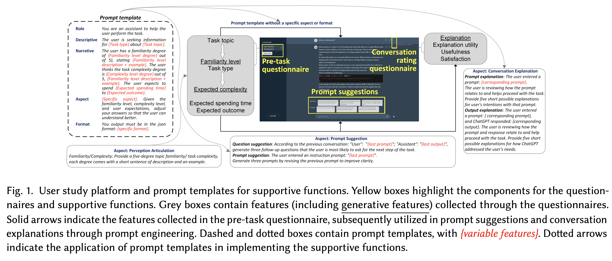
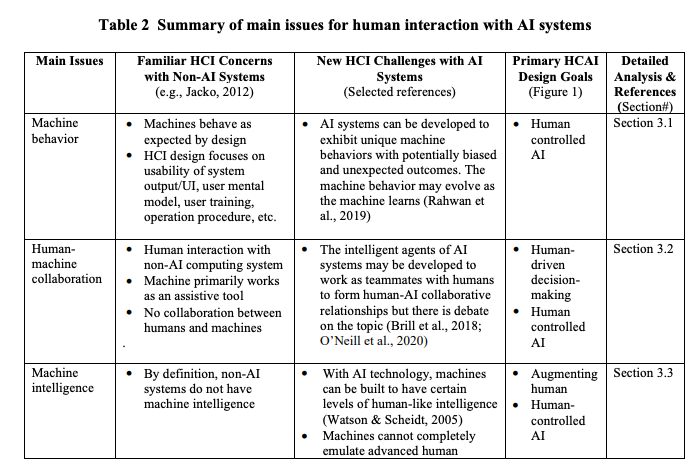
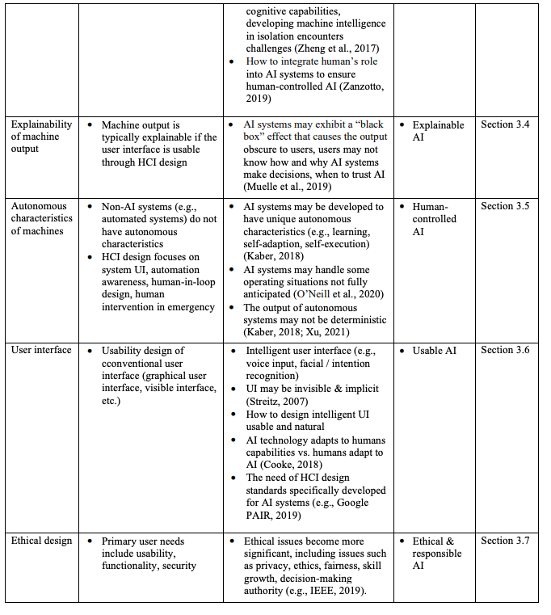
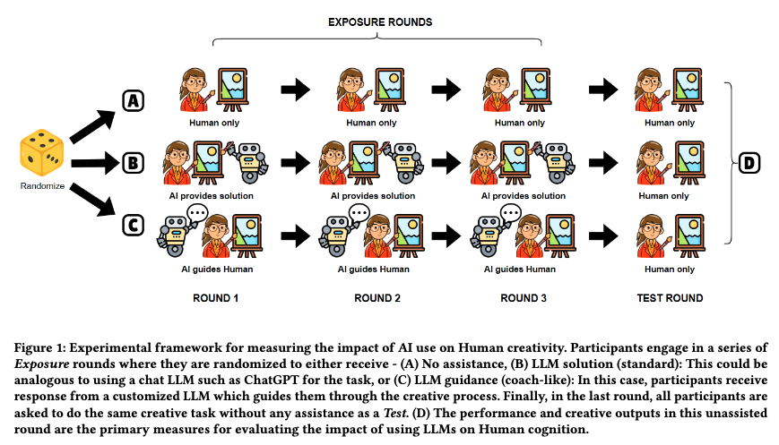
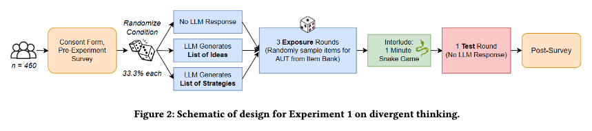
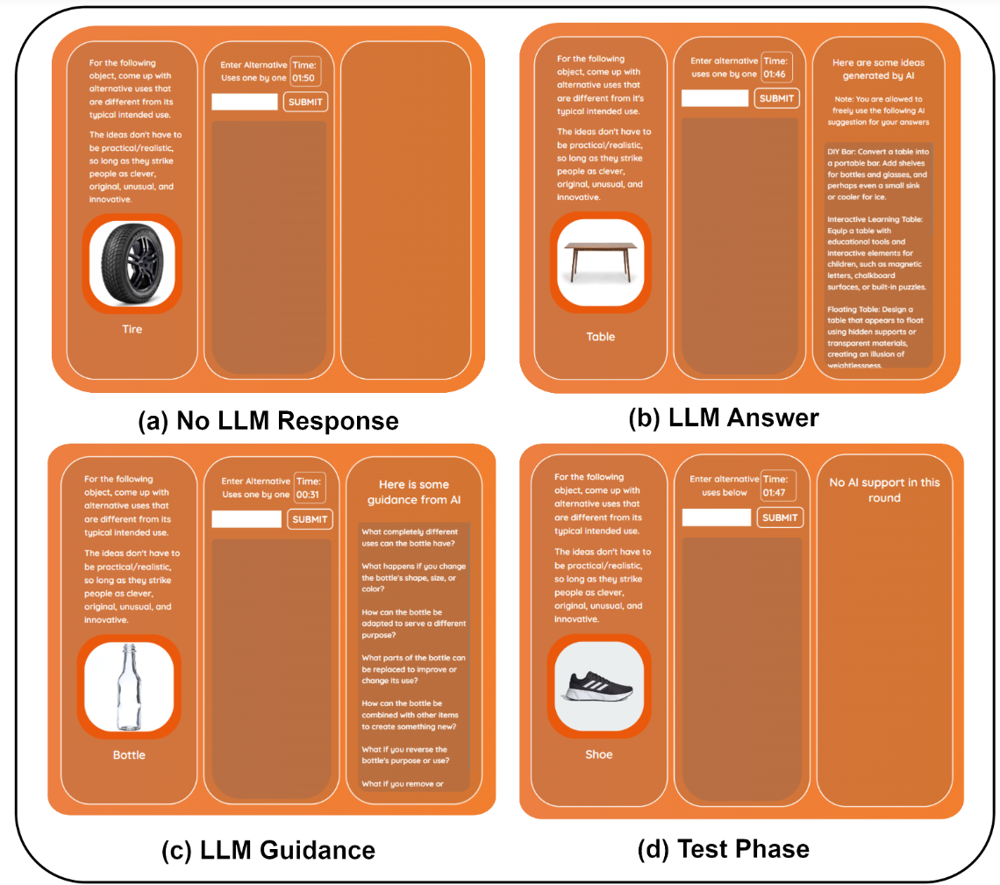
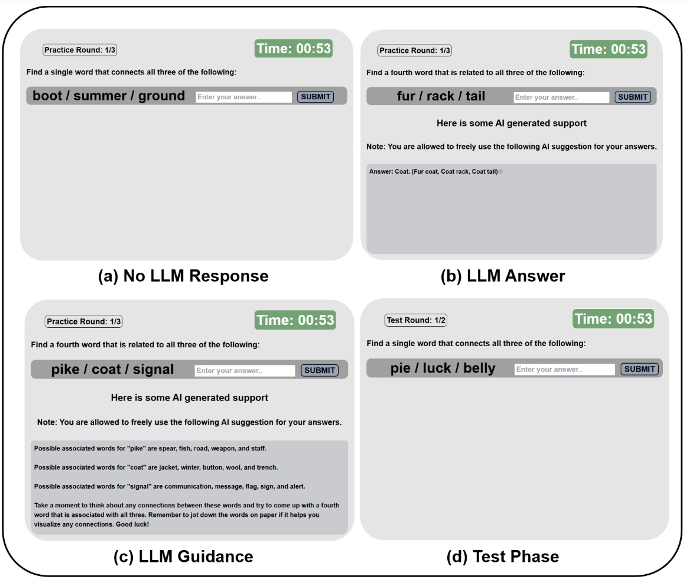
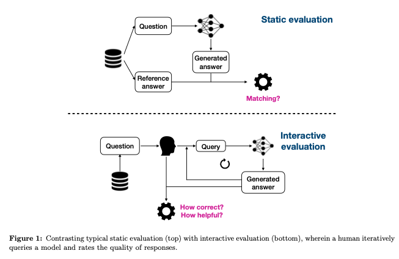
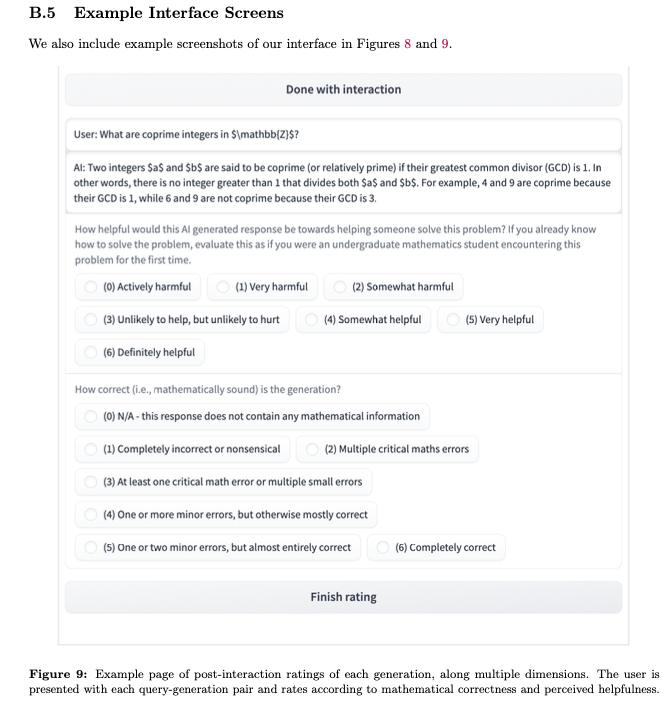
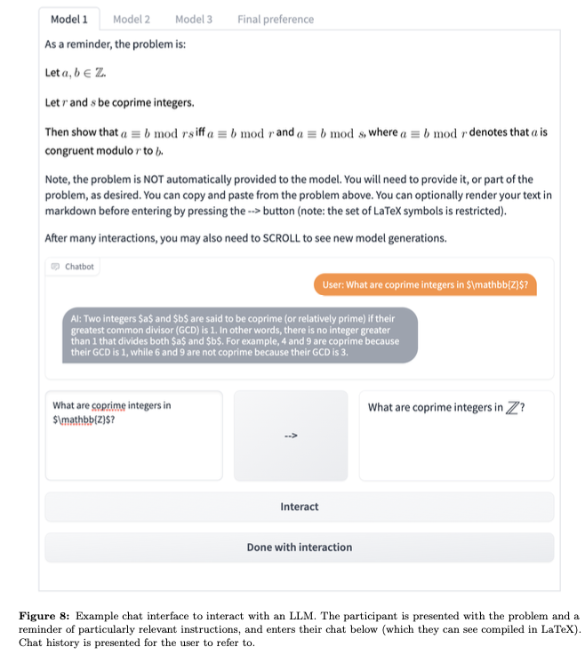

# Interactive AI Lit

## Task Supportive and Personalized Human-Large Language Model Interaction: A User Study.

Wang, B., Liu, J., Karimnazarov, J., & Thompson, N. (2024). Task
Supportive and Personalized Human-Large Language Model Interaction: A
User Study. Proceedings of the 2024 ACM SIGIR Conference on Human
Information Interaction and Retrieval, 370–375.
https://doi.org/10.1145/3627508.3638344

Abstract

Large language model (LLM) applications, such as ChatGPT, are a powerful
tool for online information-seeking (IS) and problem-solving tasks.
However, users still face challenges initializing and refining prompts,
and their cognitive barriers and biased perceptions further impede task
completion. These issues reflect broader challenges identified within
the fields of IS and interactive information retrieval (IIR). To address
these, our approach integrates task context and user perceptions into
human-ChatGPT interactions through prompt engineering. We developed a
ChatGPT-like platform integrated with supportive functions, including
perception articulation, prompt suggestion, and conversation
explanation. Our findings of a user study demonstrate that the
supportive functions help users manage expectations, reduce cognitive
loads, better refine prompts, and increase user engagement. This
research enhances our comprehension of designing proactive and
user-centric systems with LLMs. It offers insights into evaluating
human-LLM interactions and emphasizes potential challenges for under
served users.

## Transitioning to Human-Centered AI: A Systematic Review of Theories, Scenarios, and Hypotheses in Human-AI Interactions.

Wang, D., Zheng, K., Li, C., & Guo, J. (2024). **Transitioning to
Human-Centered AI: A Systematic Review of Theories, Scenarios, and
Hypotheses in Human-AI Interactions.** Proceedings of the Association
for Information Science and Technology, 61(1), 673–678.
https://doi.org/10.1002/pra2.1078

Abstract

This study conducted a systematic review of human-AI interaction
(HAI)over the past decade for the implemented theories and scenarios,
and the tested hypotheses to discover the changes in the current
transition to human-centered AI (HCAI). Moving from acceptance theories,
Computers are social actors (CASA), anthropomorphism, and the
integrative trust model are the most frequent theories. Augmentation
scenarios of decision-making, teamwork, and human-AI collaborations are
common in the latest HAI studies. Users’ trust, acceptance, and
intention to use an AI system are the main research targets in HAI
studies. These trends show a clear transition toward HCAI. This paper
also discusses opportunities tied to HAI studies based on the
interconnections between the various theories, scenarios, and
hypotheses.

Figure 1: Figures from D. Wang et al. (2024)

## Human Creativity in the Age of LLMs: Randomized Experiments on Divergent and Convergent Thinking

Kumar, H., Vincentius, J., Jordan, E., & Anderson, A. (2024). **Human
Creativity in the Age of LLMs: Randomized Experiments on Divergent and
Convergent Thinking** (No. arXiv:2410.03703). arXiv.
http://arxiv.org/abs/2410.03703

Abstract

Large language models are transforming the creative process by offering
unprecedented capabilities to algorithmically generate ideas. While
these tools can enhance human creativity when people co-create with
them, it’s unclear how this will impact unassisted human creativity. We
conducted two large pre-registered parallel experiments involving 1,100
participants attempting tasks targeting the two core components of
creativity, divergent and convergent thinking. We compare the effects of
two forms of large language model (LLM) assistance – a standard LLM
providing direct answers and a coach-like LLM offering guidance – with a
control group receiving no AI assistance, and focus particularly on how
all groups perform in a final, unassisted stage. Our findings reveal
that while LLM assistance can provide short-term boosts in creativity
during assisted tasks, it may inadvertently hinder independent creative
performance when users work without assistance, raising concerns about
the long-term impact on human creativity and cognition.

Figure 2: Figures from Kumar et al. (2024)

## To Trust or to Think: Cognitive Forcing Functions Can Reduce Overreliance on AI in AI-assisted Decision-making

Buçinca, Z., Malaya, M. B., & Gajos, K. Z. (2021). **To Trust or to
Think: Cognitive Forcing Functions Can Reduce Overreliance on AI in
AI-assisted Decision-making.** Proceedings of the ACM on Human-Computer
Interaction, 5(CSCW1), 1–21. https://doi.org/10.1145/3449287

Abstract

People supported by AI-powered decision support tools frequently
overrely on the AI: they accept an AI’s suggestion even when that
suggestion is wrong. Adding explanations to the AI decisions does not
appear to reduce the overreliance and some studies suggest that it might
even increase it. Informed by the dual-process theory of cognition, we
posit that people rarely engage analytically with each individual AI
recommendation and explanation, and instead develop general heuristics
about whether and when to follow the AI suggestions. Building on prior
research on medical decision-making, we designed three cognitive forcing
interventions to compel people to engage more thoughtfully with the
AI-generated explanations. We conducted an experiment (N=199), in which
we compared our three cognitive forcing designs to two simple
explainable AI approaches and to a no-AI baseline. The results
demonstrate that cognitive forcing significantly reduced overreliance
compared to the simple explainable AI approaches. However, there was a
trade-off: people assigned the least favorable subjective ratings to the
designs that reduced the overreliance the most. To audit our work for
intervention-generated inequalities, we investigated whether our
interventions benefited equally people with different levels of Need for
Cognition (i.e., motivation to engage in effortful mental activities).
Our results show that, on average, cognitive forcing interventions
benefited participants higher in Need for Cognition more. Our research
suggests that human cognitive motivation moderates the effectiveness of
explainable AI solutions.

## AI can help humans find common ground in democratic deliberation.

Tessler, M. H., Bakker, M. A., Jarrett, D., Sheahan, H., Chadwick, M.
J., Koster, R., Evans, G., Campbell-Gillingham, L., Collins, T., Parkes,
D. C., Botvinick, M., & Summerfield, C. (2024). **AI can help humans
find common ground in democratic deliberation.** Science, 386(6719),
eadq2852. https://doi.org/10.1126/science.adq2852

Abstract

Finding agreement through a free exchange of views is often difficult.
Collective deliberation can be slow, difficult to scale, and unequally
attentive to different voices. In this study, we trained an artificial
intelligence (AI) to mediate human deliberation. Using participants’
personal opinions and critiques, the AI mediator iteratively generates
and refines statements that express common ground among the group on
social or political issues. Participants (N = 5734) preferred
AI-generated statements to those written by human mediators, rating them
as more informative, clear, and unbiased. Discussants often updated
their views after the deliberation, converging on a shared perspective.
Text embeddings revealed that successful group statements incorporated
dissenting voices while respecting the majority position. These findings
were replicated in a virtual citizens’ assembly involving a
demographically representative sample of the UK population.

Figure 3: Figures from Tessler et al. (2024)

## Evaluating Language Models for Mathematics through Interactions

Collins, K. M., Jiang, A. Q., Frieder, S., Wong, L., Zilka, M., Bhatt,
U., Lukasiewicz, T., Wu, Y., Tenenbaum, J. B., Hart, W., Gowers, T., Li,
W., Weller, A., & Jamnik, M. (2023). **Evaluating Language Models for
Mathematics through Interactions** (No. arXiv:2306.01694). arXiv.
http://arxiv.org/abs/2306.01694

Abstract

The standard methodology of evaluating large language models (LLMs)
based on static pairs of inputs and outputs is insufficient for
developing assistants: this kind of assessments fails to take into
account the essential interactive element in their deployment, and
therefore limits how we understand language model capabilities. We
introduce CheckMate, an adaptable prototype platform for humans to
interact with and evaluate LLMs. We conduct a study with CheckMate to
evaluate three language models~(InstructGPT, ChatGPT, and GPT-4) as
assistants in proving undergraduate-level mathematics, with a mixed
cohort of participants from undergraduate students to professors of
mathematics. We release the resulting interaction and rating dataset,
MathConverse. By analysing MathConverse, we derive a preliminary
taxonomy of human behaviours and uncover that despite a generally
positive correlation, there are notable instances of divergence between
correctness and perceived helpfulness in LLM generations, amongst other
findings. Further, we identify useful scenarios and existing issues of
GPT-4 in mathematical reasoning through a series of case studies
contributed by expert mathematicians. We conclude with actionable
takeaways for ML practitioners and mathematicians: models which
communicate uncertainty, respond well to user corrections, are more
interpretable and concise may constitute better assistants; interactive
evaluation is a promising way to continually navigate the capability of
these models; humans should be aware of language models’ algebraic
fallibility, and for that reason discern where they should be used.

Figure 4: Figures from Collins et al. (2023)

## Large Language Models Experimentation Interface

Laban, G., Laban, T., & Gunes, H. (2024). **LEXI: Large Language Models
Experimentation Interface** (No. arXiv:2407.01488). arXiv.
http://arxiv.org/abs/2407.01488

Abstract

The recent developments in Large Language Models (LLM), mark a
significant moment in the research and development of social
interactions with artificial agents. These agents are widely deployed in
a variety of settings, with potential impact on users. However, the
study of social interactions with agents powered by LLM is still
emerging, limited by access to the technology and to data, the absence
of standardised interfaces, and challenges to establishing controlled
experimental setups using the currently available business-oriented
platforms. To answer these gaps, we developed LEXI, LLMs Experimentation
Interface, an open-source tool enabling the deployment of artificial
agents powered by LLM in social interaction behavioural experiments.
Using a graphical interface, LEXI allows researchers to build agents,
and deploy them in experimental setups along with forms and
questionnaires while collecting interaction logs and self-reported data.
The outcomes of usability testing indicate LEXI’s broad utility, high
usability and minimum mental workload requirement, with distinctive
benefits observed across disciplines. A proof-of-concept study exploring
the tool’s efficacy in evaluating social HAIs was conducted, resulting
in high-quality data. A comparison of empathetic versus neutral agents
indicated that people perceive empathetic agents as more social, and
write longer and more positive messages towards them.

Laban et al. (2024)

## Human-AI Collaboration in Cooperative Games: A Study of Playing Codenames with an LLM Assistant

Sidji, M., Smith, W., & Rogerson, M. J. (2024). **Human-AI Collaboration
in Cooperative Games: A Study of Playing Codenames with an LLM
Assistant.** Proc. ACM Hum.-Comput. Interact., 8(CHI PLAY),
316:1-316:25. https://doi.org/10.1145/3677081

Abstract

Playing partial information, restricted communication, cooperative
(PIRCC) games with humans have proven challenging for AI, due to our
reliance on social dynamics and sophisticated cognitive techniques. Yet,
recent advances in generative AI may change this situation through new
forms of human-AI collaboration. This paper investigates how teams of
players interact with an AI assistant in the PIRCC game Codenames and
the impact this has on cognition, social dynamics, and player
experience. We observed gameplay and conducted post-game focus groups
with 54 participants across ten groups. Each group played three rounds
of Codenames, with an AI assistant supporting Cluegivers. We found the
AI assistant enhanced players’ convergent and divergent thinking, but
interfered with formation of team mental models, highlighting a tension
in the use of AI in creative team scenarios. The presence of the AI
challenged many players’ understanding of the ‘spirit of the game’.
Furthermore, the presence of the AI assistants weakened social
connections between human teammates, but strengthened connections across
teams. This paper provides an empirical account of an AI assistant’s
effect on cognition, social dynamics, and player experience in
Codenames. We highlight the opportunities and challenges that arise when
designing hybrid digital boardgames that include AI assistants.

Sidji et al. (2024)

## Effects of interacting with a large language model compared with a human coach on the clinical diagnostic process and outcomes among fourth-year medical students: Study protocol for a prospective, randomised experiment using patient vignettes

Kämmer, J. E., Hautz, W. E., Krummrey, G., Sauter, T. C., Penders, D.,
Birrenbach, T., & Bienefeld, N. (2024). **Effects of interacting with a
large language model compared with a human coach on the clinical
diagnostic process and outcomes among fourth-year medical students:
Study protocol for a prospective, randomised experiment using patient
vignettes.** BMJ Open, 14(7), e087469.
https://doi.org/10.1136/bmjopen-2024-087469

Abstract

Versatile large language models (LLMs) have the potential to augment
diagnostic decision-­making by assisting diagnosticians, thanks to their
ability to engage in open-­ended, natural conversations and their
comprehensive knowledge access. Yet the novelty of LLMs in diagnostic
decision-­making introduces uncertainties regarding their impact.
Clinicians unfamiliar with the use of LLMs in their professional context
may rely on general attitudes towards LLMs more broadly, potentially
hindering thoughtful use and critical evaluation of their input, leading
to either over-­reliance and lack of critical thinking or an
unwillingness to use LLMs as diagnostic aids. To address these concerns,
this study examines the influence on the diagnostic process and outcomes
of interacting with an LLM compared with a human coach, and of prior
training vs no training for interacting with either of these ‘coaches’.
Our findings aim to illuminate the potential benefits and risks of
employing artificial intelligence (AI) in diagnostic decision-­making.
Methods and analysis  We are conducting a prospective, randomised
experiment with N=158 fourth-­year medical students from Charité Medical
School, Berlin, Germany. Participants are asked to diagnose patient
vignettes after being assigned to either a human coach or ChatGPT and
after either training or no training (both between-­subject factors). We
are specifically collecting data on the effects of using either of these
‘coaches’ and of additional training on information search, number of
hypotheses entertained, diagnostic accuracy and confidence. Statistical
methods will include linear mixed effects models. Exploratory analyses
of the interaction patterns and attitudes towards AI will also generate
more generalisable knowledge about the role of AI in medicine.

## Enhancing AI-Assisted Group Decision Making through LLM-Powered Devil’s Advocate.

Chiang, C.-W., Lu, Z., Li, Z., & Yin, M. (2024). **Enhancing AI-Assisted
Group Decision Making through LLM-Powered Devil’s Advocate.**
Proceedings of the 29th International Conference on Intelligent User
Interfaces, 103–119. https://doi.org/10.1145/3640543.3645199

Abstract

Group decision making plays a crucial role in our complex and
interconnected world. The rise of AI technologies has the potential to
provide data-driven insights to facilitate group decision making,
although it is found that groups do not always utilize AI assistance
appropriately. In this paper, we aim to examine whether and how the
introduction of a devil’s advocate in the AI-assisted group deci- sion
making processes could help groups better utilize AI assistance and
change the perceptions of group processes during decision making.
Inspired by the exceptional conversational capabilities ex- hibited by
modern large language models (LLMs), we design four different styles of
devil’s advocate powered by LLMs, varying their interactivity (i.e.,
interactive vs. non-interactive) and their target of objection (i.e.,
challenge the AI recommendation or the majority opinion within the
group). Through a randomized human-subject experiment, we find evidence
suggesting that LLM-powered devil’s advocates that argue against the AI
model’s decision recommenda- tion have the potential to promote groups’
appropriate reliance on AI. Meanwhile, the introduction of LLM-powered
devil’s advocate usually does not lead to substantial increases in
people’s perceived workload for completing the group decision making
tasks, while interactive LLM-powered devil’s advocates are perceived as
more collaborating and of higher quality. We conclude by discussing the
practical implications of our findings.

## References

Buçinca, Z., Malaya, M. B., & Gajos, K. Z. (2021). To Trust or to Think:
Cognitive Forcing Functions Can Reduce Overreliance on AI in
AI-assisted Decision-making. *Proceedings of
the ACM on Human-Computer Interaction*, *5*(CSCW1), 1–21.
<https://doi.org/10.1145/3449287>

Chiang, C.-W., Lu, Z., Li, Z., & Yin, M. (2024). Enhancing AI-Assisted
Group Decision Making through LLM-Powered Devil’s Advocate. *Proceedings
of the 29th International Conference on Intelligent User Interfaces*,
103–119. <https://doi.org/10.1145/3640543.3645199>

Collins, K. M., Jiang, A. Q., Frieder, S., Wong, L., Zilka, M., Bhatt,
U., Lukasiewicz, T., Wu, Y., Tenenbaum, J. B., Hart, W., Gowers, T., Li,
W., Weller, A., & Jamnik, M. (2023). *Evaluating Language Models for
Mathematics through Interactions* (arXiv:2306.01694). arXiv.
<https://arxiv.org/abs/2306.01694>

Kämmer, J. E., Hautz, W. E., Krummrey, G., Sauter, T. C., Penders, D.,
Birrenbach, T., & Bienefeld, N. (2024). Effects of interacting with a
large language model compared with a human coach on the clinical
diagnostic process and outcomes among fourth-year medical students:
Study protocol for a prospective, randomised experiment using patient
vignettes. *BMJ Open*, *14*(7), e087469.
<https://doi.org/10.1136/bmjopen-2024-087469>

Kumar, H., Vincentius, J., Jordan, E., & Anderson, A. (2024). *Human
Creativity in the Age of LLMs: Randomized Experiments on Divergent and
Convergent Thinking* (arXiv:2410.03703). arXiv.
<https://arxiv.org/abs/2410.03703>

Laban, G., Laban, T., & Gunes, H. (2024). *LEXI: Large Language Models
Experimentation Interface* (arXiv:2407.01488). arXiv.
<https://arxiv.org/abs/2407.01488>

Sidji, M., Smith, W., & Rogerson, M. J. (2024). Human-AI Collaboration
in Cooperative Games: A Study of Playing Codenames with an LLM
Assistant. *Proc. ACM Hum.-Comput. Interact.*, *8*(CHI PLAY),
316:1–316:25. <https://doi.org/10.1145/3677081>

Tessler, M. H., Bakker, M. A., Jarrett, D., Sheahan, H., Chadwick, M.
J., Koster, R., Evans, G., Campbell-Gillingham, L., Collins, T., Parkes,
D. C., Botvinick, M., & Summerfield, C. (2024). AI can help humans find
common ground in democratic deliberation. *Science*, *386*(6719),
eadq2852. <https://doi.org/10.1126/science.adq2852>

Wang, B., Liu, J., Karimnazarov, J., & Thompson, N. (2024). Task
Supportive and Personalized Human-Large Language Model Interaction: A
User Study. *Proceedings of the 2024 ACM SIGIR Conference on Human
Information Interaction and Retrieval*, 370–375.
<https://doi.org/10.1145/3627508.3638344>

Wang, D., Zheng, K., Li, C., & Guo, J. (2024). Transitioning to
Human-Centered AI: A Systematic Review of Theories, Scenarios, and
Hypotheses in Human-AI Interactions. *Proceedings of the Association for
Information Science and Technology*, *61*(1), 673–678.
<https://doi.org/10.1002/pra2.1078>

