# LLM Energy
Thomas E. Gorman
2024-10-17

<https://tegorman13.github.io/ccl/llm_energy.html>

## Sasha: Creative Goal-Oriented Reasoning in Smart Homes with Large Language Models.

King, E., Yu, H., Lee, S., & Julien, C. (2024). **Sasha: Creative
Goal-Oriented Reasoning in Smart Homes with Large Language Models.**
Proceedings of the ACM on Interactive, Mobile, Wearable and Ubiquitous
Technologies, 8(1), 1–38. https://doi.org/10.1145/3643505

Abstract

Smart home assistants function best when user commands are direct and
well-specified—e.g., “turn on the kitchen light”—or when a hard-coded
routine specifies the response. In more natural communication, however,
human speech is unconstrained, often describing goals (e.g., “make it
cozy in here” or “help me save energy”) rather than indicating specific
target devices and actions to take on those devices. Current systems
fail to understand these under-specified commands since they cannot
reason about devices and settings as they relate to human situations. We
introduce large language models (LLMs) to this problem space, exploring
their use for controlling devices and creating automation routines in
response to under-specified user commands in smart homes. We empirically
study the baseline quality and failure modes of LLM-created action plans
with a survey of age-diverse users. We find that LLMs can reason
creatively to achieve challenging goals, but they experience patterns of
failure that diminish their usefulness. We address these gaps with
Sasha, a smarter smart home assistant. Sasha responds to
loosely-constrained commands like “make it cozy” or “help me sleep
better” by executing plans to achieve user goals—e.g., setting a mood
with available devices, or devising automation routines. We implement
and evaluate Sasha in a hands-on user study, showing the capabilities
and limitations of LLM-driven smart homes when faced with unconstrained
user-generated scenarios.

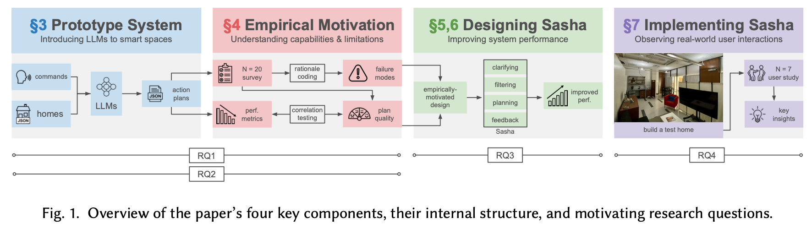

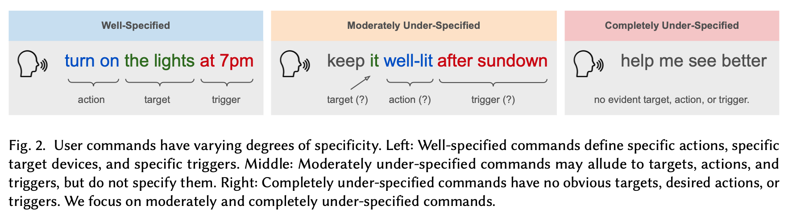

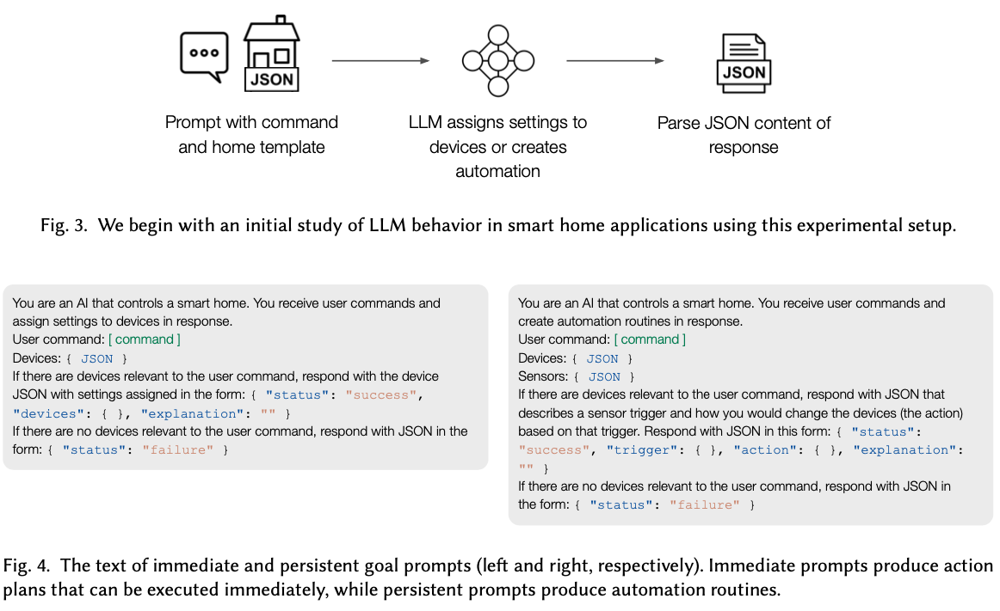

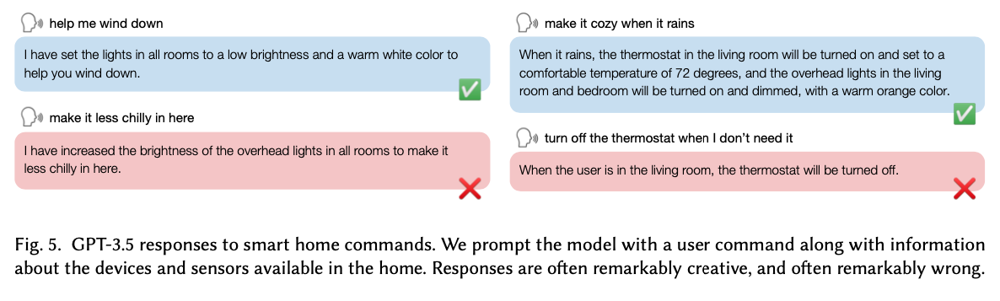

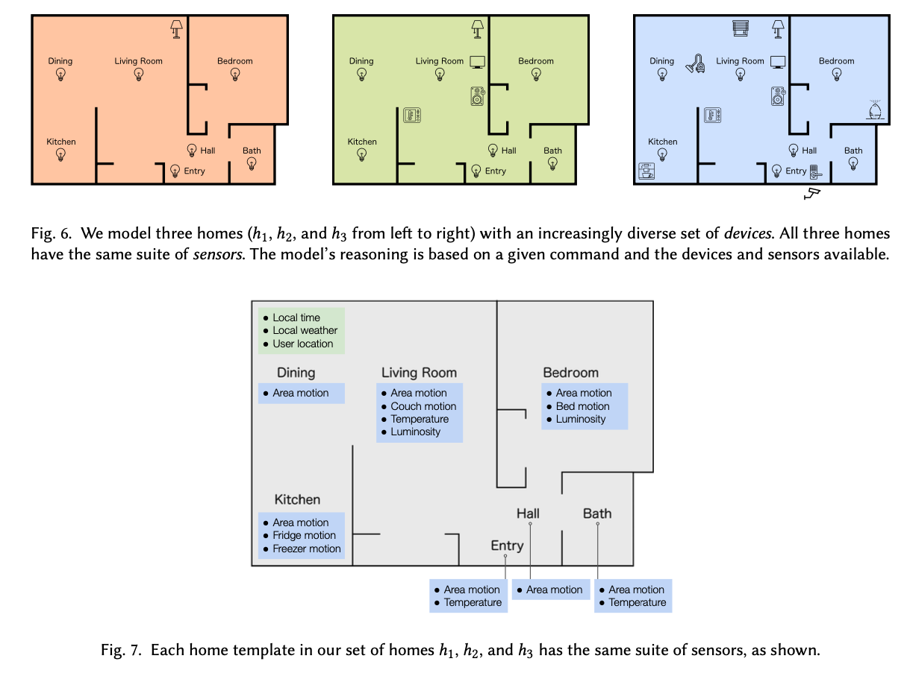

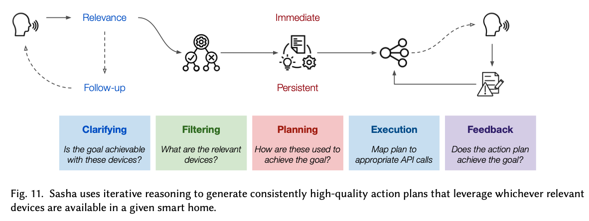

Figure 1: Figure from King, Yu, Lee, et al. (2024)

------------------------------------------------------------------------



## Thoughtful Things: Building Human-Centric Smart Devices with Small Language Models

King, E., Yu, H., Vartak, S., Jacob, J., Lee, S., & Julien, C. (2024).
**Thoughtful Things: Building Human-Centric Smart Devices with Small
Language Models** (arXiv:2405.03821). arXiv.
http://arxiv.org/abs/2405.03821

Abstract

Everyday devices like light bulbs and kitchen appliances are now
embedded with so many features and automated behaviors that they have
become complicated to actually use. While such “smart” capabilities can
better support users’ goals, the task of learning the “ins and outs” of
different devices is daunting. Voice assistants aim to solve this
problem by providing a natural language interface to devices, yet such
assistants cannot understand loosely-constrained commands, they lack the
ability to reason about and explain devices’ behaviors to users, and
they rely on connectivity to intrusive cloud infrastructure. Toward
addressing these issues, we propose thoughtful things: devices that
leverage lightweight, on-device language models to take actions and
explain their behaviors in response to unconstrained user commands. We
propose an end-to-end framework that leverages formal modeling,
automated training data synthesis, and generative language models to
create devices that are both capable and thoughtful in the presence of
unconstrained user goals and inquiries. Our framework requires no
labeled data and can be deployed on-device, with no cloud dependency. We
implement two thoughtful things (a lamp and a thermostat) and deploy
them on real hardware, evaluating their practical performance.

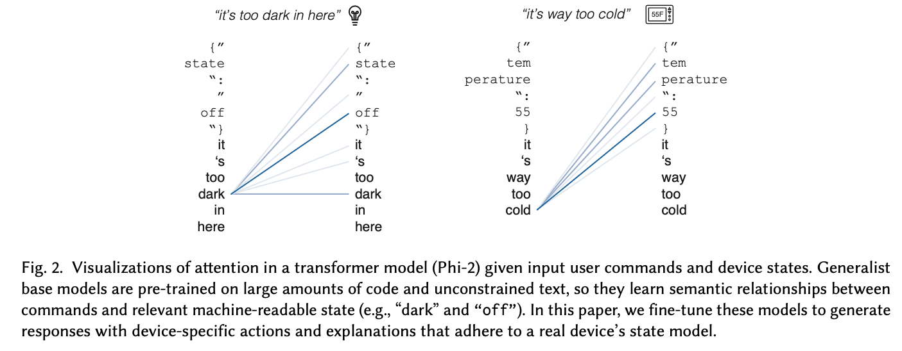

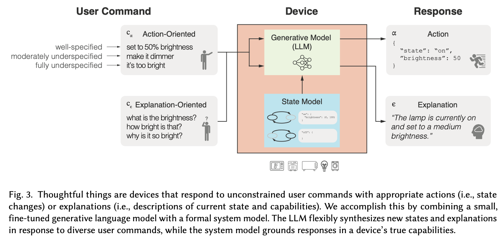

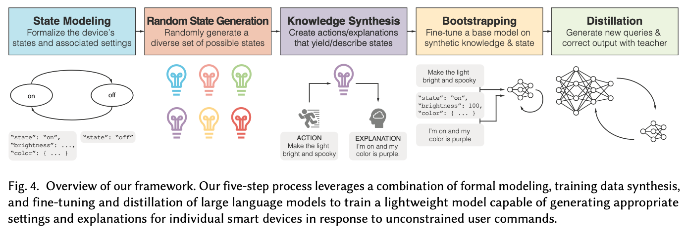

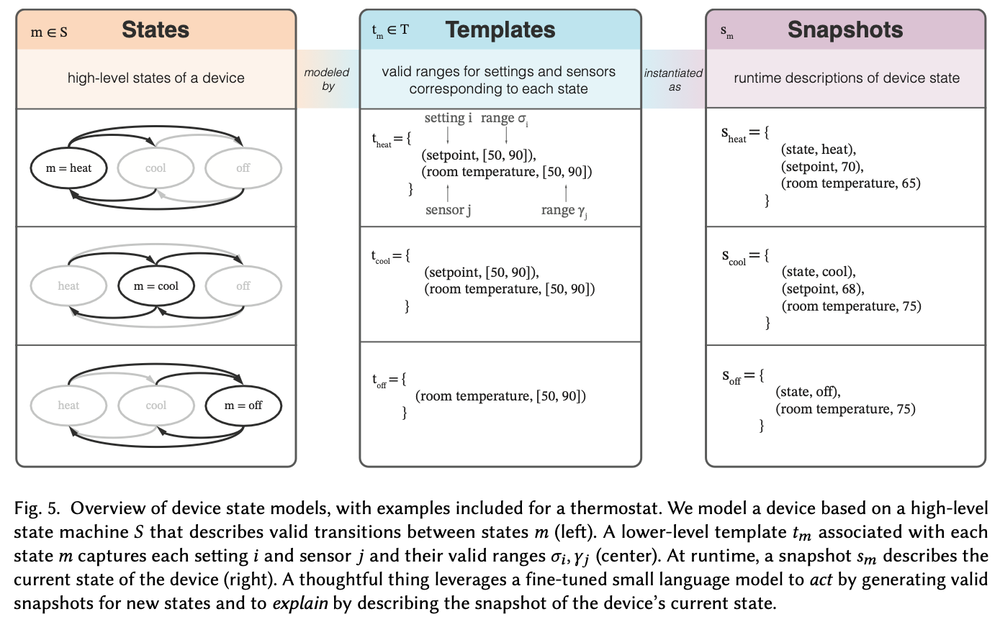

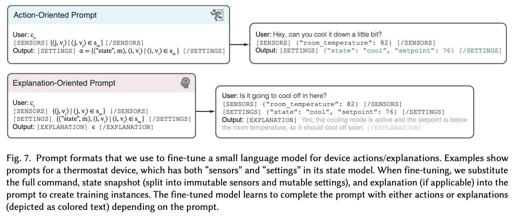

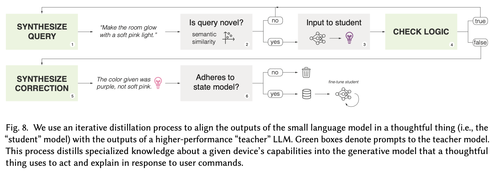

Figure 2: Figure from King, Yu, Vartak, et al. (2024)

------------------------------------------------------------------------



## Designing Home Automation Routines Using an LLM-Based Chatbot.

Giudici, M., Padalino, L., Paolino, G., Paratici, I., Pascu, A. I., &
Garzotto, F. (2024). **Designing Home Automation Routines Using an
LLM-Based Chatbot.** Designs, 8(3), Article 3.
https://doi.org/10.3390/designs8030043

Abstract

Without any more delay, individuals are urged to adopt more sustainable
behaviors to fight climate change. New digital systems mixed with
engaging and gamification mechanisms could play an important role in
achieving such an objective. In particular, Conversational Agents, like
Smart Home Assistants, are a promising tool that encourage sustainable
behaviors within household settings. In recent years, large language
models (LLMs) have shown great potential in enhancing the capabilities
of such assistants, making them more effective in interacting with
users. We present the design and implementation of GreenIFTTT, an
application empowered by GPT4 to create and control home automation
routines. The agent helps users understand which energy consumption
optimization routines could be created and applied to make their home
appliances more environmentally sustainable. We performed an exploratory
study (Italy, December 2023) with N = 13 participants to test our
application’s usability and UX. The results suggest that GreenIFTTT is a
usable, engaging, easy, and supportive tool, providing insight into new
perspectives and usage of LLMs to create more environmentally
sustainable home automation.

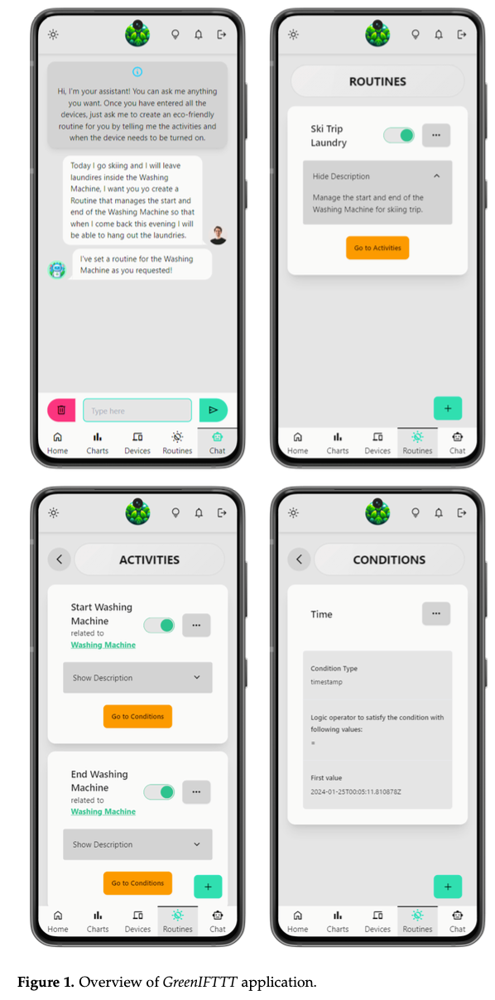

------------------------------------------------------------------------



## Enhancing smart home interaction through multimodal command disambiguation.

Calò, T., & De Russis, L. (2024). **Enhancing smart home interaction
through multimodal command disambiguation.** Personal and Ubiquitous
Computing. https://doi.org/10.1007/s00779-024-01827-3

Abstract

Smart speakers are entering our homes and enriching the connected
ecosystem already present in them. Home inhabitants can use those to
execute relatively simple commands, e.g., turning a lamp on. Their
capabilities to interpret more complex and ambiguous commands (e.g.,
make this room warmer) are limited, if not absent. Large language models
(LLMs) can offer creative and viable solutions to enable a practical and
user-acceptable interpretation of such ambiguous commands. This paper
introduces an interactive disambiguation approach that integrates visual
and textual cues with natural language commands. After contextualizing
the approach with a use case, we test it in an experiment where users
are prompted to select the appropriate cue (an image or a textual
description) to clarify ambiguous commands, thereby refining the
accuracy of the system’s interpretations. Outcomes from the study
indicate that the disambiguation system produces responses well-aligned
with user intentions, and that participants found the textual
descriptions slightly more effective. Finally, interviews reveal
heightened satisfaction with the smart-home system when engaging with
the proposed disambiguation approach.

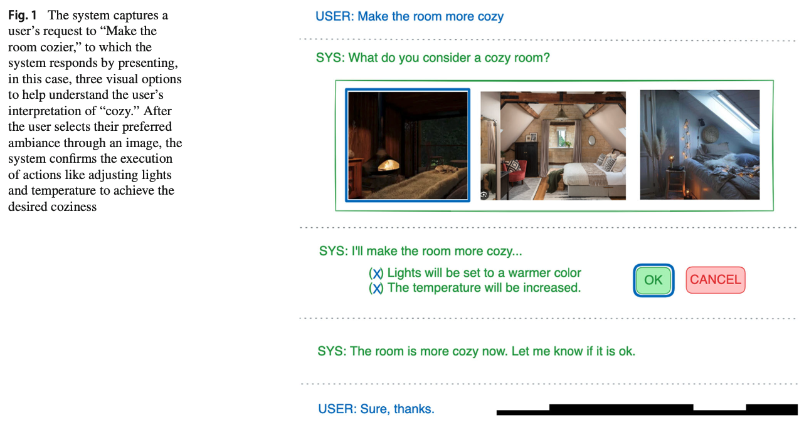

------------------------------------------------------------------------



## Save It for the “Hot” Day: An LLM-Empowered Visual Analytics System for Heat Risk Management

Li, H., Kam-Kwai, W., Luo, Y., Chen, J., Liu, C., Zhang, Y., Lau, A. K.
H., Qu, H., & Liu, D. (2024). **Save It for the “Hot” Day: An
LLM-Empowered Visual Analytics System for Heat Risk Management**
(arXiv:2406.03317). arXiv. http://arxiv.org/abs/2406.03317

Abstract

The escalating frequency and intensity of heat-related climate events,
particularly heatwaves, emphasize the pressing need for advanced heat
risk management strategies. Current approaches, primarily relying on
numerical models, face challenges in spatial-temporal resolution and in
capturing the dynamic interplay of environmental, social, and behavioral
factors affecting heat risks. This has led to difficulties in
translating risk assessments into effective mitigation actions.
Recognizing these problems, we introduce a novel approach leveraging the
burgeoning capabilities of Large Language Models (LLMs) to extract rich
and contextual insights from news reports. We hence propose an
LLM-empowered visual analytics system, Havior, that integrates the
precise, data-driven insights of numerical models with nuanced news
report information. This hybrid approach enables a more comprehensive
assessment of heat risks and better identification, assessment, and
mitigation of heat-related threats. The system incorporates novel
visualization designs, such as “thermoglyph” and news glyph, enhancing
intuitive understanding and analysis of heat risks. The integration of
LLM-based techniques also enables advanced information retrieval and
semantic knowledge extraction that can be guided by experts’ analytics
needs. Our case studies on two cities that faced significant heatwave
events and interviews with five experts have demonstrated the usefulness
of our system in providing in-depth and actionable insights for heat
risk management.

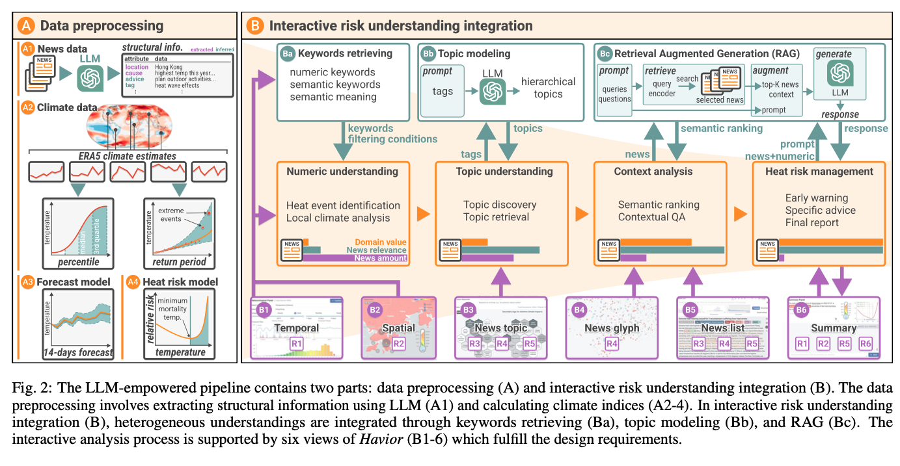



## Follow-Me AI: Energy-Efficient User Interaction with Smart Environments

Saleh, A., Donta, P. K., Morabito, R., Motlagh, N. H., & Lovén, L.
(2024). **Follow-Me AI: Energy-Efficient User Interaction with Smart
Environments** (arXiv:2404.12486). arXiv.
http://arxiv.org/abs/2404.12486

Abstract

This article introduces Follow-Me AI, a concept designed to enhance user
interactions with smart environments, optimize energy use, and provide
better control over data captured by these environments. Through AI
agents that accompany users, Follow-Me AI negotiates data management
based on user consent, aligns environmental controls as well as user
communication and computes resources available in the environment with
user preferences, and predicts user behavior to proactively adjust the
smart environment. The manuscript illustrates this concept with a
detailed example of Follow-Me AI in a smart campus setting, detailing
the interactions with the building’s management system for optimal
comfort and efficiency. Finally, this article looks into the challenges
and opportunities related to Follow-Me AI.

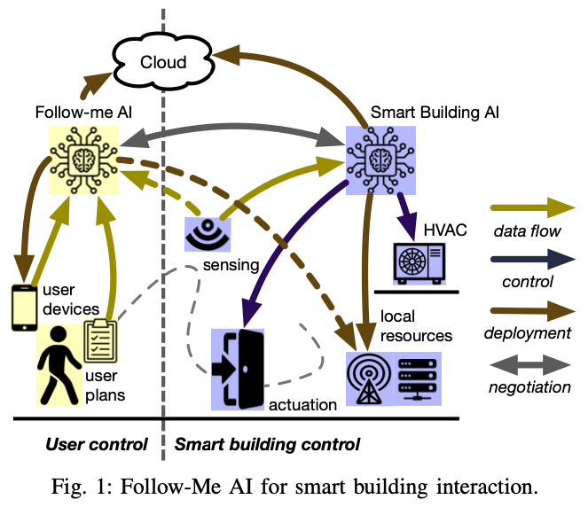

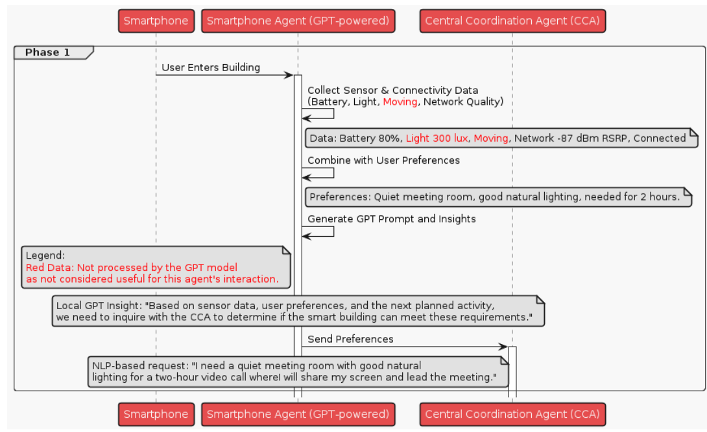

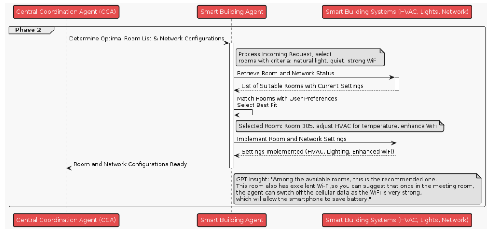

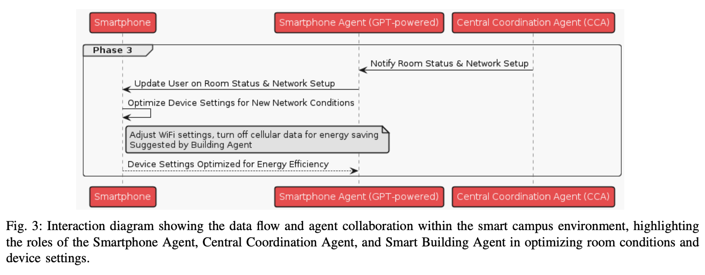

Figure 3: Figure from Saleh et al. (2024)



## An LLM-Based Digital Twin for Optimizing Human-in-the Loop Systems

Yang, H., Siew, M., & Joe-Wong, C. (2024). **An LLM-Based Digital Twin
for Optimizing Human-in-the Loop Systems** (arXiv:2403.16809). arXiv.
http://arxiv.org/abs/2403.16809

Abstract

The increasing prevalence of Cyber-Physical Systems and the Internet of
Things (CPS-IoT) applications and Foundation Models are enabling new
applications that leverage real-time control of the environment. For
example, real-time control of Heating, Ventilation and Air-Conditioning
(HVAC) systems can reduce its usage when not needed for the comfort of
human occupants, hence reducing energy consumption. Collecting realtime
feedback on human preferences in such human-in-the-loop (HITL) systems,
however, is difficult in practice. We propose the use of large language
models (LLMs) to deal with the challenges of dynamic environments and
difficult-to-obtain data in CPS optimization. In this paper, we present
a case study that employs LLM agents to mimic the behaviors and thermal
preferences of various population groups (e.g. young families, the
elderly) in a shopping mall. The aggregated thermal preferences are
integrated into an agent-in-the-loop based reinforcement learning
algorithm AitL-RL, which employs the LLM as a dynamic simulation of the
physical environment to learn how to balance between energy savings and
occupant comfort. Our results show that LLMs are capable of simulating
complex population movements within large open spaces. Besides,
AitL-RLdemonstrates superior performance compared to the popular
existing policy of set point control, suggesting that adaptive and
personalized decision-making is critical for efficient optimization in
CPS-IoT applications. Through this case study, we demonstrate the
potential of integrating advanced Foundation Models like LLMs into
CPS-IoT to enhance system adaptability and efficiency. The project’s
code can be found on our GitHub repository.

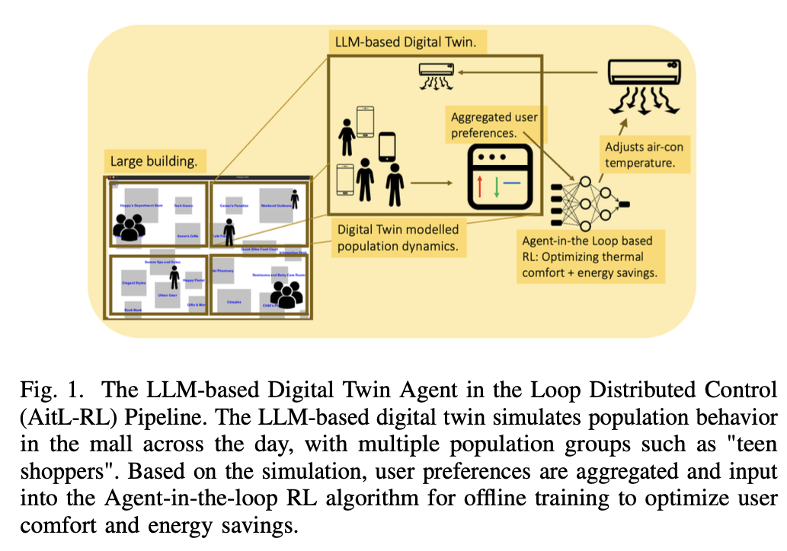



## Can Private LLM Agents Synthesize Household Energy Consumption Data?

Almashor, M., & Miyashita, Y. (2024). **Can Private LLM Agents
Synthesize Household Energy Consumption Data?** Proceedings of the 15th
ACM International Conference on Future and Sustainable Energy Systems,
664–668. https://doi.org/10.1145/3632775.3661993

Abstract

Reproducible science requires easy access to data, especially with the
rise of data-driven and increasingly complex models used within energy
research. Too often however, the data to reconstruct and verify
purported solutions in publications is hidden due to some combination of
commercial, legal, and sensitivity issues. This early work presents our
initial efforts to leverage the recent advancements in Large Language
Models (LLMs) to create usable and shareable energy datasets. In
particular, we’re utilising their mimicry of human behaviors, with the
goal of extracting and exploring synthetic energy data through the
simulation of LLM agents capable of interacting with and executing
actions in controlled environments. We also analyse and visualise
publicly available data in an attempt to create realistic but not quite
exact copies of the originals. Our early results show some promise, with
outputs that resemble the twin peak curves for household energy
consumption. The hope is that our generalised approach can be used to
easily replicate usable and realistic copies of otherwise secret or
sensitive data.

Almashor & Miyashita (2024)

## Prompt-Gaming: A Pilot Study on LLM-Evaluating Agent in a Meaningful Energy Game.

Isaza-Giraldo, A., Bala, P., Campos, P. F., & Pereira, L. (2024).
Prompt-Gaming: A Pilot Study on LLM-Evaluating Agent in a Meaningful
Energy Game. Extended Abstracts of the 2024 CHI Conference on Human
Factors in Computing Systems, 1–12.
https://doi.org/10.1145/3613905.3650774

Abstract

Building on previous work on incorporating large language models (LLM)
in gaming, we investigate the possibility of implementing LLM as
evaluating agents of open-ended challenges in serious games and its
potential to facilitate a meaningful experience for the player. We
contribute with a sustainability game prototype in a single natural
language prompt about energy communities and we tested it with 13
participants inside ChatGPT-3.5. Two participants were already aware of
energy communities before the game, and eight of the remaining 11 gained
valuable knowledge about the specific topic. Comparing ChatGPT-3.5
evaluations of players’ interaction with an expert’s assessment,
ChatGPT-3.5 correctly evaluated 81% of player’s answers. Our results are
encouraging and show the potential of using LLMs as mediating agents in
educational games, while also allowing easy prototyping of games through
natural language prompts.

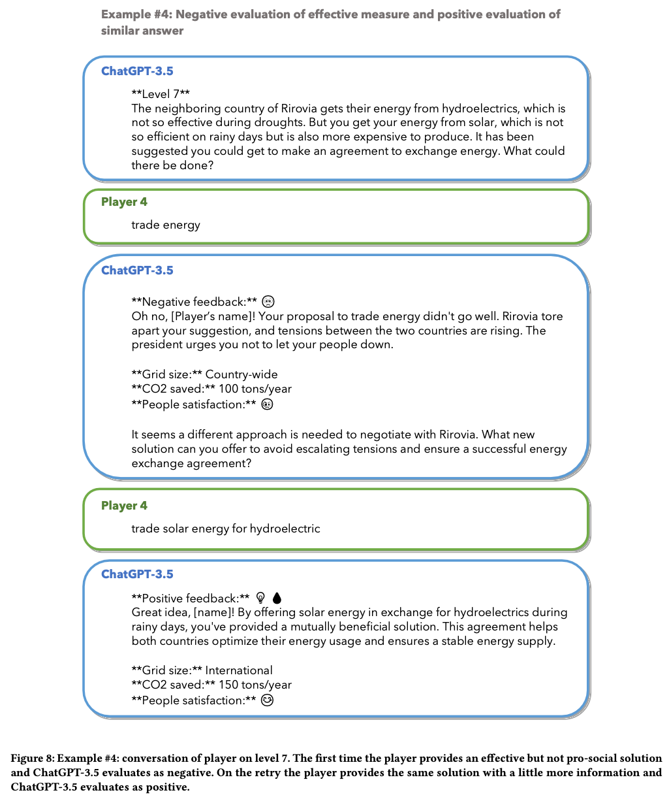



## Evaluation of large language models (LLMs) on the mastery of knowledge and skills in the heating, ventilation and air conditioning (HVAC) industry.

Lu, J., Tian, X., Zhang, C., Zhao, Y., Zhang, J., Zhang, W., Feng, C.,
He, J., Wang, J., & He, F. (2024). **Evaluation of large language models
(LLMs) on the mastery of knowledge and skills in the heating,
ventilation and air conditioning (HVAC) industry.** Energy and Built
Environment. https://doi.org/10.1016/j.enbenv.2024.03.010

Abstract

Large language models (LLMs) have shown human-level capabilities in
solving various complex tasks. However, it is still unknown whether
state-of-the-art LLMs master sufficient knowledge related to heating,
ventilation and air conditioning (HVAC) systems. It will be inspiring if
LLMs can think and learn like professionals in the HVAC industry. Hence,
this study investigates the performance of LLMs on mastering the
knowledge and skills related to the HVAC industry by letting them take
the ASHRAE Certified HVAC Designer examination, an authoritative
examination in the HVAC industry. Three key knowledge capabilities are
explored: recall, analysis and application. Twelve representative LLMs
are tested such as GPT-3.5, GPT-4 and LLaMA. According to the results,
GPT-4 passes the ASHRAE Certified HVAC Designer examination with scores
from 74 to 78, which is higher than about half of human examinees.
Besides, GPT-3.5 passes the examination twice out of five times. It
demonstrates that some LLMs such as GPT-4 and GPT-3.5 have great
potential to assist or replace humans in designing and operating HVAC
systems. However, they still make some mistakes sometimes due to the
lack of knowledge, poor reasoning capabilities and unsatisfactory
equation calculation abilities. Accordingly, four future research
directions are proposed to reveal how to utilize and improve LLMs in the
HVAC industry: teaching LLMs to use design tools or software in the HVAC
industry, enabling LLMs to read and analyze the operational data from
HVAC systems, developing tailored corpuses for the HVAC industry, and
assessing the performance of LLMs in real-world HVAC design and
operation scenarios.

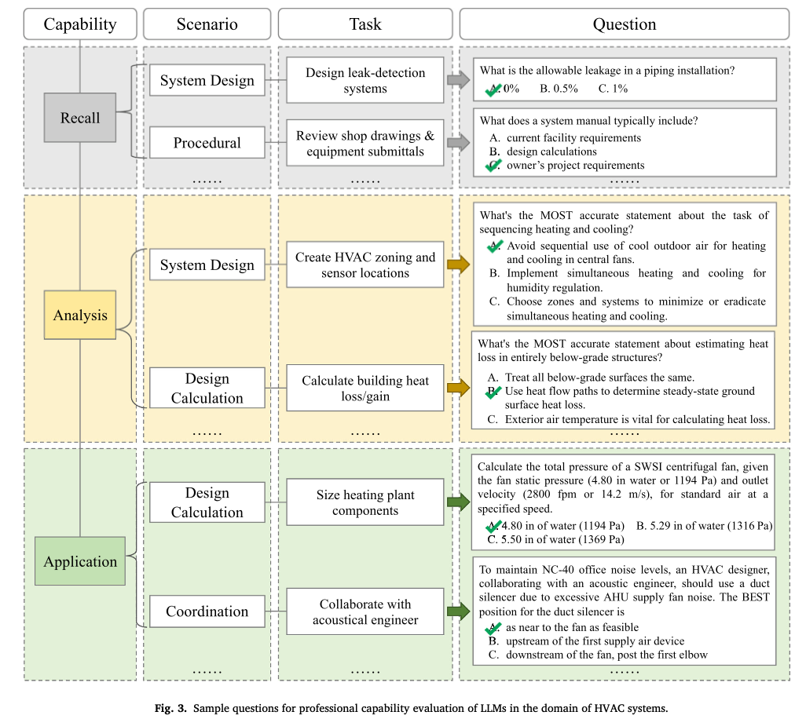



## Domain-specific large language models for fault diagnosis of heating, ventilation, and air conditioning systems by labeled-data-supervised fine-tuning.

Zhang, J., Zhang, C., Lu, J., & Zhao, Y. (2025). **Domain-specific large
language models for fault diagnosis of heating, ventilation, and air
conditioning systems by labeled-data-supervised fine-tuning.** Applied
Energy, 377, 124378. https://doi.org/10.1016/j.apenergy.2024.124378

Abstract

Large language models (LLMs) have exhibited great potential in fault
diagnosis of heating, ventilation, and air conditioning systems.
However, the fault diagnosis accuracy of LLMs is still unsatisfactory,
due to the lack of effective diagnosis accuracy enhancement methods for
LLMs. To fill this gap, this study proposes a LLM fine-tuning method
supervised by data with fault and fault-free labels to enhance the fault
diagnosis accuracy of LLMs. This method designs a LLM self-correction
strategy to automatically generate a fine-tuning dataset based on the
labeled data. The generated fine-tuning dataset is applied to fine-tune
a LLM. Moreover, a data augmentation-based approach is put forward to
adaptively update the fine-tuning dataset for iteratively developing a
high-performance fine-tuned LLM. The proposed method is utilized to
fine-tune the GPT-3.5 model using the air handling unit (AHU) fault
dataset from the RP-1312 project. The results show that the diagnosis
accuracy of the GPT-3.5 model is increased from 29.5 % to 100.0 % after
model fine-tuning. Compared with the GPT-4 model, the fine-tuned GPT-3.5
model achieves a 31.1 % higher average diagnosis accuracy. The
fine-tuned GPT-3.5 model is also applied to diagnose faults in two AHUs
from another open-source dataset to verify the generalization ability of
this model. The two AHUs have different system structures and sensor
configurations compared to the AHU in the RP-1312 dataset, and this
dataset is not utilized to fine-tune the GPT-3.5 model. The average
diagnosis accuracy of the GPT-3.5 model is increased from 46.0 % to 99.1
% and from 38.8 % to 98.9 % for the faults in the two AHUs,
respectively, after model fine-tuning. Furthermore, the proposed method
is verified using two fault datasets from a variable air volume box and
a chiller plant system. After fine-tuning the GPT-3.5 model using the
two datasets, the average diagnosis accuracy of this model is increased
from 33.0 % to 98.3 % for variable air volume box faults and from 36.0 %
to 99.1 % for chiller plant system faults. This study provides an
effective solution to the development of domain-specific LLMs for this
domain.

Zhang et al. (2025)



## Game of LLMs: Discovering Structural Constructs in Activities using Large Language Models.

Hiremath, S. K., & Plötz, T. (2024). **Game of LLMs: Discovering
Structural Constructs in Activities using Large Language Models.**
Companion of the 2024 on ACM International Joint Conference on Pervasive
and Ubiquitous Computing, 487–492.
https://doi.org/10.1145/3675094.3678444

Abstract

Human Activity Recognition is a time-series analysis problem. A popular
analysis procedure used by the community assumes an optimal window
length to design recognition pipelines. However, in the scenario of
smart homes, where activities are of varying duration and frequency, the
assumption of a constant sized window does not hold. Additionally,
previous works have shown these activities to be made up of building
blocks. We focus on identifying these underlying building
blocks–structural constructs, with the use of large language models.
Identifying these constructs can be beneficial especially in recognizing
short-duration and infrequent activities, which current systems cannot
recognize. We also propose the development of an activity recognition
procedure that uses these building blocks to model activities, thus
helping the downstream task of activity monitoring in smart homes.

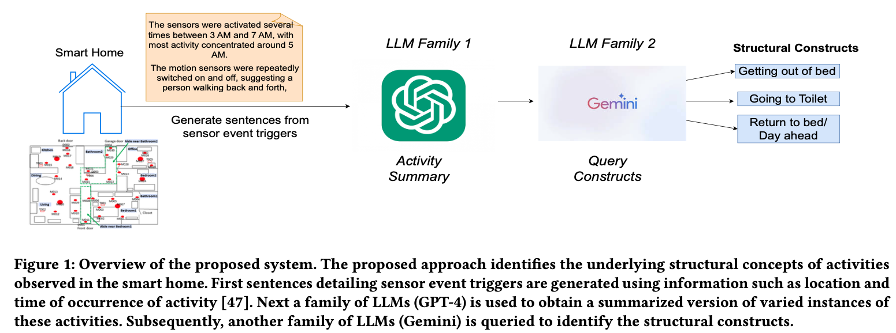



## LLM-Based Open-Domain Integrated Task and Knowledge Assistants with Programmable Policies

Joshi, H., Liu, S., Chen, J., Weigle, R., & Lam, M. S. (2024).
**LLM-Based Open-Domain Integrated Task and Knowledge Assistants with
Programmable Policies** (arXiv:2407.05674). arXiv.
http://arxiv.org/abs/2407.05674

Abstract

Programming LLM-based knowledge and task assistants that faithfully
conform to developer-provided policies is challenging. These agents must
retrieve and provide consistent, accurate, and relevant information to
address user’s queries and needs. Yet such agents generate unfounded
responses (“hallucinate”). Traditional dialogue trees can only handle a
limited number of conversation flows, making them inherently brittle. To
this end, we present KITA - a programmable framework for creating
task-oriented conversational agents that are designed to handle complex
user interactions. Unlike LLMs, KITA provides reliable grounded
responses, with controllable agent policies through its expressive
specification, KITA Worksheet. In contrast to dialog trees, it is
resilient to diverse user queries, helpful with knowledge sources, and
offers ease of programming policies through its declarative paradigm.
Through a real-user study involving 62 participants, we show that KITA
beats the GPT-4 with function calling baseline by 26.1, 22.5, and 52.4
points on execution accuracy, dialogue act accuracy, and goal completion
rate, respectively. We also release 22 real-user conversations with KITA
manually corrected to ensure accuracy.

Joshi et al. (2024)



## Large Language Models are Zero-Shot Recognizers for Activities of Daily Living

Civitarese, G., Fiori, M., Choudhary, P., & Bettini, C. (2024). **Large
Language Models are Zero-Shot Recognizers for Activities of Daily
Living** (arXiv:2407.01238). arXiv. http://arxiv.org/abs/2407.01238

Abstract

The sensor-based recognition of Activities of Daily Living (ADLs) in
smart home environments enables several applications in the areas of
energy management, safety, well-being, and healthcare. ADLs recognition
is typically based on deep learning methods requiring large datasets to
be trained. Recently, several studies proved that Large Language Models
(LLMs) effectively capture common-sense knowledge about human
activities. However, the effectiveness of LLMs for ADLs recognition in
smart home environments still deserves to be investigated. In this work,
we propose ADL-LLM, a novel LLM-based ADLs recognition system. ADLLLM
transforms raw sensor data into textual representations, that are
processed by an LLM to perform zero-shot ADLs recognition. Moreover, in
the scenario where a small labeled dataset is available, ADL-LLM can
also be empowered with few-shot prompting. We evaluated ADL-LLM on two
public datasets, showing its effectiveness in this domain.

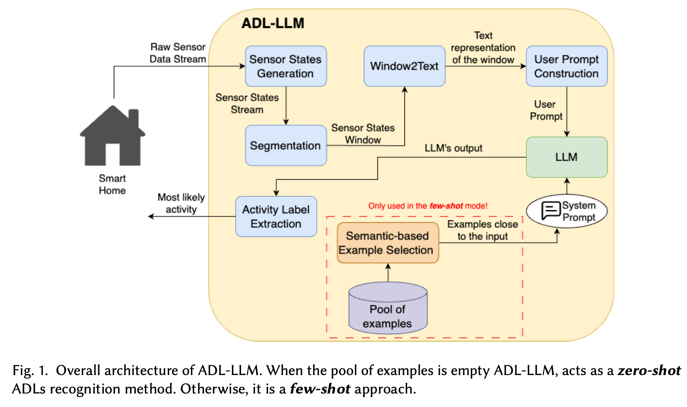

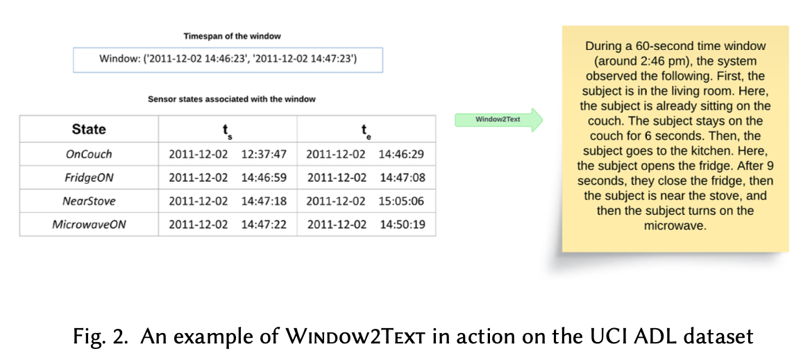

Figure 4: Figures from Civitarese et al. (2024)



## Large Language Models for Power Scheduling: A User-Centric Approach

Mongaillard, T., Lasaulce, S., Hicheur, O., Zhang, C., Bariah, L.,
Varma, V. S., Zou, H., Zhao, Q., & Debbah, M. (2024). **Large Language
Models for Power Scheduling: A User-Centric Approach**
(arXiv:2407.00476). arXiv. http://arxiv.org/abs/2407.00476

Abstract

While traditional optimization and scheduling schemes are designed to
meet fixed, predefined system requirements, future systems are moving
toward user-driven approaches and personalized services, aiming to
achieve high quality-of-experience (QoE) and flexibility. This challenge
is particularly pronounced in wireless and digitalized energy networks,
where users’ requirements have largely not been taken into consideration
due to the lack of a common language between users and machines. The
emergence of powerful large language models (LLMs) marks a radical
departure from traditional system-centric methods into more advanced
user-centric approaches by providing a natural communication interface
between users and devices. In this paper, for the first time, we
introduce a novel architecture for resource scheduling problems by
constructing three LLM agents to convert an arbitrary user’s voice
request (VRQ) into a resource allocation vector. Specifically, we design
an LLM intent recognition agent to translate the request into an
optimization problem (OP), an LLM OP parameter identification agent, and
an LLM OP solving agent. To evaluate system performance, we construct a
database of typical VRQs in the context of electric vehicle (EV)
charging. As a proof of concept, we primarily use Llama 3 8B. Through
testing with different prompt engineering scenarios, the obtained
results demonstrate the efficiency of the proposed architecture. The
conducted performance analysis allows key insights to be extracted. For
instance, having a larger set of candidate OPs to model the real-world
problem might degrade the final performance because of a higher
recognition/OP classification noise level. All results and codes are
open source.

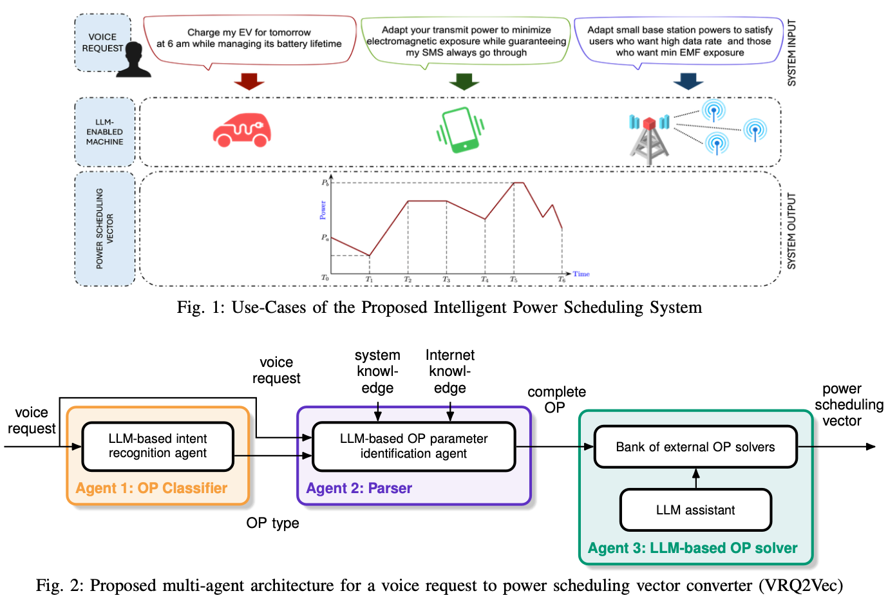

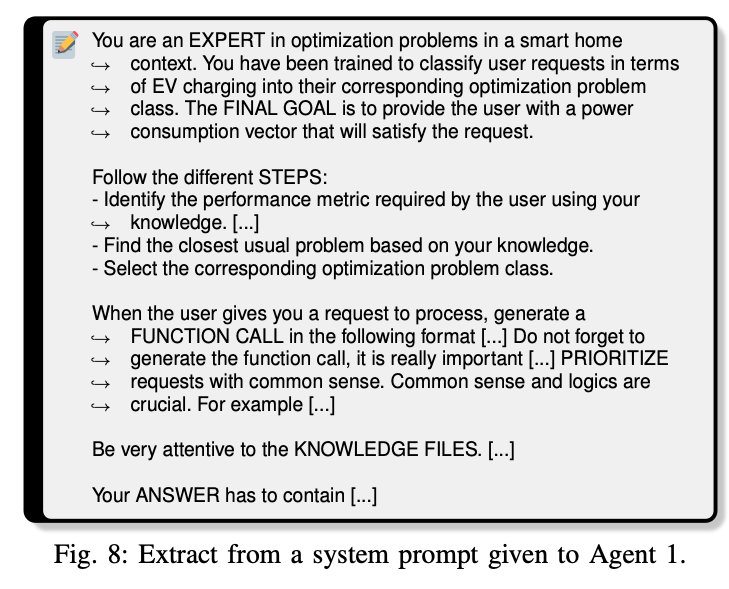

Figure 5: Figures from Mongaillard et al. (2024)



## A Recommendation System for Prosumers Based on Large Language Models.

Oprea, S.-V., & Bâra, A. (2024). **A Recommendation System for Prosumers
Based on Large Language Models.** Sensors, 24(11), Article 11.
https://doi.org/10.3390/s24113530

Abstract

As modern technologies, particularly home assistant devices and sensors,
become more integrated into our daily lives, they are also making their
way into the domain of energy management within our homes. Homeowners,
now acting as prosumers, have access to detailed information at 15-min
or even 5-min intervals, including weather forecasts, outputs from
renewable energy source (RES)-based systems, appliance schedules and the
current energy balance, which details any deficits or surpluses along
with their quantities and the predicted prices on the local energy
market (LEM). The goal for these prosumers is to reduce costs while
ensuring their home’s comfort levels are maintained. However, given the
complexity and the rapid decision-making required in managing this
information, the need for a supportive system is evident. This is
particularly true given the routine nature of these decisions,
highlighting the potential for a system that provides personalized
recommendations to optimize energy consumption, whether that involves
adjusting the load or engaging in transactions with the LEM. In this
context, we propose a recommendation system powered by large language
models (LLMs), Scikit-llm and zero-shot classifiers, designed to
evaluate specific scenarios and offer tailored advice for prosumers
based on the available data at any given moment. Two scenarios for a
prosumer of 5.9 kW are assessed using candidate labels, such as
Decrease, Increase, Sell and Buy. A comparison with a content-based
filtering system is provided considering the performance metrics that
are relevant for prosumers.

Oprea & Bâra (2024)



## A conversational agent for creating automations exploiting large language models. Personal and Ubiquitous Computing.

Gallo, S., Paternò, F., & Malizia, A. (2024). **A conversational agent
for creating automations exploiting large language models. Personal and
Ubiquitous Computing.** https://doi.org/10.1007/s00779-024-01825-5

Abstract

The proliferation of sensors and smart Internet of Things (IoT) devices
in our everyday environments is reshaping our interactions with everyday
objects. This change underlines the need to empower non-expert users to
easily configure the behaviour of these devices to align with their
preferences and habits. At the same time, recent advances in generative
transformers, such as ChatGPT, have opened up new possibilities in a
variety of natural language processing tasks, enhancing reasoning
capabilities and conversational interactions. This paper presents
RuleBot +  + , a conversational agent that exploits GPT-4 to assist the
user in the creation and modification of trigger-action automations
through natural language. After an introduction to motivations and
related work, we present the design and implementation of
RuleBot +  + and report the results of the user test in which users
interacted with our solution and Home Assistant, one of the most used
open-source tools for managing smart environments.

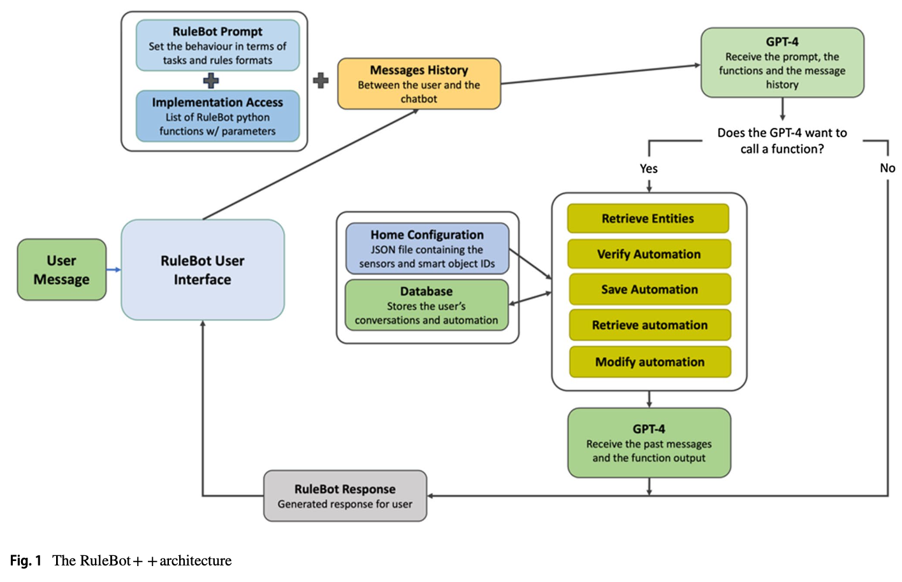

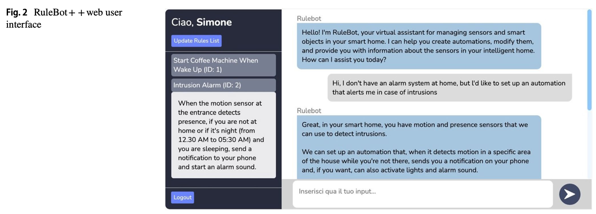

Figure 6: Figures from Gallo et al. (2024)



## A Human-on-the-Loop Optimization Autoformalism Approach for Sustainability

Jin, M., Sel, B., Hardeep, F., & Yin, W. (2023). **A Human-on-the-Loop
Optimization Autoformalism Approach for Sustainability**
(arXiv:2308.10380). arXiv. http://arxiv.org/abs/2308.10380

Abstract

This paper outlines a natural conversational approach to solving
personalized energy-related problems using large language models (LLMs).
We focus on customizable optimization problems that necessitate repeated
solving with slight variations in modeling and are user-specific, hence
posing a challenge to devising a one-size-fits-all model. We put forward
a strategy that augments an LLM with an optimization solver, enhancing
its proficiency in understanding and responding to user specifications
and preferences while providing nonlinear reasoning capabilities. Our
approach pioneers the novel concept of human-guided optimization
autoformalism, translating a natural language task specification
automatically into an optimization instance. This enables LLMs to
analyze, explain, and tackle a variety of instance-specific
energy-related problems, pushing beyond the limits of current
prompt-based techniques. Our research encompasses various commonplace
tasks in the energy sector, from electric vehicle charging and Heating,
Ventilation, and Air Conditioning (HVAC) control to long-term planning
problems such as cost-benefit evaluations for installing rooftop solar
photovoltaics (PVs) or heat pumps. This pilot study marks an essential
stride towards the context-based formulation of optimization using LLMs,
with the potential to democratize optimization processes. As a result,
stakeholders are empowered to optimize their energy consumption,
promoting sustainable energy practices customized to personal needs and
preferences.

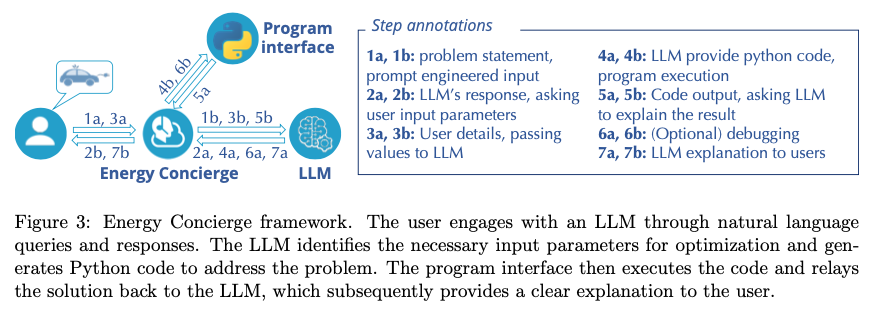

## References

Almashor, M., & Miyashita, Y. (2024). *Can Private LLM Agents Synthesize
Household Energy Consumption Data?*

Calò, T., & De Russis, L. (2024). Enhancing smart home interaction
through multimodal command disambiguation. *Personal and Ubiquitous
Computing*. <https://doi.org/10.1007/s00779-024-01827-3>

Civitarese, G., Fiori, M., Choudhary, P., & Bettini, C. (2024). *Large
Language Models are Zero-Shot Recognizers for Activities of Daily
Living* (arXiv:2407.01238). arXiv. <https://arxiv.org/abs/2407.01238>

Gallo, S., Paternò, F., & Malizia, A. (2024). A conversational agent for
creating automations exploiting large language models. *Personal and
Ubiquitous Computing*. <https://doi.org/10.1007/s00779-024-01825-5>

Giudici, M., Padalino, L., Paolino, G., Paratici, I., Pascu, A. I., &
Garzotto, F. (2024). Designing Home Automation Routines Using an
LLM-Based Chatbot. *Designs*, *8*(3), 43.
<https://doi.org/10.3390/designs8030043>

Hiremath, S. K., & Plötz, T. (2024). Game of LLMs: Discovering
Structural Constructs in Activities using Large Language Models.
*Companion of the 2024 on ACM International Joint Conference on
Pervasive and Ubiquitous Computing*, 487–492.
<https://doi.org/10.1145/3675094.3678444>

Isaza-Giraldo, A., Bala, P., Campos, P. F., & Pereira, L. (2024).
Prompt-Gaming: A Pilot Study on LLM-Evaluating Agent in a Meaningful
Energy Game. *Extended Abstracts of the CHI Conference on Human Factors
in Computing Systems*, 1–12. <https://doi.org/10.1145/3613905.3650774>

Jin, M., Sel, B., Hardeep, F., & Yin, W. (2023). *A
Human-on-the-Loop Optimization Autoformalism
Approach for Sustainability* (arXiv:2308.10380). arXiv.
<https://arxiv.org/abs/2308.10380>

Joshi, H., Liu, S., Chen, J., Weigle, R., & Lam, M. S. (2024).
*LLM-Based Open-Domain Integrated Task and Knowledge Assistants with
Programmable Policies* (arXiv:2407.05674). arXiv.
<https://arxiv.org/abs/2407.05674>

King, E., Yu, H., Lee, S., & Julien, C. (2024). Sasha: Creative
Goal-Oriented Reasoning in Smart Homes with Large Language Models.
*Proceedings of the ACM on Interactive, Mobile, Wearable and Ubiquitous
Technologies*, *8*(1), 1–38. <https://doi.org/10.1145/3643505>

King, E., Yu, H., Vartak, S., Jacob, J., Lee, S., & Julien, C. (2024).
*Thoughtful Things: Building Human-Centric Smart Devices with Small
Language Models* (arXiv:2405.03821). arXiv.
<https://arxiv.org/abs/2405.03821>

Li, H., Kam-Kwai, W., Luo, Y., Chen, J., Liu, C., Zhang, Y., Lau, A. K.
H., Qu, H., & Liu, D. (2024). *Save It for the "Hot" Day: An
LLM-Empowered Visual Analytics System for Heat Risk Management*
(arXiv:2406.03317). arXiv. <https://arxiv.org/abs/2406.03317>

Lu, J., Tian, X., Zhang, C., Zhao, Y., Zhang, J., Zhang, W., Feng, C.,
He, J., Wang, J., & He, F. (2024). Evaluation of large language models
(LLMs) on the mastery of knowledge and skills in the heating,
ventilation and air conditioning (HVAC) industry. *Energy and Built
Environment*. <https://doi.org/10.1016/j.enbenv.2024.03.010>

Mongaillard, T., Lasaulce, S., Hicheur, O., Zhang, C., Bariah, L.,
Varma, V. S., Zou, H., Zhao, Q., & Debbah, M. (2024). *Large Language
Models for Power Scheduling: A User-Centric Approach*
(arXiv:2407.00476). arXiv. <https://arxiv.org/abs/2407.00476>

Oprea, S.-V., & Bâra, A. (2024). A Recommendation System for Prosumers
Based on Large Language Models. *Sensors*, *24*(11), 3530.
<https://doi.org/10.3390/s24113530>

Saleh, A., Donta, P. K., Morabito, R., Motlagh, N. H., & Lovén, L.
(2024). *Follow-Me AI: Energy-Efficient User Interaction with Smart
Environments* (arXiv:2404.12486). arXiv.
<https://arxiv.org/abs/2404.12486>

Yang, H., Siew, M., & Joe-Wong, C. (2024). *An LLM-Based Digital Twin
for Optimizing Human-in-the Loop Systems*
(arXiv:2403.16809). arXiv. <https://arxiv.org/abs/2403.16809>

Zhang, J., Zhang, C., Lu, J., & Zhao, Y. (2025). Domain-specific large
language models for fault diagnosis of heating, ventilation, and air
conditioning systems by labeled-data-supervised fine-tuning. *Applied
Energy*, *377*, 124378. <https://doi.org/10.1016/j.apenergy.2024.124378>

