# Group Decision Lit

<https://tegorman13.github.io/ccl/llm_energy.html>

## Sasha: Creative Goal-Oriented Reasoning in Smart Homes with Large Language Models.

King, E., Yu, H., Lee, S., & Julien, C. (2024). **Sasha: Creative
Goal-Oriented Reasoning in Smart Homes with Large Language Models.**
Proceedings of the ACM on Interactive, Mobile, Wearable and Ubiquitous
Technologies, 8(1), 1–38. https://doi.org/10.1145/3643505

Abstract

Smart home assistants function best when user commands are direct and
well-specified—e.g., “turn on the kitchen light”—or when a hard-coded
routine specifies the response. In more natural communication, however,
human speech is unconstrained, often describing goals (e.g., “make it
cozy in here” or “help me save energy”) rather than indicating specific
target devices and actions to take on those devices. Current systems
fail to understand these under-specified commands since they cannot
reason about devices and settings as they relate to human situations. We
introduce large language models (LLMs) to this problem space, exploring
their use for controlling devices and creating automation routines in
response to under-specified user commands in smart homes. We empirically
study the baseline quality and failure modes of LLM-created action plans
with a survey of age-diverse users. We find that LLMs can reason
creatively to achieve challenging goals, but they experience patterns of
failure that diminish their usefulness. We address these gaps with
Sasha, a smarter smart home assistant. Sasha responds to
loosely-constrained commands like “make it cozy” or “help me sleep
better” by executing plans to achieve user goals—e.g., setting a mood
with available devices, or devising automation routines. We implement
and evaluate Sasha in a hands-on user study, showing the capabilities
and limitations of LLM-driven smart homes when faced with unconstrained
user-generated scenarios.

Figure 1: Figure from King, Yu, Lee, et al. (2024)

------------------------------------------------------------------------



## Thoughtful Things: Building Human-Centric Smart Devices with Small Language Models

King, E., Yu, H., Vartak, S., Jacob, J., Lee, S., & Julien, C. (2024).
**Thoughtful Things: Building Human-Centric Smart Devices with Small
Language Models** (arXiv:2405.03821). arXiv.
http://arxiv.org/abs/2405.03821

Abstract

Everyday devices like light bulbs and kitchen appliances are now
embedded with so many features and automated behaviors that they have
become complicated to actually use. While such “smart” capabilities can
better support users’ goals, the task of learning the “ins and outs” of
different devices is daunting. Voice assistants aim to solve this
problem by providing a natural language interface to devices, yet such
assistants cannot understand loosely-constrained commands, they lack the
ability to reason about and explain devices’ behaviors to users, and
they rely on connectivity to intrusive cloud infrastructure. Toward
addressing these issues, we propose thoughtful things: devices that
leverage lightweight, on-device language models to take actions and
explain their behaviors in response to unconstrained user commands. We
propose an end-to-end framework that leverages formal modeling,
automated training data synthesis, and generative language models to
create devices that are both capable and thoughtful in the presence of
unconstrained user goals and inquiries. Our framework requires no
labeled data and can be deployed on-device, with no cloud dependency. We
implement two thoughtful things (a lamp and a thermostat) and deploy
them on real hardware, evaluating their practical performance.

Figure 2: Figure from King, Yu, Vartak, et al. (2024)

------------------------------------------------------------------------



## Designing Home Automation Routines Using an LLM-Based Chatbot.

Giudici, M., Padalino, L., Paolino, G., Paratici, I., Pascu, A. I., &
Garzotto, F. (2024). **Designing Home Automation Routines Using an
LLM-Based Chatbot.** Designs, 8(3), Article 3.
https://doi.org/10.3390/designs8030043

Abstract

Without any more delay, individuals are urged to adopt more sustainable
behaviors to fight climate change. New digital systems mixed with
engaging and gamification mechanisms could play an important role in
achieving such an objective. In particular, Conversational Agents, like
Smart Home Assistants, are a promising tool that encourage sustainable
behaviors within household settings. In recent years, large language
models (LLMs) have shown great potential in enhancing the capabilities
of such assistants, making them more effective in interacting with
users. We present the design and implementation of GreenIFTTT, an
application empowered by GPT4 to create and control home automation
routines. The agent helps users understand which energy consumption
optimization routines could be created and applied to make their home
appliances more environmentally sustainable. We performed an exploratory
study (Italy, December 2023) with N = 13 participants to test our
application’s usability and UX. The results suggest that GreenIFTTT is a
usable, engaging, easy, and supportive tool, providing insight into new
perspectives and usage of LLMs to create more environmentally
sustainable home automation.

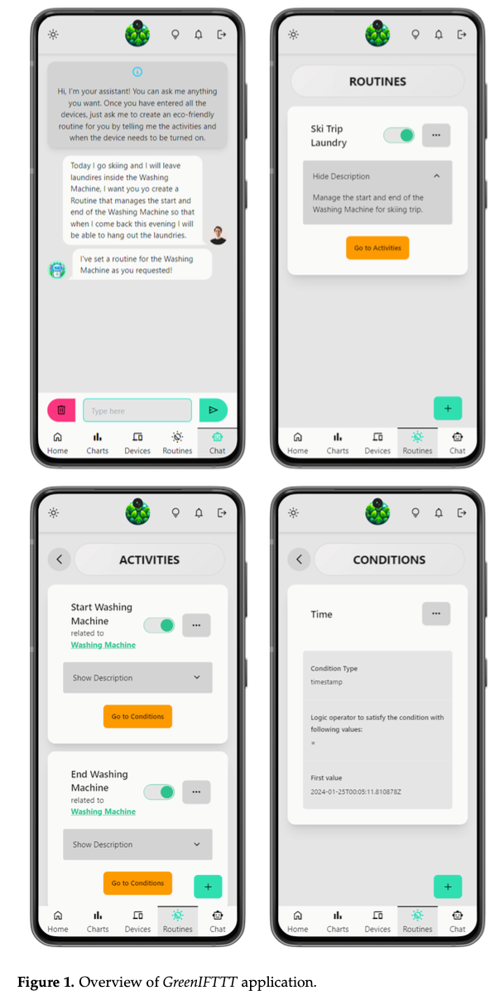

------------------------------------------------------------------------



## Enhancing smart home interaction through multimodal command disambiguation.

Calò, T., & De Russis, L. (2024). **Enhancing smart home interaction
through multimodal command disambiguation.** Personal and Ubiquitous
Computing. https://doi.org/10.1007/s00779-024-01827-3

Abstract

Smart speakers are entering our homes and enriching the connected
ecosystem already present in them. Home inhabitants can use those to
execute relatively simple commands, e.g., turning a lamp on. Their
capabilities to interpret more complex and ambiguous commands (e.g.,
make this room warmer) are limited, if not absent. Large language models
(LLMs) can offer creative and viable solutions to enable a practical and
user-acceptable interpretation of such ambiguous commands. This paper
introduces an interactive disambiguation approach that integrates visual
and textual cues with natural language commands. After contextualizing
the approach with a use case, we test it in an experiment where users
are prompted to select the appropriate cue (an image or a textual
description) to clarify ambiguous commands, thereby refining the
accuracy of the system’s interpretations. Outcomes from the study
indicate that the disambiguation system produces responses well-aligned
with user intentions, and that participants found the textual
descriptions slightly more effective. Finally, interviews reveal
heightened satisfaction with the smart-home system when engaging with
the proposed disambiguation approach.

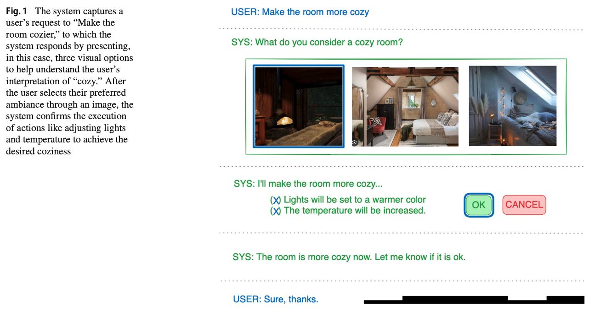

------------------------------------------------------------------------



## Save It for the “Hot” Day: An LLM-Empowered Visual Analytics System for Heat Risk Management

Li, H., Kam-Kwai, W., Luo, Y., Chen, J., Liu, C., Zhang, Y., Lau, A. K.
H., Qu, H., & Liu, D. (2024). **Save It for the “Hot” Day: An
LLM-Empowered Visual Analytics System for Heat Risk Management**
(arXiv:2406.03317). arXiv. http://arxiv.org/abs/2406.03317

Abstract

The escalating frequency and intensity of heat-related climate events,
particularly heatwaves, emphasize the pressing need for advanced heat
risk management strategies. Current approaches, primarily relying on
numerical models, face challenges in spatial-temporal resolution and in
capturing the dynamic interplay of environmental, social, and behavioral
factors affecting heat risks. This has led to difficulties in
translating risk assessments into effective mitigation actions.
Recognizing these problems, we introduce a novel approach leveraging the
burgeoning capabilities of Large Language Models (LLMs) to extract rich
and contextual insights from news reports. We hence propose an
LLM-empowered visual analytics system, Havior, that integrates the
precise, data-driven insights of numerical models with nuanced news
report information. This hybrid approach enables a more comprehensive
assessment of heat risks and better identification, assessment, and
mitigation of heat-related threats. The system incorporates novel
visualization designs, such as “thermoglyph” and news glyph, enhancing
intuitive understanding and analysis of heat risks. The integration of
LLM-based techniques also enables advanced information retrieval and
semantic knowledge extraction that can be guided by experts’ analytics
needs. Our case studies on two cities that faced significant heatwave
events and interviews with five experts have demonstrated the usefulness
of our system in providing in-depth and actionable insights for heat
risk management.

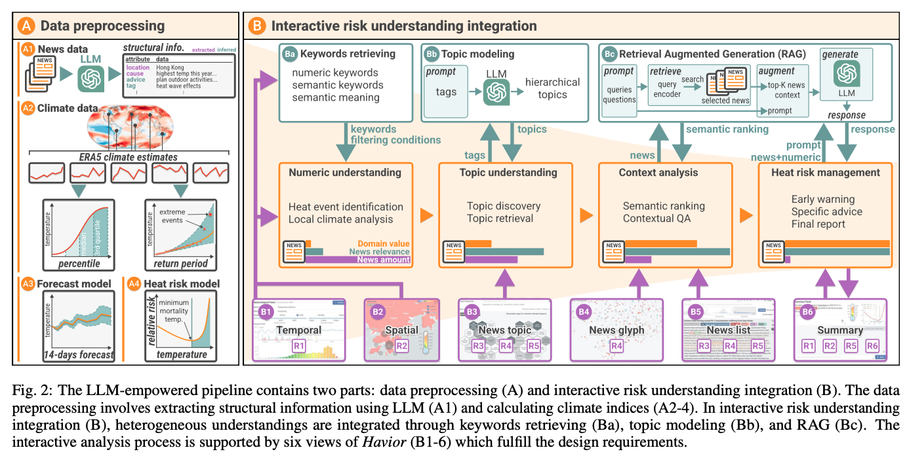



## Follow-Me AI: Energy-Efficient User Interaction with Smart Environments

Saleh, A., Donta, P. K., Morabito, R., Motlagh, N. H., & Lovén, L.
(2024). **Follow-Me AI: Energy-Efficient User Interaction with Smart
Environments** (arXiv:2404.12486). arXiv.
http://arxiv.org/abs/2404.12486

Abstract

This article introduces Follow-Me AI, a concept designed to enhance user
interactions with smart environments, optimize energy use, and provide
better control over data captured by these environments. Through AI
agents that accompany users, Follow-Me AI negotiates data management
based on user consent, aligns environmental controls as well as user
communication and computes resources available in the environment with
user preferences, and predicts user behavior to proactively adjust the
smart environment. The manuscript illustrates this concept with a
detailed example of Follow-Me AI in a smart campus setting, detailing
the interactions with the building’s management system for optimal
comfort and efficiency. Finally, this article looks into the challenges
and opportunities related to Follow-Me AI.

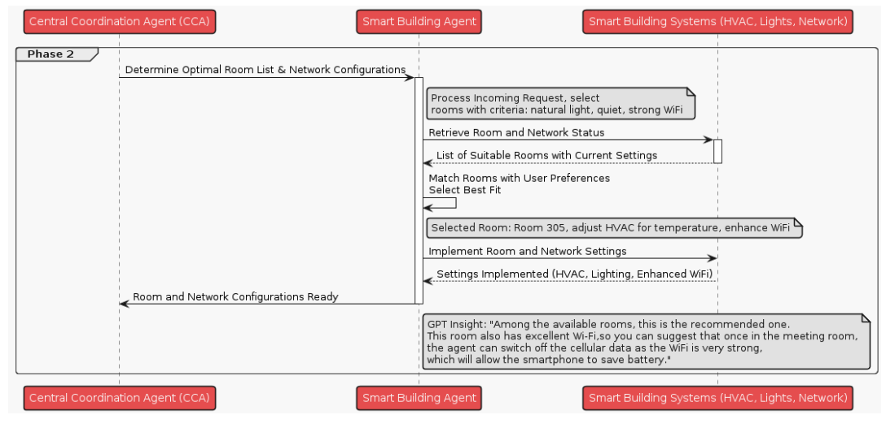

Figure 3: Figure from Saleh et al. (2024)



## An LLM-Based Digital Twin for Optimizing Human-in-the Loop Systems

Yang, H., Siew, M., & Joe-Wong, C. (2024). **An LLM-Based Digital Twin
for Optimizing Human-in-the Loop Systems** (arXiv:2403.16809). arXiv.
http://arxiv.org/abs/2403.16809

Abstract

The increasing prevalence of Cyber-Physical Systems and the Internet of
Things (CPS-IoT) applications and Foundation Models are enabling new
applications that leverage real-time control of the environment. For
example, real-time control of Heating, Ventilation and Air-Conditioning
(HVAC) systems can reduce its usage when not needed for the comfort of
human occupants, hence reducing energy consumption. Collecting realtime
feedback on human preferences in such human-in-the-loop (HITL) systems,
however, is difficult in practice. We propose the use of large language
models (LLMs) to deal with the challenges of dynamic environments and
difficult-to-obtain data in CPS optimization. In this paper, we present
a case study that employs LLM agents to mimic the behaviors and thermal
preferences of various population groups (e.g. young families, the
elderly) in a shopping mall. The aggregated thermal preferences are
integrated into an agent-in-the-loop based reinforcement learning
algorithm AitL-RL, which employs the LLM as a dynamic simulation of the
physical environment to learn how to balance between energy savings and
occupant comfort. Our results show that LLMs are capable of simulating
complex population movements within large open spaces. Besides,
AitL-RLdemonstrates superior performance compared to the popular
existing policy of set point control, suggesting that adaptive and
personalized decision-making is critical for efficient optimization in
CPS-IoT applications. Through this case study, we demonstrate the
potential of integrating advanced Foundation Models like LLMs into
CPS-IoT to enhance system adaptability and efficiency. The project’s
code can be found on our GitHub repository.



## Can Private LLM Agents Synthesize Household Energy Consumption Data?

Almashor, M., & Miyashita, Y. (2024). **Can Private LLM Agents
Synthesize Household Energy Consumption Data?** Proceedings of the 15th
ACM International Conference on Future and Sustainable Energy Systems,
664–668. https://doi.org/10.1145/3632775.3661993

Abstract

Reproducible science requires easy access to data, especially with the
rise of data-driven and increasingly complex models used within energy
research. Too often however, the data to reconstruct and verify
purported solutions in publications is hidden due to some combination of
commercial, legal, and sensitivity issues. This early work presents our
initial efforts to leverage the recent advancements in Large Language
Models (LLMs) to create usable and shareable energy datasets. In
particular, we’re utilising their mimicry of human behaviors, with the
goal of extracting and exploring synthetic energy data through the
simulation of LLM agents capable of interacting with and executing
actions in controlled environments. We also analyse and visualise
publicly available data in an attempt to create realistic but not quite
exact copies of the originals. Our early results show some promise, with
outputs that resemble the twin peak curves for household energy
consumption. The hope is that our generalised approach can be used to
easily replicate usable and realistic copies of otherwise secret or
sensitive data.

Almashor & Miyashita (2024)

## Prompt-Gaming: A Pilot Study on LLM-Evaluating Agent in a Meaningful Energy Game.

Isaza-Giraldo, A., Bala, P., Campos, P. F., & Pereira, L. (2024).
Prompt-Gaming: A Pilot Study on LLM-Evaluating Agent in a Meaningful
Energy Game. Extended Abstracts of the 2024 CHI Conference on Human
Factors in Computing Systems, 1–12.
https://doi.org/10.1145/3613905.3650774

Abstract

Building on previous work on incorporating large language models (LLM)
in gaming, we investigate the possibility of implementing LLM as
evaluating agents of open-ended challenges in serious games and its
potential to facilitate a meaningful experience for the player. We
contribute with a sustainability game prototype in a single natural
language prompt about energy communities and we tested it with 13
participants inside ChatGPT-3.5. Two participants were already aware of
energy communities before the game, and eight of the remaining 11 gained
valuable knowledge about the specific topic. Comparing ChatGPT-3.5
evaluations of players’ interaction with an expert’s assessment,
ChatGPT-3.5 correctly evaluated 81% of player’s answers. Our results are
encouraging and show the potential of using LLMs as mediating agents in
educational games, while also allowing easy prototyping of games through
natural language prompts.



## Evaluation of large language models (LLMs) on the mastery of knowledge and skills in the heating, ventilation and air conditioning (HVAC) industry.

Lu, J., Tian, X., Zhang, C., Zhao, Y., Zhang, J., Zhang, W., Feng, C.,
He, J., Wang, J., & He, F. (2024). **Evaluation of large language models
(LLMs) on the mastery of knowledge and skills in the heating,
ventilation and air conditioning (HVAC) industry.** Energy and Built
Environment. https://doi.org/10.1016/j.enbenv.2024.03.010

Abstract

Large language models (LLMs) have shown human-level capabilities in
solving various complex tasks. However, it is still unknown whether
state-of-the-art LLMs master sufficient knowledge related to heating,
ventilation and air conditioning (HVAC) systems. It will be inspiring if
LLMs can think and learn like professionals in the HVAC industry. Hence,
this study investigates the performance of LLMs on mastering the
knowledge and skills related to the HVAC industry by letting them take
the ASHRAE Certified HVAC Designer examination, an authoritative
examination in the HVAC industry. Three key knowledge capabilities are
explored: recall, analysis and application. Twelve representative LLMs
are tested such as GPT-3.5, GPT-4 and LLaMA. According to the results,
GPT-4 passes the ASHRAE Certified HVAC Designer examination with scores
from 74 to 78, which is higher than about half of human examinees.
Besides, GPT-3.5 passes the examination twice out of five times. It
demonstrates that some LLMs such as GPT-4 and GPT-3.5 have great
potential to assist or replace humans in designing and operating HVAC
systems. However, they still make some mistakes sometimes due to the
lack of knowledge, poor reasoning capabilities and unsatisfactory
equation calculation abilities. Accordingly, four future research
directions are proposed to reveal how to utilize and improve LLMs in the
HVAC industry: teaching LLMs to use design tools or software in the HVAC
industry, enabling LLMs to read and analyze the operational data from
HVAC systems, developing tailored corpuses for the HVAC industry, and
assessing the performance of LLMs in real-world HVAC design and
operation scenarios.



## Domain-specific large language models for fault diagnosis of heating, ventilation, and air conditioning systems by labeled-data-supervised fine-tuning.

Zhang, J., Zhang, C., Lu, J., & Zhao, Y. (2025). **Domain-specific large
language models for fault diagnosis of heating, ventilation, and air
conditioning systems by labeled-data-supervised fine-tuning.** Applied
Energy, 377, 124378. https://doi.org/10.1016/j.apenergy.2024.124378

Abstract

Large language models (LLMs) have exhibited great potential in fault
diagnosis of heating, ventilation, and air conditioning systems.
However, the fault diagnosis accuracy of LLMs is still unsatisfactory,
due to the lack of effective diagnosis accuracy enhancement methods for
LLMs. To fill this gap, this study proposes a LLM fine-tuning method
supervised by data with fault and fault-free labels to enhance the fault
diagnosis accuracy of LLMs. This method designs a LLM self-correction
strategy to automatically generate a fine-tuning dataset based on the
labeled data. The generated fine-tuning dataset is applied to fine-tune
a LLM. Moreover, a data augmentation-based approach is put forward to
adaptively update the fine-tuning dataset for iteratively developing a
high-performance fine-tuned LLM. The proposed method is utilized to
fine-tune the GPT-3.5 model using the air handling unit (AHU) fault
dataset from the RP-1312 project. The results show that the diagnosis
accuracy of the GPT-3.5 model is increased from 29.5 % to 100.0 % after
model fine-tuning. Compared with the GPT-4 model, the fine-tuned GPT-3.5
model achieves a 31.1 % higher average diagnosis accuracy. The
fine-tuned GPT-3.5 model is also applied to diagnose faults in two AHUs
from another open-source dataset to verify the generalization ability of
this model. The two AHUs have different system structures and sensor
configurations compared to the AHU in the RP-1312 dataset, and this
dataset is not utilized to fine-tune the GPT-3.5 model. The average
diagnosis accuracy of the GPT-3.5 model is increased from 46.0 % to 99.1
% and from 38.8 % to 98.9 % for the faults in the two AHUs,
respectively, after model fine-tuning. Furthermore, the proposed method
is verified using two fault datasets from a variable air volume box and
a chiller plant system. After fine-tuning the GPT-3.5 model using the
two datasets, the average diagnosis accuracy of this model is increased
from 33.0 % to 98.3 % for variable air volume box faults and from 36.0 %
to 99.1 % for chiller plant system faults. This study provides an
effective solution to the development of domain-specific LLMs for this
domain.

Zhang et al. (2025)



## Game of LLMs: Discovering Structural Constructs in Activities using Large Language Models.

Hiremath, S. K., & Plötz, T. (2024). **Game of LLMs: Discovering
Structural Constructs in Activities using Large Language Models.**
Companion of the 2024 on ACM International Joint Conference on Pervasive
and Ubiquitous Computing, 487–492.
https://doi.org/10.1145/3675094.3678444

Abstract

Human Activity Recognition is a time-series analysis problem. A popular
analysis procedure used by the community assumes an optimal window
length to design recognition pipelines. However, in the scenario of
smart homes, where activities are of varying duration and frequency, the
assumption of a constant sized window does not hold. Additionally,
previous works have shown these activities to be made up of building
blocks. We focus on identifying these underlying building
blocks–structural constructs, with the use of large language models.
Identifying these constructs can be beneficial especially in recognizing
short-duration and infrequent activities, which current systems cannot
recognize. We also propose the development of an activity recognition
procedure that uses these building blocks to model activities, thus
helping the downstream task of activity monitoring in smart homes.



## LLM-Based Open-Domain Integrated Task and Knowledge Assistants with Programmable Policies

Joshi, H., Liu, S., Chen, J., Weigle, R., & Lam, M. S. (2024).
**LLM-Based Open-Domain Integrated Task and Knowledge Assistants with
Programmable Policies** (arXiv:2407.05674). arXiv.
http://arxiv.org/abs/2407.05674

Abstract

Programming LLM-based knowledge and task assistants that faithfully
conform to developer-provided policies is challenging. These agents must
retrieve and provide consistent, accurate, and relevant information to
address user’s queries and needs. Yet such agents generate unfounded
responses (“hallucinate”). Traditional dialogue trees can only handle a
limited number of conversation flows, making them inherently brittle. To
this end, we present KITA - a programmable framework for creating
task-oriented conversational agents that are designed to handle complex
user interactions. Unlike LLMs, KITA provides reliable grounded
responses, with controllable agent policies through its expressive
specification, KITA Worksheet. In contrast to dialog trees, it is
resilient to diverse user queries, helpful with knowledge sources, and
offers ease of programming policies through its declarative paradigm.
Through a real-user study involving 62 participants, we show that KITA
beats the GPT-4 with function calling baseline by 26.1, 22.5, and 52.4
points on execution accuracy, dialogue act accuracy, and goal completion
rate, respectively. We also release 22 real-user conversations with KITA
manually corrected to ensure accuracy.

Joshi et al. (2024)



## Large Language Models are Zero-Shot Recognizers for Activities of Daily Living

Civitarese, G., Fiori, M., Choudhary, P., & Bettini, C. (2024). **Large
Language Models are Zero-Shot Recognizers for Activities of Daily
Living** (arXiv:2407.01238). arXiv. http://arxiv.org/abs/2407.01238

Abstract

The sensor-based recognition of Activities of Daily Living (ADLs) in
smart home environments enables several applications in the areas of
energy management, safety, well-being, and healthcare. ADLs recognition
is typically based on deep learning methods requiring large datasets to
be trained. Recently, several studies proved that Large Language Models
(LLMs) effectively capture common-sense knowledge about human
activities. However, the effectiveness of LLMs for ADLs recognition in
smart home environments still deserves to be investigated. In this work,
we propose ADL-LLM, a novel LLM-based ADLs recognition system. ADLLLM
transforms raw sensor data into textual representations, that are
processed by an LLM to perform zero-shot ADLs recognition. Moreover, in
the scenario where a small labeled dataset is available, ADL-LLM can
also be empowered with few-shot prompting. We evaluated ADL-LLM on two
public datasets, showing its effectiveness in this domain.

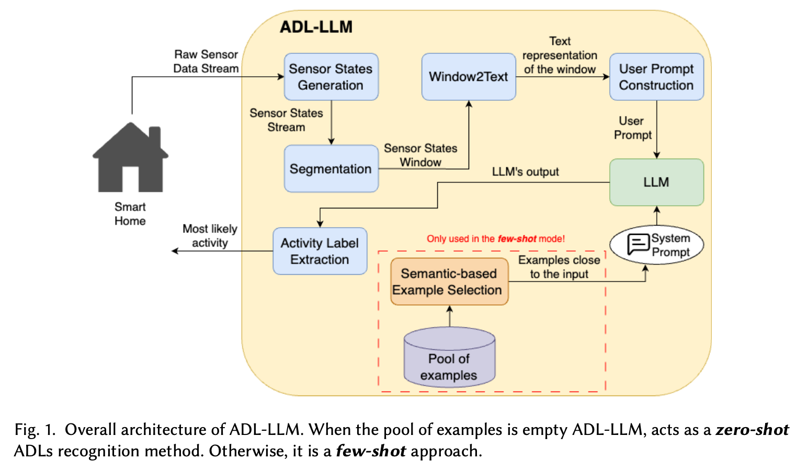

Figure 4: Figures from Civitarese et al. (2024)



## Large Language Models for Power Scheduling: A User-Centric Approach

Mongaillard, T., Lasaulce, S., Hicheur, O., Zhang, C., Bariah, L.,
Varma, V. S., Zou, H., Zhao, Q., & Debbah, M. (2024). **Large Language
Models for Power Scheduling: A User-Centric Approach**
(arXiv:2407.00476). arXiv. http://arxiv.org/abs/2407.00476

Abstract

While traditional optimization and scheduling schemes are designed to
meet fixed, predefined system requirements, future systems are moving
toward user-driven approaches and personalized services, aiming to
achieve high quality-of-experience (QoE) and flexibility. This challenge
is particularly pronounced in wireless and digitalized energy networks,
where users’ requirements have largely not been taken into consideration
due to the lack of a common language between users and machines. The
emergence of powerful large language models (LLMs) marks a radical
departure from traditional system-centric methods into more advanced
user-centric approaches by providing a natural communication interface
between users and devices. In this paper, for the first time, we
introduce a novel architecture for resource scheduling problems by
constructing three LLM agents to convert an arbitrary user’s voice
request (VRQ) into a resource allocation vector. Specifically, we design
an LLM intent recognition agent to translate the request into an
optimization problem (OP), an LLM OP parameter identification agent, and
an LLM OP solving agent. To evaluate system performance, we construct a
database of typical VRQs in the context of electric vehicle (EV)
charging. As a proof of concept, we primarily use Llama 3 8B. Through
testing with different prompt engineering scenarios, the obtained
results demonstrate the efficiency of the proposed architecture. The
conducted performance analysis allows key insights to be extracted. For
instance, having a larger set of candidate OPs to model the real-world
problem might degrade the final performance because of a higher
recognition/OP classification noise level. All results and codes are
open source.

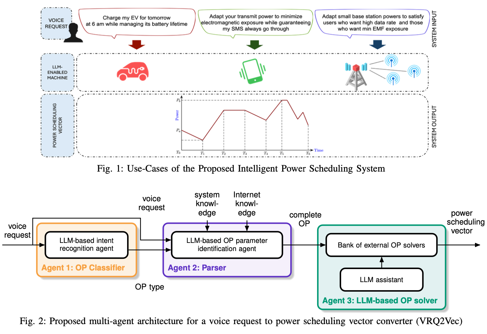

Figure 5: Figures from Mongaillard et al. (2024)



## A Recommendation System for Prosumers Based on Large Language Models.

Oprea, S.-V., & Bâra, A. (2024). **A Recommendation System for Prosumers
Based on Large Language Models.** Sensors, 24(11), Article 11.
https://doi.org/10.3390/s24113530

Abstract

As modern technologies, particularly home assistant devices and sensors,
become more integrated into our daily lives, they are also making their
way into the domain of energy management within our homes. Homeowners,
now acting as prosumers, have access to detailed information at 15-min
or even 5-min intervals, including weather forecasts, outputs from
renewable energy source (RES)-based systems, appliance schedules and the
current energy balance, which details any deficits or surpluses along
with their quantities and the predicted prices on the local energy
market (LEM). The goal for these prosumers is to reduce costs while
ensuring their home’s comfort levels are maintained. However, given the
complexity and the rapid decision-making required in managing this
information, the need for a supportive system is evident. This is
particularly true given the routine nature of these decisions,
highlighting the potential for a system that provides personalized
recommendations to optimize energy consumption, whether that involves
adjusting the load or engaging in transactions with the LEM. In this
context, we propose a recommendation system powered by large language
models (LLMs), Scikit-llm and zero-shot classifiers, designed to
evaluate specific scenarios and offer tailored advice for prosumers
based on the available data at any given moment. Two scenarios for a
prosumer of 5.9 kW are assessed using candidate labels, such as
Decrease, Increase, Sell and Buy. A comparison with a content-based
filtering system is provided considering the performance metrics that
are relevant for prosumers.

Oprea & Bâra (2024)



## A conversational agent for creating automations exploiting large language models. Personal and Ubiquitous Computing.

Gallo, S., Paternò, F., & Malizia, A. (2024). **A conversational agent
for creating automations exploiting large language models. Personal and
Ubiquitous Computing.** https://doi.org/10.1007/s00779-024-01825-5

Abstract

The proliferation of sensors and smart Internet of Things (IoT) devices
in our everyday environments is reshaping our interactions with everyday
objects. This change underlines the need to empower non-expert users to
easily configure the behaviour of these devices to align with their
preferences and habits. At the same time, recent advances in generative
transformers, such as ChatGPT, have opened up new possibilities in a
variety of natural language processing tasks, enhancing reasoning
capabilities and conversational interactions. This paper presents
RuleBot +  + , a conversational agent that exploits GPT-4 to assist the
user in the creation and modification of trigger-action automations
through natural language. After an introduction to motivations and
related work, we present the design and implementation of
RuleBot +  + and report the results of the user test in which users
interacted with our solution and Home Assistant, one of the most used
open-source tools for managing smart environments.

Figure 6: Figures from Gallo et al. (2024)



## A Human-on-the-Loop Optimization Autoformalism Approach for Sustainability

Jin, M., Sel, B., Hardeep, F., & Yin, W. (2023). **A Human-on-the-Loop
Optimization Autoformalism Approach for Sustainability**
(arXiv:2308.10380). arXiv. http://arxiv.org/abs/2308.10380

Abstract

This paper outlines a natural conversational approach to solving
personalized energy-related problems using large language models (LLMs).
We focus on customizable optimization problems that necessitate repeated
solving with slight variations in modeling and are user-specific, hence
posing a challenge to devising a one-size-fits-all model. We put forward
a strategy that augments an LLM with an optimization solver, enhancing
its proficiency in understanding and responding to user specifications
and preferences while providing nonlinear reasoning capabilities. Our
approach pioneers the novel concept of human-guided optimization
autoformalism, translating a natural language task specification
automatically into an optimization instance. This enables LLMs to
analyze, explain, and tackle a variety of instance-specific
energy-related problems, pushing beyond the limits of current
prompt-based techniques. Our research encompasses various commonplace
tasks in the energy sector, from electric vehicle charging and Heating,
Ventilation, and Air Conditioning (HVAC) control to long-term planning
problems such as cost-benefit evaluations for installing rooftop solar
photovoltaics (PVs) or heat pumps. This pilot study marks an essential
stride towards the context-based formulation of optimization using LLMs,
with the potential to democratize optimization processes. As a result,
stakeholders are empowered to optimize their energy consumption,
promoting sustainable energy practices customized to personal needs and
preferences.

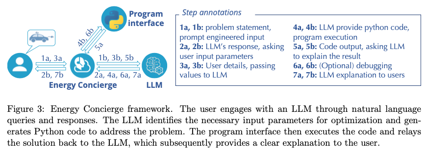

# References

Abdelnabi, S., Gomaa, A., Sivaprasad, S., Schönherr, L., & Fritz, M.
(2023). *LLM-Deliberation: Evaluating LLMs with Interactive Multi-Agent
Negotiation Games.* <https://doi.org/10.60882/cispa.25233028.v1>

Almashor, M., & Miyashita, Y. (2024). Can Private LLM Agents Synthesize
Household Energy Consumption Data? *Proceedings of the 15th ACM
International Conference on Future and Sustainable Energy Systems*,
664–668. <https://doi.org/10.1145/3632775.3661993>

Banerjee, D., Teso, S., Sayin, B., & Passerini, A. (2024). *Learning To
Guide Human Decision Makers With Vision-Language Models*
(arXiv:2403.16501). arXiv. <https://arxiv.org/abs/2403.16501>

Bhatia, S. (2024). Exploring variability in risk taking with large
language models. *Journal of Experimental Psychology: General*,
*153*(7), 1838–1860. <https://doi.org/10.1037/xge0001607>

Bienefeld, N., Kolbe, M., Camen, G., Huser, D., & Buehler, P. K. (2023).
Human-AI teaming: Leveraging transactive memory and speaking up for
enhanced team effectiveness. *Frontiers in Psychology*, *14*.
<https://doi.org/10.3389/fpsyg.2023.1208019>

Binz, M., & Schulz, E. (2023). Using cognitive psychology to understand
GPT-3. *Proceedings of the National Academy of Sciences*, *120*(6),
e2218523120. <https://doi.org/10.1073/pnas.2218523120>

Buçinca, Z., Malaya, M. B., & Gajos, K. Z. (2021). To Trust or to Think:
Cognitive Forcing Functions Can Reduce Overreliance on AI in
AI-assisted Decision-making. *Proceedings of
the ACM on Human-Computer Interaction*, *5*(CSCW1), 1–21.
<https://doi.org/10.1145/3449287>

Burton, J. W., Lopez-Lopez, E., Hechtlinger, S., Rahwan, Z., Aeschbach,
S., Bakker, M. A., Becker, J. A., Berditchevskaia, A., Berger, J.,
Brinkmann, L., Flek, L., Herzog, S. M., Huang, S., Kapoor, S.,
Narayanan, A., Nussberger, A.-M., Yasseri, T., Nickl, P., Almaatouq, A.,
… Hertwig, R. (2024). How large language models can reshape collective
intelligence. *Nature Human Behaviour*, 1–13.
<https://doi.org/10.1038/s41562-024-01959-9>

Calò, T., & De Russis, L. (2024). Enhancing smart home interaction
through multimodal command disambiguation. *Personal and Ubiquitous
Computing*. <https://doi.org/10.1007/s00779-024-01827-3>

Chen, Y., Liu, T. X., Shan, Y., & Zhong, S. (2023). The emergence of
economic rationality of GPT. *Proceedings of the National Academy of
Sciences*, *120*(51), e2316205120.
<https://doi.org/10.1073/pnas.2316205120>

Cheung, V., Maier, M., & Lieder, F. (2024). *Large Language Models
Amplify Human Biases in Moral Decision-Making*.
<https://doi.org/10.31234/osf.io/aj46b>

Chiang, C.-W., Lu, Z., Li, Z., & Yin, M. (2024). Enhancing AI-Assisted
Group Decision Making through LLM-Powered Devil’s Advocate. *Proceedings
of the 29th International Conference on Intelligent User Interfaces*,
103–119. <https://doi.org/10.1145/3640543.3645199>

Choi, A. S., Akter, S. S., Singh, J. P., & Anastasopoulos, A. (2024).
*The LLM Effect: Are Humans Truly Using LLMs, or Are They Being
Influenced By Them Instead?* (arXiv:2410.04699). arXiv.
<https://arxiv.org/abs/2410.04699>

Chuang, Y.-S., Harlalka, N., Suresh, S., Goyal, A., Hawkins, R., Yang,
S., Shah, D., Hu, J., & Rogers, T. T. (2024). *The Wisdom of Partisan
Crowds: Comparing Collective Intelligence in Humans and
LLM-based Agents*.

Chuang, Y.-S., Suresh, S., Harlalka, N., Goyal, A., Hawkins, R., Yang,
S., Shah, D., Hu, J., & Rogers, T. T. (2023). *Evaluating LLM Agent
Group Dynamics against Human Group Dynamics: A Case Study on Wisdom of
Partisan Crowds* (arXiv:2311.09665). arXiv.
<https://arxiv.org/abs/2311.09665>

Civitarese, G., Fiori, M., Choudhary, P., & Bettini, C. (2024). *Large
Language Models are Zero-Shot Recognizers for Activities of Daily
Living* (arXiv:2407.01238). arXiv. <https://arxiv.org/abs/2407.01238>

Collins, K. M., Jiang, A. Q., Frieder, S., Wong, L., Zilka, M., Bhatt,
U., Lukasiewicz, T., Wu, Y., Tenenbaum, J. B., Hart, W., Gowers, T., Li,
W., Weller, A., & Jamnik, M. (2023). *Evaluating Language Models for
Mathematics through Interactions* (arXiv:2306.01694). arXiv.
<https://arxiv.org/abs/2306.01694>

Collins, K. M., Sucholutsky, I., Bhatt, U., Chandra, K., Wong, L., Lee,
M., Zhang, C. E., Zhi-Xuan, T., Ho, M., Mansinghka, V., Weller, A.,
Tenenbaum, J. B., & Griffiths, T. L. (2024). Building machines that
learn and think with people. *Nature Human Behaviour*, *8*(10),
1851–1863. <https://doi.org/10.1038/s41562-024-01991-9>

Du, Y., Rajivan, P., & Gonzalez, C. C. (2024). *Large Language Models
for Collective Problem-Solving: Insights into Group Consensus
Decision-Making*.

Eigner, E., & Händler, T. (2024). *Determinants of
LLM-assisted Decision-Making*
(arXiv:2402.17385). arXiv. <https://arxiv.org/abs/2402.17385>

Gallo, S., Paternò, F., & Malizia, A. (2024). A conversational agent for
creating automations exploiting large language models. *Personal and
Ubiquitous Computing*. <https://doi.org/10.1007/s00779-024-01825-5>

Gao, C., Lan, X., Li, N., Yuan, Y., Ding, J., Zhou, Z., Xu, F., & Li, Y.
(2024). Large language models empowered agent-based modeling and
simulation: A survey and perspectives. *Humanities and Social Sciences
Communications*, *11*(1), 1–24.
<https://doi.org/10.1057/s41599-024-03611-3>

Gao, J., Gebreegziabher, S. A., Choo, K. T. W., Li, T. J.-J., Perrault,
S. T., & Malone, T. W. (2024). A Taxonomy for Human-LLM Interaction
Modes: An Initial Exploration. *Extended Abstracts of the CHI Conference
on Human Factors in Computing Systems*, 1–11.
<https://doi.org/10.1145/3613905.3650786>

Gao, Y., Lee, D., Burtch, G., & Fazelpour, S. (2024). *Take Caution in
Using LLMs as Human Surrogates: Scylla Ex Machina* (arXiv:2410.19599).
arXiv. <https://arxiv.org/abs/2410.19599>

Giudici, M., Padalino, L., Paolino, G., Paratici, I., Pascu, A. I., &
Garzotto, F. (2024). Designing Home Automation Routines Using an
LLM-Based Chatbot. *Designs*, *8*(3), 43.
<https://doi.org/10.3390/designs8030043>

Goli, A., & Singh, A. (2024). Can Large Language Models Capture Human
Preferences? *Marketing Science*.
<https://doi.org/10.1287/mksc.2023.0306>

Guo, X., Huang, K., Liu, J., Fan, W., Vélez, N., Wu, Q., Wang, H.,
Griffiths, T. L., & Wang, M. (2024). *Embodied LLM Agents Learn to
Cooperate in Organized Teams* (arXiv:2403.12482). arXiv.
<https://arxiv.org/abs/2403.12482>

Hagendorff, T., Fabi, S., & Kosinski, M. (2023). Human-like intuitive
behavior and reasoning biases emerged in large language models but
disappeared in ChatGPT. *Nature Computational Science*, *3*(10),
833–838. <https://doi.org/10.1038/s43588-023-00527-x>

Hao, X., Demir, E., & Eyers, D. (2024). Exploring collaborative
decision-making: A quasi-experimental study of human and Generative AI
interaction. *Technology in Society*, *78*, 102662.
<https://doi.org/10.1016/j.techsoc.2024.102662>

Hiremath, S. K., & Plötz, T. (2024). Game of LLMs: Discovering
Structural Constructs in Activities using Large Language Models.
*Companion of the 2024 on ACM International Joint Conference on
Pervasive and Ubiquitous Computing*, 487–492.
<https://doi.org/10.1145/3675094.3678444>

Isaza-Giraldo, A., Bala, P., Campos, P. F., & Pereira, L. (2024).
Prompt-Gaming: A Pilot Study on LLM-Evaluating Agent in a Meaningful
Energy Game. *Extended Abstracts of the 2024 CHI Conference on Human
Factors in Computing Systems*, 1–12.
<https://doi.org/10.1145/3613905.3650774>

Jin, M., Sel, B., Hardeep, F., & Yin, W. (2023). *A
Human-on-the-Loop Optimization Autoformalism
Approach for Sustainability* (arXiv:2308.10380). arXiv.
<https://arxiv.org/abs/2308.10380>

Joshi, H., Liu, S., Chen, J., Weigle, R., & Lam, M. S. (2024).
*LLM-Based Open-Domain Integrated Task and Knowledge Assistants with
Programmable Policies* (arXiv:2407.05674). arXiv.
<https://arxiv.org/abs/2407.05674>

Kämmer, J. E., Hautz, W. E., Krummrey, G., Sauter, T. C., Penders, D.,
Birrenbach, T., & Bienefeld, N. (2024). Effects of interacting with a
large language model compared with a human coach on the clinical
diagnostic process and outcomes among fourth-year medical students:
Study protocol for a prospective, randomised experiment using patient
vignettes. *BMJ Open*, *14*(7), e087469.
<https://doi.org/10.1136/bmjopen-2024-087469>

King, E., Yu, H., Lee, S., & Julien, C. (2024). Sasha: Creative
Goal-Oriented Reasoning in Smart Homes with Large Language Models.
*Proceedings of the ACM on Interactive, Mobile, Wearable and Ubiquitous
Technologies*, *8*(1), 1–38. <https://doi.org/10.1145/3643505>

King, E., Yu, H., Vartak, S., Jacob, J., Lee, S., & Julien, C. (2024).
*Thoughtful Things: Building Human-Centric Smart Devices with Small
Language Models* (arXiv:2405.03821). arXiv.
<https://arxiv.org/abs/2405.03821>

Koehl, D., & Vangsness, L. (2023). Measuring Latent Trust Patterns in
Large Language Models in the Context of Human-AI Teaming. *Proceedings
of the Human Factors and Ergonomics Society Annual Meeting*, *67*.
<https://doi.org/10.1177/21695067231192869>

Kumar, H., Vincentius, J., Jordan, E., & Anderson, A. (2024). *Human
Creativity in the Age of LLMs: Randomized Experiments on Divergent and
Convergent Thinking* (arXiv:2410.03703). arXiv.
<https://arxiv.org/abs/2410.03703>

Laban, G., Laban, T., & Gunes, H. (2024). *LEXI: Large Language Models
Experimentation Interface* (arXiv:2407.01488). arXiv.
<https://arxiv.org/abs/2407.01488>

Lai, V., Chen, C., Smith-Renner, A., Liao, Q. V., & Tan, C. (2023).
Towards a Science of Human-AI Decision Making: An Overview of Design
Space in Empirical Human-Subject Studies. *2023 ACM Conference on
Fairness, Accountability, and Transparency*, 1369–1385.
<https://doi.org/10.1145/3593013.3594087>

Lampinen, A. K., Dasgupta, I., Chan, S. C. Y., Sheahan, H. R., Creswell,
A., Kumaran, D., McClelland, J. L., & Hill, F. (2024). Language models,
like humans, show content effects on reasoning tasks. *PNAS Nexus*,
*3*(7), pgae233. <https://doi.org/10.1093/pnasnexus/pgae233>

Li, H., Kam-Kwai, W., Luo, Y., Chen, J., Liu, C., Zhang, Y., Lau, A. K.
H., Qu, H., & Liu, D. (2024). *Save It for the "Hot" Day: An
LLM-Empowered Visual Analytics System for Heat Risk Management*
(arXiv:2406.03317). arXiv. <https://arxiv.org/abs/2406.03317>

Lu, J., Tian, X., Zhang, C., Zhao, Y., Zhang, J., Zhang, W., Feng, C.,
He, J., Wang, J., & He, F. (2024). Evaluation of large language models
(LLMs) on the mastery of knowledge and skills in the heating,
ventilation and air conditioning (HVAC) industry. *Energy and Built
Environment*. <https://doi.org/10.1016/j.enbenv.2024.03.010>

Ma, S., Chen, Q., Wang, X., Zheng, C., Peng, Z., Yin, M., & Ma, X.
(2024). *Towards Human-AI Deliberation: Design and Evaluation of
LLM-Empowered Deliberative AI for AI-Assisted Decision-Making*
(arXiv:2403.16812). arXiv. <https://arxiv.org/abs/2403.16812>

Macmillan-Scott, O., & Musolesi, M. (2024). (Ir)rationality and
cognitive biases in large language models. *Royal Society Open Science*,
*11*(6), 240255. <https://doi.org/10.1098/rsos.240255>

Marjieh, R., Gokhale, A., Bullo, F., & Griffiths, T. L. (2024). *Task
Allocation in Teams as a Multi-Armed Bandit*.

Matz, S. C., Teeny, J. D., Vaid, S. S., Peters, H., Harari, G. M., &
Cerf, M. (2024). The potential of generative AI for personalized
persuasion at scale. *Scientific Reports*, *14*(1), 4692.
<https://doi.org/10.1038/s41598-024-53755-0>

Mei, Q., Xie, Y., Yuan, W., & Jackson, M. O. (2024). A Turing test of
whether AI chatbots are behaviorally similar to humans. *Proceedings of
the National Academy of Sciences*, *121*(9), e2313925121.
<https://doi.org/10.1073/pnas.2313925121>

Mongaillard, T., Lasaulce, S., Hicheur, O., Zhang, C., Bariah, L.,
Varma, V. S., Zou, H., Zhao, Q., & Debbah, M. (2024). *Large Language
Models for Power Scheduling: A User-Centric Approach*
(arXiv:2407.00476). arXiv. <https://arxiv.org/abs/2407.00476>

Narayanan, S., Yu, G., Ho, C.-J., & Yin, M. (2023). How does Value
Similarity affect Human Reliance in AI-Assisted Ethical Decision Making?
*Proceedings of the 2023 AAAI/ACM Conference on AI, Ethics, and
Society*, 49–57. <https://doi.org/10.1145/3600211.3604709>

Nguyen, J. (2024). Human Bias in AI Models? Anchoring Effects and
Mitigation Strategies in Large Language Models. *Journal of Behavioral
and Experimental Finance*, 100971.
<https://doi.org/10.1016/j.jbef.2024.100971>

Nishida, Y., Shimojo, S., & Hayashi, Y. (2024). Conversational Agent
Dynamics with Minority Opinion and Cognitive Conflict in Small-Group
Decision-Making. *Japanese Psychological Research*.
<https://doi.org/10.1111/jpr.12552>

Nisioti, E., Risi, S., Momennejad, I., Oudeyer, P.-Y., & Moulin-Frier,
C. (2024, July). Collective Innovation in Groups of Large Language
Models. *ALIFE 2024: Proceedings of the 2024 Artificial Life
Conference*. <https://doi.org/10.1162/isal_a_00730>

Nobandegani, A. S., Rish, I., & Shultz, T. R. (2023). Decision-Making
Paradoxes in Humans vs Machines: The case of the Allais and Ellsberg
Paradoxes. *Proceedings of the Annual Meeting of the Cognitive Science
Society*, *46*.

Oprea, S.-V., & Bâra, A. (2024). A Recommendation System for Prosumers
Based on Large Language Models. *Sensors*, *24*(11), 3530.
<https://doi.org/10.3390/s24113530>

Rastogi, C., Leqi, L., Holstein, K., & Heidari, H. (2023). A Taxonomy of
Human and ML Strengths in Decision-Making to Investigate Human-ML
Complementarity. *Proceedings of the AAAI Conference on Human
Computation and Crowdsourcing*, *11*, 127–139.
<https://doi.org/10.1609/hcomp.v11i1.27554>

Rastogi, C., Zhang, Y., Wei, D., Varshney, K. R., Dhurandhar, A., &
Tomsett, R. (2022). Deciding Fast and Slow: The Role of Cognitive Biases
in AI-assisted Decision-making. *Proceedings
of the ACM on Human-Computer Interaction*, *6*(CSCW1), 1–22.
<https://doi.org/10.1145/3512930>

Roberts, J., Moore, K., Pham, T., Ewaleifoh, O., & Fisher, D. (2024).
*Large Language Model Recall Uncertainty is Modulated by the Fan
Effect*.

Saleh, A., Donta, P. K., Morabito, R., Motlagh, N. H., & Lovén, L.
(2024). *Follow-Me AI: Energy-Efficient User Interaction with Smart
Environments* (arXiv:2404.12486). arXiv.
<https://arxiv.org/abs/2404.12486>

Sidji, M., Smith, W., & Rogerson, M. J. (2024). Human-AI Collaboration
in Cooperative Games: A Study of Playing Codenames with an LLM
Assistant. *Proc. ACM Hum.-Comput. Interact.*, *8*(CHI PLAY),
316:1–316:25. <https://doi.org/10.1145/3677081>

Stadler, M., Bannert, M., & Sailer, M. (2024). Cognitive ease at a cost:
LLMs reduce mental effort but compromise depth in student scientific
inquiry. *Computers in Human Behavior*, *160*, 108386.
<https://doi.org/10.1016/j.chb.2024.108386>

Subramonyam, H., Pea, R., Pondoc, C. L., Agrawala, M., & Seifert, C.
(2024). *Bridging the Gulf of Envisioning: Cognitive Design Challenges
in LLM Interfaces* (arXiv:2309.14459). arXiv.
<https://arxiv.org/abs/2309.14459>

Suri, G., Slater, L. R., Ziaee, A., & Nguyen, M. (2024). Do large
language models show decision heuristics similar to humans? A case study
using GPT-35. *Journal of Experimental Psychology: General*, *153*(4),
1066–1075. <https://doi.org/10.1037/xge0001547>

Swaroop, S., Buçinca, Z., Gajos, K. Z., & Doshi-Velez, F. (2024).
Accuracy-Time Tradeoffs in AI-Assisted Decision Making under Time
Pressure. *Proceedings of the 29th International Conference on
Intelligent User Interfaces*, 138–154.
<https://doi.org/10.1145/3640543.3645206>

Tessler, M. H., Bakker, M. A., Jarrett, D., Sheahan, H., Chadwick, M.
J., Koster, R., Evans, G., Campbell-Gillingham, L., Collins, T., Parkes,
D. C., Botvinick, M., & Summerfield, C. (2024). AI can help humans find
common ground in democratic deliberation. *Science*, *386*(6719),
eadq2852. <https://doi.org/10.1126/science.adq2852>

Tjuatja, L., Chen, V., Wu, T., Talwalkwar, A., & Neubig, G. (2024). Do
LLMs Exhibit Human-like Response Biases? A
Case Study in Survey Design. *Transactions of the Association for
Computational Linguistics*, *12*, 1011–1026.
<https://doi.org/10.1162/tacl_a_00685>

Vats, V., Nizam, M. B., Liu, M., Wang, Z., Ho, R., Prasad, M. S.,
Titterton, V., Malreddy, S. V., Aggarwal, R., Xu, Y., Ding, L., Mehta,
J., Grinnell, N., Liu, L., Zhong, S., Gandamani, D. N., Tang, X.,
Ghosalkar, R., Shen, C., … Davis, J. (2024). *A Survey on Human-AI
Teaming with Large Pre-Trained Models* (arXiv:2403.04931). arXiv.
<https://arxiv.org/abs/2403.04931>

Wang, B., Liu, J., Karimnazarov, J., & Thompson, N. (2024). Task
Supportive and Personalized Human-Large Language Model Interaction: A
User Study. *Proceedings of the 2024 ACM SIGIR Conference on Human
Information Interaction and Retrieval*, 370–375.
<https://doi.org/10.1145/3627508.3638344>

Wang, D., Zheng, K., Li, C., & Guo, J. (2024). Transitioning to
Human-Centered AI: A Systematic Review of Theories, Scenarios, and
Hypotheses in Human-AI Interactions. *Proceedings of the Association for
Information Science and Technology*, *61*(1), 673–678.
<https://doi.org/10.1002/pra2.1078>

Westphal, M., Vössing, M., Satzger, G., Yom-Tov, G. B., & Rafaeli, A.
(2023). Decision control and explanations in human-AI collaboration:
Improving user perceptions and compliance. *Computers in Human
Behavior*, *144*, 107714. <https://doi.org/10.1016/j.chb.2023.107714>

Yang, H., Siew, M., & Joe-Wong, C. (2024). *An LLM-Based Digital Twin
for Optimizing Human-in-the Loop Systems*
(arXiv:2403.16809). arXiv. <https://arxiv.org/abs/2403.16809>

Yang, J. C., Dailisan, D., Korecki, M., Hausladen, C. I., & Helbing, D.
(2024). *LLM Voting: Human Choices and AI Collective Decision Making*
(arXiv:2402.01766). arXiv. <https://arxiv.org/abs/2402.01766>

Yang, Z., Xu, X., Yao, B., Rogers, E., Zhang, S., Intille, S., Shara,
N., Gao, G. G., & Wang, D. (2024). Talk2Care: An
LLM-based Voice Assistant for Communication between Healthcare
Providers and Older Adults. *Proceedings of the ACM on Interactive,
Mobile, Wearable and Ubiquitous Technologies*, *8*(2), 1–35.
<https://doi.org/10.1145/3659625>

Yax, N., Anlló, H., & Palminteri, S. (2024). Studying and improving
reasoning in humans and machines. *Communications Psychology*, *2*(1),
1–16. <https://doi.org/10.1038/s44271-024-00091-8>

Zhang, J., Xu, X., Zhang, N., Liu, R., Hooi, B., & Deng, S. (2024).
*Exploring Collaboration Mechanisms for LLM Agents: A Social Psychology
View* (arXiv:2310.02124). arXiv. <https://arxiv.org/abs/2310.02124>

Zhang, J., Zhang, C., Lu, J., & Zhao, Y. (2025). Domain-specific large
language models for fault diagnosis of heating, ventilation, and air
conditioning systems by labeled-data-supervised fine-tuning. *Applied
Energy*, *377*, 124378. <https://doi.org/10.1016/j.apenergy.2024.124378>

Zhang, S., Wang, X., Zhang, W., Chen, Y., Gao, L., Wang, D., Zhang, W.,
Wang, X., & Wen, Y. (2024). *Mutual Theory of Mind in Human-AI
Collaboration: An Empirical Study with LLM-driven
AI Agents in a Real-time Shared Workspace
Task* (arXiv:2409.08811). arXiv.
<https://arxiv.org/abs/2409.08811>

Zhao, Y., Huang, Z., Seligman, M., & Peng, K. (2024). Risk and prosocial
behavioural cues elicit human-like response patterns from AI chatbots.
*Scientific Reports*, *14*(1), 7095.
<https://doi.org/10.1038/s41598-024-55949-y>

## To Trust or to Think: Cognitive Forcing Functions Can Reduce Overreliance on AI in AI-assisted Decision-making

Buçinca, Z., Malaya, M. B., & Gajos, K. Z. (2021). **To Trust or to
Think: Cognitive Forcing Functions Can Reduce Overreliance on AI in
AI-assisted Decision-making.** Proceedings of the ACM on Human-Computer
Interaction, 5(CSCW1), 1–21. https://doi.org/10.1145/3449287

Abstract

People supported by AI-powered decision support tools frequently
overrely on the AI: they accept an AI’s suggestion even when that
suggestion is wrong. Adding explanations to the AI decisions does not
appear to reduce the overreliance and some studies suggest that it might
even increase it. Informed by the dual-process theory of cognition, we
posit that people rarely engage analytically with each individual AI
recommendation and explanation, and instead develop general heuristics
about whether and when to follow the AI suggestions. Building on prior
research on medical decision-making, we designed three cognitive forcing
interventions to compel people to engage more thoughtfully with the
AI-generated explanations. We conducted an experiment (N=199), in which
we compared our three cognitive forcing designs to two simple
explainable AI approaches and to a no-AI baseline. The results
demonstrate that cognitive forcing significantly reduced overreliance
compared to the simple explainable AI approaches. However, there was a
trade-off: people assigned the least favorable subjective ratings to the
designs that reduced the overreliance the most. To audit our work for
intervention-generated inequalities, we investigated whether our
interventions benefited equally people with different levels of Need for
Cognition (i.e., motivation to engage in effortful mental activities).
Our results show that, on average, cognitive forcing interventions
benefited participants higher in Need for Cognition more. Our research
suggests that human cognitive motivation moderates the effectiveness of
explainable AI solutions.

## (Ir)rationality and cognitive biases in large language models.

Macmillan-Scott, O., & Musolesi, M. (2024). **(Ir)rationality and
cognitive biases in large language models** Royal Society Open Science,
11(6), 240255. https://doi.org/10.1098/rsos.240255

Abstract

Do large language models (LLMs) display rational reasoning? LLMs have
been shown to contain human biases due to the data they have been
trained on; whether this is reflected in rational reasoning remains less
clear. In this paper, we answer this question by evaluating seven
language models using tasks from the cognitive psychology literature. We
find that, like humans, LLMs display irrationality in these tasks.
However, the way this irrationality is displayed does not reflect that
shown by humans. When incorrect answers are given by LLMs to these
tasks, they are often incorrect in ways that differ from human-like
biases. On top of this, the LLMs reveal an additional layer of
irrationality in the significant inconsistency of the responses. Aside
from the experimental results, this paper seeks to make a methodological
contribution by showing how we can assess and compare different
capabilities of these types of models, in this case with respect to
rational reasoning.

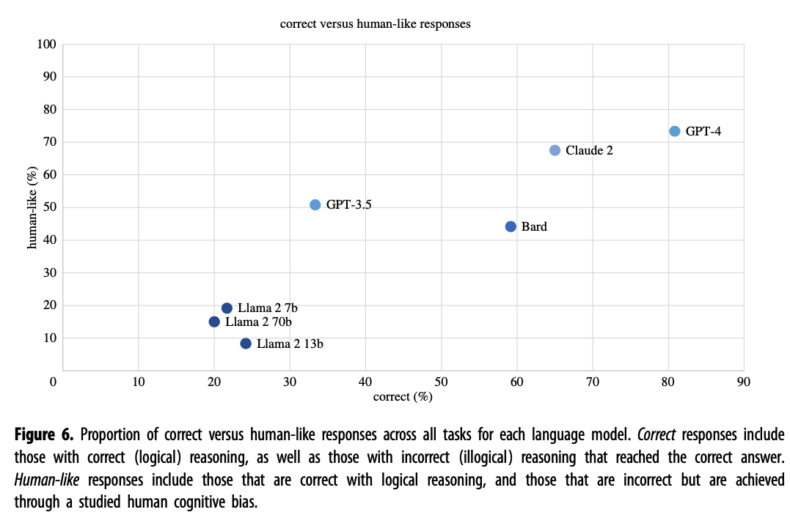

Figure 7: Figures from Macmillan-Scott & Musolesi (2024)

## Human-like intuitive behavior and reasoning biases emerged in large language models but disappeared in ChatGPT

Hagendorff, T., Fabi, S., & Kosinski, M. (2023). **Human-like intuitive
behavior and reasoning biases emerged in large language models but
disappeared in ChatGPT.** Nature Computational Science, 3(10), 833–838.
https://doi.org/10.1038/s43588-023-00527-x

Abstract

We design a battery of semantic illusions and cognitive reflection
tests, aimed to elicit intuitive yet erroneous responses. We administer
these tasks, traditionally used to study reasoning and decision-making
in humans, to OpenAI’s generative pre-trained transformer model family.
The results show that as the models expand in size and linguistic
proficiency they increasingly display human-like intuitive system 1
thinking and associated cognitive errors. This pattern shifts notably
with the introduction of ChatGPT models, which tend to respond
correctly, avoiding the traps embedded in the tasks. Both ChatGPT-3.5
and 4 utilize the input–output context window to engage in
chain-of-thought reasoning, reminiscent of how people use notepads to
support their system 2 thinking. Yet, they remain accurate even when
prevented from engaging in chain-of-thought reasoning, indicating that
their system-1-like next-word generation processes are more accurate
than those of older models. Our findings highlight the value of applying
psychological methodologies to study large language models, as this can
uncover previously undetected emergent characteristics.

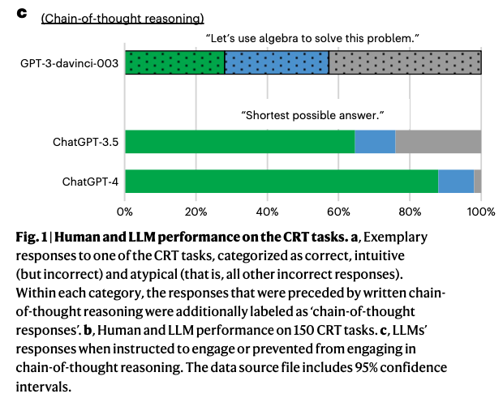

Figure 8: Figures from Hagendorff et al. (2023)

## Using cognitive psychology to understand GPT-3.

Binz, M., & Schulz, E. (2023). **Using cognitive psychology to
understand GPT-3.** Proceedings of the National Academy of Sciences,
120(6), e2218523120. https://doi.org/10.1073/pnas.2218523120

Abstract

We study GPT-3, a recent large language model, using tools from
cognitive psychology. More specifically, we assess GPT-3’s
decision-making, information search, deliberation, and causal reasoning
abilities on a battery of canonical experiments from the literature. We
find that much of GPT-3’s behavior is impressive: It solves
vignette-based tasks similarly or better than human subjects, is able to
make decent decisions from descriptions, outperforms humans in a
multiarmed bandit task, and shows signatures of model-based
reinforcement learning. Yet, we also find that small perturbations to
vignette-based tasks can lead GPT-3 vastly astray, that it shows no
signatures of directed exploration, and that it fails miserably in a
causal reasoning task. Taken together, these results enrich our
understanding of current large language models and pave the way for
future investigations using tools from cognitive psychology to study
increasingly capable and opaque artificial agents.

## Studying and improving reasoning in humans and machines.

Yax, N., Anlló, H., & Palminteri, S. (2024). **Studying and improving
reasoning in humans and machines.** Communications Psychology, 2(1),
1–16. https://doi.org/10.1038/s44271-024-00091-8

Abstract

In the present study, we investigate and compare reasoning in large
language models (LLMs) and humans, using a selection of cognitive
psychology tools traditionally dedicated to the study of (bounded)
rationality. We presented to human participants and an array of
pretrained LLMs new variants of classical cognitive experiments, and
cross-compared their performances. Our results showed that most of the
included models presented reasoning errors akin to those frequently
ascribed to error-prone, heuristic-based human reasoning.
Notwithstanding this superficial similarity, an in-depth comparison
between humans and LLMs indicated important differences with human-like
reasoning, with models’ limitations disappearing almost entirely in more
recent LLMs’ releases. Moreover, we show that while it is possible to
devise strategies to induce better performance, humans and machines are
not equally responsive to the same prompting schemes. We conclude by
discussing the epistemological implications and challenges of comparing
human and machine behavior for both artificial intelligence and
cognitive psychology.

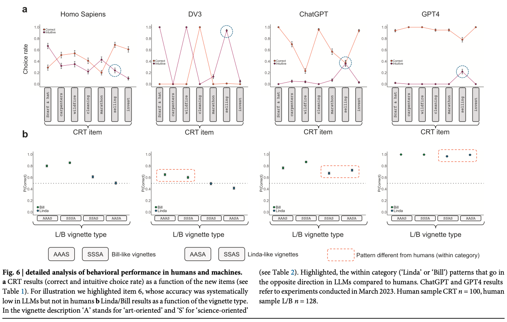

## Exploring variability in risk taking with large language models.

Bhatia, S. (2024). **Exploring variability in risk taking with large
language models.** Journal of Experimental Psychology: General, 153(7),
1838–1860. https://doi.org/10.1037/xge0001607

Abstract

What are the sources of individual-level differences in risk taking, and
how do they depend on the domain or situation in which the decision is
being made? Psychologists currently answer such questions with
psychometric methods, which analyze correlations across participant
responses in survey data sets. In this article, we analyze the
preferences that give rise to these correlations. Our approach uses (a)
large language models (LLMs) to quantify everyday risky behaviors in
terms of the attributes or reasons that may describe those behaviors,
and (b) decision models to map these attributes and reasons onto
participant responses. We show that LLM-based decision models can
explain observed correlations between behaviors in terms of the reasons
different behaviors elicit and explain observed correlations between
individuals in terms of the weights different individuals place on
reasons, thereby providing a decision theoretic foundation for
psychometric findings. Since LLMs can generate quantitative
representations for nearly any naturalistic decision, they can be used
to make accurate out-of-sample predictions for hundreds of everyday
behaviors, predict the reasons why people may or may not want to engage
in these behaviors, and interpret these reasons in terms of core
psychological constructs. Our approach has important theoretical and
practical implications for the study of heterogeneity in everyday
behavior.

Bhatia (2024)

## Human Bias in AI Models? Anchoring Effects and Mitigation Strategies in Large Language Models

Nguyen, J. (2024). **Human Bias in AI Models? Anchoring Effects and
Mitigation Strategies in Large Language Models.** Journal of Behavioral
and Experimental Finance, 100971.
https://doi.org/10.1016/j.jbef.2024.100971

Abstract

This study builds on the seminal work of Tversky and Kahneman (1974),
exploring the presence and extent of anchoring bias in forecasts
generated by four Large Language Models (LLMs): GPT-4, Claude 2, Gemini
Pro and GPT-3.5. In contrast to recent findings of advanced reasoning
capabilities in LLMs, our randomised controlled trials reveal the
presence of anchoring bias across all models: forecasts are
significantly influenced by prior mention of high or low values. We
examine two mitigation prompting strategies, ‘Chain of Thought’ and
‘ignore previous’, finding limited and varying degrees of effectiveness.
Our results extend the anchoring bias research in finance beyond human
decision-making to encompass LLMs, highlighting the importance of
deliberate and informed prompting in AI forecasting in both ad hoc LLM
use and in crafting few-shot examples.

## A Turing test of whether AI chatbots are behaviorally similar to humans

Mei, Q., Xie, Y., Yuan, W., & Jackson, M. O. (2024). **A Turing test of
whether AI chatbots are behaviorally similar to humans.** Proceedings of
the National Academy of Sciences, 121(9), e2313925121.
https://doi.org/10.1073/pnas.2313925121

Abstract

We administer a Turing test to AI chatbots. We examine how chatbots
behave in a suite of classic behavioral games that are designed to
elicit characteristics such as trust, fairness, risk-aversion,
cooperation, etc., as well as how they respond to a traditional Big-5
psychological survey that measures personality traits. ChatGPT-4
exhibits behavioral and personality traits that are statistically
indistinguishable from a random human from tens of thousands of human
subjects from more than 50 countries. Chatbots also modify their
behavior based on previous experience and contexts “as if” they were
learning from the interactions and change their behavior in response to
different framings of the same strategic situation. Their behaviors are
often distinct from average and modal human behaviors, in which case
they tend to behave on the more altruistic and cooperative end of the
distribution. We estimate that they act as if they are maximizing an
average of their own and partner’s payoffs.

## Deciding Fast and Slow: The Role of Cognitive Biases in AI-assisted Decision-making

Rastogi, C., Zhang, Y., Wei, D., Varshney, K. R., Dhurandhar, A., &
Tomsett, R. (2022). **Deciding Fast and Slow: The Role of Cognitive
Biases in AI-assisted Decision-making.** Proceedings of the ACM on
Human-Computer Interaction, 6(CSCW1), 1–22.
https://doi.org/10.1145/3512930

Abstract

Several strands of research have aimed to bridge the gap between
artificial intelligence (AI) and human decision-makers in AI-assisted
decision-making, where humans are the consumers of AI model predictions
and the ultimate decision-makers in high-stakes applications. However,
people’s perception and understanding are often distorted by their
cognitive biases, such as confirmation bias, anchoring bias,
availability bias, to name a few. In this work, we use knowledge from
the field of cognitive science to account for cognitive biases in the
human-AI collaborative decision-making setting, and mitigate their
negative effects on collaborative performance. To this end, we
mathematically model cognitive biases and provide a general framework
through which researchers and practitioners can understand the interplay
between cognitive biases and human-AI accuracy. We then focus
specifically on anchoring bias, a bias commonly encountered in human-AI
collaboration. We implement a time-based de-anchoring strategy and
conduct our first user experiment that validates its effectiveness in
human-AI collaborative decision-making. With this result, we design a
time allocation strategy for a resource-constrained setting that
achieves optimal human-AI collaboration under some assumptions. We,
then, conduct a second user experiment which shows that our time
allocation strategy with explanation can effectively de-anchor the human
and improve collaborative performance when the AI model has low
confidence and is incorrect.

Figure 9: Figures from Rastogi et al. (2022)

## Decision control and explanations in human-AI collaboration: Improving user perceptions and compliance

Westphal, M., Vössing, M., Satzger, G., Yom-Tov, G. B., & Rafaeli, A.
(2023). **Decision control and explanations in human-AI collaboration:
Improving user perceptions and compliance.** Computers in Human
Behavior, 144, 107714. https://doi.org/10.1016/j.chb.2023.107714

Abstract

Human-AI collaboration has become common, integrating highly complex AI
systems into the workplace. Still, it is often ineffective; impaired
perceptions – such as low trust or limited understanding – reduce
compliance with recommendations provided by the AI system. Drawing from
cognitive load theory, we examine two techniques of human-AI
collaboration as potential remedies. In three experimental studies, we
grant users decision control by empowering them to adjust the system’s
recommendations, and we offer explanations for the system’s reasoning.
We find decision control positively affects user perceptions of trust
and understanding, and improves user compliance with system
recommendations. Next, we isolate different effects of providing
explanations that may help explain inconsistent findings in recent
literature: while explanations help reenact the system’s reasoning, they
also increase task complexity. Further, the effectiveness of providing
an explanation depends on the specific user’s cognitive ability to
handle complex tasks. In summary, our study shows that users benefit
from enhanced decision control, while explanations – unless
appropriately designed for the specific user – may even harm user
perceptions and compliance. This work bears both theoretical and
practical implications for the management of human-AI collaboration.

## Risk and prosocial behavioural cues elicit human-like response patterns from AI chatbots.

Zhao, Y., Huang, Z., Seligman, M., & Peng, K. (2024). **Risk and
prosocial behavioural cues elicit human-like response patterns from AI
chatbots.** Scientific Reports, 14(1), 7095.
https://doi.org/10.1038/s41598-024-55949-y

Abstract

Emotions, long deemed a distinctly human characteristic, guide a
repertoire of behaviors, e.g., promoting risk-aversion under negative
emotional states or generosity under positive ones. The question of
whether Artificial Intelligence (AI) can possess emotions remains
elusive, chiefly due to the absence of an operationalized consensus on
what constitutes ‘emotion’ within AI. Adopting a pragmatic approach,
this study investigated the response patterns of AI
chatbots—specifically, large language models (LLMs)—to various emotional
primes. We engaged AI chatbots as one would human participants,
presenting scenarios designed to elicit positive, negative, or neutral
emotional states. Multiple accounts of OpenAI’s ChatGPT Plus were then
tasked with responding to inquiries concerning investment decisions and
prosocial behaviors. Our analysis revealed that ChatGPT-4 bots, when
primed with positive, negative, or neutral emotions, exhibited distinct
response patterns in both risk-taking and prosocial decisions, a
phenomenon less evident in the ChatGPT-3.5 iterations. This observation
suggests an enhanced capacity for modulating responses based on
emotional cues in more advanced LLMs. While these findings do not
suggest the presence of emotions in AI, they underline the feasibility
of swaying AI responses by leveraging emotional indicators.

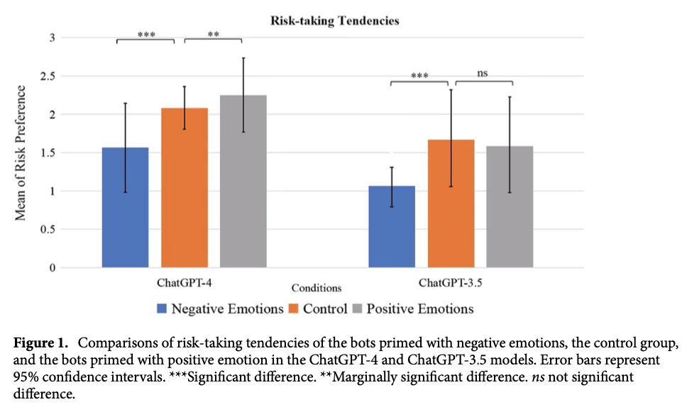

## Do large language models show decision heuristics similar to humans? A case study using GPT-3.5

Suri, G., Slater, L. R., Ziaee, A., & Nguyen, M. (2024). **Do large
language models show decision heuristics similar to humans? A case study
using GPT-3.5.** Journal of Experimental Psychology: General, 153(4),
1066–1075. https://doi.org/10.1037/xge0001547

Abstract

A Large Language Model (LLM) is an artificial intelligence system
trained on vast amounts of natural language data, enabling it to
generate human-like responses to written or spoken language input.
Generative Pre-Trained Transformer (GPT)-3.5 is an example of an LLM
that supports a conversational agent called ChatGPT. In this work, we
used a series of novel prompts to determine whether ChatGPT shows
heuristics and other context-sensitive responses. We also tested the
same prompts on human participants. Across four studies, we found that
ChatGPT was influenced by random anchors in making estimates (anchoring,
Study 1); it judged the likelihood of two events occurring together to
be higher than the likelihood of either event occurring alone, and it
was influenced by anecdotal information (representativeness and
availability heuristic, Study 2); it found an item to be more
efficacious when its features were presented positively rather than
negatively—even though both presentations contained statistically
equivalent information (framing effect, Study 3); and it valued an owned
item more than a newly found item even though the two items were
objectively identical (endowment effect, Study 4). In each study, human
participants showed similar effects. Heuristics and context-sensitive
responses in humans are thought to be driven by cognitive and affective
processes such as loss aversion and effort reduction. The fact that an
LLM—which lacks these processes—also shows such responses invites
consideration of the possibility that language is sufficiently rich to
carry these effects and may play a role in generating these effects in
humans.

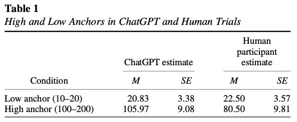

## Can Large Language Models Capture Human Preferences?

Goli, A., & Singh, A. (2024). **Can Large Language Models Capture Human
Preferences?** Marketing Science. https://doi.org/10.1287/mksc.2023.0306

Abstract

We explore the viability of large language models (LLMs), specifically
OpenAI’s GPT-3.5 and GPT-4, in emulating human survey respondents and
eliciting preferences, with a focus on intertemporal choices. Leveraging
the extensive literature on intertemporal discounting for benchmarking,
we examine responses from LLMs across various languages and compare them
with human responses, exploring preferences between smaller, sooner and
larger, later rewards. Our findings reveal that both generative
pretrained transformer (GPT) models demonstrate less patience than
humans, with GPT-3.5 exhibiting a lexicographic preference for earlier
rewards unlike human decision makers. Although GPT-4 does not display
lexicographic preferences, its measured discount rates are still
considerably larger than those found in humans. Interestingly, GPT
models show greater patience in languages with weak future tense
references, such as German and Mandarin, aligning with the existing
literature that suggests a correlation between language structure and
intertemporal preferences. We demonstrate how prompting GPT to explain
its decisions, a procedure we term “chain-of-thought conjoint,” can
mitigate, but does not eliminate, discrepancies between LLM and human
responses. Although directly eliciting preferences using LLMs may yield
misleading results, combining chain-of-thought conjoint with topic
modeling aids in hypothesis generation, enabling researchers to explore
the underpinnings of preferences. Chain-of-thought conjoint provides a
structured framework for marketers to use LLMs to identify potential
attributes or factors that can explain preference heterogeneity across
different customers and contexts.

Figure 10: Figures from Goli & Singh (2024)

## Language models, like humans, show content effects on reasoning tasks

Lampinen, A. K., Dasgupta, I., Chan, S. C. Y., Sheahan, H. R., Creswell,
A., Kumaran, D., McClelland, J. L., & Hill, F. (2024). **Language
models, like humans, show content effects on reasoning tasks.** PNAS
Nexus, 3(7), pgae233. https://doi.org/10.1093/pnasnexus/pgae233

Abstract

Abstract reasoning is a key ability for an intelligent system. Large
language models (LMs) achieve above-chance performance on abstract
reasoning tasks but exhibit many imperfections. However, human abstract
reasoning is also imperfect. Human reasoning is affected by our
real-world knowledge and beliefs, and shows notable “content effects”;
humans reason more reliably when the semantic content of a problem
supports the correct logical inferences. These content-entangled
reasoning patterns are central to debates about the fundamental nature
of human intelligence. Here, we investigate whether language
models—whose prior expectations capture some aspects of human
knowledge—similarly mix content into their answers to logic problems. We
explored this question across three logical reasoning tasks: natural
language inference, judging the logical validity of syllogisms, and the
Wason selection task. We evaluate state of the art LMs, as well as
humans, and find that the LMs reflect many of the same qualitative human
patterns on these tasks—like humans, models answer more accurately when
the semantic content of a task supports the logical inferences. These
parallels are reflected in accuracy patterns, and in some lower-level
features like the relationship between LM confidence over possible
answers and human response times. However, in some cases the humans and
models behave differently—particularly on the Wason task, where humans
perform much worse than large models, and exhibit a distinct error
pattern. Our findings have implications for understanding possible
contributors to these human cognitive effects, as well as the factors
that influence language model performance.

Lampinen et al. (2024)

## The emergence of economic rationality of GPT

Chen, Y., Liu, T. X., Shan, Y., & Zhong, S. (2023). **The emergence of
economic rationality of GPT.** Proceedings of the National Academy of
Sciences, 120(51), e2316205120. https://doi.org/10.1073/pnas.2316205120

Abstract

As large language models (LLMs) like GPT become increasingly prevalent,
it is essential that we assess their capabilities beyond language
processing. This paper examines the economic rationality of GPT by
instructing it to make budgetary decisions in four domains: risk, time,
social, and food preferences. We measure economic rationality by
assessing the consistency of GPT’s decisions with utility maximization
in classic revealed preference theory. We find that GPT’s decisions are
largely rational in each domain and demonstrate higher rationality score
than those of human subjects in a parallel experiment and in the
literature. Moreover, the estimated preference parameters of GPT are
slightly different from human subjects and exhibit a lower degree of
heterogeneity. We also find that the rationality scores are robust to
the degree of randomness and demographic settings such as age and gender
but are sensitive to contexts based on the language frames of the choice
situations. These results suggest the potential of LLMs to make good
decisions and the need to further understand their capabilities,
limitations, and underlying mechanisms.

## The potential of generative AI for personalized persuasion at scale.

Matz, S. C., Teeny, J. D., Vaid, S. S., Peters, H., Harari, G. M., &
Cerf, M. (2024). **The potential of generative AI for personalized
persuasion at scale.** Scientific Reports, 14(1), 4692.
https://doi.org/10.1038/s41598-024-53755-0

Abstract

Matching the language or content of a message to the psychological
profile of its recipient (known as “personalized persuasion”) is widely
considered to be one of the most effective messaging strategies. We
demonstrate that the rapid advances in large language models (LLMs),
like ChatGPT, could accelerate this influence by making personalized
persuasion scalable. Across four studies (consisting of seven
sub-studies; total N = 1788), we show that personalized messages crafted
by ChatGPT exhibit significantly more influence than non-personalized
messages. This was true across different domains of persuasion (e.g.,
marketing of consumer products, political appeals for climate action),
psychological profiles (e.g., personality traits, political ideology,
moral foundations), and when only providing the LLM with a single, short
prompt naming or describing the targeted psychological dimension. Thus,
our findings are among the first to demonstrate the potential for LLMs
to automate, and thereby scale, the use of personalized persuasion in
ways that enhance its effectiveness and efficiency. We discuss the
implications for researchers, practitioners, and the general public.

## Decision-Making Paradoxes in Humans vs Machines: The case of the Allais and Ellsberg Paradoxes.

Nobandegani, A. S., Rish, I., & Shultz, T. R. (2023). **Decision-Making
Paradoxes in Humans vs Machines: The case of the Allais and Ellsberg
Paradoxes.** Proceedings of the Annual Meeting of the Cognitive Science
Society, 46. https://arxiv.org/abs/2406.11426

Abstract

Human decision-making is filled with a variety of paradoxes
demonstrating deviations from rationality principles. Do
state-of-the-art artificial intelligence (AI) models also manifest these
paradoxes when making decisions? As a case study, in this work we
investigate whether GPT-4, a recently released state-of-the-art language
model, would show two well-known paradoxes in human decision-making: the
Allais paradox and the Ellsberg paradox. We demonstrate that GPT-4
succeeds in the two variants of the Allais paradox (the
common-consequence effect and the common-ratio effect) but fails in the
case of the Ellsberg paradox. We also show that providing GPT-4 with
high-level normative principles allows it to succeed in the Ellsberg
paradox, thus elevating GPT-4’s decision-making rationality. We discuss
the implications of our work for AI rationality enhancement and
AI-assisted decision-making.

Nobandegani et al. (2023)

## Do LLMs Exhibit Human-like Response Biases? A Case Study in Survey Design.

Tjuatja, L., Chen, V., Wu, T., Talwalkwar, A., & Neubig, G. (2024). **Do
LLMs Exhibit Human-like Response Biases? A Case Study in Survey
Design.** Transactions of the Association for Computational Linguistics,
12, 1011–1026. https://doi.org/10.1162/tacl_a_00685

Abstract

One widely cited barrier to the adoption of LLMs as proxies for humans
in subjective tasks is their sensitivity to prompt wording—but
interestingly, humans also display sensitivities to instruction changes
in the form of response biases. We investigate the extent to which LLMs
reflect human response biases, if at all. We look to survey design,
where human response biases caused by changes in the wordings of
“prompts” have been extensively explored in social psychology
literature. Drawing from these works, we design a dataset and framework
to evaluate whether LLMs exhibit human-like response biases in survey
questionnaires. Our comprehensive evaluation of nine models shows that
popular open and commercial LLMs generally fail to reflect human-like
behavior, particularly in models that have undergone RLHF. Furthermore,
even if a model shows a significant change in the same direction as
humans, we find that they are sensitive to perturbations that do not
elicit significant changes in humans. These results highlight the
pitfalls of using LLMs as human proxies, and underscore the need for
finer-grained characterizations of model behavior.

## Cognitive ease at a cost: LLMs reduce mental effort but compromise depth in student scientific inquiry

Stadler, M., Bannert, M., & Sailer, M. (2024). **Cognitive ease at a
cost: LLMs reduce mental effort but compromise depth in student
scientific inquiry.** Computers in Human Behavior, 160, 108386.
https://doi.org/10.1016/j.chb.2024.108386

Abstract

This study explores the cognitive load and learning outcomes associated
with using large language models (LLMs) versus traditional search
engines for information gathering during learning. A total of 91
university students were randomly assigned to either use ChatGPT3.5 or
Google to research the socio-scientific issue of nanoparticles in
sunscreen to derive valid recommendations and justifications. The study
aimed to investigate potential differences in cognitive load, as well as
the quality and homogeneity of the students’ recommendations and
justifications. Results indicated that students using LLMs experienced
significantly lower cognitive load. However, despite this reduction,
these students demonstrated lower-quality reasoning and argumentation in
their final recommendations compared to those who used traditional
search engines. Further, the homogeneity of the recommendations and
justifications did not differ significantly between the two groups,
suggesting that LLMs did not restrict the diversity of students’
perspectives. These findings highlight the nuanced implications of
digital tools on learning, suggesting that while LLMs can decrease the
cognitive burden associated with information gathering during a learning
task, they may not promote deeper engagement with content necessary for
high-quality learning per se.

Stadler et al. (2024)

## Cognitive LLMs: Towards Integrating Cognitive Architectures and Large Language Models for Manufacturing Decision-making

Wu, S., Oltramari, A., Francis, J., Giles, C. L., & Ritter, F. E.
(2024). **Cognitive LLMs: Towards Integrating Cognitive Architectures
and Large Language Models for Manufacturing Decision-making**
(arXiv:2408.09176). arXiv. http://arxiv.org/abs/2408.09176

Abstract

Resolving the dichotomy between the human-like yet constrained reasoning
processes of Cognitive Architectures and the broad but often noisy
inference behavior of Large Language Models (LLMs) remains a challenging
but exciting pursuit, for enabling reliable machine reasoning
capabilities in production systems. Because Cognitive Architectures are
famously developed for the purpose of modeling the internal mechanisms
of human cognitive decision-making at a computational level, new
investigations consider the goal of informing LLMs with the knowledge
necessary for replicating such processes, e.g., guided perception,
memory, goal-setting, and action. Previous approaches that use LLMs for
grounded decision-making struggle with complex reasoning tasks that
require slower, deliberate cognition over fast and intuitive
inference—reporting issues related to the lack of sufficient grounding,
as in hallucination. To resolve these challenges, we introduce LLM-ACTR,
a novel neurosymbolic architecture that provides human-aligned and
versatile decision-making by integrating the ACT-R Cognitive
Architecture with LLMs. Our framework extracts and embeds knowledge of
ACT-R’s internal decision-making process as latent neural
representations, injects this information into trainable LLM adapter
layers, and fine-tunes the LLMs for downstream prediction. Our
experiments on novel Design for Manufacturing tasks show both improved
task performance as well as improved grounded decision-making capability
of our approach, compared to LLM-only baselines that leverage
chain-of-thought reasoning strategies.

## Large Language Models Amplify Human Biases in Moral Decision-Making

Cheung, V., Maier, M., & Lieder, F. (2024). **Large Language Models
Amplify Human Biases in Moral Decision-Making** (https://osf.io/3kvjd/).
https://doi.org/10.31234/osf.io/aj46b

Abstract

As large language models (LLMs) become more widely used, people
increasingly rely on them to make or advise on moral decisions. Some
researchers even propose using LLMs as participants in psychology
experiments. It is therefore important to understand how well LLMs make
moral decisions and how they compare to humans. We investigated this
question in realistic moral dilemmas using prompts where GPT-4, Llama 3,
and Claude 3 give advice and where they emulate a research participant.
In Study 1, we compared responses from LLMs to a representative US
sample (N = 285) for 22 dilemmas: social dilemmas that pitted
self-interest against the greater good, and moral dilemmas that pitted
utilitarian cost-benefit reasoning against deontological rules. In
social dilemmas, LLMs were more altruistic than participants. In moral
dilemmas, LLMs exhibited stronger omission bias than participants: they
usually endorsed inaction over action. In Study 2 (N = 490,
preregistered), we replicated this omission bias and document an
additional bias: unlike humans, LLMs (except GPT-4o) tended to answer
“no” in moral dilemmas, whereby the phrasing of the question influences
the decision even when physical action remains the same. Our findings
show that LLM moral decision-making amplifies human biases and
introduces potentially problematic biases.

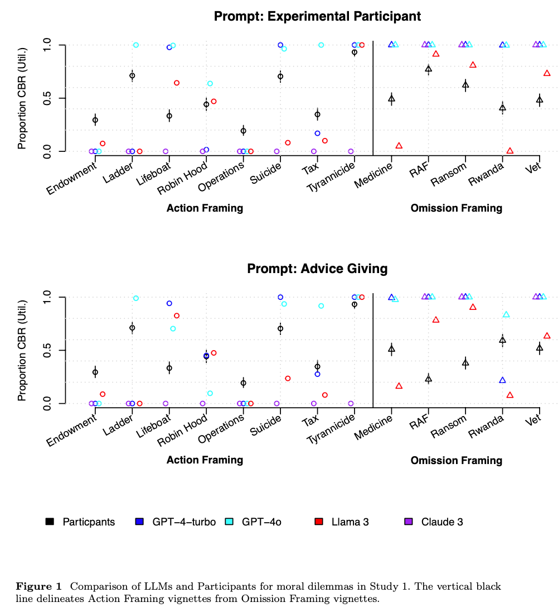

## Large Language Model Recall Uncertainty is Modulated by the Fan Effect.

Roberts, J., Moore, K., Pham, T., Ewaleifoh, O., & Fisher, D. (2024).
**Large Language Model Recall Uncertainty is Modulated by the Fan
Effect.**

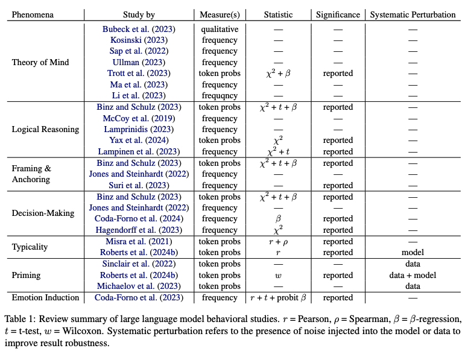

------------------------------------------------------------------------

## Accuracy-Time Tradeoffs in AI-Assisted Decision Making under Time Pressure.

Swaroop, S., Buçinca, Z., Gajos, K. Z., & Doshi-Velez, F. (2024).
**Accuracy-Time Tradeoffs in AI-Assisted Decision Making under Time
Pressure.** Proceedings of the 29th International Conference on
Intelligent User Interfaces, 138–154.
https://doi.org/10.1145/3640543.3645206

Abstract

In settings where users both need high accuracy and are timepressured,
such as doctors working in emergency rooms, we want to provide AI
assistance that both increases decision accuracy and reduces
decision-making time. Current literature focusses on how users interact
with AI assistance when there is no time pressure, finding that
different AI assistances have different benefits: some can reduce time
taken while increasing overreliance on AI, while others do the opposite.
The precise benefit can depend on both the user and task. In
time-pressured scenarios, adapting when we show AI assistance is
especially important: relying on the AI assistance can save time, and
can therefore be beneficial when the AI is likely to be right. We would
ideally adapt what AI assistance we show depending on various properties
(of the task and of the user) in order to best trade off accuracy and
time. We introduce a study where users have to answer a series of logic
puzzles. We find that time pressure affects how users use different AI
assistances, making some assistances more beneficial than others when
compared to notime-pressure settings. We also find that a user’s
overreliance rate is a key predictor of their behaviour: overreliers and
not-overreliers use different AI assistance types differently. We find
marginal correlations between a user’s overreliance rate (which is
related to the user’s trust in AI recommendations) and their personality
traits (Big Five Personality traits). Overall, our work suggests that AI
assistances have different accuracy-time tradeoffs when people are under
time pressure compared to no time pressure, and we explore how we might
adapt AI assistances in this setting.

## The LLM Effect: Are Humans Truly Using LLMs, or Are They Being Influenced By Them Instead?

Choi, A. S., Akter, S. S., Singh, J. P., & Anastasopoulos, A. (2024).
**The LLM Effect: Are Humans Truly Using LLMs, or Are They Being
Influenced By Them Instead?** (arXiv:2410.04699). arXiv.
http://arxiv.org/abs/2410.04699

Abstract

Large Language Models (LLMs) have shown capabilities close to human
performance in various analytical tasks, leading researchers to use them
for time and labor-intensive analyses. However, their capability to
handle highly specialized and open-ended tasks in domains like policy
studies remains in question. This paper investigates the efficiency and
accuracy of LLMs in specialized tasks through a structured user study
focusing on Human-LLM partnership. The study, conducted in two
stages-Topic Discovery and Topic Assignment-integrates LLMs with expert
annotators to observe the impact of LLM suggestions on what is usually
human-only analysis. Results indicate that LLM-generated topic lists
have significant overlap with human generated topic lists, with minor
hiccups in missing document-specific topics. However, LLM suggestions
may significantly improve task completion speed, but at the same time
introduce anchoring bias, potentially affecting the depth and nuance of
the analysis, raising a critical question about the trade-off between
increased efficiency and the risk of biased analysis.

## Mutual Theory of Mind in Human-AI Collaboration: An Empirical Study with LLM-driven AI Agents in a Real-time Shared Workspace Task

Zhang, S., Wang, X., Zhang, W., Chen, Y., Gao, L., Wang, D., Zhang, W.,
Wang, X., & Wen, Y. (2024). **Mutual Theory of Mind in Human-AI
Collaboration: An Empirical Study with LLM-driven AI Agents in a
Real-time Shared Workspace Task** (arXiv:2409.08811). arXiv.
http://arxiv.org/abs/2409.08811

Abstract

Theory of Mind (ToM) significantly impacts human collaboration and
communication as a crucial capability to understand others. When AI
agents with ToM capability collaborate with humans, Mutual Theory of
Mind (MToM) arises in such human-AI teams (HATs). The MToM process,
which involves interactive communication and ToM-based strategy
adjustment, affects the team’s performance and collaboration process. To
explore the MToM process, we conducted a mixed-design experiment using a
large language model-driven AI agent with ToM and communication modules
in a real-time shared-workspace task. We find that the agent’s ToM
capability does not significantly impact team performance but enhances
human understanding of the agent and the feeling of being understood.
Most participants in our study believe verbal communication increases
human burden, and the results show that bidirectional communication
leads to lower HAT performance. We discuss the results’ implications for
designing AI agents that collaborate with humans in real-time shared
workspace tasks.

## Bridging the Gulf of Envisioning: Cognitive Design Challenges in LLM Interfaces

Subramonyam, H., Pea, R., Pondoc, C. L., Agrawala, M., & Seifert, C.
(2024). **Bridging the Gulf of Envisioning: Cognitive Design Challenges
in LLM Interfaces** (arXiv:2309.14459; Version 2). arXiv.
http://arxiv.org/abs/2309.14459

Abstract

Large language models (LLMs) exhibit dynamic capabilities and appear to
comprehend complex and ambiguous natural language prompts. However,
calibrating LLM interactions is challenging for interface designers and
end-users alike. A central issue is our limited grasp of how human
cognitive processes begin with a goal and form intentions for executing
actions, a blindspot even in established interaction models such as
Norman’s gulfs of execution and evaluation. To address this gap, we
theorize how end-users ‘envision’ translating their goals into clear
intentions and craft prompts to obtain the desired LLM response. We
define a process of Envisioning by highlighting three misalignments: (1)
knowing whether LLMs can accomplish the task, (2) how to instruct the
LLM to do the task, and (3) how to evaluate the success of the LLM’s
output in meeting the goal. Finally, we make recommendations to narrow
the envisioning gulf in human-LLM interactions.

## Learning To Guide Human Decision Makers With Vision-Language Models

Banerjee, D., Teso, S., Sayin, B., & Passerini, A. (2024). **Learning To
Guide Human Decision Makers With Vision-Language Models**
(arXiv:2403.16501). arXiv. http://arxiv.org/abs/2403.16501

Abstract

There is increasing interest in developing AIs for assisting human
decision-making in high-stakes tasks, such as medical diagnosis, for the
purpose of improving decision quality and reducing cognitive strain.
Mainstream approaches team up an expert with a machine learning model to
which safer decisions are offloaded, thus letting the former focus on
cases that demand their attention. his separation of responsibilities
setup, however, is inadequate for high-stakes scenarios. On the one
hand, the expert may end up over-relying on the machine’s decisions due
to anchoring bias, thus losing the human oversight that is increasingly
being required by regulatory agencies to ensure trustworthy AI. On the
other hand, the expert is left entirely unassisted on the (typically
hardest) decisions on which the model abstained. As a remedy, we
introduce learning to guide (LTG), an alternative framework in which -
rather than taking control from the human expert - the machine provides
guidance useful for decision making, and the human is entirely
responsible for coming up with a decision. In order to ensure guidance
is interpretable} and task-specific, we develop SLOG, an approach for
turning any vision-language model into a capable generator of textual
guidance by leveraging a modicum of human feedback. Our empirical
evaluation highlights the promise of SLOG on a challenging, real-world
medical diagnosis task.

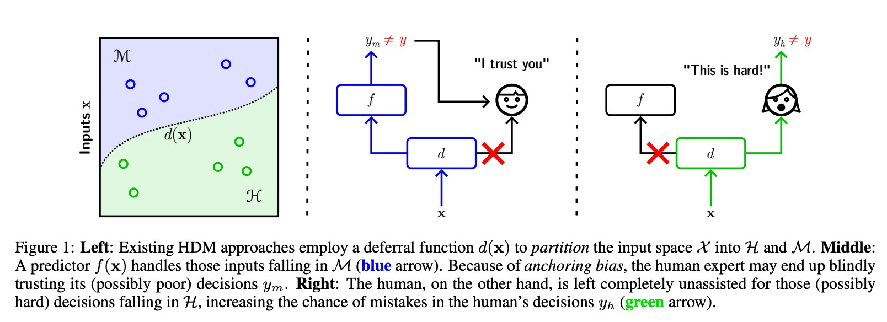

Figure 11: Figures from Banerjee et al. (2024)

## How does Value Similarity affect Human Reliance in AI-Assisted Ethical Decision Making?

Narayanan, S., Yu, G., Ho, C.-J., & Yin, M. (2023). **How does Value
Similarity affect Human Reliance in AI-Assisted Ethical Decision
Making?** Proceedings of the 2023 AAAI/ACM Conference on AI, Ethics, and
Society, 49–57. https://doi.org/10.1145/3600211.3604709

Abstract

This paper explores the impact of value similarity between humans and AI
on human reliance in the context of AI-assisted ethical decision-making.
Using kidney allocation as a case study, we conducted a randomized
human-subject experiment where workers were presented with ethical
dilemmas in various conditions, including no AI recommendations,
recommendations from a similar AI, and recommendations from a dissimilar
AI. We found that recommendations provided by a dissimilar AI had a
higher overall effect on human decisions than recommendations from a
similar AI. However, when humans and AI disagreed, participants were
more likely to change their decisions when provided with recommendations
from a similar AI. The effect was not due to humans’ perceptions of the
AI being similar, but rather due to the AI displaying similar ethical
values through its recommendations. We also conduct a preliminary
analysis on the relationship between value similarity and trust, and
potential shifts in ethical preferences at the population-level.

## Determinants of LLM-assisted Decision-Making

Eigner, E., & Händler, T. (2024). **Determinants of LLM-assisted
Decision-Making** (arXiv:2402.17385). arXiv.
http://arxiv.org/abs/2402.17385

Abstract

Decision-making is a fundamental capability in everyday life. Large
Language Models (LLMs) provide multifaceted support in enhancing human
decision-making processes. However, understanding the influencing
factors of LLM-assisted decision-making is crucial for enabling
individuals to utilize LLM-provided advantages and minimize associated
risks in order to make more informed and better decisions. This study
presents the results of a comprehensive literature analysis, providing a
structural overview and detailed analysis of determinants impacting
decision-making with LLM support. In particular, we explore the effects
of technological aspects of LLMs, including transparency and prompt
engineering, psychological factors such as emotions and decision-making
styles, as well as decision specific determinants such as task
difficulty and accountability. In addition, the impact of the
determinants on the decision-making process is illustrated via multiple
application scenarios. Drawing from our analysis, we develop a
dependency framework that systematizes possible interactions in terms of
reciprocal interdependencies between these determinants. Our research
reveals that, due to the multifaceted interactions with various
determinants, factors such as trust in or reliance on LLMs, the user’s
mental model, and the characteristics of information processing are
identified as significant aspects influencing LLM-assisted
decision-making processes. Our findings can be seen as crucial for
improving decision quality in human-AI collaboration, empowering both
users and organizations, and designing more effective LLM interfaces.
Additionally, our work provides a foundation for future empirical
investigations on the determinants of decision-making assisted by LLMs.

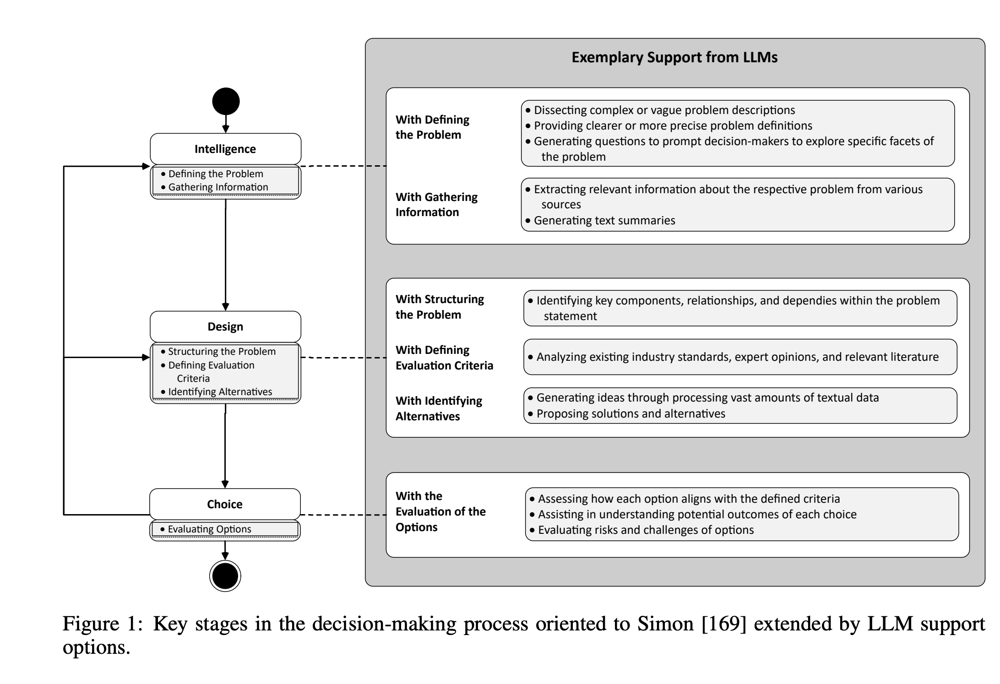

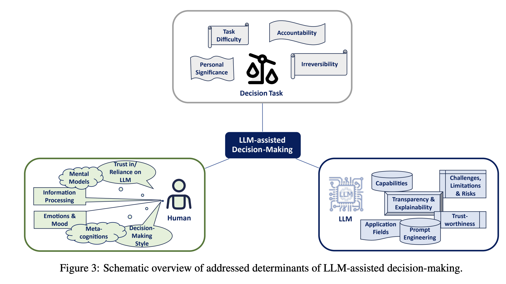

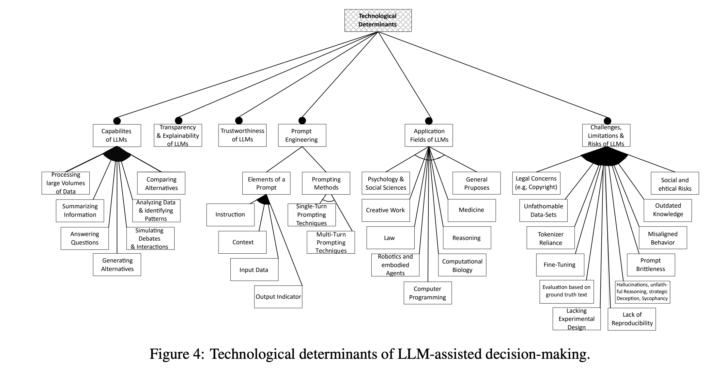

Figure 12: Figures from Eigner & Händler (2024)

## A Taxonomy of Human and ML Strengths in Decision-Making to Investigate Human-ML Complementarity.

Rastogi, C., Leqi, L., Holstein, K., & Heidari, H. (2023). **A Taxonomy
of Human and ML Strengths in Decision-Making to Investigate Human-ML
Complementarity.** Proceedings of the AAAI Conference on Human
Computation and Crowdsourcing, 11, 127–139.
https://doi.org/10.1609/hcomp.v11i1.27554

Abstract

Hybrid human-ML systems increasingly make consequential decisions in a
wide range of domains. These systems are often introduced with the
expectation that the combined human-ML system will achieve complementary
performance, that is, the combined decision-making system will be an
improvement compared with either decision-making agent in isolation.
However, empirical results have been mixed, and existing research rarely
articulates the sources and mechanisms by which complementary
performance is expected to arise. Our goal in this work is to provide
conceptual tools to advance the way researchers reason and communicate
about human-ML complementarity. Drawing upon prior literature in human
psychology, machine learning, and human-computer interaction, we propose
a taxonomy characterizing distinct ways in which human and ML-based
decision-making can differ. In doing so, we conceptually map potential
mechanisms by which combining human and ML decision-making may yield
complementary performance, developing a language for the research
community to reason about design of hybrid systems in any
decision-making domain. To illustrate how our taxonomy can be used to
investigate complementarity, we provide a mathematical aggregation
framework to examine enabling conditions for complementarity. Through
synthetic simulations, we demonstrate how this framework can be used to
explore specific aspects of our taxonomy and shed light on the optimal
mechanisms for combining human-ML judgments.

Rastogi et al. (2023)

## Take Caution in Using LLMs as Human Surrogates: Scylla Ex Machina

Gao, Y., Lee, D., Burtch, G., & Fazelpour, S. (2024). **Take Caution in
Using LLMs as Human Surrogates: Scylla Ex Machina**
(No. arXiv:2410.19599). arXiv. http://arxiv.org/abs/2410.19599

Abstract

Human decision-making is filled with a variety of paradoxes
demonstrating deviations from rationality principles. Do
state-of-the-art artificial intelligence (AI) models also manifest these
paradoxes when making decisions? As a case study, in this work we
investigate whether GPT-4, a recently released state-of-the-art language
model, would show two well-known paradoxes in human decision-making: the
Allais paradox and the Ellsberg paradox. We demonstrate that GPT-4
succeeds in the two variants of the Allais paradox (the
common-consequence effect and the common-ratio effect) but fails in the
case of the Ellsberg paradox. We also show that providing GPT-4 with
high-level normative principles allows it to succeed in the Ellsberg
paradox, thus elevating GPT-4’s decision-making rationality. We discuss
the implications of our work for AI rationality enhancement and
AI-assisted decision-making.

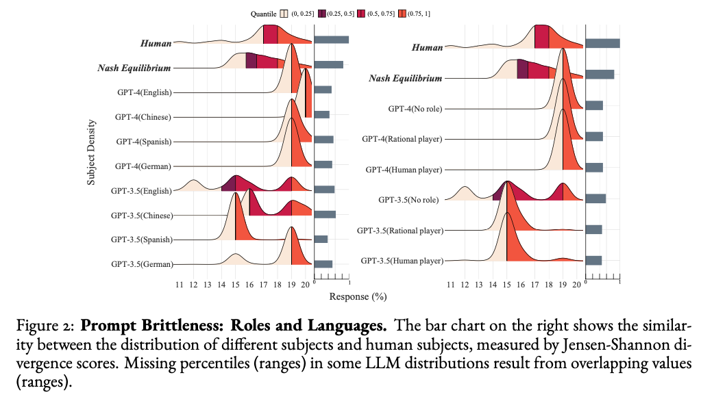

## Towards a Science of Human-AI Decision Making: An Overview of Design Space in Empirical Human-Subject Studies.

Lai, V., Chen, C., Smith-Renner, A., Liao, Q. V., & Tan, C. (2023).
**Towards a Science of Human-AI Decision Making: An Overview of Design
Space in Empirical Human-Subject Studies.** 2023 ACM Conference on
Fairness, Accountability, and Transparency, 1369–1385.
https://doi.org/10.1145/3593013.3594087

Abstract

AI systems are adopted in numerous domains due to their increas- ingly
strong predictive performance. However, in high-stakes domains such as
criminal justice and healthcare, full automation is often not desirable
due to safety, ethical, and legal concerns, yet fully manual approaches
can be inaccurate and time-consuming. As a result, there is growing
interest in the research community to augment human decision making with
AI assistance. Besides developing AI technologies for this purpose, the
emerging field of human-AI decision making must embrace empirical
approaches to form a foundational understanding of how humans interact
and work with AI to make decisions. To invite and help structure
research efforts towards a science of understanding and improving
human-AI decision making, we survey recent literature of empirical
human-subject studies on this topic. We summarize the study design
choices made in over 100 papers in three important aspects: (1) decision
tasks, (2) AI assistance elements, and (3) evaluation metrics. For each
aspect, we summarize current trends, discuss gaps in current practices
of the field, and make a list of recommendations for future research.
Our work highlights the need to develop com- mon frameworks to account
for the design and research spaces of human-AI decision making, so that
researchers can make rigorous choices in study design, and the research
community can build on each other’s work and produce generalizable
scientific knowledge. We also hope this work will serve as a bridge for
HCI and AI communities to work together to mutually shape the empirical
science and computational technologies for human-AI decision making.

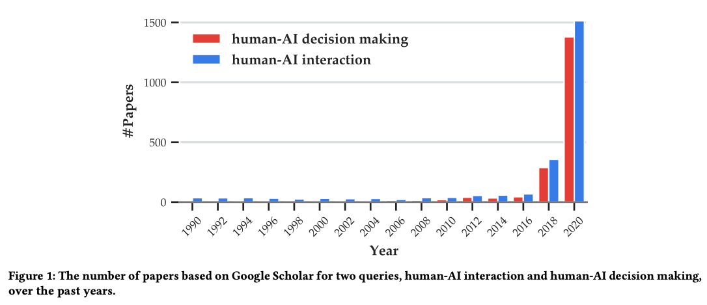

# References

Abdelnabi, S., Gomaa, A., Sivaprasad, S., Schönherr, L., & Fritz, M.
(2023). *LLM-Deliberation: Evaluating LLMs with Interactive Multi-Agent
Negotiation Games.* <https://doi.org/10.60882/cispa.25233028.v1>

Almashor, M., & Miyashita, Y. (2024). Can Private LLM Agents Synthesize
Household Energy Consumption Data? *Proceedings of the 15th ACM
International Conference on Future and Sustainable Energy Systems*,
664–668. <https://doi.org/10.1145/3632775.3661993>

Banerjee, D., Teso, S., Sayin, B., & Passerini, A. (2024). *Learning To
Guide Human Decision Makers With Vision-Language Models*
(arXiv:2403.16501). arXiv. <https://arxiv.org/abs/2403.16501>

Bhatia, S. (2024). Exploring variability in risk taking with large
language models. *Journal of Experimental Psychology: General*,
*153*(7), 1838–1860. <https://doi.org/10.1037/xge0001607>

Bienefeld, N., Kolbe, M., Camen, G., Huser, D., & Buehler, P. K. (2023).
Human-AI teaming: Leveraging transactive memory and speaking up for
enhanced team effectiveness. *Frontiers in Psychology*, *14*.
<https://doi.org/10.3389/fpsyg.2023.1208019>

Binz, M., & Schulz, E. (2023). Using cognitive psychology to understand
GPT-3. *Proceedings of the National Academy of Sciences*, *120*(6),
e2218523120. <https://doi.org/10.1073/pnas.2218523120>

Buçinca, Z., Malaya, M. B., & Gajos, K. Z. (2021). To Trust or to Think:
Cognitive Forcing Functions Can Reduce Overreliance on AI in
AI-assisted Decision-making. *Proceedings of
the ACM on Human-Computer Interaction*, *5*(CSCW1), 1–21.
<https://doi.org/10.1145/3449287>

Burton, J. W., Lopez-Lopez, E., Hechtlinger, S., Rahwan, Z., Aeschbach,
S., Bakker, M. A., Becker, J. A., Berditchevskaia, A., Berger, J.,
Brinkmann, L., Flek, L., Herzog, S. M., Huang, S., Kapoor, S.,
Narayanan, A., Nussberger, A.-M., Yasseri, T., Nickl, P., Almaatouq, A.,
… Hertwig, R. (2024). How large language models can reshape collective
intelligence. *Nature Human Behaviour*, 1–13.
<https://doi.org/10.1038/s41562-024-01959-9>

Calò, T., & De Russis, L. (2024). Enhancing smart home interaction
through multimodal command disambiguation. *Personal and Ubiquitous
Computing*. <https://doi.org/10.1007/s00779-024-01827-3>

Chen, Y., Liu, T. X., Shan, Y., & Zhong, S. (2023). The emergence of
economic rationality of GPT. *Proceedings of the National Academy of
Sciences*, *120*(51), e2316205120.
<https://doi.org/10.1073/pnas.2316205120>

Cheung, V., Maier, M., & Lieder, F. (2024). *Large Language Models
Amplify Human Biases in Moral Decision-Making*.
<https://doi.org/10.31234/osf.io/aj46b>

Chiang, C.-W., Lu, Z., Li, Z., & Yin, M. (2024). Enhancing AI-Assisted
Group Decision Making through LLM-Powered Devil’s Advocate. *Proceedings
of the 29th International Conference on Intelligent User Interfaces*,
103–119. <https://doi.org/10.1145/3640543.3645199>

Choi, A. S., Akter, S. S., Singh, J. P., & Anastasopoulos, A. (2024).
*The LLM Effect: Are Humans Truly Using LLMs, or Are They Being
Influenced By Them Instead?* (arXiv:2410.04699). arXiv.
<https://arxiv.org/abs/2410.04699>

Chuang, Y.-S., Harlalka, N., Suresh, S., Goyal, A., Hawkins, R., Yang,
S., Shah, D., Hu, J., & Rogers, T. T. (2024). *The Wisdom of Partisan
Crowds: Comparing Collective Intelligence in Humans and
LLM-based Agents*.

Chuang, Y.-S., Suresh, S., Harlalka, N., Goyal, A., Hawkins, R., Yang,
S., Shah, D., Hu, J., & Rogers, T. T. (2023). *Evaluating LLM Agent
Group Dynamics against Human Group Dynamics: A Case Study on Wisdom of
Partisan Crowds* (arXiv:2311.09665). arXiv.
<https://arxiv.org/abs/2311.09665>

Civitarese, G., Fiori, M., Choudhary, P., & Bettini, C. (2024). *Large
Language Models are Zero-Shot Recognizers for Activities of Daily
Living* (arXiv:2407.01238). arXiv. <https://arxiv.org/abs/2407.01238>

Collins, K. M., Jiang, A. Q., Frieder, S., Wong, L., Zilka, M., Bhatt,
U., Lukasiewicz, T., Wu, Y., Tenenbaum, J. B., Hart, W., Gowers, T., Li,
W., Weller, A., & Jamnik, M. (2023). *Evaluating Language Models for
Mathematics through Interactions* (arXiv:2306.01694). arXiv.
<https://arxiv.org/abs/2306.01694>

Collins, K. M., Sucholutsky, I., Bhatt, U., Chandra, K., Wong, L., Lee,
M., Zhang, C. E., Zhi-Xuan, T., Ho, M., Mansinghka, V., Weller, A.,
Tenenbaum, J. B., & Griffiths, T. L. (2024). Building machines that
learn and think with people. *Nature Human Behaviour*, *8*(10),
1851–1863. <https://doi.org/10.1038/s41562-024-01991-9>

Du, Y., Rajivan, P., & Gonzalez, C. C. (2024). *Large Language Models
for Collective Problem-Solving: Insights into Group Consensus
Decision-Making*.

Eigner, E., & Händler, T. (2024). *Determinants of
LLM-assisted Decision-Making*
(arXiv:2402.17385). arXiv. <https://arxiv.org/abs/2402.17385>

Gallo, S., Paternò, F., & Malizia, A. (2024). A conversational agent for
creating automations exploiting large language models. *Personal and
Ubiquitous Computing*. <https://doi.org/10.1007/s00779-024-01825-5>

Gao, C., Lan, X., Li, N., Yuan, Y., Ding, J., Zhou, Z., Xu, F., & Li, Y.
(2024). Large language models empowered agent-based modeling and
simulation: A survey and perspectives. *Humanities and Social Sciences
Communications*, *11*(1), 1–24.
<https://doi.org/10.1057/s41599-024-03611-3>

Gao, J., Gebreegziabher, S. A., Choo, K. T. W., Li, T. J.-J., Perrault,
S. T., & Malone, T. W. (2024). A Taxonomy for Human-LLM Interaction
Modes: An Initial Exploration. *Extended Abstracts of the CHI Conference
on Human Factors in Computing Systems*, 1–11.
<https://doi.org/10.1145/3613905.3650786>

Gao, Y., Lee, D., Burtch, G., & Fazelpour, S. (2024). *Take Caution in
Using LLMs as Human Surrogates: Scylla Ex Machina* (arXiv:2410.19599).
arXiv. <https://arxiv.org/abs/2410.19599>

Giudici, M., Padalino, L., Paolino, G., Paratici, I., Pascu, A. I., &
Garzotto, F. (2024). Designing Home Automation Routines Using an
LLM-Based Chatbot. *Designs*, *8*(3), 43.
<https://doi.org/10.3390/designs8030043>

Goli, A., & Singh, A. (2024). Can Large Language Models Capture Human
Preferences? *Marketing Science*.
<https://doi.org/10.1287/mksc.2023.0306>

Guo, X., Huang, K., Liu, J., Fan, W., Vélez, N., Wu, Q., Wang, H.,
Griffiths, T. L., & Wang, M. (2024). *Embodied LLM Agents Learn to
Cooperate in Organized Teams* (arXiv:2403.12482). arXiv.
<https://arxiv.org/abs/2403.12482>

Hagendorff, T., Fabi, S., & Kosinski, M. (2023). Human-like intuitive
behavior and reasoning biases emerged in large language models but
disappeared in ChatGPT. *Nature Computational Science*, *3*(10),
833–838. <https://doi.org/10.1038/s43588-023-00527-x>

Hao, X., Demir, E., & Eyers, D. (2024). Exploring collaborative
decision-making: A quasi-experimental study of human and Generative AI
interaction. *Technology in Society*, *78*, 102662.
<https://doi.org/10.1016/j.techsoc.2024.102662>

Hiremath, S. K., & Plötz, T. (2024). Game of LLMs: Discovering
Structural Constructs in Activities using Large Language Models.
*Companion of the 2024 on ACM International Joint Conference on
Pervasive and Ubiquitous Computing*, 487–492.
<https://doi.org/10.1145/3675094.3678444>

Isaza-Giraldo, A., Bala, P., Campos, P. F., & Pereira, L. (2024).
Prompt-Gaming: A Pilot Study on LLM-Evaluating Agent in a Meaningful
Energy Game. *Extended Abstracts of the 2024 CHI Conference on Human
Factors in Computing Systems*, 1–12.
<https://doi.org/10.1145/3613905.3650774>

Jin, M., Sel, B., Hardeep, F., & Yin, W. (2023). *A
Human-on-the-Loop Optimization Autoformalism
Approach for Sustainability* (arXiv:2308.10380). arXiv.
<https://arxiv.org/abs/2308.10380>

Joshi, H., Liu, S., Chen, J., Weigle, R., & Lam, M. S. (2024).
*LLM-Based Open-Domain Integrated Task and Knowledge Assistants with
Programmable Policies* (arXiv:2407.05674). arXiv.
<https://arxiv.org/abs/2407.05674>

Kämmer, J. E., Hautz, W. E., Krummrey, G., Sauter, T. C., Penders, D.,
Birrenbach, T., & Bienefeld, N. (2024). Effects of interacting with a
large language model compared with a human coach on the clinical
diagnostic process and outcomes among fourth-year medical students:
Study protocol for a prospective, randomised experiment using patient
vignettes. *BMJ Open*, *14*(7), e087469.
<https://doi.org/10.1136/bmjopen-2024-087469>

King, E., Yu, H., Lee, S., & Julien, C. (2024). Sasha: Creative
Goal-Oriented Reasoning in Smart Homes with Large Language Models.
*Proceedings of the ACM on Interactive, Mobile, Wearable and Ubiquitous
Technologies*, *8*(1), 1–38. <https://doi.org/10.1145/3643505>

King, E., Yu, H., Vartak, S., Jacob, J., Lee, S., & Julien, C. (2024).
*Thoughtful Things: Building Human-Centric Smart Devices with Small
Language Models* (arXiv:2405.03821). arXiv.
<https://arxiv.org/abs/2405.03821>

Koehl, D., & Vangsness, L. (2023). Measuring Latent Trust Patterns in
Large Language Models in the Context of Human-AI Teaming. *Proceedings
of the Human Factors and Ergonomics Society Annual Meeting*, *67*.
<https://doi.org/10.1177/21695067231192869>

Kumar, H., Vincentius, J., Jordan, E., & Anderson, A. (2024). *Human
Creativity in the Age of LLMs: Randomized Experiments on Divergent and
Convergent Thinking* (arXiv:2410.03703). arXiv.
<https://arxiv.org/abs/2410.03703>

Laban, G., Laban, T., & Gunes, H. (2024). *LEXI: Large Language Models
Experimentation Interface* (arXiv:2407.01488). arXiv.
<https://arxiv.org/abs/2407.01488>

Lai, V., Chen, C., Smith-Renner, A., Liao, Q. V., & Tan, C. (2023).
Towards a Science of Human-AI Decision Making: An Overview of Design
Space in Empirical Human-Subject Studies. *2023 ACM Conference on
Fairness, Accountability, and Transparency*, 1369–1385.
<https://doi.org/10.1145/3593013.3594087>

Lampinen, A. K., Dasgupta, I., Chan, S. C. Y., Sheahan, H. R., Creswell,
A., Kumaran, D., McClelland, J. L., & Hill, F. (2024). Language models,
like humans, show content effects on reasoning tasks. *PNAS Nexus*,
*3*(7), pgae233. <https://doi.org/10.1093/pnasnexus/pgae233>

Li, H., Kam-Kwai, W., Luo, Y., Chen, J., Liu, C., Zhang, Y., Lau, A. K.
H., Qu, H., & Liu, D. (2024). *Save It for the "Hot" Day: An
LLM-Empowered Visual Analytics System for Heat Risk Management*
(arXiv:2406.03317). arXiv. <https://arxiv.org/abs/2406.03317>

Lu, J., Tian, X., Zhang, C., Zhao, Y., Zhang, J., Zhang, W., Feng, C.,
He, J., Wang, J., & He, F. (2024). Evaluation of large language models
(LLMs) on the mastery of knowledge and skills in the heating,
ventilation and air conditioning (HVAC) industry. *Energy and Built
Environment*. <https://doi.org/10.1016/j.enbenv.2024.03.010>

Ma, S., Chen, Q., Wang, X., Zheng, C., Peng, Z., Yin, M., & Ma, X.
(2024). *Towards Human-AI Deliberation: Design and Evaluation of
LLM-Empowered Deliberative AI for AI-Assisted Decision-Making*
(arXiv:2403.16812). arXiv. <https://arxiv.org/abs/2403.16812>

Macmillan-Scott, O., & Musolesi, M. (2024). (Ir)rationality and
cognitive biases in large language models. *Royal Society Open Science*,
*11*(6), 240255. <https://doi.org/10.1098/rsos.240255>

Marjieh, R., Gokhale, A., Bullo, F., & Griffiths, T. L. (2024). *Task
Allocation in Teams as a Multi-Armed Bandit*.

Matz, S. C., Teeny, J. D., Vaid, S. S., Peters, H., Harari, G. M., &
Cerf, M. (2024). The potential of generative AI for personalized
persuasion at scale. *Scientific Reports*, *14*(1), 4692.
<https://doi.org/10.1038/s41598-024-53755-0>

Mei, Q., Xie, Y., Yuan, W., & Jackson, M. O. (2024). A Turing test of
whether AI chatbots are behaviorally similar to humans. *Proceedings of
the National Academy of Sciences*, *121*(9), e2313925121.
<https://doi.org/10.1073/pnas.2313925121>

Mongaillard, T., Lasaulce, S., Hicheur, O., Zhang, C., Bariah, L.,
Varma, V. S., Zou, H., Zhao, Q., & Debbah, M. (2024). *Large Language
Models for Power Scheduling: A User-Centric Approach*
(arXiv:2407.00476). arXiv. <https://arxiv.org/abs/2407.00476>

Narayanan, S., Yu, G., Ho, C.-J., & Yin, M. (2023). How does Value
Similarity affect Human Reliance in AI-Assisted Ethical Decision Making?
*Proceedings of the 2023 AAAI/ACM Conference on AI, Ethics, and
Society*, 49–57. <https://doi.org/10.1145/3600211.3604709>

Nguyen, J. (2024). Human Bias in AI Models? Anchoring Effects and
Mitigation Strategies in Large Language Models. *Journal of Behavioral
and Experimental Finance*, 100971.
<https://doi.org/10.1016/j.jbef.2024.100971>

Nishida, Y., Shimojo, S., & Hayashi, Y. (2024). Conversational Agent
Dynamics with Minority Opinion and Cognitive Conflict in Small-Group
Decision-Making. *Japanese Psychological Research*.
<https://doi.org/10.1111/jpr.12552>

Nisioti, E., Risi, S., Momennejad, I., Oudeyer, P.-Y., & Moulin-Frier,
C. (2024, July). Collective Innovation in Groups of Large Language
Models. *ALIFE 2024: Proceedings of the 2024 Artificial Life
Conference*. <https://doi.org/10.1162/isal_a_00730>

Nobandegani, A. S., Rish, I., & Shultz, T. R. (2023). Decision-Making
Paradoxes in Humans vs Machines: The case of the Allais and Ellsberg
Paradoxes. *Proceedings of the Annual Meeting of the Cognitive Science
Society*, *46*.

Oprea, S.-V., & Bâra, A. (2024). A Recommendation System for Prosumers
Based on Large Language Models. *Sensors*, *24*(11), 3530.
<https://doi.org/10.3390/s24113530>

Rastogi, C., Leqi, L., Holstein, K., & Heidari, H. (2023). A Taxonomy of
Human and ML Strengths in Decision-Making to Investigate Human-ML
Complementarity. *Proceedings of the AAAI Conference on Human
Computation and Crowdsourcing*, *11*, 127–139.
<https://doi.org/10.1609/hcomp.v11i1.27554>

Rastogi, C., Zhang, Y., Wei, D., Varshney, K. R., Dhurandhar, A., &
Tomsett, R. (2022). Deciding Fast and Slow: The Role of Cognitive Biases
in AI-assisted Decision-making. *Proceedings
of the ACM on Human-Computer Interaction*, *6*(CSCW1), 1–22.
<https://doi.org/10.1145/3512930>

Roberts, J., Moore, K., Pham, T., Ewaleifoh, O., & Fisher, D. (2024).
*Large Language Model Recall Uncertainty is Modulated by the Fan
Effect*.

Saleh, A., Donta, P. K., Morabito, R., Motlagh, N. H., & Lovén, L.
(2024). *Follow-Me AI: Energy-Efficient User Interaction with Smart
Environments* (arXiv:2404.12486). arXiv.
<https://arxiv.org/abs/2404.12486>

Sidji, M., Smith, W., & Rogerson, M. J. (2024). Human-AI Collaboration
in Cooperative Games: A Study of Playing Codenames with an LLM
Assistant. *Proc. ACM Hum.-Comput. Interact.*, *8*(CHI PLAY),
316:1–316:25. <https://doi.org/10.1145/3677081>

Stadler, M., Bannert, M., & Sailer, M. (2024). Cognitive ease at a cost:
LLMs reduce mental effort but compromise depth in student scientific
inquiry. *Computers in Human Behavior*, *160*, 108386.
<https://doi.org/10.1016/j.chb.2024.108386>

Subramonyam, H., Pea, R., Pondoc, C. L., Agrawala, M., & Seifert, C.
(2024). *Bridging the Gulf of Envisioning: Cognitive Design Challenges
in LLM Interfaces* (arXiv:2309.14459). arXiv.
<https://arxiv.org/abs/2309.14459>

Suri, G., Slater, L. R., Ziaee, A., & Nguyen, M. (2024). Do large
language models show decision heuristics similar to humans? A case study
using GPT-35. *Journal of Experimental Psychology: General*, *153*(4),
1066–1075. <https://doi.org/10.1037/xge0001547>

Swaroop, S., Buçinca, Z., Gajos, K. Z., & Doshi-Velez, F. (2024).
Accuracy-Time Tradeoffs in AI-Assisted Decision Making under Time
Pressure. *Proceedings of the 29th International Conference on
Intelligent User Interfaces*, 138–154.
<https://doi.org/10.1145/3640543.3645206>

Tessler, M. H., Bakker, M. A., Jarrett, D., Sheahan, H., Chadwick, M.
J., Koster, R., Evans, G., Campbell-Gillingham, L., Collins, T., Parkes,
D. C., Botvinick, M., & Summerfield, C. (2024). AI can help humans find
common ground in democratic deliberation. *Science*, *386*(6719),
eadq2852. <https://doi.org/10.1126/science.adq2852>

Tjuatja, L., Chen, V., Wu, T., Talwalkwar, A., & Neubig, G. (2024). Do
LLMs Exhibit Human-like Response Biases? A
Case Study in Survey Design. *Transactions of the Association for
Computational Linguistics*, *12*, 1011–1026.
<https://doi.org/10.1162/tacl_a_00685>

Vats, V., Nizam, M. B., Liu, M., Wang, Z., Ho, R., Prasad, M. S.,
Titterton, V., Malreddy, S. V., Aggarwal, R., Xu, Y., Ding, L., Mehta,
J., Grinnell, N., Liu, L., Zhong, S., Gandamani, D. N., Tang, X.,
Ghosalkar, R., Shen, C., … Davis, J. (2024). *A Survey on Human-AI
Teaming with Large Pre-Trained Models* (arXiv:2403.04931). arXiv.
<https://arxiv.org/abs/2403.04931>

Wang, B., Liu, J., Karimnazarov, J., & Thompson, N. (2024). Task
Supportive and Personalized Human-Large Language Model Interaction: A
User Study. *Proceedings of the 2024 ACM SIGIR Conference on Human
Information Interaction and Retrieval*, 370–375.
<https://doi.org/10.1145/3627508.3638344>

Wang, D., Zheng, K., Li, C., & Guo, J. (2024). Transitioning to
Human-Centered AI: A Systematic Review of Theories, Scenarios, and
Hypotheses in Human-AI Interactions. *Proceedings of the Association for
Information Science and Technology*, *61*(1), 673–678.
<https://doi.org/10.1002/pra2.1078>

Westphal, M., Vössing, M., Satzger, G., Yom-Tov, G. B., & Rafaeli, A.
(2023). Decision control and explanations in human-AI collaboration:
Improving user perceptions and compliance. *Computers in Human
Behavior*, *144*, 107714. <https://doi.org/10.1016/j.chb.2023.107714>

Yang, H., Siew, M., & Joe-Wong, C. (2024). *An LLM-Based Digital Twin
for Optimizing Human-in-the Loop Systems*
(arXiv:2403.16809). arXiv. <https://arxiv.org/abs/2403.16809>

Yang, J. C., Dailisan, D., Korecki, M., Hausladen, C. I., & Helbing, D.
(2024). *LLM Voting: Human Choices and AI Collective Decision Making*
(arXiv:2402.01766). arXiv. <https://arxiv.org/abs/2402.01766>

Yang, Z., Xu, X., Yao, B., Rogers, E., Zhang, S., Intille, S., Shara,
N., Gao, G. G., & Wang, D. (2024). Talk2Care: An
LLM-based Voice Assistant for Communication between Healthcare
Providers and Older Adults. *Proceedings of the ACM on Interactive,
Mobile, Wearable and Ubiquitous Technologies*, *8*(2), 1–35.
<https://doi.org/10.1145/3659625>

Yax, N., Anlló, H., & Palminteri, S. (2024). Studying and improving
reasoning in humans and machines. *Communications Psychology*, *2*(1),
1–16. <https://doi.org/10.1038/s44271-024-00091-8>

Zhang, J., Xu, X., Zhang, N., Liu, R., Hooi, B., & Deng, S. (2024).
*Exploring Collaboration Mechanisms for LLM Agents: A Social Psychology
View* (arXiv:2310.02124). arXiv. <https://arxiv.org/abs/2310.02124>

Zhang, J., Zhang, C., Lu, J., & Zhao, Y. (2025). Domain-specific large
language models for fault diagnosis of heating, ventilation, and air
conditioning systems by labeled-data-supervised fine-tuning. *Applied
Energy*, *377*, 124378. <https://doi.org/10.1016/j.apenergy.2024.124378>

Zhang, S., Wang, X., Zhang, W., Chen, Y., Gao, L., Wang, D., Zhang, W.,
Wang, X., & Wen, Y. (2024). *Mutual Theory of Mind in Human-AI
Collaboration: An Empirical Study with LLM-driven
AI Agents in a Real-time Shared Workspace
Task* (arXiv:2409.08811). arXiv.
<https://arxiv.org/abs/2409.08811>

Zhao, Y., Huang, Z., Seligman, M., & Peng, K. (2024). Risk and prosocial
behavioural cues elicit human-like response patterns from AI chatbots.
*Scientific Reports*, *14*(1), 7095.
<https://doi.org/10.1038/s41598-024-55949-y>

## Task Supportive and Personalized Human-Large Language Model Interaction: A User Study.

Wang, B., Liu, J., Karimnazarov, J., & Thompson, N. (2024). Task
Supportive and Personalized Human-Large Language Model Interaction: A
User Study. Proceedings of the 2024 ACM SIGIR Conference on Human
Information Interaction and Retrieval, 370–375.
https://doi.org/10.1145/3627508.3638344

Abstract

Large language model (LLM) applications, such as ChatGPT, are a powerful
tool for online information-seeking (IS) and problem-solving tasks.
However, users still face challenges initializing and refining prompts,
and their cognitive barriers and biased perceptions further impede task
completion. These issues reflect broader challenges identified within
the fields of IS and interactive information retrieval (IIR). To address
these, our approach integrates task context and user perceptions into
human-ChatGPT interactions through prompt engineering. We developed a
ChatGPT-like platform integrated with supportive functions, including
perception articulation, prompt suggestion, and conversation
explanation. Our findings of a user study demonstrate that the
supportive functions help users manage expectations, reduce cognitive
loads, better refine prompts, and increase user engagement. This
research enhances our comprehension of designing proactive and
user-centric systems with LLMs. It offers insights into evaluating
human-LLM interactions and emphasizes potential challenges for under
served users.

## Transitioning to Human-Centered AI: A Systematic Review of Theories, Scenarios, and Hypotheses in Human-AI Interactions.

Wang, D., Zheng, K., Li, C., & Guo, J. (2024). **Transitioning to
Human-Centered AI: A Systematic Review of Theories, Scenarios, and
Hypotheses in Human-AI Interactions.** Proceedings of the Association
for Information Science and Technology, 61(1), 673–678.
https://doi.org/10.1002/pra2.1078

Abstract

This study conducted a systematic review of human-AI interaction
(HAI)over the past decade for the implemented theories and scenarios,
and the tested hypotheses to discover the changes in the current
transition to human-centered AI (HCAI). Moving from acceptance theories,
Computers are social actors (CASA), anthropomorphism, and the
integrative trust model are the most frequent theories. Augmentation
scenarios of decision-making, teamwork, and human-AI collaborations are
common in the latest HAI studies. Users’ trust, acceptance, and
intention to use an AI system are the main research targets in HAI
studies. These trends show a clear transition toward HCAI. This paper
also discusses opportunities tied to HAI studies based on the
interconnections between the various theories, scenarios, and
hypotheses.

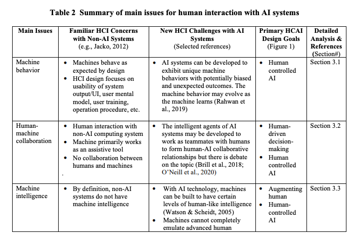

Figure 13: Figures from D. Wang et al. (2024)

## Human Creativity in the Age of LLMs: Randomized Experiments on Divergent and Convergent Thinking

Kumar, H., Vincentius, J., Jordan, E., & Anderson, A. (2024). **Human
Creativity in the Age of LLMs: Randomized Experiments on Divergent and
Convergent Thinking** (No. arXiv:2410.03703). arXiv.
http://arxiv.org/abs/2410.03703

Abstract

Large language models are transforming the creative process by offering
unprecedented capabilities to algorithmically generate ideas. While
these tools can enhance human creativity when people co-create with
them, it’s unclear how this will impact unassisted human creativity. We
conducted two large pre-registered parallel experiments involving 1,100
participants attempting tasks targeting the two core components of
creativity, divergent and convergent thinking. We compare the effects of
two forms of large language model (LLM) assistance – a standard LLM
providing direct answers and a coach-like LLM offering guidance – with a
control group receiving no AI assistance, and focus particularly on how
all groups perform in a final, unassisted stage. Our findings reveal
that while LLM assistance can provide short-term boosts in creativity
during assisted tasks, it may inadvertently hinder independent creative
performance when users work without assistance, raising concerns about
the long-term impact on human creativity and cognition.

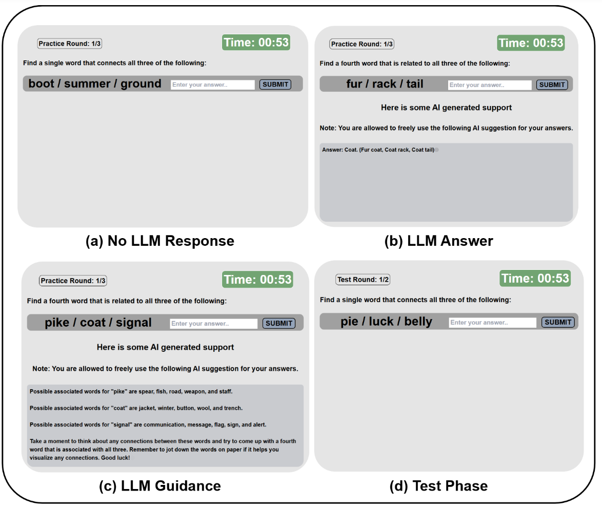

Figure 14: Figures from Kumar et al. (2024)

## To Trust or to Think: Cognitive Forcing Functions Can Reduce Overreliance on AI in AI-assisted Decision-making

Buçinca, Z., Malaya, M. B., & Gajos, K. Z. (2021). **To Trust or to
Think: Cognitive Forcing Functions Can Reduce Overreliance on AI in
AI-assisted Decision-making.** Proceedings of the ACM on Human-Computer
Interaction, 5(CSCW1), 1–21. https://doi.org/10.1145/3449287

Abstract

People supported by AI-powered decision support tools frequently
overrely on the AI: they accept an AI’s suggestion even when that
suggestion is wrong. Adding explanations to the AI decisions does not
appear to reduce the overreliance and some studies suggest that it might
even increase it. Informed by the dual-process theory of cognition, we
posit that people rarely engage analytically with each individual AI
recommendation and explanation, and instead develop general heuristics
about whether and when to follow the AI suggestions. Building on prior
research on medical decision-making, we designed three cognitive forcing
interventions to compel people to engage more thoughtfully with the
AI-generated explanations. We conducted an experiment (N=199), in which
we compared our three cognitive forcing designs to two simple
explainable AI approaches and to a no-AI baseline. The results
demonstrate that cognitive forcing significantly reduced overreliance
compared to the simple explainable AI approaches. However, there was a
trade-off: people assigned the least favorable subjective ratings to the
designs that reduced the overreliance the most. To audit our work for
intervention-generated inequalities, we investigated whether our
interventions benefited equally people with different levels of Need for
Cognition (i.e., motivation to engage in effortful mental activities).
Our results show that, on average, cognitive forcing interventions
benefited participants higher in Need for Cognition more. Our research
suggests that human cognitive motivation moderates the effectiveness of
explainable AI solutions.

## AI can help humans find common ground in democratic deliberation.

Tessler, M. H., Bakker, M. A., Jarrett, D., Sheahan, H., Chadwick, M.
J., Koster, R., Evans, G., Campbell-Gillingham, L., Collins, T., Parkes,
D. C., Botvinick, M., & Summerfield, C. (2024). **AI can help humans
find common ground in democratic deliberation.** Science, 386(6719),
eadq2852. https://doi.org/10.1126/science.adq2852

Abstract

Finding agreement through a free exchange of views is often difficult.
Collective deliberation can be slow, difficult to scale, and unequally
attentive to different voices. In this study, we trained an artificial
intelligence (AI) to mediate human deliberation. Using participants’
personal opinions and critiques, the AI mediator iteratively generates
and refines statements that express common ground among the group on
social or political issues. Participants (N = 5734) preferred
AI-generated statements to those written by human mediators, rating them
as more informative, clear, and unbiased. Discussants often updated
their views after the deliberation, converging on a shared perspective.
Text embeddings revealed that successful group statements incorporated
dissenting voices while respecting the majority position. These findings
were replicated in a virtual citizens’ assembly involving a
demographically representative sample of the UK population.

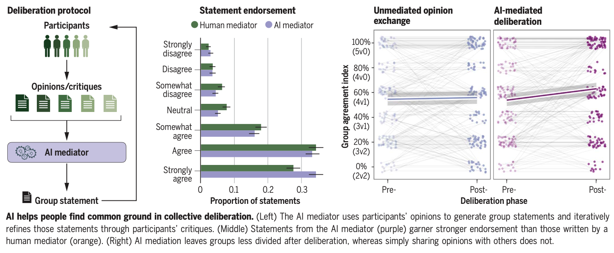

Figure 15: Figures from Tessler et al. (2024)

## Evaluating Language Models for Mathematics through Interactions

Collins, K. M., Jiang, A. Q., Frieder, S., Wong, L., Zilka, M., Bhatt,
U., Lukasiewicz, T., Wu, Y., Tenenbaum, J. B., Hart, W., Gowers, T., Li,
W., Weller, A., & Jamnik, M. (2023). **Evaluating Language Models for
Mathematics through Interactions** (No. arXiv:2306.01694). arXiv.
http://arxiv.org/abs/2306.01694

Abstract

The standard methodology of evaluating large language models (LLMs)
based on static pairs of inputs and outputs is insufficient for
developing assistants: this kind of assessments fails to take into
account the essential interactive element in their deployment, and
therefore limits how we understand language model capabilities. We
introduce CheckMate, an adaptable prototype platform for humans to
interact with and evaluate LLMs. We conduct a study with CheckMate to
evaluate three language models~(InstructGPT, ChatGPT, and GPT-4) as
assistants in proving undergraduate-level mathematics, with a mixed
cohort of participants from undergraduate students to professors of
mathematics. We release the resulting interaction and rating dataset,
MathConverse. By analysing MathConverse, we derive a preliminary
taxonomy of human behaviours and uncover that despite a generally
positive correlation, there are notable instances of divergence between
correctness and perceived helpfulness in LLM generations, amongst other
findings. Further, we identify useful scenarios and existing issues of
GPT-4 in mathematical reasoning through a series of case studies
contributed by expert mathematicians. We conclude with actionable
takeaways for ML practitioners and mathematicians: models which
communicate uncertainty, respond well to user corrections, are more
interpretable and concise may constitute better assistants; interactive
evaluation is a promising way to continually navigate the capability of
these models; humans should be aware of language models’ algebraic
fallibility, and for that reason discern where they should be used.

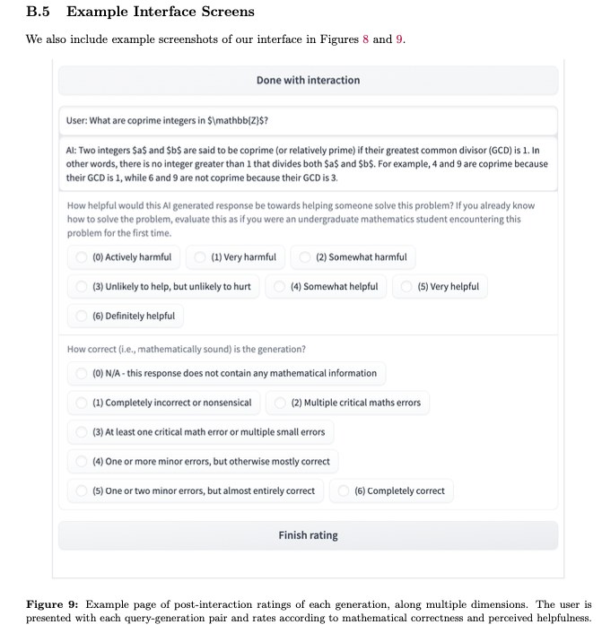

Figure 16: Figures from Collins et al. (2023)

## Large Language Models Experimentation Interface

Laban, G., Laban, T., & Gunes, H. (2024). **LEXI: Large Language Models
Experimentation Interface** (No. arXiv:2407.01488). arXiv.
http://arxiv.org/abs/2407.01488

Abstract

The recent developments in Large Language Models (LLM), mark a
significant moment in the research and development of social
interactions with artificial agents. These agents are widely deployed in
a variety of settings, with potential impact on users. However, the
study of social interactions with agents powered by LLM is still
emerging, limited by access to the technology and to data, the absence
of standardised interfaces, and challenges to establishing controlled
experimental setups using the currently available business-oriented
platforms. To answer these gaps, we developed LEXI, LLMs Experimentation
Interface, an open-source tool enabling the deployment of artificial
agents powered by LLM in social interaction behavioural experiments.
Using a graphical interface, LEXI allows researchers to build agents,
and deploy them in experimental setups along with forms and
questionnaires while collecting interaction logs and self-reported data.
The outcomes of usability testing indicate LEXI’s broad utility, high
usability and minimum mental workload requirement, with distinctive
benefits observed across disciplines. A proof-of-concept study exploring
the tool’s efficacy in evaluating social HAIs was conducted, resulting
in high-quality data. A comparison of empathetic versus neutral agents
indicated that people perceive empathetic agents as more social, and
write longer and more positive messages towards them.

Laban et al. (2024)

## Human-AI Collaboration in Cooperative Games: A Study of Playing Codenames with an LLM Assistant

Sidji, M., Smith, W., & Rogerson, M. J. (2024). **Human-AI Collaboration
in Cooperative Games: A Study of Playing Codenames with an LLM
Assistant.** Proc. ACM Hum.-Comput. Interact., 8(CHI PLAY),
316:1-316:25. https://doi.org/10.1145/3677081

Abstract

Playing partial information, restricted communication, cooperative
(PIRCC) games with humans have proven challenging for AI, due to our
reliance on social dynamics and sophisticated cognitive techniques. Yet,
recent advances in generative AI may change this situation through new
forms of human-AI collaboration. This paper investigates how teams of
players interact with an AI assistant in the PIRCC game Codenames and
the impact this has on cognition, social dynamics, and player
experience. We observed gameplay and conducted post-game focus groups
with 54 participants across ten groups. Each group played three rounds
of Codenames, with an AI assistant supporting Cluegivers. We found the
AI assistant enhanced players’ convergent and divergent thinking, but
interfered with formation of team mental models, highlighting a tension
in the use of AI in creative team scenarios. The presence of the AI
challenged many players’ understanding of the ‘spirit of the game’.
Furthermore, the presence of the AI assistants weakened social
connections between human teammates, but strengthened connections across
teams. This paper provides an empirical account of an AI assistant’s
effect on cognition, social dynamics, and player experience in
Codenames. We highlight the opportunities and challenges that arise when
designing hybrid digital boardgames that include AI assistants.

Sidji et al. (2024)

## Effects of interacting with a large language model compared with a human coach on the clinical diagnostic process and outcomes among fourth-year medical students: Study protocol for a prospective, randomised experiment using patient vignettes

Kämmer, J. E., Hautz, W. E., Krummrey, G., Sauter, T. C., Penders, D.,
Birrenbach, T., & Bienefeld, N. (2024). **Effects of interacting with a
large language model compared with a human coach on the clinical
diagnostic process and outcomes among fourth-year medical students:
Study protocol for a prospective, randomised experiment using patient
vignettes.** BMJ Open, 14(7), e087469.
https://doi.org/10.1136/bmjopen-2024-087469

Abstract

Versatile large language models (LLMs) have the potential to augment
diagnostic decision-­making by assisting diagnosticians, thanks to their
ability to engage in open-­ended, natural conversations and their
comprehensive knowledge access. Yet the novelty of LLMs in diagnostic
decision-­making introduces uncertainties regarding their impact.
Clinicians unfamiliar with the use of LLMs in their professional context
may rely on general attitudes towards LLMs more broadly, potentially
hindering thoughtful use and critical evaluation of their input, leading
to either over-­reliance and lack of critical thinking or an
unwillingness to use LLMs as diagnostic aids. To address these concerns,
this study examines the influence on the diagnostic process and outcomes
of interacting with an LLM compared with a human coach, and of prior
training vs no training for interacting with either of these ‘coaches’.
Our findings aim to illuminate the potential benefits and risks of
employing artificial intelligence (AI) in diagnostic decision-­making.
Methods and analysis  We are conducting a prospective, randomised
experiment with N=158 fourth-­year medical students from Charité Medical
School, Berlin, Germany. Participants are asked to diagnose patient
vignettes after being assigned to either a human coach or ChatGPT and
after either training or no training (both between-­subject factors). We
are specifically collecting data on the effects of using either of these
‘coaches’ and of additional training on information search, number of
hypotheses entertained, diagnostic accuracy and confidence. Statistical
methods will include linear mixed effects models. Exploratory analyses
of the interaction patterns and attitudes towards AI will also generate
more generalisable knowledge about the role of AI in medicine.

## Enhancing AI-Assisted Group Decision Making through LLM-Powered Devil’s Advocate.

Chiang, C.-W., Lu, Z., Li, Z., & Yin, M. (2024). **Enhancing AI-Assisted
Group Decision Making through LLM-Powered Devil’s Advocate.**
Proceedings of the 29th International Conference on Intelligent User
Interfaces, 103–119. https://doi.org/10.1145/3640543.3645199

Abstract

Group decision making plays a crucial role in our complex and
interconnected world. The rise of AI technologies has the potential to
provide data-driven insights to facilitate group decision making,
although it is found that groups do not always utilize AI assistance
appropriately. In this paper, we aim to examine whether and how the
introduction of a devil’s advocate in the AI-assisted group deci- sion
making processes could help groups better utilize AI assistance and
change the perceptions of group processes during decision making.
Inspired by the exceptional conversational capabilities ex- hibited by
modern large language models (LLMs), we design four different styles of
devil’s advocate powered by LLMs, varying their interactivity (i.e.,
interactive vs. non-interactive) and their target of objection (i.e.,
challenge the AI recommendation or the majority opinion within the
group). Through a randomized human-subject experiment, we find evidence
suggesting that LLM-powered devil’s advocates that argue against the AI
model’s decision recommenda- tion have the potential to promote groups’
appropriate reliance on AI. Meanwhile, the introduction of LLM-powered
devil’s advocate usually does not lead to substantial increases in
people’s perceived workload for completing the group decision making
tasks, while interactive LLM-powered devil’s advocates are perceived as
more collaborating and of higher quality. We conclude by discussing the
practical implications of our findings.

# References

Abdelnabi, S., Gomaa, A., Sivaprasad, S., Schönherr, L., & Fritz, M.
(2023). *LLM-Deliberation: Evaluating LLMs with Interactive Multi-Agent
Negotiation Games.* <https://doi.org/10.60882/cispa.25233028.v1>

Almashor, M., & Miyashita, Y. (2024). Can Private LLM Agents Synthesize
Household Energy Consumption Data? *Proceedings of the 15th ACM
International Conference on Future and Sustainable Energy Systems*,
664–668. <https://doi.org/10.1145/3632775.3661993>

Banerjee, D., Teso, S., Sayin, B., & Passerini, A. (2024). *Learning To
Guide Human Decision Makers With Vision-Language Models*
(arXiv:2403.16501). arXiv. <https://arxiv.org/abs/2403.16501>

Bhatia, S. (2024). Exploring variability in risk taking with large
language models. *Journal of Experimental Psychology: General*,
*153*(7), 1838–1860. <https://doi.org/10.1037/xge0001607>

Bienefeld, N., Kolbe, M., Camen, G., Huser, D., & Buehler, P. K. (2023).
Human-AI teaming: Leveraging transactive memory and speaking up for
enhanced team effectiveness. *Frontiers in Psychology*, *14*.
<https://doi.org/10.3389/fpsyg.2023.1208019>

Binz, M., & Schulz, E. (2023). Using cognitive psychology to understand
GPT-3. *Proceedings of the National Academy of Sciences*, *120*(6),
e2218523120. <https://doi.org/10.1073/pnas.2218523120>

Buçinca, Z., Malaya, M. B., & Gajos, K. Z. (2021). To Trust or to Think:
Cognitive Forcing Functions Can Reduce Overreliance on AI in
AI-assisted Decision-making. *Proceedings of
the ACM on Human-Computer Interaction*, *5*(CSCW1), 1–21.
<https://doi.org/10.1145/3449287>

Burton, J. W., Lopez-Lopez, E., Hechtlinger, S., Rahwan, Z., Aeschbach,
S., Bakker, M. A., Becker, J. A., Berditchevskaia, A., Berger, J.,
Brinkmann, L., Flek, L., Herzog, S. M., Huang, S., Kapoor, S.,
Narayanan, A., Nussberger, A.-M., Yasseri, T., Nickl, P., Almaatouq, A.,
… Hertwig, R. (2024). How large language models can reshape collective
intelligence. *Nature Human Behaviour*, 1–13.
<https://doi.org/10.1038/s41562-024-01959-9>

Calò, T., & De Russis, L. (2024). Enhancing smart home interaction
through multimodal command disambiguation. *Personal and Ubiquitous
Computing*. <https://doi.org/10.1007/s00779-024-01827-3>

Chen, Y., Liu, T. X., Shan, Y., & Zhong, S. (2023). The emergence of
economic rationality of GPT. *Proceedings of the National Academy of
Sciences*, *120*(51), e2316205120.
<https://doi.org/10.1073/pnas.2316205120>

Cheung, V., Maier, M., & Lieder, F. (2024). *Large Language Models
Amplify Human Biases in Moral Decision-Making*.
<https://doi.org/10.31234/osf.io/aj46b>

Chiang, C.-W., Lu, Z., Li, Z., & Yin, M. (2024). Enhancing AI-Assisted
Group Decision Making through LLM-Powered Devil’s Advocate. *Proceedings
of the 29th International Conference on Intelligent User Interfaces*,
103–119. <https://doi.org/10.1145/3640543.3645199>

Choi, A. S., Akter, S. S., Singh, J. P., & Anastasopoulos, A. (2024).
*The LLM Effect: Are Humans Truly Using LLMs, or Are They Being
Influenced By Them Instead?* (arXiv:2410.04699). arXiv.
<https://arxiv.org/abs/2410.04699>

Chuang, Y.-S., Harlalka, N., Suresh, S., Goyal, A., Hawkins, R., Yang,
S., Shah, D., Hu, J., & Rogers, T. T. (2024). *The Wisdom of Partisan
Crowds: Comparing Collective Intelligence in Humans and
LLM-based Agents*.

Chuang, Y.-S., Suresh, S., Harlalka, N., Goyal, A., Hawkins, R., Yang,
S., Shah, D., Hu, J., & Rogers, T. T. (2023). *Evaluating LLM Agent
Group Dynamics against Human Group Dynamics: A Case Study on Wisdom of
Partisan Crowds* (arXiv:2311.09665). arXiv.
<https://arxiv.org/abs/2311.09665>

Civitarese, G., Fiori, M., Choudhary, P., & Bettini, C. (2024). *Large
Language Models are Zero-Shot Recognizers for Activities of Daily
Living* (arXiv:2407.01238). arXiv. <https://arxiv.org/abs/2407.01238>

Collins, K. M., Jiang, A. Q., Frieder, S., Wong, L., Zilka, M., Bhatt,
U., Lukasiewicz, T., Wu, Y., Tenenbaum, J. B., Hart, W., Gowers, T., Li,
W., Weller, A., & Jamnik, M. (2023). *Evaluating Language Models for
Mathematics through Interactions* (arXiv:2306.01694). arXiv.
<https://arxiv.org/abs/2306.01694>

Collins, K. M., Sucholutsky, I., Bhatt, U., Chandra, K., Wong, L., Lee,
M., Zhang, C. E., Zhi-Xuan, T., Ho, M., Mansinghka, V., Weller, A.,
Tenenbaum, J. B., & Griffiths, T. L. (2024). Building machines that
learn and think with people. *Nature Human Behaviour*, *8*(10),
1851–1863. <https://doi.org/10.1038/s41562-024-01991-9>

Du, Y., Rajivan, P., & Gonzalez, C. C. (2024). *Large Language Models
for Collective Problem-Solving: Insights into Group Consensus
Decision-Making*.

Eigner, E., & Händler, T. (2024). *Determinants of
LLM-assisted Decision-Making*
(arXiv:2402.17385). arXiv. <https://arxiv.org/abs/2402.17385>

Gallo, S., Paternò, F., & Malizia, A. (2024). A conversational agent for
creating automations exploiting large language models. *Personal and
Ubiquitous Computing*. <https://doi.org/10.1007/s00779-024-01825-5>

Gao, C., Lan, X., Li, N., Yuan, Y., Ding, J., Zhou, Z., Xu, F., & Li, Y.
(2024). Large language models empowered agent-based modeling and
simulation: A survey and perspectives. *Humanities and Social Sciences
Communications*, *11*(1), 1–24.
<https://doi.org/10.1057/s41599-024-03611-3>

Gao, J., Gebreegziabher, S. A., Choo, K. T. W., Li, T. J.-J., Perrault,
S. T., & Malone, T. W. (2024). A Taxonomy for Human-LLM Interaction
Modes: An Initial Exploration. *Extended Abstracts of the CHI Conference
on Human Factors in Computing Systems*, 1–11.
<https://doi.org/10.1145/3613905.3650786>

Gao, Y., Lee, D., Burtch, G., & Fazelpour, S. (2024). *Take Caution in
Using LLMs as Human Surrogates: Scylla Ex Machina* (arXiv:2410.19599).
arXiv. <https://arxiv.org/abs/2410.19599>

Giudici, M., Padalino, L., Paolino, G., Paratici, I., Pascu, A. I., &
Garzotto, F. (2024). Designing Home Automation Routines Using an
LLM-Based Chatbot. *Designs*, *8*(3), 43.
<https://doi.org/10.3390/designs8030043>

Goli, A., & Singh, A. (2024). Can Large Language Models Capture Human
Preferences? *Marketing Science*.
<https://doi.org/10.1287/mksc.2023.0306>

Guo, X., Huang, K., Liu, J., Fan, W., Vélez, N., Wu, Q., Wang, H.,
Griffiths, T. L., & Wang, M. (2024). *Embodied LLM Agents Learn to
Cooperate in Organized Teams* (arXiv:2403.12482). arXiv.
<https://arxiv.org/abs/2403.12482>

Hagendorff, T., Fabi, S., & Kosinski, M. (2023). Human-like intuitive
behavior and reasoning biases emerged in large language models but
disappeared in ChatGPT. *Nature Computational Science*, *3*(10),
833–838. <https://doi.org/10.1038/s43588-023-00527-x>

Hao, X., Demir, E., & Eyers, D. (2024). Exploring collaborative
decision-making: A quasi-experimental study of human and Generative AI
interaction. *Technology in Society*, *78*, 102662.
<https://doi.org/10.1016/j.techsoc.2024.102662>

Hiremath, S. K., & Plötz, T. (2024). Game of LLMs: Discovering
Structural Constructs in Activities using Large Language Models.
*Companion of the 2024 on ACM International Joint Conference on
Pervasive and Ubiquitous Computing*, 487–492.
<https://doi.org/10.1145/3675094.3678444>

Isaza-Giraldo, A., Bala, P., Campos, P. F., & Pereira, L. (2024).
Prompt-Gaming: A Pilot Study on LLM-Evaluating Agent in a Meaningful
Energy Game. *Extended Abstracts of the 2024 CHI Conference on Human
Factors in Computing Systems*, 1–12.
<https://doi.org/10.1145/3613905.3650774>

Jin, M., Sel, B., Hardeep, F., & Yin, W. (2023). *A
Human-on-the-Loop Optimization Autoformalism
Approach for Sustainability* (arXiv:2308.10380). arXiv.
<https://arxiv.org/abs/2308.10380>

Joshi, H., Liu, S., Chen, J., Weigle, R., & Lam, M. S. (2024).
*LLM-Based Open-Domain Integrated Task and Knowledge Assistants with
Programmable Policies* (arXiv:2407.05674). arXiv.
<https://arxiv.org/abs/2407.05674>

Kämmer, J. E., Hautz, W. E., Krummrey, G., Sauter, T. C., Penders, D.,
Birrenbach, T., & Bienefeld, N. (2024). Effects of interacting with a
large language model compared with a human coach on the clinical
diagnostic process and outcomes among fourth-year medical students:
Study protocol for a prospective, randomised experiment using patient
vignettes. *BMJ Open*, *14*(7), e087469.
<https://doi.org/10.1136/bmjopen-2024-087469>

King, E., Yu, H., Lee, S., & Julien, C. (2024). Sasha: Creative
Goal-Oriented Reasoning in Smart Homes with Large Language Models.
*Proceedings of the ACM on Interactive, Mobile, Wearable and Ubiquitous
Technologies*, *8*(1), 1–38. <https://doi.org/10.1145/3643505>

King, E., Yu, H., Vartak, S., Jacob, J., Lee, S., & Julien, C. (2024).
*Thoughtful Things: Building Human-Centric Smart Devices with Small
Language Models* (arXiv:2405.03821). arXiv.
<https://arxiv.org/abs/2405.03821>

Koehl, D., & Vangsness, L. (2023). Measuring Latent Trust Patterns in
Large Language Models in the Context of Human-AI Teaming. *Proceedings
of the Human Factors and Ergonomics Society Annual Meeting*, *67*.
<https://doi.org/10.1177/21695067231192869>

Kumar, H., Vincentius, J., Jordan, E., & Anderson, A. (2024). *Human
Creativity in the Age of LLMs: Randomized Experiments on Divergent and
Convergent Thinking* (arXiv:2410.03703). arXiv.
<https://arxiv.org/abs/2410.03703>

Laban, G., Laban, T., & Gunes, H. (2024). *LEXI: Large Language Models
Experimentation Interface* (arXiv:2407.01488). arXiv.
<https://arxiv.org/abs/2407.01488>

Lai, V., Chen, C., Smith-Renner, A., Liao, Q. V., & Tan, C. (2023).
Towards a Science of Human-AI Decision Making: An Overview of Design
Space in Empirical Human-Subject Studies. *2023 ACM Conference on
Fairness, Accountability, and Transparency*, 1369–1385.
<https://doi.org/10.1145/3593013.3594087>

Lampinen, A. K., Dasgupta, I., Chan, S. C. Y., Sheahan, H. R., Creswell,
A., Kumaran, D., McClelland, J. L., & Hill, F. (2024). Language models,
like humans, show content effects on reasoning tasks. *PNAS Nexus*,
*3*(7), pgae233. <https://doi.org/10.1093/pnasnexus/pgae233>

Li, H., Kam-Kwai, W., Luo, Y., Chen, J., Liu, C., Zhang, Y., Lau, A. K.
H., Qu, H., & Liu, D. (2024). *Save It for the "Hot" Day: An
LLM-Empowered Visual Analytics System for Heat Risk Management*
(arXiv:2406.03317). arXiv. <https://arxiv.org/abs/2406.03317>

Lu, J., Tian, X., Zhang, C., Zhao, Y., Zhang, J., Zhang, W., Feng, C.,
He, J., Wang, J., & He, F. (2024). Evaluation of large language models
(LLMs) on the mastery of knowledge and skills in the heating,
ventilation and air conditioning (HVAC) industry. *Energy and Built
Environment*. <https://doi.org/10.1016/j.enbenv.2024.03.010>

Ma, S., Chen, Q., Wang, X., Zheng, C., Peng, Z., Yin, M., & Ma, X.
(2024). *Towards Human-AI Deliberation: Design and Evaluation of
LLM-Empowered Deliberative AI for AI-Assisted Decision-Making*
(arXiv:2403.16812). arXiv. <https://arxiv.org/abs/2403.16812>

Macmillan-Scott, O., & Musolesi, M. (2024). (Ir)rationality and
cognitive biases in large language models. *Royal Society Open Science*,
*11*(6), 240255. <https://doi.org/10.1098/rsos.240255>

Marjieh, R., Gokhale, A., Bullo, F., & Griffiths, T. L. (2024). *Task
Allocation in Teams as a Multi-Armed Bandit*.

Matz, S. C., Teeny, J. D., Vaid, S. S., Peters, H., Harari, G. M., &
Cerf, M. (2024). The potential of generative AI for personalized
persuasion at scale. *Scientific Reports*, *14*(1), 4692.
<https://doi.org/10.1038/s41598-024-53755-0>

Mei, Q., Xie, Y., Yuan, W., & Jackson, M. O. (2024). A Turing test of
whether AI chatbots are behaviorally similar to humans. *Proceedings of
the National Academy of Sciences*, *121*(9), e2313925121.
<https://doi.org/10.1073/pnas.2313925121>

Mongaillard, T., Lasaulce, S., Hicheur, O., Zhang, C., Bariah, L.,
Varma, V. S., Zou, H., Zhao, Q., & Debbah, M. (2024). *Large Language
Models for Power Scheduling: A User-Centric Approach*
(arXiv:2407.00476). arXiv. <https://arxiv.org/abs/2407.00476>

Narayanan, S., Yu, G., Ho, C.-J., & Yin, M. (2023). How does Value
Similarity affect Human Reliance in AI-Assisted Ethical Decision Making?
*Proceedings of the 2023 AAAI/ACM Conference on AI, Ethics, and
Society*, 49–57. <https://doi.org/10.1145/3600211.3604709>

Nguyen, J. (2024). Human Bias in AI Models? Anchoring Effects and
Mitigation Strategies in Large Language Models. *Journal of Behavioral
and Experimental Finance*, 100971.
<https://doi.org/10.1016/j.jbef.2024.100971>

Nishida, Y., Shimojo, S., & Hayashi, Y. (2024). Conversational Agent
Dynamics with Minority Opinion and Cognitive Conflict in Small-Group
Decision-Making. *Japanese Psychological Research*.
<https://doi.org/10.1111/jpr.12552>

Nisioti, E., Risi, S., Momennejad, I., Oudeyer, P.-Y., & Moulin-Frier,
C. (2024, July). Collective Innovation in Groups of Large Language
Models. *ALIFE 2024: Proceedings of the 2024 Artificial Life
Conference*. <https://doi.org/10.1162/isal_a_00730>

Nobandegani, A. S., Rish, I., & Shultz, T. R. (2023). Decision-Making
Paradoxes in Humans vs Machines: The case of the Allais and Ellsberg
Paradoxes. *Proceedings of the Annual Meeting of the Cognitive Science
Society*, *46*.

Oprea, S.-V., & Bâra, A. (2024). A Recommendation System for Prosumers
Based on Large Language Models. *Sensors*, *24*(11), 3530.
<https://doi.org/10.3390/s24113530>

Rastogi, C., Leqi, L., Holstein, K., & Heidari, H. (2023). A Taxonomy of
Human and ML Strengths in Decision-Making to Investigate Human-ML
Complementarity. *Proceedings of the AAAI Conference on Human
Computation and Crowdsourcing*, *11*, 127–139.
<https://doi.org/10.1609/hcomp.v11i1.27554>

Rastogi, C., Zhang, Y., Wei, D., Varshney, K. R., Dhurandhar, A., &
Tomsett, R. (2022). Deciding Fast and Slow: The Role of Cognitive Biases
in AI-assisted Decision-making. *Proceedings
of the ACM on Human-Computer Interaction*, *6*(CSCW1), 1–22.
<https://doi.org/10.1145/3512930>

Roberts, J., Moore, K., Pham, T., Ewaleifoh, O., & Fisher, D. (2024).
*Large Language Model Recall Uncertainty is Modulated by the Fan
Effect*.

Saleh, A., Donta, P. K., Morabito, R., Motlagh, N. H., & Lovén, L.
(2024). *Follow-Me AI: Energy-Efficient User Interaction with Smart
Environments* (arXiv:2404.12486). arXiv.
<https://arxiv.org/abs/2404.12486>

Sidji, M., Smith, W., & Rogerson, M. J. (2024). Human-AI Collaboration
in Cooperative Games: A Study of Playing Codenames with an LLM
Assistant. *Proc. ACM Hum.-Comput. Interact.*, *8*(CHI PLAY),
316:1–316:25. <https://doi.org/10.1145/3677081>

Stadler, M., Bannert, M., & Sailer, M. (2024). Cognitive ease at a cost:
LLMs reduce mental effort but compromise depth in student scientific
inquiry. *Computers in Human Behavior*, *160*, 108386.
<https://doi.org/10.1016/j.chb.2024.108386>

Subramonyam, H., Pea, R., Pondoc, C. L., Agrawala, M., & Seifert, C.
(2024). *Bridging the Gulf of Envisioning: Cognitive Design Challenges
in LLM Interfaces* (arXiv:2309.14459). arXiv.
<https://arxiv.org/abs/2309.14459>

Suri, G., Slater, L. R., Ziaee, A., & Nguyen, M. (2024). Do large
language models show decision heuristics similar to humans? A case study
using GPT-35. *Journal of Experimental Psychology: General*, *153*(4),
1066–1075. <https://doi.org/10.1037/xge0001547>

Swaroop, S., Buçinca, Z., Gajos, K. Z., & Doshi-Velez, F. (2024).
Accuracy-Time Tradeoffs in AI-Assisted Decision Making under Time
Pressure. *Proceedings of the 29th International Conference on
Intelligent User Interfaces*, 138–154.
<https://doi.org/10.1145/3640543.3645206>

Tessler, M. H., Bakker, M. A., Jarrett, D., Sheahan, H., Chadwick, M.
J., Koster, R., Evans, G., Campbell-Gillingham, L., Collins, T., Parkes,
D. C., Botvinick, M., & Summerfield, C. (2024). AI can help humans find
common ground in democratic deliberation. *Science*, *386*(6719),
eadq2852. <https://doi.org/10.1126/science.adq2852>

Tjuatja, L., Chen, V., Wu, T., Talwalkwar, A., & Neubig, G. (2024). Do
LLMs Exhibit Human-like Response Biases? A
Case Study in Survey Design. *Transactions of the Association for
Computational Linguistics*, *12*, 1011–1026.
<https://doi.org/10.1162/tacl_a_00685>

Vats, V., Nizam, M. B., Liu, M., Wang, Z., Ho, R., Prasad, M. S.,
Titterton, V., Malreddy, S. V., Aggarwal, R., Xu, Y., Ding, L., Mehta,
J., Grinnell, N., Liu, L., Zhong, S., Gandamani, D. N., Tang, X.,
Ghosalkar, R., Shen, C., … Davis, J. (2024). *A Survey on Human-AI
Teaming with Large Pre-Trained Models* (arXiv:2403.04931). arXiv.
<https://arxiv.org/abs/2403.04931>

Wang, B., Liu, J., Karimnazarov, J., & Thompson, N. (2024). Task
Supportive and Personalized Human-Large Language Model Interaction: A
User Study. *Proceedings of the 2024 ACM SIGIR Conference on Human
Information Interaction and Retrieval*, 370–375.
<https://doi.org/10.1145/3627508.3638344>

Wang, D., Zheng, K., Li, C., & Guo, J. (2024). Transitioning to
Human-Centered AI: A Systematic Review of Theories, Scenarios, and
Hypotheses in Human-AI Interactions. *Proceedings of the Association for
Information Science and Technology*, *61*(1), 673–678.
<https://doi.org/10.1002/pra2.1078>

Westphal, M., Vössing, M., Satzger, G., Yom-Tov, G. B., & Rafaeli, A.
(2023). Decision control and explanations in human-AI collaboration:
Improving user perceptions and compliance. *Computers in Human
Behavior*, *144*, 107714. <https://doi.org/10.1016/j.chb.2023.107714>

Yang, H., Siew, M., & Joe-Wong, C. (2024). *An LLM-Based Digital Twin
for Optimizing Human-in-the Loop Systems*
(arXiv:2403.16809). arXiv. <https://arxiv.org/abs/2403.16809>

Yang, J. C., Dailisan, D., Korecki, M., Hausladen, C. I., & Helbing, D.
(2024). *LLM Voting: Human Choices and AI Collective Decision Making*
(arXiv:2402.01766). arXiv. <https://arxiv.org/abs/2402.01766>

Yang, Z., Xu, X., Yao, B., Rogers, E., Zhang, S., Intille, S., Shara,
N., Gao, G. G., & Wang, D. (2024). Talk2Care: An
LLM-based Voice Assistant for Communication between Healthcare
Providers and Older Adults. *Proceedings of the ACM on Interactive,
Mobile, Wearable and Ubiquitous Technologies*, *8*(2), 1–35.
<https://doi.org/10.1145/3659625>

Yax, N., Anlló, H., & Palminteri, S. (2024). Studying and improving
reasoning in humans and machines. *Communications Psychology*, *2*(1),
1–16. <https://doi.org/10.1038/s44271-024-00091-8>

Zhang, J., Xu, X., Zhang, N., Liu, R., Hooi, B., & Deng, S. (2024).
*Exploring Collaboration Mechanisms for LLM Agents: A Social Psychology
View* (arXiv:2310.02124). arXiv. <https://arxiv.org/abs/2310.02124>

Zhang, J., Zhang, C., Lu, J., & Zhao, Y. (2025). Domain-specific large
language models for fault diagnosis of heating, ventilation, and air
conditioning systems by labeled-data-supervised fine-tuning. *Applied
Energy*, *377*, 124378. <https://doi.org/10.1016/j.apenergy.2024.124378>

Zhang, S., Wang, X., Zhang, W., Chen, Y., Gao, L., Wang, D., Zhang, W.,
Wang, X., & Wen, Y. (2024). *Mutual Theory of Mind in Human-AI
Collaboration: An Empirical Study with LLM-driven
AI Agents in a Real-time Shared Workspace
Task* (arXiv:2409.08811). arXiv.
<https://arxiv.org/abs/2409.08811>

Zhao, Y., Huang, Z., Seligman, M., & Peng, K. (2024). Risk and prosocial
behavioural cues elicit human-like response patterns from AI chatbots.
*Scientific Reports*, *14*(1), 7095.
<https://doi.org/10.1038/s41598-024-55949-y>

# Relevant Papers

## AI can help humans find common ground in democratic deliberation.

Tessler, M. H., Bakker, M. A., Jarrett, D., Sheahan, H., Chadwick, M.
J., Koster, R., Evans, G., Campbell-Gillingham, L., Collins, T., Parkes,
D. C., Botvinick, M., & Summerfield, C. (2024). **AI can help humans
find common ground in democratic deliberation.** Science, 386(6719),
eadq2852. https://doi.org/10.1126/science.adq2852

Abstract

Finding agreement through a free exchange of views is often difficult.
Collective deliberation can be slow, difficult to scale, and unequally
attentive to different voices. In this study, we trained an artificial
intelligence (AI) to mediate human deliberation. Using participants’
personal opinions and critiques, the AI mediator iteratively generates
and refines statements that express common ground among the group on
social or political issues. Participants (N = 5734) preferred
AI-generated statements to those written by human mediators, rating them
as more informative, clear, and unbiased. Discussants often updated
their views after the deliberation, converging on a shared perspective.
Text embeddings revealed that successful group statements incorporated
dissenting voices while respecting the majority position. These findings
were replicated in a virtual citizens’ assembly involving a
demographically representative sample of the UK population.

Figure 17: Figures from Tessler et al. (2024)

## Task Allocation in Teams as a Multi-Armed Bandit.

Marjieh, R., Gokhale, A., Bullo, F., & Griffiths, T. L. (2024). **Task
Allocation in Teams as a Multi-Armed Bandit.**
https://cocosci.princeton.edu/papers/marjieh2024task.pdf

Abstract

Humans rely on efficient distribution of resources to transcend the
abilities of individuals. Successful task allocation, whether in small
teams or across large institutions, depends on individuals’ ability to
discern their own and others’ strengths and weaknesses, and to optimally
act on them. This dependence creates a tension between exploring the
capabilities of others and exploiting the knowledge acquired so far,
which can be challenging. How do people navigate this tension? To
address this question, we propose a novel task allocation paradigm in
which a human agent is asked to repeatedly allocate tasks in three
distinct classes (categorizing a blurry image, detecting a noisy voice
command, and solving an anagram) between themselves and two other (bot)
team members to maximize team performance. We show that this problem can
be recast as a combinatorial multi-armed bandit which allows us to
compare people’s performance against two well-known strategies, Thompson
Sampling and Upper Confidence Bound (UCB). We find that humans are able
to successfully integrate information about the capabilities of
different team members to infer optimal allocations, and in some cases
perform on par with these optimal strategies. Our approach opens up new
avenues for studying the mechanisms underlying collective cooperation in
teams.

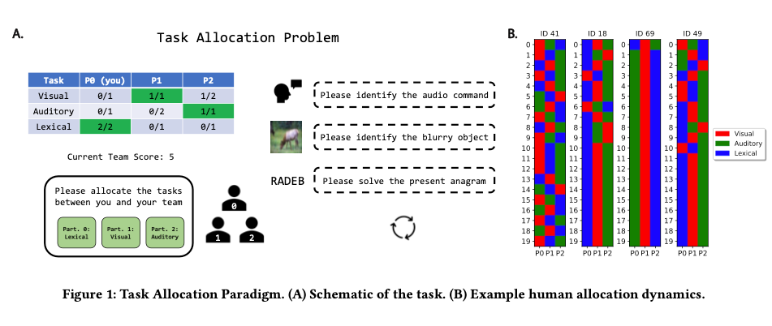

## Human-AI teaming: Leveraging transactive memory and speaking up for enhanced team effectiveness.

Bienefeld, N., Kolbe, M., Camen, G., Huser, D., & Buehler, P. K. (2023).
**Human-AI teaming: Leveraging transactive memory and speaking up for
enhanced team effectiveness.** Frontiers in Psychology, 14.
https://doi.org/10.3389/fpsyg.2023.1208019

Abstract

In this prospective observational study, we investigate the role of
transactive memory and speaking up in human-AI teams comprising 180
intensive care (ICU) physicians and nurses working with AI in a
simulated clinical environment. Our findings indicate that interactions
with AI agents differ significantly from human interactions, as
accessing information from AI agents is positively linked to a team’s
ability to generate novel hypotheses and demonstrate speaking-up
behavior, but only in higher-performing teams. Conversely, accessing
information from human team members is negatively associated with these
aspects, regardless of team performance. This study is a valuable
contribution to the expanding field of research on human-AI teams and
team science in general, as it emphasizes the necessity of incorporating
AI agents as knowledge sources in a team’s transactive memory system, as
well as highlighting their role as catalysts for speaking up. Practical
implications include suggestions for the design of future AI systems and
human-AI team training in healthcare and beyond.

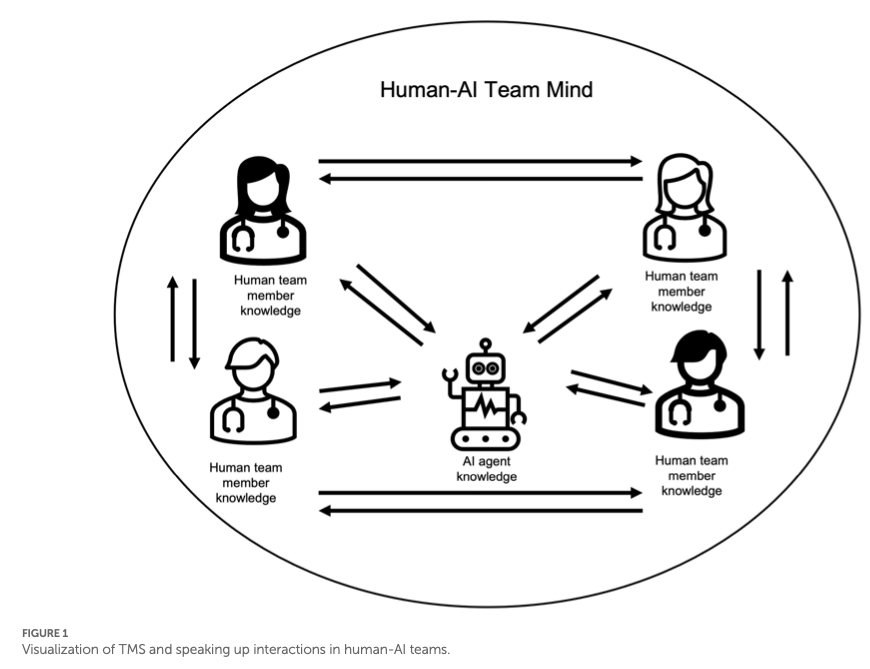

  
  

## Large language models empowered agent-based modeling and simulation: A survey and perspectives.

Gao, C., Lan, X., Li, N., Yuan, Y., Ding, J., Zhou, Z., Xu, F., & Li, Y.
(2024). **Large language models empowered agent-based modeling and
simulation: A survey and perspectives.** Humanities and Social Sciences
Communications, 11(1), 1–24. https://doi.org/10.1057/s41599-024-03611-3

Abstract

Agent-based modeling and simulation have evolved as a powerful tool for
modeling complex systems, offering insights into emergent behaviors and
interactions among diverse agents. Recently, integrating large language
models into agent-based modeling and simulation presents a promising
avenue for enhancing simulation capabilities. This paper surveys the
landscape of utilizing large language models in agent-based modeling and
simulation, discussing their challenges and promising future directions.
In this survey, since this is an interdisciplinary field, we first
introduce the background of agent-based modeling and simulation and
large language model-empowered agents. We then discuss the motivation
for applying large language models to agent-based simulation and
systematically analyze the challenges in environment perception, human
alignment, action generation, and evaluation. Most importantly, we
provide a comprehensive overview of the recent works of large language
model-empowered agent-based modeling and simulation in multiple
scenarios, which can be divided into four domains: cyber, physical,
social, and hybrid, covering simulation of both real-world and virtual
environments, and how these works address the above challenges. Finally,
since this area is new and quickly evolving, we discuss the open
problems and promising future directions. We summarize the
representative papers along with their code repositories in
https://github.com/tsinghua-fib-lab/LLM-Agent-Based-Modeling-and-Simulation.

## Building Machines that Learn and Think with People

Collins, K. M., Sucholutsky, I., Bhatt, U., Chandra, K., Wong, L., Lee,
M., Zhang, C. E., Zhi-Xuan, T., Ho, M., Mansinghka, V., Weller, A.,
Tenenbaum, J. B., & Griffiths, T. L. (2024). **Building machines that
learn and think with people.** Nature Human Behaviour, 8(10), 1851–1863.
https://doi.org/10.1038/s41562-024-01991-9

Abstract

What do we want from machine intelligence? We envision machines that are
not just tools for thought, but partners in thought: reasonable,
insightful, knowledgeable, reliable, and trustworthy systems that think
with us. Current artificial intelligence (AI) systems satisfy some of
these criteria, some of the time. In this Perspective, we show how the
science of collaborative cognition can be put to work to engineer
systems that really can be called “thought partners,” systems built to
meet our expectations and complement our limitations. We lay out several
modes of collaborative thought in which humans and AI thought partners
can engage and propose desiderata for human-compatible thought
partnerships. Drawing on motifs from computational cognitive science, we
motivate an alternative scaling path for the design of thought partners
and ecosystems around their use through a Bayesian lens, whereby the
partners we construct actively build and reason over models of the human
and world.

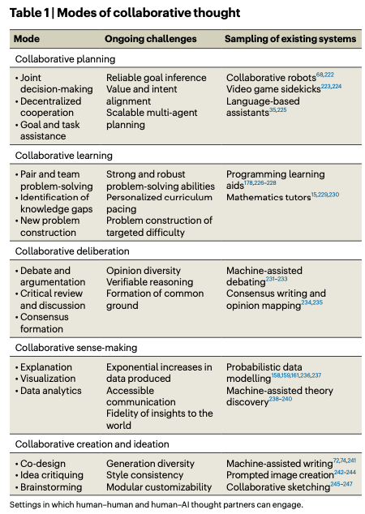

Figure 18: Figures from Collins et al. (2024)

  

## Large Language Models for Collective Problem-Solving: Insights into Group Consensus Decision-Making

Du, Y., Rajivan, P., & Gonzalez, C. C. (2024). **Large Language Models
for Collective Problem-Solving: Insights into Group Consensus
Decision-Making.** https://escholarship.org/uc/item/6s060914

Abstract

Large Language models (LLM) exhibit human-like proficiency in various
tasks such as translation, question answering, essay writing, and
programming. Emerging research explores the use of LLMs in collective
problem-solving endeavors, such as tasks where groups try to uncover
clues through discussions. Although prior work has investigated
individual problem-solving tasks, leveraging LLM-powered agents for
group consensus and decision-making remains largely unexplored. This
research addresses this gap by (1) proposing an algorithm to enable
free-form conversation in groups of LLM agents, (2) creating metrics to
evaluate the human-likeness of the generated dialogue and
problem-solving performance, and (3) evaluating LLM agent groups against
human groups using an open source dataset. Our results reveal that LLM
groups outperform human groups in problem-solving tasks. LLM groups also
show a greater improvement in scores after participating in free
discussions. In particular, analyses indicate that LLM agent groups
exhibit more disagreements, complex statements, and a propensity for
positive statements compared to human groups. The results shed light on
the potential of LLMs to facilitate collective reasoning and provide
insight into the dynamics of group interactions involving synthetic LLM
agents.

Figure 19: Figure from Du et al. (2024)

## Exploring collaborative decision-making: A quasi-experimental study of human and Generative AI interaction.

Hao, X., Demir, E., & Eyers, D. (2024). **Exploring collaborative
decision-making: A quasi-experimental study of human and Generative AI
interaction.** Technology in Society, 78, 102662.
https://doi.org/10.1016/j.techsoc.2024.102662

Abstract

This paper explores the effects of integrating Generative Artificial
Intelligence (GAI) into decision-making processes within organizations,
employing a quasi-experimental pretest-posttest design. The study
examines the synergistic interaction between Human Intelligence (HI) and
GAI across four group decision-making scenarios within three global
organizations renowned for their cutting-edge operational techniques.
The research progresses through several phases: identifying research
problems, collecting baseline data on decision-making, implementing AI
interventions, and evaluating the outcomes post-intervention to identify
shifts in performance. The results demonstrate that GAI effectively
reduces human cognitive burdens and mitigates heuristic biases by
offering data-driven support and predictive analytics, grounded in
System 2 reasoning. This is particularly valuable in complex situations
characterized by unfamiliarity and information overload, where
intuitive, System 1 thinking is less effective. However, the study also
uncovers challenges related to GAI integration, such as potential
over-reliance on technology, intrinsic biases particularly
‘out-of-the-box’ thinking without contextual creativity. To address
these issues, this paper proposes an innovative strategic framework for
HI-GAI collaboration that emphasizes transparency, accountability, and
inclusiveness.

  
  

## How large language models can reshape collective intelligence

Burton, J. W., Lopez-Lopez, E., Hechtlinger, S., Rahwan, Z., Aeschbach,
S., Bakker, M. A., Becker, J. A., Berditchevskaia, A., Berger, J.,
Brinkmann, L., Flek, L., Herzog, S. M., Huang, S., Kapoor, S.,
Narayanan, A., Nussberger, A.-M., Yasseri, T., Nickl, P., Almaatouq, A.,
… Hertwig, R. (2024). **How large language models can reshape collective
intelligence.** Nature Human Behaviour, 1–13.
https://doi.org/10.1038/s41562-024-01959-9

Abstract

Collective intelligence underpins the success of groups, organizations,
markets and societies. Through distributed cognition and coordination,
collectives can achieve outcomes that exceed the capabilities of
individuals—even experts—resulting in improved accuracy and novel
capabilities. Often, collective intelligence is supported by information
technology, such as online prediction markets that elicit the ‘wisdom of
crowds’, online forums that structure collective deliberation or digital
platforms that crowdsource knowledge from the public. Large language
models, however, are transforming how information is aggregated,
accessed and transmitted online. Here we focus on the unique
opportunities and challenges this transformation poses for collective
intelligence. We bring together interdisciplinary perspectives from
industry and academia to identify potential benefits, risks,
policy-relevant considerations and open research questions, culminating
in a call for a closer examination of how large language models affect
humans’ ability to collectively tackle complex problems.

  

## Towards Human-AI Deliberation: Design and Evaluation of LLM-Empowered Deliberative AI for AI-Assisted Decision-Making

Ma, S., Chen, Q., Wang, X., Zheng, C., Peng, Z., Yin, M., & Ma, X.
(2024). **Towards Human-AI Deliberation: Design and Evaluation of
LLM-Empowered Deliberative AI for AI-Assisted Decision-Making**
(arXiv:2403.16812). arXiv. http://arxiv.org/abs/2403.16812

Abstract

In AI-assisted decision-making, humans often passively review AI’s
suggestion and decide whether to accept or reject it as a whole. In such
a paradigm, humans are found to rarely trigger analytical thinking and
face difficulties in communicating the nuances of conflicting opinions
to the AI when disagreements occur. To tackle this challenge, we propose
Human-AI Deliberation, a novel framework to promote human reflection and
discussion on conflicting human-AI opinions in decision-making. Based on
theories in human deliberation, this framework engages humans and AI in
dimension-level opinion elicitation, deliberative discussion, and
decision updates. To empower AI with deliberative capabilities, we
designed Deliberative AI, which leverages large language models (LLMs)
as a bridge between humans and domain-specific models to enable flexible
conversational interactions and faithful information provision. An
exploratory evaluation on a graduate admissions task shows that
Deliberative AI outperforms conventional explainable AI (XAI) assistants
in improving humans’ appropriate reliance and task performance. Based on
a mixed-methods analysis of participant behavior, perception, user
experience, and open-ended feedback, we draw implications for future
AI-assisted decision tool design.

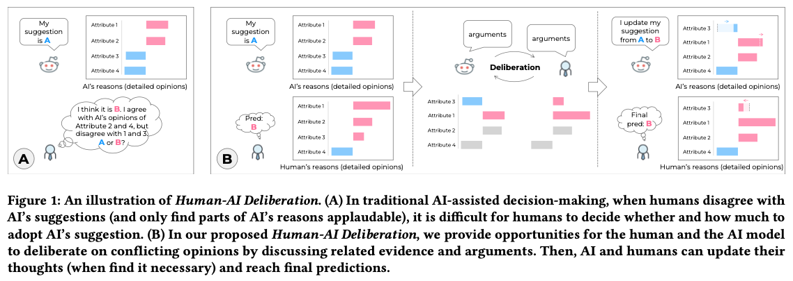

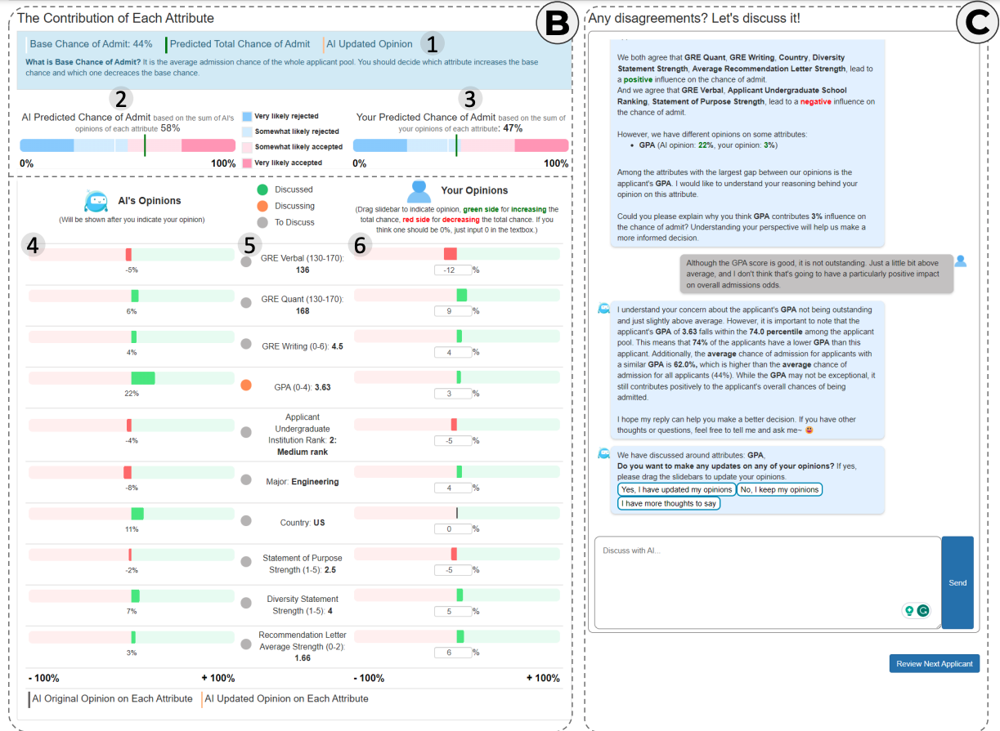

Figure 20: Figure from Ma et al. (2024)

## Enhancing AI-Assisted Group Decision Making through LLM-Powered Devil’s Advocate.

Chiang, C.-W., Lu, Z., Li, Z., & Yin, M. (2024). **Enhancing AI-Assisted
Group Decision Making through LLM-Powered Devil’s Advocate.**
Proceedings of the 29th International Conference on Intelligent User
Interfaces, 103–119. https://doi.org/10.1145/3640543.3645199

Abstract

Group decision making plays a crucial role in our complex and
interconnected world. The rise of AI technologies has the potential to
provide data-driven insights to facilitate group decision making,
although it is found that groups do not always utilize AI assistance
appropriately. In this paper, we aim to examine whether and how the
introduction of a devil’s advocate in the AI-assisted group deci- sion
making processes could help groups better utilize AI assistance and
change the perceptions of group processes during decision making.
Inspired by the exceptional conversational capabilities ex- hibited by
modern large language models (LLMs), we design four different styles of
devil’s advocate powered by LLMs, varying their interactivity (i.e.,
interactive vs. non-interactive) and their target of objection (i.e.,
challenge the AI recommendation or the majority opinion within the
group). Through a randomized human-subject experiment, we find evidence
suggesting that LLM-powered devil’s advocates that argue against the AI
model’s decision recommenda- tion have the potential to promote groups’
appropriate reliance on AI. Meanwhile, the introduction of LLM-powered
devil’s advocate usually does not lead to substantial increases in
people’s perceived workload for completing the group decision making
tasks, while interactive LLM-powered devil’s advocates are perceived as
more collaborating and of higher quality. We conclude by discussing the
practical implications of our findings.

## The Wisdom of Partisan Crowds: Comparing Collective Intelligence in Humans and LLM-based Agents

Chuang, Y.-S., Harlalka, N., Suresh, S., Goyal, A., Hawkins, R., Yang,
S., Shah, D., Hu, J., & Rogers, T. T. (2024). **The Wisdom of Partisan
Crowds: Comparing Collective Intelligence in Humans and LLM-based
Agents.** https://escholarship.org/uc/item/3k67x8s5

Abstract

Human groups are able to converge to more accurate beliefs through
deliberation, even in the presence of polarization and partisan bias — a
phenomenon known as the “wisdom of partisan crowds.” Large Language
Models (LLMs) are increasingly being used to simulate human collective
behavior, yet few benchmarks exist for evaluating their dynamics against
the behavior of human groups. In this paper, we examine the extent to
which the wisdom of partisan crowds emerges in groups of LLM-based
agents that are prompted to role-play as partisan personas (e.g.,
Democrat or Republican). We find that they not only display human-like
partisan biases, but also converge to more accurate beliefs through
deliberation, as humans do. We then identify several factors that
interfere with convergence, including the use of chain-of-thought
prompting and lack of details in personas. Conversely, fine-tuning on
human data appears to enhance convergence. These findings show the
potential and limitations of LLM-based agents as a model of human
collective intelligence.

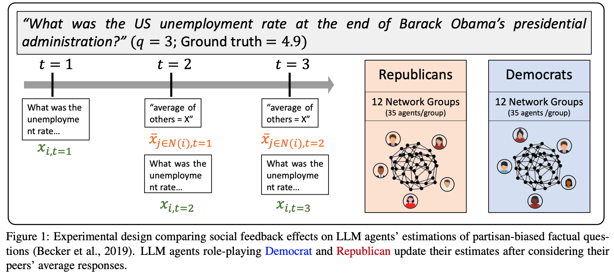

## Collective Innovation in Groups of Large Language Models.

Nisioti, E., Risi, S., Momennejad, I., Oudeyer, P.-Y., & Moulin-Frier,
C. (2024, July 7). **Collective Innovation in Groups of Large Language
Models.** ALIFE 2024: Proceedings of the 2024 Artificial Life
Conference. https://doi.org/10.1162/isal_a_00730

Abstract

Human culture relies on collective innovation: our ability to
continuously explore how existing elements in our environment can be
combined to create new ones. Language is hypothesized to play a key role
in human culture, driving individual cognitive capacities and shaping
communication. Yet the majority of models of collective innovation
assign no cognitive capacities or language abilities to agents. Here, we
contribute a computational study of collective innovation where agents
are Large Language Models (LLMs) that play Little Alchemy 2, a creative
video game originally developed for humans that, as we argue, captures
useful aspects of innovation landscapes not present in previous
test-beds. We, first, study an LLM in isolation and discover that it
exhibits both useful skills and crucial limitations. We, then, study
groups of LLMs that share information related to their behaviour and
focus on the effect of social connectivity on collective performance. In
agreement with previous human and computational studies, we observe that
groups with dynamic connectivity out-compete fully-connected groups. Our
work reveals opportunities and challenges for future studies of
collective innovation that are becoming increasingly relevant as
Generative Artificial Intelligence algorithms and humans innovate
alongside each other.

## Evaluating LLM Agent Group Dynamics against Human Group Dynamics: A Case Study on Wisdom of Partisan Crowds

Chuang, Y.-S., Suresh, S., Harlalka, N., Goyal, A., Hawkins, R., Yang,
S., Shah, D., Hu, J., & Rogers, T. T. (2023). **Evaluating LLM Agent
Group Dynamics against Human Group Dynamics: A Case Study on Wisdom of
Partisan Crowds** http://arxiv.org/abs/2311.09665

Abstract

This study investigates the potential of Large Language Models (LLMs) to
simulate human group dynamics, particularly within politically charged
contexts. We replicate the Wisdom of Partisan Crowds phenomenon using
LLMs to role-play as Democrat and Republican personas, engaging in a
structured interaction akin to human group study. Our approach evaluates
how agents’ responses evolve through social influence. Our key findings
indicate that LLM agents role-playing detailed personas and without
Chain-of-Thought (CoT) reasoning closely align with human behaviors,
while having CoT reasoning hurts the alignment. However, incorporating
explicit biases into agent prompts does not necessarily enhance the
wisdom of partisan crowds. Moreover, fine-tuning LLMs with human data
shows promise in achieving human-like behavior but poses a risk of
overfitting certain behaviors. These findings show the potential and
limitations of using LLM agents in modeling human group phenomena.

Chuang et al. (2023)

## Exploring Collaboration Mechanisms for LLM Agents: A Social Psychology View

Zhang, J., Xu, X., Zhang, N., Liu, R., Hooi, B., & Deng, S. (2024).
**Exploring Collaboration Mechanisms for LLM Agents: A Social Psychology
View** (arXiv:2310.02124). arXiv. http://arxiv.org/abs/2310.02124

<https://www.zjukg.org/project/MachineSoM/>

Abstract

As Natural Language Processing (NLP) systems are increasingly employed
in intricate social environments, a pressing query emerges: Can these
NLP systems mirror human-esque collaborative intelligence, in a
multi-agent society consisting of multiple large language models (LLMs)?
This paper probes the collaboration mechanisms among contemporary NLP
systems by melding practical experiments with theoretical insights. We
fabricate four unique ‘societies’ comprised of LLM agents, where each
agent is characterized by a specific ‘trait’ (easy-going or
overconfident) and engages in collaboration with a distinct ‘thinking
pattern’ (debate or reflection). Through evaluating these multi-agent
societies on three benchmark datasets, we discern that certain
collaborative strategies not only outshine previous top-tier approaches
but also optimize efficiency (using fewer API tokens). Moreover, our
results further illustrate that LLM agents manifest humanlike social
behaviors, such as conformity and consensus reaching, mirroring
foundational social psychology theories. In conclusion, we integrate
insights from social psychology to contextualize the collaboration of
LLM agents, inspiring further investigations into the collaboration
mechanism for LLMs. We have shared our code and datasets1, hoping to
catalyze further research in this promising avenue.

## LLM-Deliberation: Evaluating LLMs with Interactive Multi-Agent Negotiation Games.

Abdelnabi, S., Gomaa, A., Sivaprasad, S., Schönherr, L., & Fritz, M.
(2023). **LLM-Deliberation: Evaluating LLMs with Interactive Multi-Agent
Negotiation Games.** https://doi.org/10.60882/cispa.25233028.v1

Abstract

There is a growing interest in using Large Language Models (LLMs) as
agents to tackle real-world tasks that may require assessing complex
situations. Yet, we have a limited understanding of LLMs’ reasoning and
decision-making capabilities, partly stemming from a lack of dedicated
evaluation benchmarks. As negotiating and compromising are key aspects
of our everyday communication and collaboration, we propose using
scorable negotiation games as a new evaluation framework for LLMs. We
create a testbed of diverse text-based, multi-agent, multi-issue,
semantically rich negotiation games, with easily tunable difficulty. To
solve the challenge, agents need to have strong arithmetic, inference,
exploration, and planning capabilities, while seamlessly integrating
them. Via a systematic zero-shot Chain-of-Thought prompting (CoT), we
show that agents can negotiate and consistently reach successful deals.
We quantify the performance with multiple metrics and observe a large
gap between GPT-4 and earlier models. Importantly, we test the
generalization to new games and setups. Finally, we show that these
games can help evaluate other critical aspects, such as the interaction
dynamics between agents in the presence of greedy and adversarial
players.

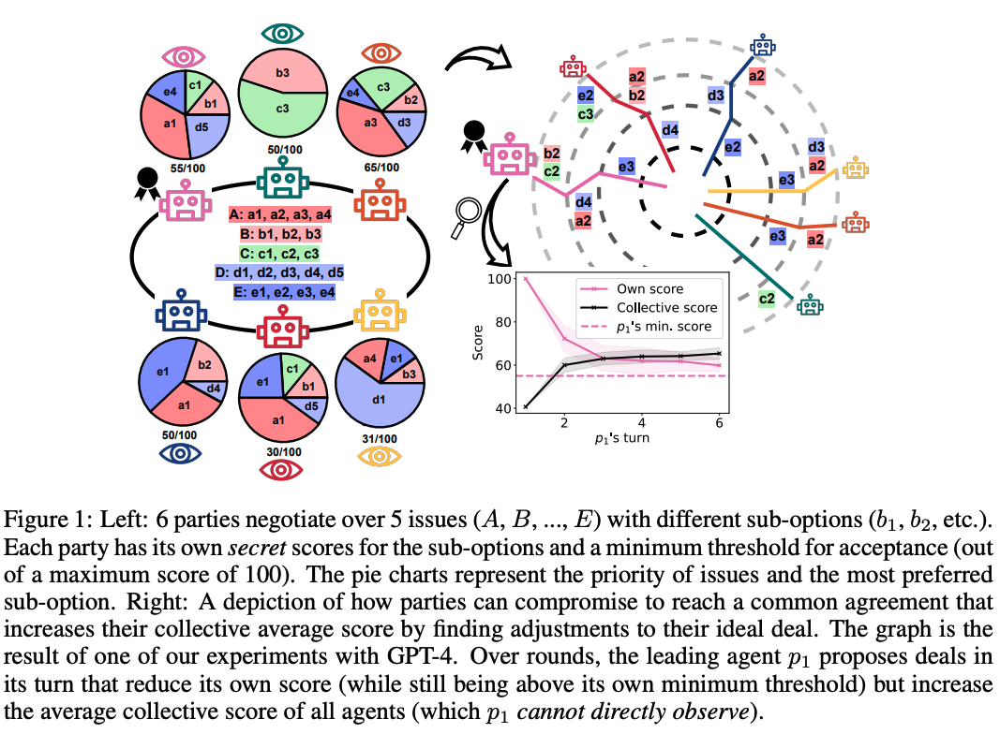

## LLM Voting: Human Choices and AI Collective Decision Making

Yang, J. C., Dailisan, D., Korecki, M., Hausladen, C. I., & Helbing, D.
(2024). **LLM Voting: Human Choices and AI Collective Decision Making**
(arXiv:2402.01766). arXiv. http://arxiv.org/abs/2402.01766

Abstract

This paper investigates the voting behaviors of Large Language Models
(LLMs), specifically GPT-4 and LLaMA-2, their biases, and how they align
with human voting patterns. Our methodology involved using a dataset
from a human voting experiment to establish a baseline for human
preferences and conducting a corresponding experiment with LLM agents.
We observed that the choice of voting methods and the presentation order
influenced LLM voting outcomes. We found that varying the persona can
reduce some of these biases and enhance alignment with human choices.
While the Chain-of-Thought approach did not improve prediction accuracy,
it has potential for AI explainability in the voting process. We also
identified a trade-off between preference diversity and alignment
accuracy in LLMs, influenced by different temperature settings. Our
findings indicate that LLMs may lead to less diverse collective outcomes
and biased assumptions when used in voting scenarios, emphasizing the
need for cautious integration of LLMs into democratic processes.

## Embodied LLM Agents Learn to Cooperate in Organized Teams

Guo, X., Huang, K., Liu, J., Fan, W., Vélez, N., Wu, Q., Wang, H.,
Griffiths, T. L., & Wang, M. (2024). **Embodied LLM Agents Learn to
Cooperate in Organized Teams** (arXiv:2403.12482). arXiv.
http://arxiv.org/abs/2403.12482

Abstract

Large Language Models (LLMs) have emerged as integral tools for
reasoning, planning, and decision-making, drawing upon their extensive
world knowledge and proficiency in language-related tasks. LLMs thus
hold tremendous potential for natural language interaction within
multi-agent systems to foster cooperation. However, LLM agents tend to
over-report and comply with any instruction, which may result in
information redundancy and confusion in multi-agent cooperation.
Inspired by human organizations, this paper introduces a framework that
imposes prompt-based organization structures on LLM agents to mitigate
these problems. Through a series of experiments with embodied LLM agents
and human-agent collaboration, our results highlight the impact of
designated leadership on team efficiency, shedding light on the
leadership qualities displayed by LLM agents and their spontaneous
cooperative behaviors. Further, we harness the potential of LLMs to
propose enhanced organizational prompts, via a Criticize-Reflect
process, resulting in novel organization structures that reduce
communication costs and enhance team efficiency.

## Measuring Latent Trust Patterns in Large Language Models in the Context of Human-AI Teaming

Koehl, D., & Vangsness, L. (2023). **Measuring Latent Trust Patterns in
Large Language Models in the Context of Human-AI Teaming.** Proceedings
of the Human Factors and Ergonomics Society Annual Meeting, 67.
https://doi.org/10.1177/21695067231192869

Abstract

Qualitative self-report methods such as think-aloud procedures and
open-ended response questions can provide valuable data to human factors
research. These measures come with analytic weaknesses, such as
researcher bias, intra- and inter-rater reliability concerns, and
time-consuming coding protocols. A possible solution exists in the
latent semantic patterns that exist in machine learning large language
models. These semantic patterns could be used to analyze qualitative
responses. This exploratory research compared the statistical quality of
automated sentence coding using large language models to the benchmarks
of self-report and behavioral measures within the context of trust in
automation research. The results indicated that three large language
models show promise as tools for analyzing qualitative responses. The
study also provides insight on minimum sample sizes for model creation
and offers recommendations for further validating the robustness of
large language models as research tools.

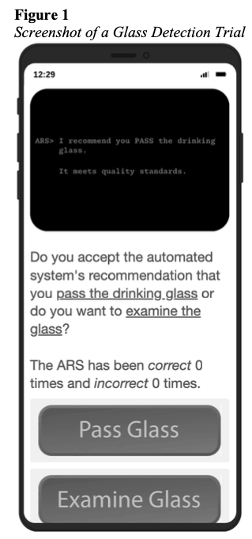

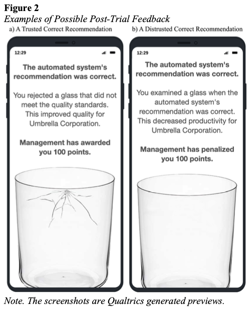

Figure 21: Koehl & Vangsness (2023)

## A Survey on Human-AI Teaming with Large Pre-Trained Models

Vats, V., Nizam, M. B., Liu, M., Wang, Z., Ho, R., Prasad, M. S.,
Titterton, V., Malreddy, S. V., Aggarwal, R., Xu, Y., Ding, L., Mehta,
J., Grinnell, N., Liu, L., Zhong, S., Gandamani, D. N., Tang, X.,
Ghosalkar, R., Shen, C., … Davis, J. (2024). **A Survey on Human-AI
Teaming with Large Pre-Trained Models** (arXiv:2403.04931). arXiv.
http://arxiv.org/abs/2403.04931

Abstract

In the rapidly evolving landscape of artificial intelligence (AI), the
collaboration between human intelligence and AI systems, known as
Human-AI (HAI) Teaming, has emerged as a cornerstone for advancing
problem-solving and decision-making processes. The advent of Large
Pre-trained Models (LPtM) has significantly transformed this landscape,
offering unprecedented capabilities by leveraging vast amounts of data
to understand and predict complex patterns. This paper surveys the
pivotal integration of LPtMs with HAI, emphasizing how these models
enhance collaborative intelligence beyond traditional approaches. It
examines the potential of LPtMs in augmenting human capabilities,
discussing this collaboration for AI model improvements, effective
teaming, ethical considerations, and their broad applied implications in
various sectors. Through this exploration, the study sheds light on the
transformative impact of LPtM-enhanced HAI Teaming, providing insights
for future research, policy development, and strategic implementations
aimed at harnessing the full potential of this collaboration for
research and societal benefit.

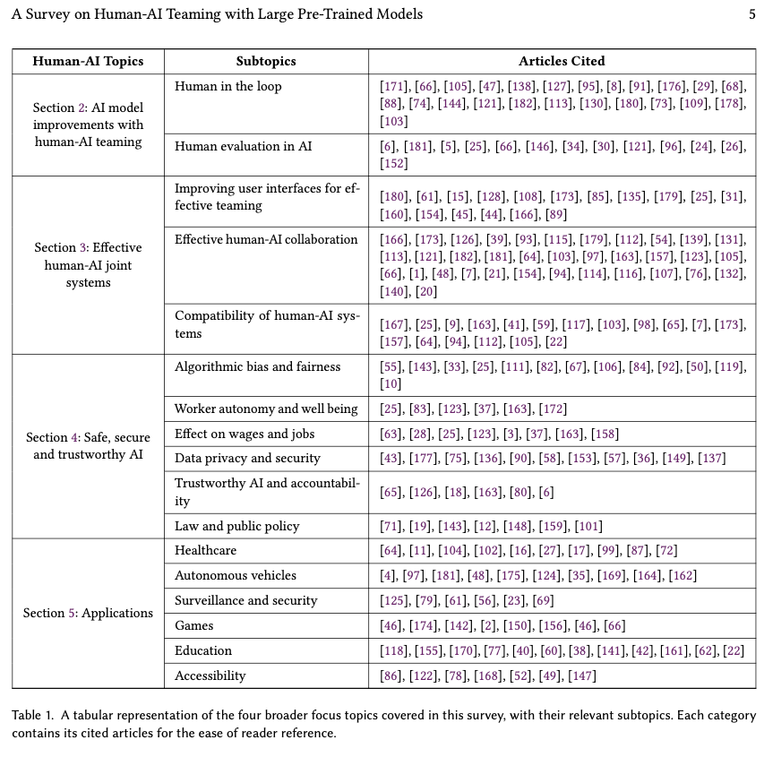

------------------------------------------------------------------------

## Conversational Agent Dynamics with Minority Opinion and Cognitive Conflict in Small-Group Decision-Making.

Nishida, Y., Shimojo, S., & Hayashi, Y. (2024). **Conversational Agent
Dynamics with Minority Opinion and Cognitive Conflict in Small-Group
Decision-Making.** Japanese Psychological Research.
https://doi.org/10.1111/jpr.12552

Abstract

This study investigated the impact of group discussions with text-based
conversational agents on risk-taking decision-making, which has been
under-researched. We also focused on the influence of opinion patterns
presented by the agents during discussions and attitudes toward these
agents. Through an online experiment, 430 participants read a
decision-seeking scenario and expressed the degree of risk they were
willing to take. After viewing the text-based opinions of six agents and
having a discussion with the agents, participants expressed the degree
of risk they were willing to take for the same scenario. The result
showed that participants’ risk-taking decisions shifted toward the
agents’ group opinions, regardless of whether the agents’ opinions
tended to be risky or cautious. Additionally, when the agents’ group
opinions were more risk-biased and included a minority opinion, a
significant association existed between the degree of the participants’
shift to a riskier decision and their positive attitudes toward the
agents. The agents’ group opinions guided participants toward both risky
and cautious decisions, and participants’ attitudes toward the agents
were associated with their decision-making, albeit to a limited extent.

## A Taxonomy for Human-LLM Interaction Modes: An Initial Exploration

Gao, J., Gebreegziabher, S. A., Choo, K. T. W., Li, T. J.-J., Perrault,
S. T., & Malone, T. W. (2024). **A Taxonomy for Human-LLM Interaction
Modes: An Initial Exploration.** Extended Abstracts of the CHI
Conference on Human Factors in Computing Systems, 1–11.
https://doi.org/10.1145/3613905.3650786

Abstract

With ChatGPT’s release, conversational prompting has become the most
popular form of human-LLM interaction. However, its effectiveness is
limited for more complex tasks involving reasoning, creativity, and
iteration. Through a systematic analysis of HCI papers published since
2021, we identified four key phases in the human-LLM interaction flow -
planning, facilitating, iterating, and testing - to precisely understand
the dynamics of this process. Additionally, we have developed a taxonomy
of four primary interaction modes: Mode 1: Standard Prompting, Mode 2:
User Interface, Mode 3: Context-based, and Mode 4: Agent Facilitator.
This taxonomy was further enriched using the “5W1H” guideline method,
which involved a detailed examination of definitions, participant roles
(Who), the phases that happened (When), human objectives and LLM
abilities (What), and the mechanics of each interaction mode (How). We
anticipate this taxonomy will contribute to the future design and
evaluation of human-LLM interaction.

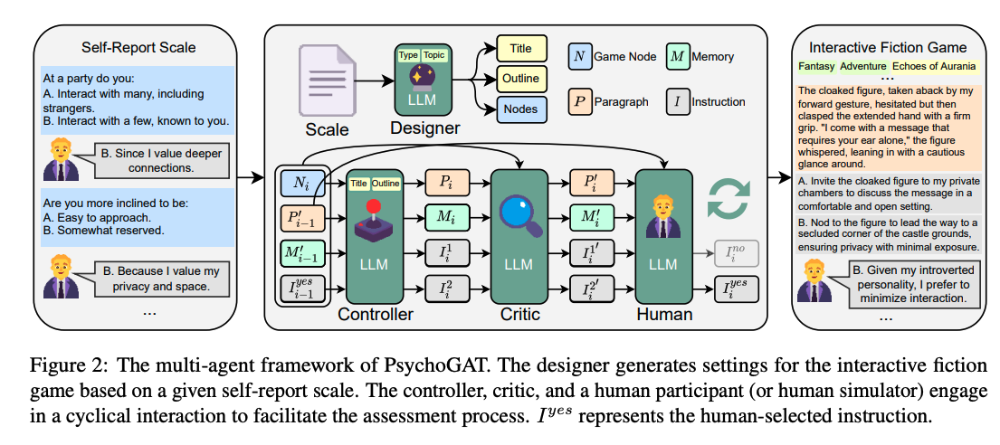

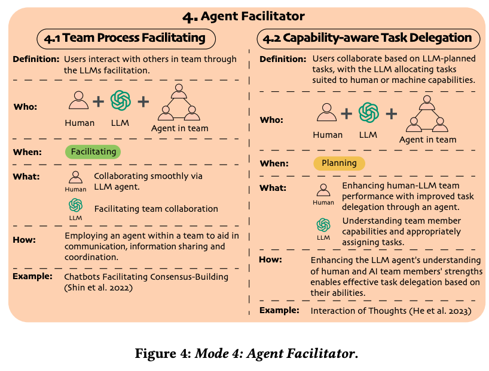

Figure 22: J. Gao et al. (2024)

## Talk2Care: An LLM-based Voice Assistant for Communication between Healthcare Providers and Older Adults.

Yang, Z., Xu, X., Yao, B., Rogers, E., Zhang, S., Intille, S., Shara,
N., Gao, G. G., & Wang, D. (2024). **Talk2Care: An LLM-based Voice
Assistant for Communication between Healthcare Providers and Older
Adults.** Proceedings of the ACM on Interactive, Mobile, Wearable and
Ubiquitous Technologies, 8(2), 1–35. https://doi.org/10.1145/3659625

Abstract

Despite the plethora of telehealth applications to assist home-based
older adults and healthcare providers, basic messaging and phone calls
are still the most common communication methods, which suffer from
limited availability, information loss, and process inefficiencies. One
promising solution to facilitate patient-provider communication is to
leverage large language models (LLMs) with their powerful natural
conversation and summarization capability. However, there is a limited
understanding of LLMs’ role during the communication. We first conducted
two interview studies with both older adults (N=10) and healthcare
providers (N=9) to understand their needs and opportunities for LLMs in
patient-provider asynchronous communication. Based on the insights, we
built an LLM-powered communication system, Talk2Care, and designed
interactive components for both groups: (1) For older adults, we
leveraged the convenience and accessibility of voice assistants (VAs)
and built an LLM-powered conversational interface for effective
information collection. (2) For health providers, we built an LLM-based
dashboard to summarize and present important health information based on
older adults’ conversations with the VA. We further conducted two user
studies with older adults and providers to evaluate the usability of the
system. The results showed that Talk2Care could facilitate the
communication process, enrich the health information collected from
older adults, and considerably save providers’ efforts and time. We
envision our work as an initial exploration of LLMs’ capability in the
intersection of healthcare and interpersonal communication.

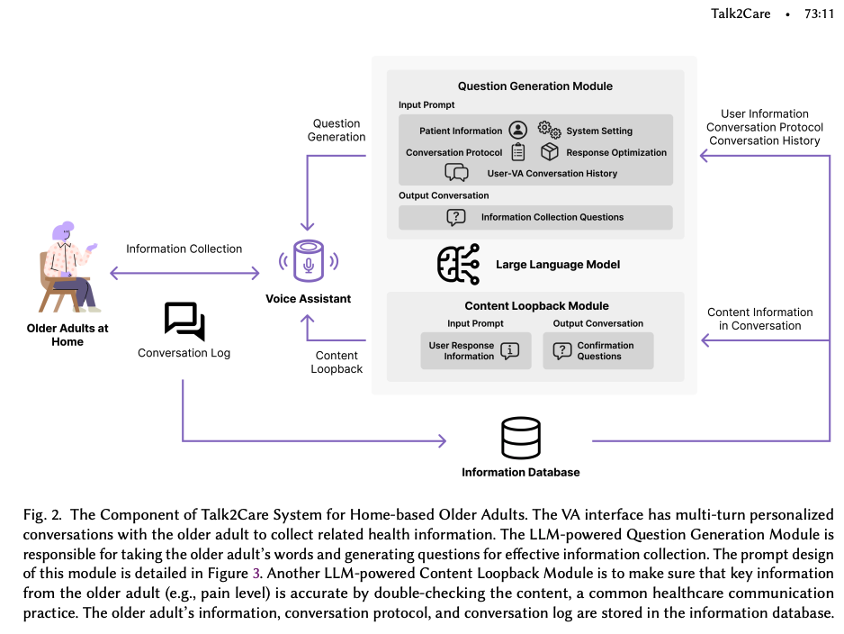

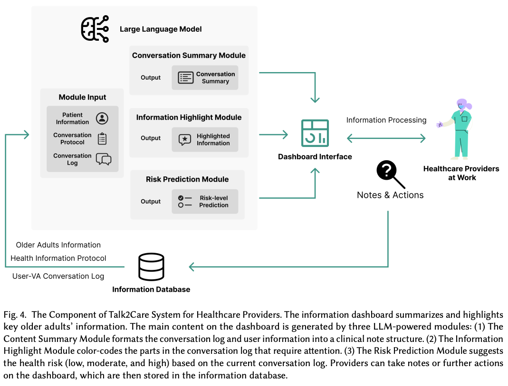

Figure 23: Figures from Z. Yang et al. (2024)

 

# References

Abdelnabi, S., Gomaa, A., Sivaprasad, S., Schönherr, L., & Fritz, M.
(2023). *LLM-Deliberation: Evaluating LLMs with Interactive Multi-Agent
Negotiation Games.* <https://doi.org/10.60882/cispa.25233028.v1>

Almashor, M., & Miyashita, Y. (2024). Can Private LLM Agents Synthesize
Household Energy Consumption Data? *Proceedings of the 15th ACM
International Conference on Future and Sustainable Energy Systems*,
664–668. <https://doi.org/10.1145/3632775.3661993>

Banerjee, D., Teso, S., Sayin, B., & Passerini, A. (2024). *Learning To
Guide Human Decision Makers With Vision-Language Models*
(arXiv:2403.16501). arXiv. <https://arxiv.org/abs/2403.16501>

Bhatia, S. (2024). Exploring variability in risk taking with large
language models. *Journal of Experimental Psychology: General*,
*153*(7), 1838–1860. <https://doi.org/10.1037/xge0001607>

Bienefeld, N., Kolbe, M., Camen, G., Huser, D., & Buehler, P. K. (2023).
Human-AI teaming: Leveraging transactive memory and speaking up for
enhanced team effectiveness. *Frontiers in Psychology*, *14*.
<https://doi.org/10.3389/fpsyg.2023.1208019>

Binz, M., & Schulz, E. (2023). Using cognitive psychology to understand
GPT-3. *Proceedings of the National Academy of Sciences*, *120*(6),
e2218523120. <https://doi.org/10.1073/pnas.2218523120>

Buçinca, Z., Malaya, M. B., & Gajos, K. Z. (2021). To Trust or to Think:
Cognitive Forcing Functions Can Reduce Overreliance on AI in
AI-assisted Decision-making. *Proceedings of
the ACM on Human-Computer Interaction*, *5*(CSCW1), 1–21.
<https://doi.org/10.1145/3449287>

Burton, J. W., Lopez-Lopez, E., Hechtlinger, S., Rahwan, Z., Aeschbach,
S., Bakker, M. A., Becker, J. A., Berditchevskaia, A., Berger, J.,
Brinkmann, L., Flek, L., Herzog, S. M., Huang, S., Kapoor, S.,
Narayanan, A., Nussberger, A.-M., Yasseri, T., Nickl, P., Almaatouq, A.,
… Hertwig, R. (2024). How large language models can reshape collective
intelligence. *Nature Human Behaviour*, 1–13.
<https://doi.org/10.1038/s41562-024-01959-9>

Calò, T., & De Russis, L. (2024). Enhancing smart home interaction
through multimodal command disambiguation. *Personal and Ubiquitous
Computing*. <https://doi.org/10.1007/s00779-024-01827-3>

Chen, Y., Liu, T. X., Shan, Y., & Zhong, S. (2023). The emergence of
economic rationality of GPT. *Proceedings of the National Academy of
Sciences*, *120*(51), e2316205120.
<https://doi.org/10.1073/pnas.2316205120>

Cheung, V., Maier, M., & Lieder, F. (2024). *Large Language Models
Amplify Human Biases in Moral Decision-Making*.
<https://doi.org/10.31234/osf.io/aj46b>

Chiang, C.-W., Lu, Z., Li, Z., & Yin, M. (2024). Enhancing AI-Assisted
Group Decision Making through LLM-Powered Devil’s Advocate. *Proceedings
of the 29th International Conference on Intelligent User Interfaces*,
103–119. <https://doi.org/10.1145/3640543.3645199>

Choi, A. S., Akter, S. S., Singh, J. P., & Anastasopoulos, A. (2024).
*The LLM Effect: Are Humans Truly Using LLMs, or Are They Being
Influenced By Them Instead?* (arXiv:2410.04699). arXiv.
<https://arxiv.org/abs/2410.04699>

Chuang, Y.-S., Harlalka, N., Suresh, S., Goyal, A., Hawkins, R., Yang,
S., Shah, D., Hu, J., & Rogers, T. T. (2024). *The Wisdom of Partisan
Crowds: Comparing Collective Intelligence in Humans and
LLM-based Agents*.

Chuang, Y.-S., Suresh, S., Harlalka, N., Goyal, A., Hawkins, R., Yang,
S., Shah, D., Hu, J., & Rogers, T. T. (2023). *Evaluating LLM Agent
Group Dynamics against Human Group Dynamics: A Case Study on Wisdom of
Partisan Crowds* (arXiv:2311.09665). arXiv.
<https://arxiv.org/abs/2311.09665>

Civitarese, G., Fiori, M., Choudhary, P., & Bettini, C. (2024). *Large
Language Models are Zero-Shot Recognizers for Activities of Daily
Living* (arXiv:2407.01238). arXiv. <https://arxiv.org/abs/2407.01238>

Collins, K. M., Jiang, A. Q., Frieder, S., Wong, L., Zilka, M., Bhatt,
U., Lukasiewicz, T., Wu, Y., Tenenbaum, J. B., Hart, W., Gowers, T., Li,
W., Weller, A., & Jamnik, M. (2023). *Evaluating Language Models for
Mathematics through Interactions* (arXiv:2306.01694). arXiv.
<https://arxiv.org/abs/2306.01694>

Collins, K. M., Sucholutsky, I., Bhatt, U., Chandra, K., Wong, L., Lee,
M., Zhang, C. E., Zhi-Xuan, T., Ho, M., Mansinghka, V., Weller, A.,
Tenenbaum, J. B., & Griffiths, T. L. (2024). Building machines that
learn and think with people. *Nature Human Behaviour*, *8*(10),
1851–1863. <https://doi.org/10.1038/s41562-024-01991-9>

Du, Y., Rajivan, P., & Gonzalez, C. C. (2024). *Large Language Models
for Collective Problem-Solving: Insights into Group Consensus
Decision-Making*.

Eigner, E., & Händler, T. (2024). *Determinants of
LLM-assisted Decision-Making*
(arXiv:2402.17385). arXiv. <https://arxiv.org/abs/2402.17385>

Gallo, S., Paternò, F., & Malizia, A. (2024). A conversational agent for
creating automations exploiting large language models. *Personal and
Ubiquitous Computing*. <https://doi.org/10.1007/s00779-024-01825-5>

Gao, C., Lan, X., Li, N., Yuan, Y., Ding, J., Zhou, Z., Xu, F., & Li, Y.
(2024). Large language models empowered agent-based modeling and
simulation: A survey and perspectives. *Humanities and Social Sciences
Communications*, *11*(1), 1–24.
<https://doi.org/10.1057/s41599-024-03611-3>

Gao, J., Gebreegziabher, S. A., Choo, K. T. W., Li, T. J.-J., Perrault,
S. T., & Malone, T. W. (2024). A Taxonomy for Human-LLM Interaction
Modes: An Initial Exploration. *Extended Abstracts of the CHI Conference
on Human Factors in Computing Systems*, 1–11.
<https://doi.org/10.1145/3613905.3650786>

Gao, Y., Lee, D., Burtch, G., & Fazelpour, S. (2024). *Take Caution in
Using LLMs as Human Surrogates: Scylla Ex Machina* (arXiv:2410.19599).
arXiv. <https://arxiv.org/abs/2410.19599>

Giudici, M., Padalino, L., Paolino, G., Paratici, I., Pascu, A. I., &
Garzotto, F. (2024). Designing Home Automation Routines Using an
LLM-Based Chatbot. *Designs*, *8*(3), 43.
<https://doi.org/10.3390/designs8030043>

Goli, A., & Singh, A. (2024). Can Large Language Models Capture Human
Preferences? *Marketing Science*.
<https://doi.org/10.1287/mksc.2023.0306>

Guo, X., Huang, K., Liu, J., Fan, W., Vélez, N., Wu, Q., Wang, H.,
Griffiths, T. L., & Wang, M. (2024). *Embodied LLM Agents Learn to
Cooperate in Organized Teams* (arXiv:2403.12482). arXiv.
<https://arxiv.org/abs/2403.12482>

Hagendorff, T., Fabi, S., & Kosinski, M. (2023). Human-like intuitive
behavior and reasoning biases emerged in large language models but
disappeared in ChatGPT. *Nature Computational Science*, *3*(10),
833–838. <https://doi.org/10.1038/s43588-023-00527-x>

Hao, X., Demir, E., & Eyers, D. (2024). Exploring collaborative
decision-making: A quasi-experimental study of human and Generative AI
interaction. *Technology in Society*, *78*, 102662.
<https://doi.org/10.1016/j.techsoc.2024.102662>

Hiremath, S. K., & Plötz, T. (2024). Game of LLMs: Discovering
Structural Constructs in Activities using Large Language Models.
*Companion of the 2024 on ACM International Joint Conference on
Pervasive and Ubiquitous Computing*, 487–492.
<https://doi.org/10.1145/3675094.3678444>

Isaza-Giraldo, A., Bala, P., Campos, P. F., & Pereira, L. (2024).
Prompt-Gaming: A Pilot Study on LLM-Evaluating Agent in a Meaningful
Energy Game. *Extended Abstracts of the 2024 CHI Conference on Human
Factors in Computing Systems*, 1–12.
<https://doi.org/10.1145/3613905.3650774>

Jin, M., Sel, B., Hardeep, F., & Yin, W. (2023). *A
Human-on-the-Loop Optimization Autoformalism
Approach for Sustainability* (arXiv:2308.10380). arXiv.
<https://arxiv.org/abs/2308.10380>

Joshi, H., Liu, S., Chen, J., Weigle, R., & Lam, M. S. (2024).
*LLM-Based Open-Domain Integrated Task and Knowledge Assistants with
Programmable Policies* (arXiv:2407.05674). arXiv.
<https://arxiv.org/abs/2407.05674>

Kämmer, J. E., Hautz, W. E., Krummrey, G., Sauter, T. C., Penders, D.,
Birrenbach, T., & Bienefeld, N. (2024). Effects of interacting with a
large language model compared with a human coach on the clinical
diagnostic process and outcomes among fourth-year medical students:
Study protocol for a prospective, randomised experiment using patient
vignettes. *BMJ Open*, *14*(7), e087469.
<https://doi.org/10.1136/bmjopen-2024-087469>

King, E., Yu, H., Lee, S., & Julien, C. (2024). Sasha: Creative
Goal-Oriented Reasoning in Smart Homes with Large Language Models.
*Proceedings of the ACM on Interactive, Mobile, Wearable and Ubiquitous
Technologies*, *8*(1), 1–38. <https://doi.org/10.1145/3643505>

King, E., Yu, H., Vartak, S., Jacob, J., Lee, S., & Julien, C. (2024).
*Thoughtful Things: Building Human-Centric Smart Devices with Small
Language Models* (arXiv:2405.03821). arXiv.
<https://arxiv.org/abs/2405.03821>

Koehl, D., & Vangsness, L. (2023). Measuring Latent Trust Patterns in
Large Language Models in the Context of Human-AI Teaming. *Proceedings
of the Human Factors and Ergonomics Society Annual Meeting*, *67*.
<https://doi.org/10.1177/21695067231192869>

Kumar, H., Vincentius, J., Jordan, E., & Anderson, A. (2024). *Human
Creativity in the Age of LLMs: Randomized Experiments on Divergent and
Convergent Thinking* (arXiv:2410.03703). arXiv.
<https://arxiv.org/abs/2410.03703>

Laban, G., Laban, T., & Gunes, H. (2024). *LEXI: Large Language Models
Experimentation Interface* (arXiv:2407.01488). arXiv.
<https://arxiv.org/abs/2407.01488>

Lai, V., Chen, C., Smith-Renner, A., Liao, Q. V., & Tan, C. (2023).
Towards a Science of Human-AI Decision Making: An Overview of Design
Space in Empirical Human-Subject Studies. *2023 ACM Conference on
Fairness, Accountability, and Transparency*, 1369–1385.
<https://doi.org/10.1145/3593013.3594087>

Lampinen, A. K., Dasgupta, I., Chan, S. C. Y., Sheahan, H. R., Creswell,
A., Kumaran, D., McClelland, J. L., & Hill, F. (2024). Language models,
like humans, show content effects on reasoning tasks. *PNAS Nexus*,
*3*(7), pgae233. <https://doi.org/10.1093/pnasnexus/pgae233>

Li, H., Kam-Kwai, W., Luo, Y., Chen, J., Liu, C., Zhang, Y., Lau, A. K.
H., Qu, H., & Liu, D. (2024). *Save It for the "Hot" Day: An
LLM-Empowered Visual Analytics System for Heat Risk Management*
(arXiv:2406.03317). arXiv. <https://arxiv.org/abs/2406.03317>

Lu, J., Tian, X., Zhang, C., Zhao, Y., Zhang, J., Zhang, W., Feng, C.,
He, J., Wang, J., & He, F. (2024). Evaluation of large language models
(LLMs) on the mastery of knowledge and skills in the heating,
ventilation and air conditioning (HVAC) industry. *Energy and Built
Environment*. <https://doi.org/10.1016/j.enbenv.2024.03.010>

Ma, S., Chen, Q., Wang, X., Zheng, C., Peng, Z., Yin, M., & Ma, X.
(2024). *Towards Human-AI Deliberation: Design and Evaluation of
LLM-Empowered Deliberative AI for AI-Assisted Decision-Making*
(arXiv:2403.16812). arXiv. <https://arxiv.org/abs/2403.16812>

Macmillan-Scott, O., & Musolesi, M. (2024). (Ir)rationality and
cognitive biases in large language models. *Royal Society Open Science*,
*11*(6), 240255. <https://doi.org/10.1098/rsos.240255>

Marjieh, R., Gokhale, A., Bullo, F., & Griffiths, T. L. (2024). *Task
Allocation in Teams as a Multi-Armed Bandit*.

Matz, S. C., Teeny, J. D., Vaid, S. S., Peters, H., Harari, G. M., &
Cerf, M. (2024). The potential of generative AI for personalized
persuasion at scale. *Scientific Reports*, *14*(1), 4692.
<https://doi.org/10.1038/s41598-024-53755-0>

Mei, Q., Xie, Y., Yuan, W., & Jackson, M. O. (2024). A Turing test of
whether AI chatbots are behaviorally similar to humans. *Proceedings of
the National Academy of Sciences*, *121*(9), e2313925121.
<https://doi.org/10.1073/pnas.2313925121>

Mongaillard, T., Lasaulce, S., Hicheur, O., Zhang, C., Bariah, L.,
Varma, V. S., Zou, H., Zhao, Q., & Debbah, M. (2024). *Large Language
Models for Power Scheduling: A User-Centric Approach*
(arXiv:2407.00476). arXiv. <https://arxiv.org/abs/2407.00476>

Narayanan, S., Yu, G., Ho, C.-J., & Yin, M. (2023). How does Value
Similarity affect Human Reliance in AI-Assisted Ethical Decision Making?
*Proceedings of the 2023 AAAI/ACM Conference on AI, Ethics, and
Society*, 49–57. <https://doi.org/10.1145/3600211.3604709>

Nguyen, J. (2024). Human Bias in AI Models? Anchoring Effects and
Mitigation Strategies in Large Language Models. *Journal of Behavioral
and Experimental Finance*, 100971.
<https://doi.org/10.1016/j.jbef.2024.100971>

Nishida, Y., Shimojo, S., & Hayashi, Y. (2024). Conversational Agent
Dynamics with Minority Opinion and Cognitive Conflict in Small-Group
Decision-Making. *Japanese Psychological Research*.
<https://doi.org/10.1111/jpr.12552>

Nisioti, E., Risi, S., Momennejad, I., Oudeyer, P.-Y., & Moulin-Frier,
C. (2024, July). Collective Innovation in Groups of Large Language
Models. *ALIFE 2024: Proceedings of the 2024 Artificial Life
Conference*. <https://doi.org/10.1162/isal_a_00730>

Nobandegani, A. S., Rish, I., & Shultz, T. R. (2023). Decision-Making
Paradoxes in Humans vs Machines: The case of the Allais and Ellsberg
Paradoxes. *Proceedings of the Annual Meeting of the Cognitive Science
Society*, *46*.

Oprea, S.-V., & Bâra, A. (2024). A Recommendation System for Prosumers
Based on Large Language Models. *Sensors*, *24*(11), 3530.
<https://doi.org/10.3390/s24113530>

Rastogi, C., Leqi, L., Holstein, K., & Heidari, H. (2023). A Taxonomy of
Human and ML Strengths in Decision-Making to Investigate Human-ML
Complementarity. *Proceedings of the AAAI Conference on Human
Computation and Crowdsourcing*, *11*, 127–139.
<https://doi.org/10.1609/hcomp.v11i1.27554>

Rastogi, C., Zhang, Y., Wei, D., Varshney, K. R., Dhurandhar, A., &
Tomsett, R. (2022). Deciding Fast and Slow: The Role of Cognitive Biases
in AI-assisted Decision-making. *Proceedings
of the ACM on Human-Computer Interaction*, *6*(CSCW1), 1–22.
<https://doi.org/10.1145/3512930>

Roberts, J., Moore, K., Pham, T., Ewaleifoh, O., & Fisher, D. (2024).
*Large Language Model Recall Uncertainty is Modulated by the Fan
Effect*.

Saleh, A., Donta, P. K., Morabito, R., Motlagh, N. H., & Lovén, L.
(2024). *Follow-Me AI: Energy-Efficient User Interaction with Smart
Environments* (arXiv:2404.12486). arXiv.
<https://arxiv.org/abs/2404.12486>

Sidji, M., Smith, W., & Rogerson, M. J. (2024). Human-AI Collaboration
in Cooperative Games: A Study of Playing Codenames with an LLM
Assistant. *Proc. ACM Hum.-Comput. Interact.*, *8*(CHI PLAY),
316:1–316:25. <https://doi.org/10.1145/3677081>

Stadler, M., Bannert, M., & Sailer, M. (2024). Cognitive ease at a cost:
LLMs reduce mental effort but compromise depth in student scientific
inquiry. *Computers in Human Behavior*, *160*, 108386.
<https://doi.org/10.1016/j.chb.2024.108386>

Subramonyam, H., Pea, R., Pondoc, C. L., Agrawala, M., & Seifert, C.
(2024). *Bridging the Gulf of Envisioning: Cognitive Design Challenges
in LLM Interfaces* (arXiv:2309.14459). arXiv.
<https://arxiv.org/abs/2309.14459>

Suri, G., Slater, L. R., Ziaee, A., & Nguyen, M. (2024). Do large
language models show decision heuristics similar to humans? A case study
using GPT-35. *Journal of Experimental Psychology: General*, *153*(4),
1066–1075. <https://doi.org/10.1037/xge0001547>

Swaroop, S., Buçinca, Z., Gajos, K. Z., & Doshi-Velez, F. (2024).
Accuracy-Time Tradeoffs in AI-Assisted Decision Making under Time
Pressure. *Proceedings of the 29th International Conference on
Intelligent User Interfaces*, 138–154.
<https://doi.org/10.1145/3640543.3645206>

Tessler, M. H., Bakker, M. A., Jarrett, D., Sheahan, H., Chadwick, M.
J., Koster, R., Evans, G., Campbell-Gillingham, L., Collins, T., Parkes,
D. C., Botvinick, M., & Summerfield, C. (2024). AI can help humans find
common ground in democratic deliberation. *Science*, *386*(6719),
eadq2852. <https://doi.org/10.1126/science.adq2852>

Tjuatja, L., Chen, V., Wu, T., Talwalkwar, A., & Neubig, G. (2024). Do
LLMs Exhibit Human-like Response Biases? A
Case Study in Survey Design. *Transactions of the Association for
Computational Linguistics*, *12*, 1011–1026.
<https://doi.org/10.1162/tacl_a_00685>

Vats, V., Nizam, M. B., Liu, M., Wang, Z., Ho, R., Prasad, M. S.,
Titterton, V., Malreddy, S. V., Aggarwal, R., Xu, Y., Ding, L., Mehta,
J., Grinnell, N., Liu, L., Zhong, S., Gandamani, D. N., Tang, X.,
Ghosalkar, R., Shen, C., … Davis, J. (2024). *A Survey on Human-AI
Teaming with Large Pre-Trained Models* (arXiv:2403.04931). arXiv.
<https://arxiv.org/abs/2403.04931>

Wang, B., Liu, J., Karimnazarov, J., & Thompson, N. (2024). Task
Supportive and Personalized Human-Large Language Model Interaction: A
User Study. *Proceedings of the 2024 ACM SIGIR Conference on Human
Information Interaction and Retrieval*, 370–375.
<https://doi.org/10.1145/3627508.3638344>

Wang, D., Zheng, K., Li, C., & Guo, J. (2024). Transitioning to
Human-Centered AI: A Systematic Review of Theories, Scenarios, and
Hypotheses in Human-AI Interactions. *Proceedings of the Association for
Information Science and Technology*, *61*(1), 673–678.
<https://doi.org/10.1002/pra2.1078>

Westphal, M., Vössing, M., Satzger, G., Yom-Tov, G. B., & Rafaeli, A.
(2023). Decision control and explanations in human-AI collaboration:
Improving user perceptions and compliance. *Computers in Human
Behavior*, *144*, 107714. <https://doi.org/10.1016/j.chb.2023.107714>

Yang, H., Siew, M., & Joe-Wong, C. (2024). *An LLM-Based Digital Twin
for Optimizing Human-in-the Loop Systems*
(arXiv:2403.16809). arXiv. <https://arxiv.org/abs/2403.16809>

Yang, J. C., Dailisan, D., Korecki, M., Hausladen, C. I., & Helbing, D.
(2024). *LLM Voting: Human Choices and AI Collective Decision Making*
(arXiv:2402.01766). arXiv. <https://arxiv.org/abs/2402.01766>

Yang, Z., Xu, X., Yao, B., Rogers, E., Zhang, S., Intille, S., Shara,
N., Gao, G. G., & Wang, D. (2024). Talk2Care: An
LLM-based Voice Assistant for Communication between Healthcare
Providers and Older Adults. *Proceedings of the ACM on Interactive,
Mobile, Wearable and Ubiquitous Technologies*, *8*(2), 1–35.
<https://doi.org/10.1145/3659625>

Yax, N., Anlló, H., & Palminteri, S. (2024). Studying and improving
reasoning in humans and machines. *Communications Psychology*, *2*(1),
1–16. <https://doi.org/10.1038/s44271-024-00091-8>

Zhang, J., Xu, X., Zhang, N., Liu, R., Hooi, B., & Deng, S. (2024).
*Exploring Collaboration Mechanisms for LLM Agents: A Social Psychology
View* (arXiv:2310.02124). arXiv. <https://arxiv.org/abs/2310.02124>

Zhang, J., Zhang, C., Lu, J., & Zhao, Y. (2025). Domain-specific large
language models for fault diagnosis of heating, ventilation, and air
conditioning systems by labeled-data-supervised fine-tuning. *Applied
Energy*, *377*, 124378. <https://doi.org/10.1016/j.apenergy.2024.124378>

Zhang, S., Wang, X., Zhang, W., Chen, Y., Gao, L., Wang, D., Zhang, W.,
Wang, X., & Wen, Y. (2024). *Mutual Theory of Mind in Human-AI
Collaboration: An Empirical Study with LLM-driven
AI Agents in a Real-time Shared Workspace
Task* (arXiv:2409.08811). arXiv.
<https://arxiv.org/abs/2409.08811>

Zhao, Y., Huang, Z., Seligman, M., & Peng, K. (2024). Risk and prosocial
behavioural cues elicit human-like response patterns from AI chatbots.
*Scientific Reports*, *14*(1), 7095.
<https://doi.org/10.1038/s41598-024-55949-y>

