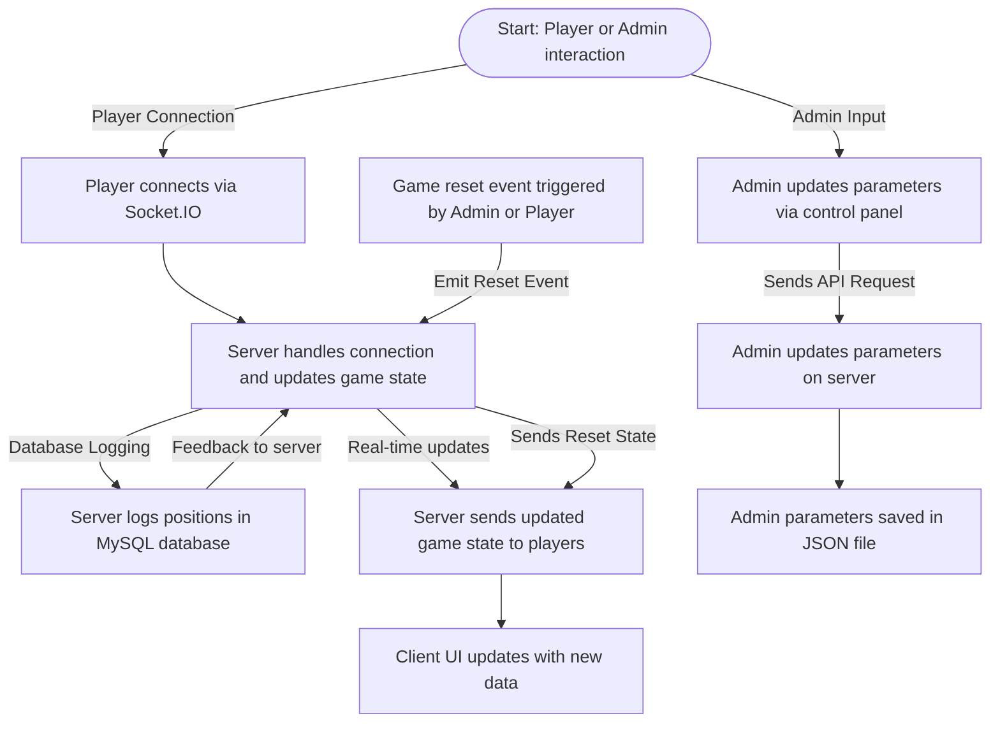
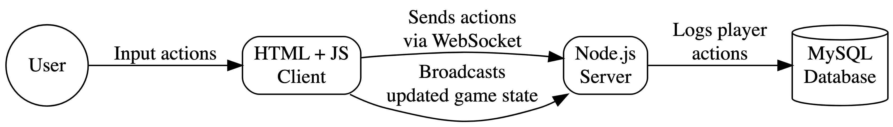

# Behavioral Experiment Documentation Report
Samuel Castro Martínez

## Documenting JavaScript and HTML Code for a Behavioral Experiment on Social Foraging

This document outlines the workings of the JavaScript and HTML code used
for a behavioral experiment on social foraging, simulating a scenario
where human participants select charging stations for electric vehicles
(EVs).


------------------------------------------------------------------------

## 1. **Conceptual Framework and Motivation**

#### Problem Space:

Efficient allocation of limited resources (e.g., EV charging stations)
presents significant challenges, especially with dynamic behavior and
decision-making. This project studies human resource allocation
decisions through a real-time, interactive online tool.

#### Key Innovations and Advantages:

- **Real-Time Interaction**: WebSockets provide synchronized, multi-user
  interactions.
- **Customizability**: A control panel dynamically adjusts parameters
  like station count, average prices, and player budgets.
- **Integration**: Player behavior and station selection data are stored
  in a MySQL database for analysis.

#### Future Development Roadmap:

1.  Enhanced visualization of player actions and system states.
2.  Integration of machine-learning models for behavior prediction.
3.  Expanded parameter customization for diverse experimental setups.

------------------------------------------------------------------------



### 2. **Architecture and Implementation**

#### System Architecture:

The architecture comprises three main components:

1.  **Client-Side Interface (HTML + JavaScript):** Manages user
    interaction and displays the simulation using a dynamic game map.
2.  **Server-Side Logic (Node.js + WebSocket):** Manages connections,
    synchronizes game states, relays updates, and handles admin
    parameter changes.
3.  **Database Layer (MySQL):** Records player positions for
    post-experiment analysis.





<div id="fig-two">

<div>



</div>

Figure 1: example diagram 2

</div>

**Data Flow:**

1.  Client connects to server via Socket.IO.
2.  Server sends initial game state (players, stations).
3.  Client renders the game.
4.  Player interacts (moves to a station).
5.  Client sends player’s action to the server.
6.  Server updates game state and broadcasts changes to all clients.
7.  Clients update displays.
8.  Player positions are periodically saved to MySQL.

**Key Data Structures:**

- `gameState` (Server): Holds game state (players, stations).

<div class="code-with-filename">

**script.js**

``` js
const gameState = {
    players: new Map(), // Map of players and their attributes
    stations: [
        { top: 8, left: 338, cost: 20 },
        { top: 479, left: 183, cost: 30 },
        ...
    ],
};
```

</div>

2.  **Player Attributes**:
    - Position (`x`, `y`)
    - Energy and monetary budgets
    - Assigned colors for visual distinction

- `adminParameters` (Client & Server): JSON with configurable parameters
  (station count, mean price, budget, download speed, station size).



## 3. Key Functions and Their Purpose

<div class="code-with-filename">

**script.js**

``` js
const setInitialParameters = async () => { ... }
```

</div>

**Purpose:** Retrieves initial game parameters from the server or
defaults. Sets initial admin panel slider values.

<div class="code-with-filename">

**script.js**

``` js
updateButton.addEventListener('click', () => { ... });
```

</div>

<div class="{lst-server1}">

**Purpose:** Sends updated parameters from the admin panel to the
server.

<div class="code-with-filename">

**server.js**

``` js
const insertPlayerPosition = async (playerId, positionX, positionY) => { ... }
```

</div>

**Purpose:** Records player position in the MySQL database.

``` js
io.on('connection', (socket) => { ... });
```

**Purpose:** Handles new player connections, initializes player data,
sends initial game state, manages movement/disconnections, and the game
reset.

``` js
app.put('/admin-parameters', async (req, res) => { ... });
```

**Purpose:** Handles and validates incoming admin parameters. Updates
`AdminParams`, saves to `admin-data.json` and sends parameter
information to the players.

</div>



## 4. **Key Features and Functionality**

### **Feature 1: Synchronized Game State**

- **Real-time Interaction:** Socket.IO enables responsive gameplay.
- **Why**: Ensures consistent user experience in multi-user settings.
- **How**: Employs WebSocket to propagate real-time updates.

<div id="lst-one1">

 1

<div class="code-with-filename">

**server.js**

``` js
io.on('connection', (socket) => {
    const player = {
        id: socket.id,
        positionX: 0,
        positionY: 235,
        energy: 100,
        money: 100,
        color: getRandomColor(),
    };
    gameState.players.set(socket.id, player);
    io.emit('gameState', gameState);
});
```

</div>

</div>



### **Feature 2: Dynamic Parameter Control**

- **Why**: Facilitates experiment customization without server restarts.
- **How**: Parameters are adjustable via a control panel in the
  interface.

<div class="code-with-filename">

**index.html**

``` html
<label for="stationCount">Number of Stations:</label>
<input type="range" id="stationCount" min="1" max="20" value="5" />
```

</div>

### **Feature 3: Data Logging**

- **Why**: Enables in-depth analysis of participant behavior.
- **How**: Logs player positions and actions into a MySQL database.

<div class="code-with-filename">

**server.js**

``` js
const insertPlayerPosition = async (playerId, positionX, positionY) => {
    const query = `INSERT INTO player_positions (player_id, position_x, position_y) VALUES (?, ?, ?)`;
    await mysqlConnection.execute(query, [playerId, positionX, positionY]);
};
```

</div>

- **Admin Control Panel (`admin.html`):** Dynamically adjusts
  parameters.
- **Data Persistence (MySQL):** Stores player data for analysis.
- **Game Reset:** Allows restarting from initial conditions.



## 5. **Installation and Getting Started**

1.  **Install dependencies:**

``` bash
npm install express socket.io mysql2
```

2.  **Start the server:**

``` bash
node server.js
```

3.  **Open `index.html`:** In a web browser.
4.  **Open the Admin Control Panel**: `http://localhost:3000/admin`

## 6. Limitations

- **Matching Algorithms:** Currently limited.
- **Scalability:** May require optimizations for large numbers of
  players.
- **Game Logic:** Requires more detailed implementation of energy,
  charging, and monetary mechanics.

## 7. Conclusion

This documentation outlines the structure and operation of the
experiment software. Future work will focus on scalability, user
experience, and integration with advanced analytics.

## Appendix

<div id="lst-sumfunc">

 2: Full `server.js` code.

``` js
import express from 'express';
import http from 'http';
import { Server } from 'socket.io';
import path from 'path';
import mysql from 'mysql2/promise';
import { fileURLToPath } from 'url';
import adminData from './admin-data.json' with { type: "json" };
import { writeFile } from 'fs/promises';

const __filename = fileURLToPath(import.meta.url);
const __dirname = path.dirname(__filename);

const app = express();
const server = http.createServer(app);
const io = new Server(server);
app.use(express.json())
let AdminParams  = adminData;
// Configuración del puerto
const PORT = process.env.PORT || 3000;

const gameState = {
    players: new Map(),
    stations: [
        { top: 8, left: 338, cost: 20 },
        { top: 479, left: 183, cost: 30 },
        { top: 123, left: 124, cost: 15 },
        { top: 300, left: 243, cost: 25 },
        { top: 185, left: 479, cost: 10 },
    ],
};

let mysqlConnection;
const configureMySQL = async () => {
    try {
        mysqlConnection = await mysql.createConnection({
            host: 'ec2-3-85-172-100.compute-1.amazonaws.com',
            user: 'scastrom',
            database: 'pathTracker',
            password: 'samuel2024',
        });
        console.log('Conexión exitosa a MySQL');
    } catch (err) {
        console.error('Error al conectar a MySQL:', err.message);
    }
};
```

</div>
