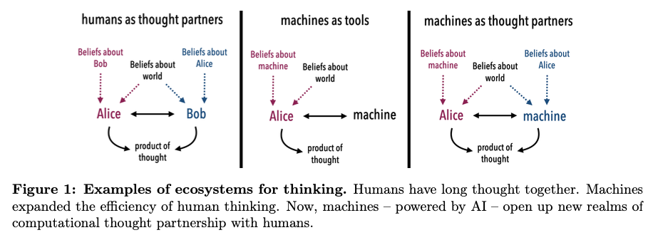
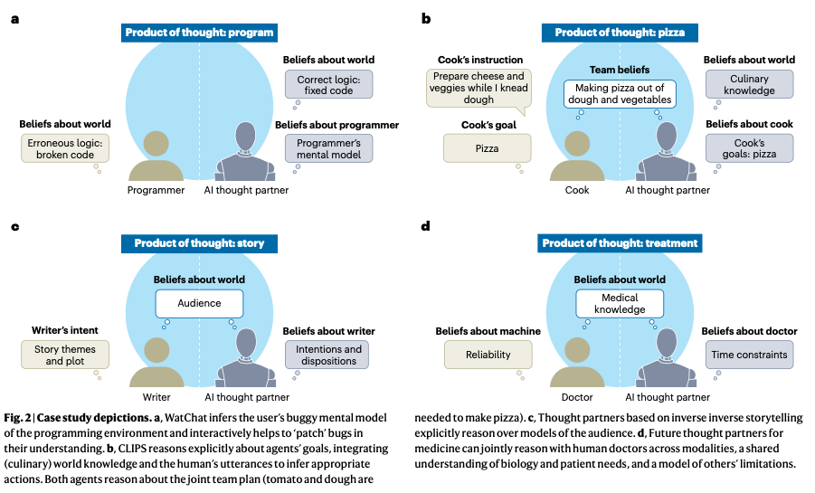

# Transactive Memory Systems

<https://tegorman13.github.io/ccl/tms.html>

## Human-AI teaming: Leveraging transactive memory and speaking up for enhanced team effectiveness.

Bienefeld, N., Kolbe, M., Camen, G., Huser, D., & Buehler, P. K. (2023).
**Human-AI teaming: Leveraging transactive memory and speaking up for
enhanced team effectiveness.** Frontiers in Psychology, 14.
https://doi.org/10.3389/fpsyg.2023.1208019

Abstract

In this prospective observational study, we investigate the role of
transactive memory and speaking up in human-AI teams comprising 180
intensive care (ICU) physicians and nurses working with AI in a
simulated clinical environment. Our findings indicate that interactions
with AI agents differ significantly from human interactions, as
accessing information from AI agents is positively linked to a team’s
ability to generate novel hypotheses and demonstrate speaking-up
behavior, but only in higher-performing teams. Conversely, accessing
information from human team members is negatively associated with these
aspects, regardless of team performance. This study is a valuable
contribution to the expanding field of research on human-AI teams and
team science in general, as it emphasizes the necessity of incorporating
AI agents as knowledge sources in a team’s transactive memory system, as
well as highlighting their role as catalysts for speaking up. Practical
implications include suggestions for the design of future AI systems and
human-AI team training in healthcare and beyond.

## Communication in Transactive Memory Systems: A Review and Multidimensional Network Perspective

Yan, B., Hollingshead, A. B., Alexander, K. S., Cruz, I., & Shaikh, S.
J. (2021). **Communication in Transactive Memory Systems: A Review and
Multidimensional Network Perspective.** Small Group Research, 52(1),
3–32. https://doi.org/10.1177/1046496420967764

Abstract

The comprehensive review synthesizes 64 empirical studies on
communication and transactive memory systems (TMS). The results reveal
that (a) a TMS forms through communication about expertise; (b) as a TMS
develops, communication to allocate information and coordinate retrieval
increases, promoting information exchange; and (c) groups update their
TMS through communicative learning. However, direct interpersonal
communication is not necessary for TMS development or utilization. Nor
do high-quality information-sharing processes always occur within
developed TMS structures. For future research, we propose a
multidimensional network approach to TMS that incorporates technologies,
addresses member characteristics, considers multiple communication
types, and situates groups in context.

## Alignment, Transactive Memory, and Collective Cognitive Systems

Tollefsen, D. P., Dale, R., & Paxton, A. (2013). **Alignment,
Transactive Memory, and Collective Cognitive Systems.** Review of
Philosophy and Psychology, 4(1), 49–64.
https://doi.org/10.1007/s13164-012-0126-z

Abstract

Research on linguistic interaction suggests that two or more individuals
can sometimes form adaptive and cohesive systems. We describe an
“alignment system” as a loosely interconnected set of cognitive
processes that facilitate social interactions. As a dynamic,
multi-component system, it is responsive to higher-level cognitive
states such as shared beliefs and intentions (those involving collective
intentionality) but can also give rise to such shared cognitive states
via bottom-up processes. As an example of putative group cognition we
turn to transactive memory and suggest how further research on alignment
in these cases might reveal how such systems can be genuinely described
as cognitive. Finally, we address a prominent critique of collective
cognitive systems, arguing that there is much empirical and explanatory
benefit to be gained from considering the possibility of group cognitive
systems, especially in the context of small-group human interaction.

## Building Machines that Learn and Think with People

Collins, K. M., Sucholutsky, I., Bhatt, U., Chandra, K., Wong, L., Lee,
M., Zhang, C. E., Zhi-Xuan, T., Ho, M., Mansinghka, V., Weller, A.,
Tenenbaum, J. B., & Griffiths, T. L. (2024). **Building machines that
learn and think with people.** Nature Human Behaviour, 8(10), 1851–1863.
https://doi.org/10.1038/s41562-024-01991-9

Abstract

What do we want from machine intelligence? We envision machines that are
not just tools for thought, but partners in thought: reasonable,
insightful, knowledgeable, reliable, and trustworthy systems that think
with us. Current artificial intelligence (AI) systems satisfy some of
these criteria, some of the time. In this Perspective, we show how the
science of collaborative cognition can be put to work to engineer
systems that really can be called “thought partners,” systems built to
meet our expectations and complement our limitations. We lay out several
modes of collaborative thought in which humans and AI thought partners
can engage and propose desiderata for human-compatible thought
partnerships. Drawing on motifs from computational cognitive science, we
motivate an alternative scaling path for the design of thought partners
and ecosystems around their use through a Bayesian lens, whereby the
partners we construct actively build and reason over models of the human
and world.

Figure 1: Figures from Collins et al. (2024)

## Task Allocation in Teams as a Multi-Armed Bandit.

Marjieh, R., Gokhale, A., Bullo, F., & Griffiths, T. L. (2024). **Task
Allocation in Teams as a Multi-Armed Bandit.**
https://cocosci.princeton.edu/papers/marjieh2024task.pdf

Abstract

Humans rely on efficient distribution of resources to transcend the
abilities of individuals. Successful task allocation, whether in small
teams or across large institutions, depends on individuals’ ability to
discern their own and others’ strengths and weaknesses, and to optimally
act on them. This dependence creates a tension between exploring the
capabilities of others and exploiting the knowledge acquired so far,
which can be challenging. How do people navigate this tension? To
address this question, we propose a novel task allocation paradigm in
which a human agent is asked to repeatedly allocate tasks in three
distinct classes (categorizing a blurry image, detecting a noisy voice
command, and solving an anagram) between themselves and two other (bot)
team members to maximize team performance. We show that this problem can
be recast as a combinatorial multi-armed bandit which allows us to
compare people’s performance against two well-known strategies, Thompson
Sampling and Upper Confidence Bound (UCB). We find that humans are able
to successfully integrate information about the capabilities of
different team members to infer optimal allocations, and in some cases
perform on par with these optimal strategies. Our approach opens up new
avenues for studying the mechanisms underlying collective cooperation in
teams.

## Bridging the Gulf of Envisioning: Cognitive Design Challenges in LLM Interfaces

Subramonyam, H., Pea, R., Pondoc, C. L., Agrawala, M., & Seifert, C.
(2024). **Bridging the Gulf of Envisioning: Cognitive Design Challenges
in LLM Interfaces** (arXiv:2309.14459; Version 2). arXiv.
http://arxiv.org/abs/2309.14459

Abstract

Large language models (LLMs) exhibit dynamic capabilities and appear to
comprehend complex and ambiguous natural language prompts. However,
calibrating LLM interactions is challenging for interface designers and
end-users alike. A central issue is our limited grasp of how human
cognitive processes begin with a goal and form intentions for executing
actions, a blindspot even in established interaction models such as
Norman’s gulfs of execution and evaluation. To address this gap, we
theorize how end-users ‘envision’ translating their goals into clear
intentions and craft prompts to obtain the desired LLM response. We
define a process of Envisioning by highlighting three misalignments: (1)
knowing whether LLMs can accomplish the task, (2) how to instruct the
LLM to do the task, and (3) how to evaluate the success of the LLM’s
output in meeting the goal. Finally, we make recommendations to narrow
the envisioning gulf in human-LLM interactions.

## Misc Papers

Argote, L., & Ren, Y. (2012). Transactive Memory Systems: A
Microfoundation of Dynamic Capabilities. Journal of Management Studies,
49(8), 1375–1382. https://doi.org/10.1111/j.1467-6486.2012.01077.x

Bienefeld, N., Kolbe, M., Camen, G., Huser, D., & Buehler, P. K. (2023).
Human-AI teaming: Leveraging transactive memory and speaking up for
enhanced team effectiveness. Frontiers in Psychology, 14.
https://doi.org/10.3389/fpsyg.2023.1208019

Brandon, D. P., & Hollingshead, A. B. (2004). Transactive Memory Systems
in Organizations: Matching Tasks, Expertise, and People. Organization
Science, 15(6), 633–644. https://doi.org/10.1287/orsc.1040.0069

Hollingshead, A. B. (1998). Communication, Learning, and Retrieval in
Transactive Memory Systems. Journal of Experimental Social Psychology,
34(5), 423–442. https://doi.org/10.1006/jesp.1998.1358

Kimura, T. (2024). Virtual Teams: A Smart Literature Review of Four
Decades of Research. Human Behavior and Emerging Technologies, 2024(1),
8373370. https://doi.org/10.1155/2024/8373370

Marjieh, R., Gokhale, A., Bullo, F., & Griffiths, T. L. (2024). Task
Allocation in Teams as a Multi-Armed Bandit.
https://cocosci.princeton.edu/papers/marjieh2024task.pdf

McWilliams, D. J., & Randolph, A. B. (2024). Transactive memory systems
in superteams: The effect of an intelligent assistant in virtual teams.
Information Technology & People, ahead-of-print(ahead-of-print).
https://doi.org/10.1108/ITP-12-2022-0918

Samipour-Biel, S. P. (2022). A Process Model of Transactive Memory
System Shared Knowledge Structure Emergence: A Computational Model in R
\[Ph.D., The University of Akron\].
https://www.proquest.com/docview/2711844070/abstract/DBDAB24DBBB34601PQ/1

Tollefsen, D. P., Dale, R., & Paxton, A. (2013). Alignment, Transactive
Memory, and Collective Cognitive Systems. Review of Philosophy and
Psychology, 4(1), 49–64. https://doi.org/10.1007/s13164-012-0126-z

Uden, L., & Ting, I.-H. (Eds.). (2024). The Design of AI-Enabled
Experience-Based Knowledge Management System to Facilitate Knowing and
Doing in Communities of Practice (Vol. 2152). Springer Nature
Switzerland. https://doi.org/10.1007/978-3-031-63269-3

Wegner, D. M. (1995). A Computer Network Model of Human Transactive
Memory. Social Cognition, 13(3), 319–339.
https://doi.org/10.1521/soco.1995.13.3.319

Yan, B., Hollingshead, A. B., Alexander, K. S., Cruz, I., & Shaikh, S.
J. (2021). Communication in Transactive Memory Systems: A Review and
Multidimensional Network Perspective. Small Group Research, 52(1), 3–32.
https://doi.org/10.1177/1046496420967764

Bienefeld, N., Kolbe, M., Camen, G., Huser, D., & Buehler, P. K. (2023).
Human-AI teaming: Leveraging transactive memory and speaking up for
enhanced team effectiveness. *Frontiers in Psychology*, *14*.
<https://doi.org/10.3389/fpsyg.2023.1208019>

Collins, K. M., Sucholutsky, I., Bhatt, U., Chandra, K., Wong, L., Lee,
M., Zhang, C. E., Zhi-Xuan, T., Ho, M., Mansinghka, V., Weller, A.,
Tenenbaum, J. B., & Griffiths, T. L. (2024). Building machines that
learn and think with people. *Nature Human Behaviour*, *8*(10),
1851–1863. <https://doi.org/10.1038/s41562-024-01991-9>

Marjieh, R., Gokhale, A., Bullo, F., & Griffiths, T. L. (2024). *Task
Allocation in Teams as a Multi-Armed Bandit*.

Subramonyam, H., Pea, R., Pondoc, C. L., Agrawala, M., & Seifert, C.
(2024). Bridging the Gulf of Envisioning: Cognitive Design Challenges in
LLM Interfaces. *Proceedings of the CHI Conference on Human Factors in
Computing Systems*, 1–19. <https://arxiv.org/abs/2309.14459>

